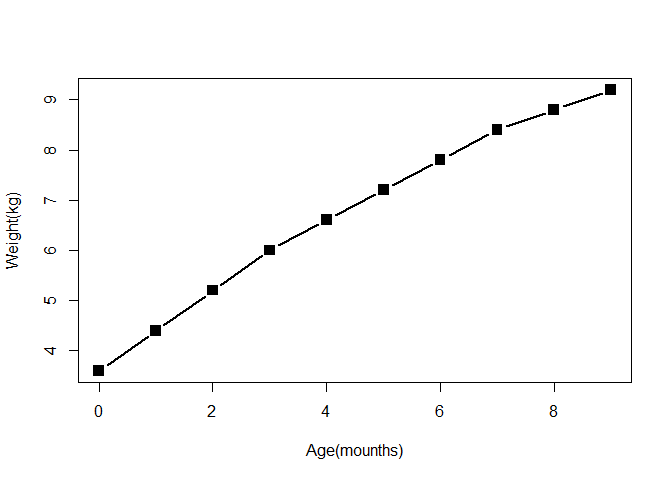
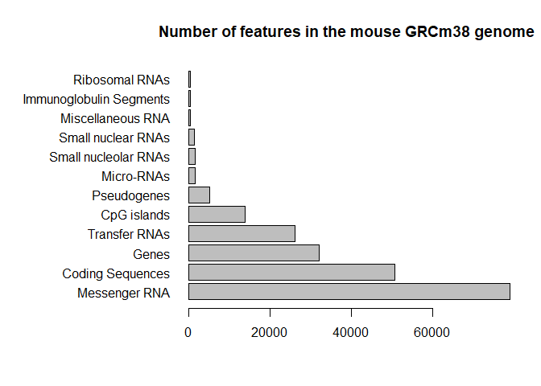
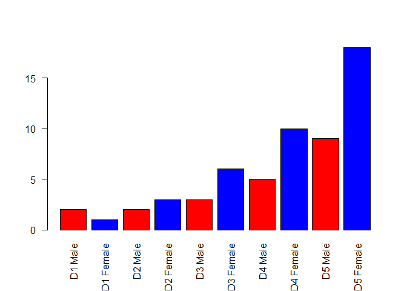
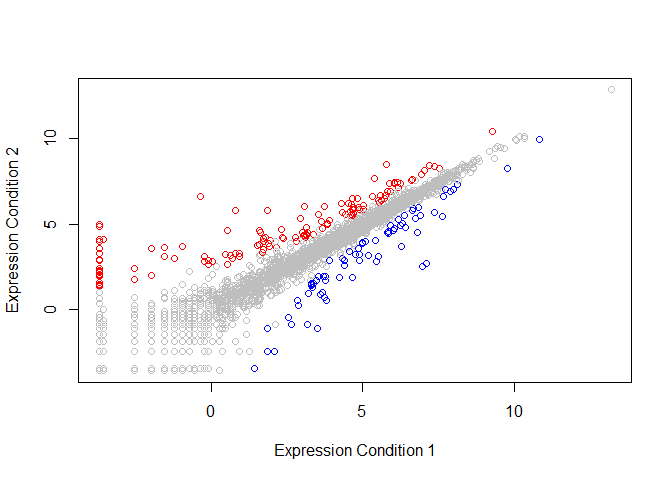
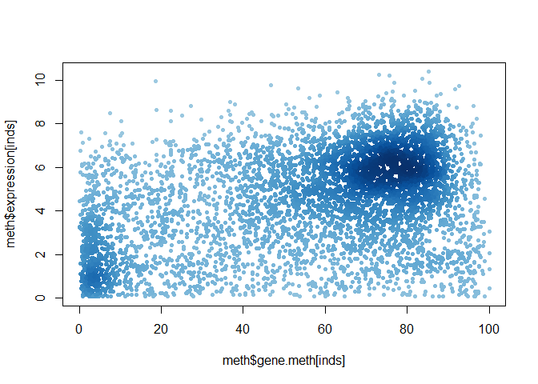

Class 5: R Graphics
================
Xiaohui Lyu
Apr 17th, 2019

``` r
# class 5 R graphics and plots

# section 1 scatterplot
# get the data1 in
weight <- read.table("lecture-5-bggn213-rstats/lecture-5-bggn213-rstats/weight_chart.txt",
           header = TRUE)

# plot a scaterplot of age vs weight
plot(weight$Age,weight$Weight,type="b",pch=15,cex=1.5,lwd=2,
     xlab="Age(mounths)",ylab="Weight(kg)")
```

<!-- -->

``` r
# section 2 barplot
# get the data2 in
feat <- read.table("lecture-5-bggn213-rstats/lecture-5-bggn213-rstats/feature_counts.txt",
           header = TRUE, sep = "\t")

# barplot
barplot(feat$Count, horiz = TRUE, 
        names.arg = feat$Feature, las=1,
        main = "Number of features in the mouse GRCm38 genome")

# changing the margins
par(mar=c(5.1,4.1,4.1,2.1))
old.mar <- par()$mar
par(mar=c(5,12,4,2))
barplot(feat$Count, horiz = TRUE, 
        names.arg = feat$Feature, las=1,
        main = "Number of features in the mouse GRCm38 genome")
```

<!-- -->

``` r
# changing back the default margins
par(mar=old.mar)

# section 3 color
mf <- read.table("lecture-5-bggn213-rstats/lecture-5-bggn213-rstats/male_female_counts.txt",
                 header = TRUE, sep = "\t")
barplot(mf$Count, names.arg = mf$Sample, las=2,
        col = c("red","blue"))
```

<!-- -->

``` r
# section 3b updown color
genes <- read.table("lecture-5-bggn213-rstats/lecture-5-bggn213-rstats/up_down_expression.txt",
                      header = TRUE)
palette(c("blue","grey","red"))
plot(genes$Condition1,genes$Condition2,
     xlab = "Expression Condition 1", ylab = "Expression Condition 2",
     col=genes$State)
```

<!-- -->

``` r
palette("default")

# section 3c dynamic color
meth <- read.table("lecture-5-bggn213-rstats/lecture-5-bggn213-rstats/expression_methylation.txt",
                   header = TRUE)
inds <- meth$expression > 0
dcols <- densCols(meth$gene.meth[inds],meth$expression[inds])
plot(meth$gene.meth[inds], meth$expression[inds],col=dcols,pch=20)
```

<!-- -->
