Class 8: Machine learning
================
Xiaohui Lyu
2019/4/26

## Kmeans clustering

Let’s try out the **kmeans()** function in R with some makieup data

``` r
# Generate some example data for clustering
tmp <- c(rnorm(30,-3), rnorm(30,3))
x <- cbind(x=tmp, y=rev(tmp))
plot(x)
```

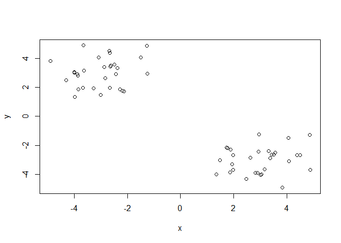<!-- -->

Use the kmeans() function setting k to 2 and nstart=20

``` r
y <- kmeans(x,centers = 2,nstart = 20)
```

Inspect/print the results

> Q. How many points are in each cluster?

> Q. What ‘component’ of your result object details - cluster size? -
> cluster assignment/membership? - cluster
    center?

``` r
y$cluster
```

    ##  [1] 1 1 1 1 1 1 1 1 1 1 1 1 1 1 1 1 1 1 1 1 1 1 1 1 1 1 1 1 1 1 2 2 2 2 2
    ## [36] 2 2 2 2 2 2 2 2 2 2 2 2 2 2 2 2 2 2 2 2 2 2 2 2 2

``` r
table(y$cluster)
```

    ## 
    ##  1  2 
    ## 30 30

``` r
y$centers
```

    ##           x         y
    ## 1 -3.000968  2.987357
    ## 2  2.987357 -3.000968

Plot x colored by the kmeans cluster assignment and add cluster centers
as blue points

``` r
plot(x,col= y$cluster)
points(y$centers, col="blue", pch=19, cex=2)
```

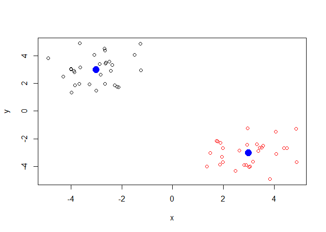<!-- -->

## Hierarchical Clustering

Here we don’t have to spell out K the number of clusters before hand but
we do have to give it a distance matrix as input.

``` r
# First we need to calculate point (dis)similarity
# as the Euclidean distance between observations
dist_matrix <- dist(x)
# The hclust() function returns a hierarchical
# clustering model
hc <- hclust(d = dist_matrix)
# the print method is not so useful here
hc
```

    ## 
    ## Call:
    ## hclust(d = dist_matrix)
    ## 
    ## Cluster method   : complete 
    ## Distance         : euclidean 
    ## Number of objects: 60

Let’s plot the results

``` r
plot(hc)
abline(h=6,col="red")
```

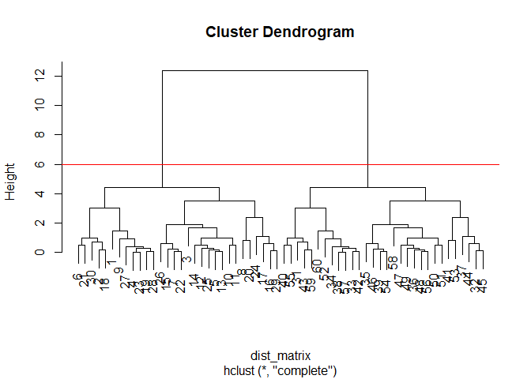<!-- -->

``` r
cutree(hc,h=6)
```

    ##  [1] 1 1 1 1 1 1 1 1 1 1 1 1 1 1 1 1 1 1 1 1 1 1 1 1 1 1 1 1 1 1 2 2 2 2 2
    ## [36] 2 2 2 2 2 2 2 2 2 2 2 2 2 2 2 2 2 2 2 2 2 2 2 2 2

``` r
gp2 <- cutree(hc, k=2)
gp2
```

    ##  [1] 1 1 1 1 1 1 1 1 1 1 1 1 1 1 1 1 1 1 1 1 1 1 1 1 1 1 1 1 1 1 2 2 2 2 2
    ## [36] 2 2 2 2 2 2 2 2 2 2 2 2 2 2 2 2 2 2 2 2 2 2 2 2 2

``` r
gp3 <- cutree(hc, k=3)
gp3
```

    ##  [1] 1 1 1 1 1 1 1 1 1 1 1 1 1 1 1 1 1 1 1 1 1 1 1 1 1 1 1 1 1 1 2 3 2 2 3
    ## [36] 3 3 2 3 2 3 2 2 3 3 3 3 3 3 3 3 2 3 3 2 3 2 3 2 2

``` r
table(gp3)
```

    ## gp3
    ##  1  2  3 
    ## 30 12 18

``` r
table(gp2)
```

    ## gp2
    ##  1  2 
    ## 30 30

``` r
table(gp2,gp3)
```

    ##    gp3
    ## gp2  1  2  3
    ##   1 30  0  0
    ##   2  0 12 18

Try a more real-life like example to see how our clustering works

``` r
# Step 1. Generate some example data for clustering
x <- rbind(
matrix(rnorm(100, mean=0, sd = 0.3), ncol = 2), # c1
matrix(rnorm(100, mean = 1, sd = 0.3), ncol = 2), # c2
matrix(c(rnorm(50, mean = 1, sd = 0.3), # c3
rnorm(50, mean = 0, sd = 0.3)), ncol = 2))
colnames(x) <- c("x", "y")
# Step 2. Plot the data without clustering
plot(x)
```

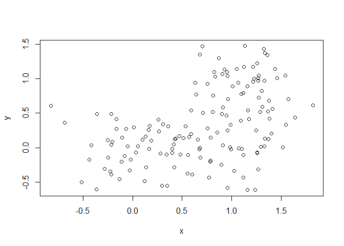<!-- -->

``` r
# Step 3. Generate colors for known clusters
# (just so we can compare to hclust results)
col <- as.factor( rep(c("c1","c2","c3"), each=50) )
plot(x, col=col)
```

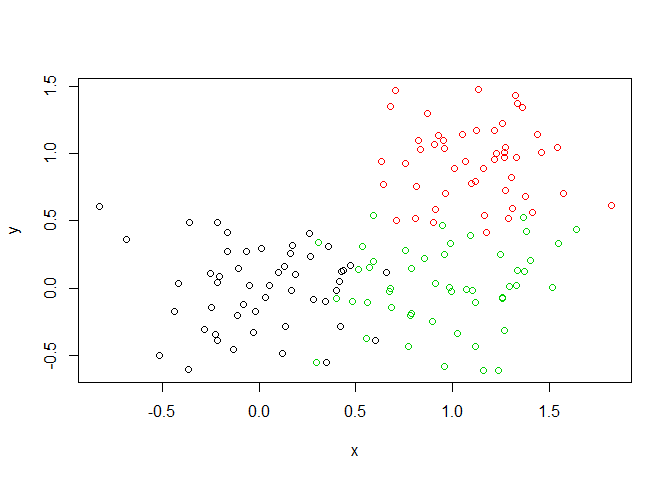<!-- -->

> Q. Use the dist(), hclust(), plot() and cutree() functions to return 2
> and 3 clusters

> Q. How does this compare to your known ‘col’ groups?

``` r
hc1 <- hclust(dist(x))
plot(hc1)
```

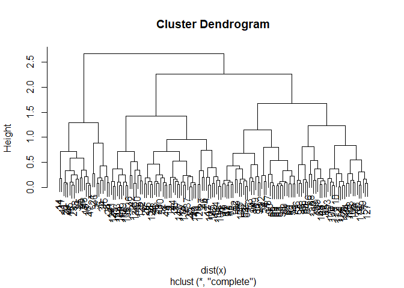<!-- -->

``` r
cut2 <- cutree(hc1, k=2)
plot(x,col=cut2)
```

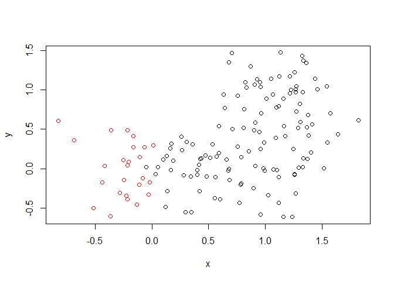<!-- -->

``` r
cut3 <- cutree(hc1,k=3)
plot(x,col=cut3)
```

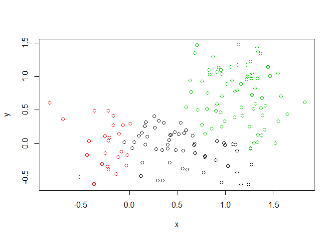<!-- -->

``` r
table(cut2,cut3)
```

    ##     cut3
    ## cut2  1  2  3
    ##    1 54  0 71
    ##    2  0 25  0

## Principal Component Analysis (PCA)

We will use the base R **prcomp()** function for PCA today.

Let’s get som RNAseq data to play with.

``` r
mydata <- read.csv("expression.csv",row.names=1)
head(mydata)
```

    ##        wt1 wt2  wt3  wt4 wt5 ko1 ko2 ko3 ko4 ko5
    ## gene1  439 458  408  429 420  90  88  86  90  93
    ## gene2  219 200  204  210 187 427 423 434 433 426
    ## gene3 1006 989 1030 1017 973 252 237 238 226 210
    ## gene4  783 792  829  856 760 849 856 835 885 894
    ## gene5  181 249  204  244 225 277 305 272 270 279
    ## gene6  460 502  491  491 493 612 594 577 618 638

There are 100 genes in this dataset

``` r
## lets do PCA
pca <- prcomp(t(mydata), scale=TRUE)
summary(pca)
```

    ## Importance of components:
    ##                           PC1    PC2     PC3     PC4     PC5     PC6
    ## Standard deviation     9.6237 1.5198 1.05787 1.05203 0.88062 0.82545
    ## Proportion of Variance 0.9262 0.0231 0.01119 0.01107 0.00775 0.00681
    ## Cumulative Proportion  0.9262 0.9493 0.96045 0.97152 0.97928 0.98609
    ##                            PC7     PC8     PC9      PC10
    ## Standard deviation     0.80111 0.62065 0.60342 3.348e-15
    ## Proportion of Variance 0.00642 0.00385 0.00364 0.000e+00
    ## Cumulative Proportion  0.99251 0.99636 1.00000 1.000e+00

``` r
attributes(pca)
```

    ## $names
    ## [1] "sdev"     "rotation" "center"   "scale"    "x"       
    ## 
    ## $class
    ## [1] "prcomp"

Let’s make our first PCA plot

``` r
## Precent variance is often more informative to look at
pca.var <- pca$sdev^2
pca.var.per <- round(pca.var/sum(pca.var)*100, 1)
pca.var.per
```

    ##  [1] 92.6  2.3  1.1  1.1  0.8  0.7  0.6  0.4  0.4  0.0

``` r
colvec <- c(rep("red",5),rep("blue",5))
xlab <- paste("PC1 (",pca.var.per[1],"%)",sep = "")
ylab <- paste("PC2(",pca.var.per[2],"%)",sep = "")

plot(pca$x[,1],pca$x[,2],xlab =xlab, ylab =ylab, col=colvec)
text(pca$x[,1],pca$x[,2],labels=colnames(mydata))
```

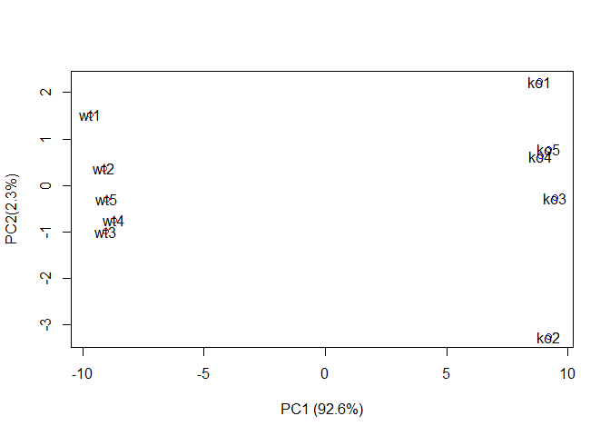<!-- -->

## PCA on the UK foods dataset

``` r
uk <- read.csv("UK_foods.csv",row.names = 1)
uk
```

    ##                     England Wales Scotland N.Ireland
    ## Cheese                  105   103      103        66
    ## Carcass_meat            245   227      242       267
    ## Other_meat              685   803      750       586
    ## Fish                    147   160      122        93
    ## Fats_and_oils           193   235      184       209
    ## Sugars                  156   175      147       139
    ## Fresh_potatoes          720   874      566      1033
    ## Fresh_Veg               253   265      171       143
    ## Other_Veg               488   570      418       355
    ## Processed_potatoes      198   203      220       187
    ## Processed_Veg           360   365      337       334
    ## Fresh_fruit            1102  1137      957       674
    ## Cereals                1472  1582     1462      1494
    ## Beverages                57    73       53        47
    ## Soft_drinks            1374  1256     1572      1506
    ## Alcoholic_drinks        375   475      458       135
    ## Confectionery            54    64       62        41

``` r
pca_uk <- prcomp(t(uk))
attributes(pca_uk)
```

    ## $names
    ## [1] "sdev"     "rotation" "center"   "scale"    "x"       
    ## 
    ## $class
    ## [1] "prcomp"

``` r
uk.var <- pca_uk$sdev^2
uk.var.per <- round(uk.var/sum(uk.var)*100, 1)
barplot(uk.var.per,names.arg = c("PC1","PC2","PC3","PC4"))
```

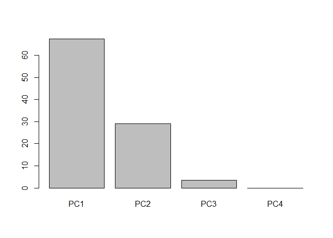<!-- -->

``` r
xlab <- paste("PC1(",uk.var.per[1],"%)")
ylab <- paste("PC2(",uk.var.per[2],"%)")
mycol <- c("orange","red","blue","dark green")
plot(pca_uk$x[,1],pca_uk$x[,2],xlab=xlab,ylab=ylab,col=mycol,pch=16,cex=2)
text(pca_uk$x[,1],pca_uk$x[,2],labels = colnames(uk))
```

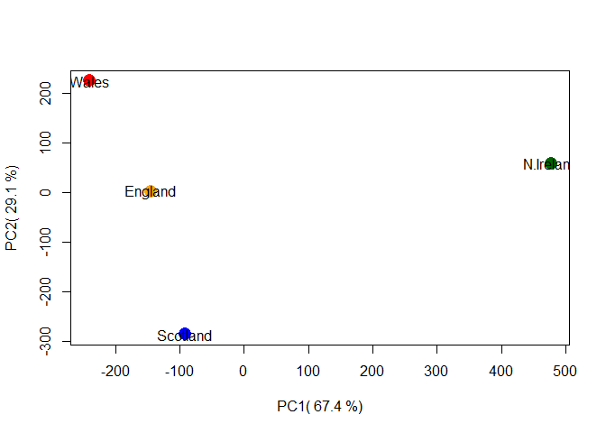<!-- -->
