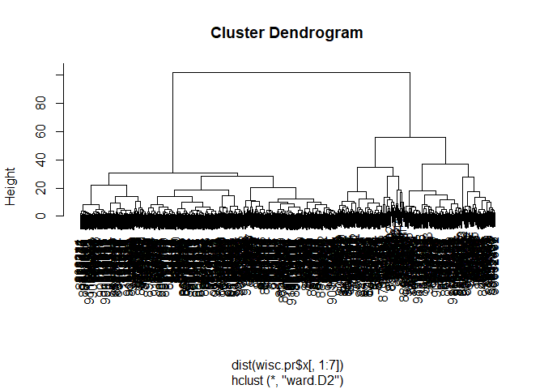
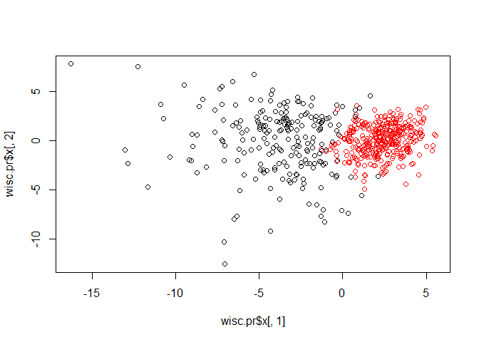
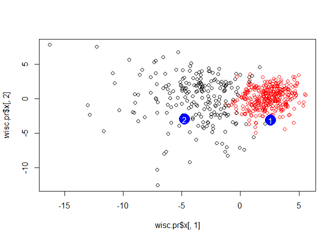

class 9: Unsupervised learning
================
Xiaohui Lyu
2019/5/1

## Preparing the data

I download the SCV format data file from the class website and placed it
in my project directory

``` r
wisc.df <- read.csv("WisconsinCancer.csv")
head(wisc.df)
```

    ##         id diagnosis radius_mean texture_mean perimeter_mean area_mean
    ## 1   842302         M       17.99        10.38         122.80    1001.0
    ## 2   842517         M       20.57        17.77         132.90    1326.0
    ## 3 84300903         M       19.69        21.25         130.00    1203.0
    ## 4 84348301         M       11.42        20.38          77.58     386.1
    ## 5 84358402         M       20.29        14.34         135.10    1297.0
    ## 6   843786         M       12.45        15.70          82.57     477.1
    ##   smoothness_mean compactness_mean concavity_mean concave.points_mean
    ## 1         0.11840          0.27760         0.3001             0.14710
    ## 2         0.08474          0.07864         0.0869             0.07017
    ## 3         0.10960          0.15990         0.1974             0.12790
    ## 4         0.14250          0.28390         0.2414             0.10520
    ## 5         0.10030          0.13280         0.1980             0.10430
    ## 6         0.12780          0.17000         0.1578             0.08089
    ##   symmetry_mean fractal_dimension_mean radius_se texture_se perimeter_se
    ## 1        0.2419                0.07871    1.0950     0.9053        8.589
    ## 2        0.1812                0.05667    0.5435     0.7339        3.398
    ## 3        0.2069                0.05999    0.7456     0.7869        4.585
    ## 4        0.2597                0.09744    0.4956     1.1560        3.445
    ## 5        0.1809                0.05883    0.7572     0.7813        5.438
    ## 6        0.2087                0.07613    0.3345     0.8902        2.217
    ##   area_se smoothness_se compactness_se concavity_se concave.points_se
    ## 1  153.40      0.006399        0.04904      0.05373           0.01587
    ## 2   74.08      0.005225        0.01308      0.01860           0.01340
    ## 3   94.03      0.006150        0.04006      0.03832           0.02058
    ## 4   27.23      0.009110        0.07458      0.05661           0.01867
    ## 5   94.44      0.011490        0.02461      0.05688           0.01885
    ## 6   27.19      0.007510        0.03345      0.03672           0.01137
    ##   symmetry_se fractal_dimension_se radius_worst texture_worst
    ## 1     0.03003             0.006193        25.38         17.33
    ## 2     0.01389             0.003532        24.99         23.41
    ## 3     0.02250             0.004571        23.57         25.53
    ## 4     0.05963             0.009208        14.91         26.50
    ## 5     0.01756             0.005115        22.54         16.67
    ## 6     0.02165             0.005082        15.47         23.75
    ##   perimeter_worst area_worst smoothness_worst compactness_worst
    ## 1          184.60     2019.0           0.1622            0.6656
    ## 2          158.80     1956.0           0.1238            0.1866
    ## 3          152.50     1709.0           0.1444            0.4245
    ## 4           98.87      567.7           0.2098            0.8663
    ## 5          152.20     1575.0           0.1374            0.2050
    ## 6          103.40      741.6           0.1791            0.5249
    ##   concavity_worst concave.points_worst symmetry_worst
    ## 1          0.7119               0.2654         0.4601
    ## 2          0.2416               0.1860         0.2750
    ## 3          0.4504               0.2430         0.3613
    ## 4          0.6869               0.2575         0.6638
    ## 5          0.4000               0.1625         0.2364
    ## 6          0.5355               0.1741         0.3985
    ##   fractal_dimension_worst  X
    ## 1                 0.11890 NA
    ## 2                 0.08902 NA
    ## 3                 0.08758 NA
    ## 4                 0.17300 NA
    ## 5                 0.07678 NA
    ## 6                 0.12440 NA

> Q3. How many of the observations have a malignant diagnosis?

``` r
table(wisc.df$diagnosis)
```

    ## 
    ##   B   M 
    ## 357 212

``` r
length(wisc.df$diagnosis[wisc.df$diagnosis=="M"])
```

    ## [1] 212

> Q4. How many variables/features in the data are suffixed with \_mean?

``` r
colnames(wisc.df)
```

    ##  [1] "id"                      "diagnosis"              
    ##  [3] "radius_mean"             "texture_mean"           
    ##  [5] "perimeter_mean"          "area_mean"              
    ##  [7] "smoothness_mean"         "compactness_mean"       
    ##  [9] "concavity_mean"          "concave.points_mean"    
    ## [11] "symmetry_mean"           "fractal_dimension_mean" 
    ## [13] "radius_se"               "texture_se"             
    ## [15] "perimeter_se"            "area_se"                
    ## [17] "smoothness_se"           "compactness_se"         
    ## [19] "concavity_se"            "concave.points_se"      
    ## [21] "symmetry_se"             "fractal_dimension_se"   
    ## [23] "radius_worst"            "texture_worst"          
    ## [25] "perimeter_worst"         "area_worst"             
    ## [27] "smoothness_worst"        "compactness_worst"      
    ## [29] "concavity_worst"         "concave.points_worst"   
    ## [31] "symmetry_worst"          "fractal_dimension_worst"
    ## [33] "X"

``` r
grep("_mean",colnames(wisc.df))
```

    ##  [1]  3  4  5  6  7  8  9 10 11 12

``` r
length(grep("_mean",colnames(wisc.df)))
```

    ## [1] 10

Select cols 3:32 and store as a matrix

``` r
wisc.data <- as.matrix(wisc.df[,3:32])
wisc.data
```

    ##        radius_mean texture_mean perimeter_mean area_mean smoothness_mean
    ##   [1,]      17.990        10.38         122.80    1001.0         0.11840
    ##   [2,]      20.570        17.77         132.90    1326.0         0.08474
    ##   [3,]      19.690        21.25         130.00    1203.0         0.10960
    ##   [4,]      11.420        20.38          77.58     386.1         0.14250
    ##   [5,]      20.290        14.34         135.10    1297.0         0.10030
    ##   [6,]      12.450        15.70          82.57     477.1         0.12780
    ##   [7,]      18.250        19.98         119.60    1040.0         0.09463
    ##   [8,]      13.710        20.83          90.20     577.9         0.11890
    ##   [9,]      13.000        21.82          87.50     519.8         0.12730
    ##  [10,]      12.460        24.04          83.97     475.9         0.11860
    ##  [11,]      16.020        23.24         102.70     797.8         0.08206
    ##  [12,]      15.780        17.89         103.60     781.0         0.09710
    ##  [13,]      19.170        24.80         132.40    1123.0         0.09740
    ##  [14,]      15.850        23.95         103.70     782.7         0.08401
    ##  [15,]      13.730        22.61          93.60     578.3         0.11310
    ##  [16,]      14.540        27.54          96.73     658.8         0.11390
    ##  [17,]      14.680        20.13          94.74     684.5         0.09867
    ##  [18,]      16.130        20.68         108.10     798.8         0.11700
    ##  [19,]      19.810        22.15         130.00    1260.0         0.09831
    ##  [20,]      13.540        14.36          87.46     566.3         0.09779
    ##  [21,]      13.080        15.71          85.63     520.0         0.10750
    ##  [22,]       9.504        12.44          60.34     273.9         0.10240
    ##  [23,]      15.340        14.26         102.50     704.4         0.10730
    ##  [24,]      21.160        23.04         137.20    1404.0         0.09428
    ##  [25,]      16.650        21.38         110.00     904.6         0.11210
    ##  [26,]      17.140        16.40         116.00     912.7         0.11860
    ##  [27,]      14.580        21.53          97.41     644.8         0.10540
    ##  [28,]      18.610        20.25         122.10    1094.0         0.09440
    ##  [29,]      15.300        25.27         102.40     732.4         0.10820
    ##  [30,]      17.570        15.05         115.00     955.1         0.09847
    ##  [31,]      18.630        25.11         124.80    1088.0         0.10640
    ##  [32,]      11.840        18.70          77.93     440.6         0.11090
    ##  [33,]      17.020        23.98         112.80     899.3         0.11970
    ##  [34,]      19.270        26.47         127.90    1162.0         0.09401
    ##  [35,]      16.130        17.88         107.00     807.2         0.10400
    ##  [36,]      16.740        21.59         110.10     869.5         0.09610
    ##  [37,]      14.250        21.72          93.63     633.0         0.09823
    ##  [38,]      13.030        18.42          82.61     523.8         0.08983
    ##  [39,]      14.990        25.20          95.54     698.8         0.09387
    ##  [40,]      13.480        20.82          88.40     559.2         0.10160
    ##  [41,]      13.440        21.58          86.18     563.0         0.08162
    ##  [42,]      10.950        21.35          71.90     371.1         0.12270
    ##  [43,]      19.070        24.81         128.30    1104.0         0.09081
    ##  [44,]      13.280        20.28          87.32     545.2         0.10410
    ##  [45,]      13.170        21.81          85.42     531.5         0.09714
    ##  [46,]      18.650        17.60         123.70    1076.0         0.10990
    ##  [47,]       8.196        16.84          51.71     201.9         0.08600
    ##  [48,]      13.170        18.66          85.98     534.6         0.11580
    ##  [49,]      12.050        14.63          78.04     449.3         0.10310
    ##  [50,]      13.490        22.30          86.91     561.0         0.08752
    ##  [51,]      11.760        21.60          74.72     427.9         0.08637
    ##  [52,]      13.640        16.34          87.21     571.8         0.07685
    ##  [53,]      11.940        18.24          75.71     437.6         0.08261
    ##  [54,]      18.220        18.70         120.30    1033.0         0.11480
    ##  [55,]      15.100        22.02          97.26     712.8         0.09056
    ##  [56,]      11.520        18.75          73.34     409.0         0.09524
    ##  [57,]      19.210        18.57         125.50    1152.0         0.10530
    ##  [58,]      14.710        21.59          95.55     656.9         0.11370
    ##  [59,]      13.050        19.31          82.61     527.2         0.08060
    ##  [60,]       8.618        11.79          54.34     224.5         0.09752
    ##  [61,]      10.170        14.88          64.55     311.9         0.11340
    ##  [62,]       8.598        20.98          54.66     221.8         0.12430
    ##  [63,]      14.250        22.15          96.42     645.7         0.10490
    ##  [64,]       9.173        13.86          59.20     260.9         0.07721
    ##  [65,]      12.680        23.84          82.69     499.0         0.11220
    ##  [66,]      14.780        23.94          97.40     668.3         0.11720
    ##  [67,]       9.465        21.01          60.11     269.4         0.10440
    ##  [68,]      11.310        19.04          71.80     394.1         0.08139
    ##  [69,]       9.029        17.33          58.79     250.5         0.10660
    ##  [70,]      12.780        16.49          81.37     502.5         0.09831
    ##  [71,]      18.940        21.31         123.60    1130.0         0.09009
    ##  [72,]       8.888        14.64          58.79     244.0         0.09783
    ##  [73,]      17.200        24.52         114.20     929.4         0.10710
    ##  [74,]      13.800        15.79          90.43     584.1         0.10070
    ##  [75,]      12.310        16.52          79.19     470.9         0.09172
    ##  [76,]      16.070        19.65         104.10     817.7         0.09168
    ##  [77,]      13.530        10.94          87.91     559.2         0.12910
    ##  [78,]      18.050        16.15         120.20    1006.0         0.10650
    ##  [79,]      20.180        23.97         143.70    1245.0         0.12860
    ##  [80,]      12.860        18.00          83.19     506.3         0.09934
    ##  [81,]      11.450        20.97          73.81     401.5         0.11020
    ##  [82,]      13.340        15.86          86.49     520.0         0.10780
    ##  [83,]      25.220        24.91         171.50    1878.0         0.10630
    ##  [84,]      19.100        26.29         129.10    1132.0         0.12150
    ##  [85,]      12.000        15.65          76.95     443.3         0.09723
    ##  [86,]      18.460        18.52         121.10    1075.0         0.09874
    ##  [87,]      14.480        21.46          94.25     648.2         0.09444
    ##  [88,]      19.020        24.59         122.00    1076.0         0.09029
    ##  [89,]      12.360        21.80          79.78     466.1         0.08772
    ##  [90,]      14.640        15.24          95.77     651.9         0.11320
    ##  [91,]      14.620        24.02          94.57     662.7         0.08974
    ##  [92,]      15.370        22.76         100.20     728.2         0.09200
    ##  [93,]      13.270        14.76          84.74     551.7         0.07355
    ##  [94,]      13.450        18.30          86.60     555.1         0.10220
    ##  [95,]      15.060        19.83         100.30     705.6         0.10390
    ##  [96,]      20.260        23.03         132.40    1264.0         0.09078
    ##  [97,]      12.180        17.84          77.79     451.1         0.10450
    ##  [98,]       9.787        19.94          62.11     294.5         0.10240
    ##  [99,]      11.600        12.84          74.34     412.6         0.08983
    ## [100,]      14.420        19.77          94.48     642.5         0.09752
    ## [101,]      13.610        24.98          88.05     582.7         0.09488
    ## [102,]       6.981        13.43          43.79     143.5         0.11700
    ## [103,]      12.180        20.52          77.22     458.7         0.08013
    ## [104,]       9.876        19.40          63.95     298.3         0.10050
    ## [105,]      10.490        19.29          67.41     336.1         0.09989
    ## [106,]      13.110        15.56          87.21     530.2         0.13980
    ## [107,]      11.640        18.33          75.17     412.5         0.11420
    ## [108,]      12.360        18.54          79.01     466.7         0.08477
    ## [109,]      22.270        19.67         152.80    1509.0         0.13260
    ## [110,]      11.340        21.26          72.48     396.5         0.08759
    ## [111,]       9.777        16.99          62.50     290.2         0.10370
    ## [112,]      12.630        20.76          82.15     480.4         0.09933
    ## [113,]      14.260        19.65          97.83     629.9         0.07837
    ## [114,]      10.510        20.19          68.64     334.2         0.11220
    ## [115,]       8.726        15.83          55.84     230.9         0.11500
    ## [116,]      11.930        21.53          76.53     438.6         0.09768
    ## [117,]       8.950        15.76          58.74     245.2         0.09462
    ## [118,]      14.870        16.67          98.64     682.5         0.11620
    ## [119,]      15.780        22.91         105.70     782.6         0.11550
    ## [120,]      17.950        20.01         114.20     982.0         0.08402
    ## [121,]      11.410        10.82          73.34     403.3         0.09373
    ## [122,]      18.660        17.12         121.40    1077.0         0.10540
    ## [123,]      24.250        20.20         166.20    1761.0         0.14470
    ## [124,]      14.500        10.89          94.28     640.7         0.11010
    ## [125,]      13.370        16.39          86.10     553.5         0.07115
    ## [126,]      13.850        17.21          88.44     588.7         0.08785
    ## [127,]      13.610        24.69          87.76     572.6         0.09258
    ## [128,]      19.000        18.91         123.40    1138.0         0.08217
    ## [129,]      15.100        16.39          99.58     674.5         0.11500
    ## [130,]      19.790        25.12         130.40    1192.0         0.10150
    ## [131,]      12.190        13.29          79.08     455.8         0.10660
    ## [132,]      15.460        19.48         101.70     748.9         0.10920
    ## [133,]      16.160        21.54         106.20     809.8         0.10080
    ## [134,]      15.710        13.93         102.00     761.7         0.09462
    ## [135,]      18.450        21.91         120.20    1075.0         0.09430
    ## [136,]      12.770        22.47          81.72     506.3         0.09055
    ## [137,]      11.710        16.67          74.72     423.6         0.10510
    ## [138,]      11.430        15.39          73.06     399.8         0.09639
    ## [139,]      14.950        17.57          96.85     678.1         0.11670
    ## [140,]      11.280        13.39          73.00     384.8         0.11640
    ## [141,]       9.738        11.97          61.24     288.5         0.09250
    ## [142,]      16.110        18.05         105.10     813.0         0.09721
    ## [143,]      11.430        17.31          73.66     398.0         0.10920
    ## [144,]      12.900        15.92          83.74     512.2         0.08677
    ## [145,]      10.750        14.97          68.26     355.3         0.07793
    ## [146,]      11.900        14.65          78.11     432.8         0.11520
    ## [147,]      11.800        16.58          78.99     432.0         0.10910
    ## [148,]      14.950        18.77          97.84     689.5         0.08138
    ## [149,]      14.440        15.18          93.97     640.1         0.09970
    ## [150,]      13.740        17.91          88.12     585.0         0.07944
    ## [151,]      13.000        20.78          83.51     519.4         0.11350
    ## [152,]       8.219        20.70          53.27     203.9         0.09405
    ## [153,]       9.731        15.34          63.78     300.2         0.10720
    ## [154,]      11.150        13.08          70.87     381.9         0.09754
    ## [155,]      13.150        15.34          85.31     538.9         0.09384
    ## [156,]      12.250        17.94          78.27     460.3         0.08654
    ## [157,]      17.680        20.74         117.40     963.7         0.11150
    ## [158,]      16.840        19.46         108.40     880.2         0.07445
    ## [159,]      12.060        12.74          76.84     448.6         0.09311
    ## [160,]      10.900        12.96          68.69     366.8         0.07515
    ## [161,]      11.750        20.18          76.10     419.8         0.10890
    ## [162,]      19.190        15.94         126.30    1157.0         0.08694
    ## [163,]      19.590        18.15         130.70    1214.0         0.11200
    ## [164,]      12.340        22.22          79.85     464.5         0.10120
    ## [165,]      23.270        22.04         152.10    1686.0         0.08439
    ## [166,]      14.970        19.76          95.50     690.2         0.08421
    ## [167,]      10.800         9.71          68.77     357.6         0.09594
    ## [168,]      16.780        18.80         109.30     886.3         0.08865
    ## [169,]      17.470        24.68         116.10     984.6         0.10490
    ## [170,]      14.970        16.95          96.22     685.9         0.09855
    ## [171,]      12.320        12.39          78.85     464.1         0.10280
    ## [172,]      13.430        19.63          85.84     565.4         0.09048
    ## [173,]      15.460        11.89         102.50     736.9         0.12570
    ## [174,]      11.080        14.71          70.21     372.7         0.10060
    ## [175,]      10.660        15.15          67.49     349.6         0.08792
    ## [176,]       8.671        14.45          54.42     227.2         0.09138
    ## [177,]       9.904        18.06          64.60     302.4         0.09699
    ## [178,]      16.460        20.11         109.30     832.9         0.09831
    ## [179,]      13.010        22.22          82.01     526.4         0.06251
    ## [180,]      12.810        13.06          81.29     508.8         0.08739
    ## [181,]      27.220        21.87         182.10    2250.0         0.10940
    ## [182,]      21.090        26.57         142.70    1311.0         0.11410
    ## [183,]      15.700        20.31         101.20     766.6         0.09597
    ## [184,]      11.410        14.92          73.53     402.0         0.09059
    ## [185,]      15.280        22.41          98.92     710.6         0.09057
    ## [186,]      10.080        15.11          63.76     317.5         0.09267
    ## [187,]      18.310        18.58         118.60    1041.0         0.08588
    ## [188,]      11.710        17.19          74.68     420.3         0.09774
    ## [189,]      11.810        17.39          75.27     428.9         0.10070
    ## [190,]      12.300        15.90          78.83     463.7         0.08080
    ## [191,]      14.220        23.12          94.37     609.9         0.10750
    ## [192,]      12.770        21.41          82.02     507.4         0.08749
    ## [193,]       9.720        18.22          60.73     288.1         0.06950
    ## [194,]      12.340        26.86          81.15     477.4         0.10340
    ## [195,]      14.860        23.21         100.40     671.4         0.10440
    ## [196,]      12.910        16.33          82.53     516.4         0.07941
    ## [197,]      13.770        22.29          90.63     588.9         0.12000
    ## [198,]      18.080        21.84         117.40    1024.0         0.07371
    ## [199,]      19.180        22.49         127.50    1148.0         0.08523
    ## [200,]      14.450        20.22          94.49     642.7         0.09872
    ## [201,]      12.230        19.56          78.54     461.0         0.09586
    ## [202,]      17.540        19.32         115.10     951.6         0.08968
    ## [203,]      23.290        26.67         158.90    1685.0         0.11410
    ## [204,]      13.810        23.75          91.56     597.8         0.13230
    ## [205,]      12.470        18.60          81.09     481.9         0.09965
    ## [206,]      15.120        16.68          98.78     716.6         0.08876
    ## [207,]       9.876        17.27          62.92     295.4         0.10890
    ## [208,]      17.010        20.26         109.70     904.3         0.08772
    ## [209,]      13.110        22.54          87.02     529.4         0.10020
    ## [210,]      15.270        12.91          98.17     725.5         0.08182
    ## [211,]      20.580        22.14         134.70    1290.0         0.09090
    ## [212,]      11.840        18.94          75.51     428.0         0.08871
    ## [213,]      28.110        18.47         188.50    2499.0         0.11420
    ## [214,]      17.420        25.56         114.50     948.0         0.10060
    ## [215,]      14.190        23.81          92.87     610.7         0.09463
    ## [216,]      13.860        16.93          90.96     578.9         0.10260
    ## [217,]      11.890        18.35          77.32     432.2         0.09363
    ## [218,]      10.200        17.48          65.05     321.2         0.08054
    ## [219,]      19.800        21.56         129.70    1230.0         0.09383
    ## [220,]      19.530        32.47         128.00    1223.0         0.08420
    ## [221,]      13.650        13.16          87.88     568.9         0.09646
    ## [222,]      13.560        13.90          88.59     561.3         0.10510
    ## [223,]      10.180        17.53          65.12     313.1         0.10610
    ## [224,]      15.750        20.25         102.60     761.3         0.10250
    ## [225,]      13.270        17.02          84.55     546.4         0.08445
    ## [226,]      14.340        13.47          92.51     641.2         0.09906
    ## [227,]      10.440        15.46          66.62     329.6         0.10530
    ## [228,]      15.000        15.51          97.45     684.5         0.08371
    ## [229,]      12.620        23.97          81.35     496.4         0.07903
    ## [230,]      12.830        22.33          85.26     503.2         0.10880
    ## [231,]      17.050        19.08         113.40     895.0         0.11410
    ## [232,]      11.320        27.08          71.76     395.7         0.06883
    ## [233,]      11.220        33.81          70.79     386.8         0.07780
    ## [234,]      20.510        27.81         134.40    1319.0         0.09159
    ## [235,]       9.567        15.91          60.21     279.6         0.08464
    ## [236,]      14.030        21.25          89.79     603.4         0.09070
    ## [237,]      23.210        26.97         153.50    1670.0         0.09509
    ## [238,]      20.480        21.46         132.50    1306.0         0.08355
    ## [239,]      14.220        27.85          92.55     623.9         0.08223
    ## [240,]      17.460        39.28         113.40     920.6         0.09812
    ## [241,]      13.640        15.60          87.38     575.3         0.09423
    ## [242,]      12.420        15.04          78.61     476.5         0.07926
    ## [243,]      11.300        18.19          73.93     389.4         0.09592
    ## [244,]      13.750        23.77          88.54     590.0         0.08043
    ## [245,]      19.400        23.50         129.10    1155.0         0.10270
    ## [246,]      10.480        19.86          66.72     337.7         0.10700
    ## [247,]      13.200        17.43          84.13     541.6         0.07215
    ## [248,]      12.890        14.11          84.95     512.2         0.08760
    ## [249,]      10.650        25.22          68.01     347.0         0.09657
    ## [250,]      11.520        14.93          73.87     406.3         0.10130
    ## [251,]      20.940        23.56         138.90    1364.0         0.10070
    ## [252,]      11.500        18.45          73.28     407.4         0.09345
    ## [253,]      19.730        19.82         130.70    1206.0         0.10620
    ## [254,]      17.300        17.08         113.00     928.2         0.10080
    ## [255,]      19.450        19.33         126.50    1169.0         0.10350
    ## [256,]      13.960        17.05          91.43     602.4         0.10960
    ## [257,]      19.550        28.77         133.60    1207.0         0.09260
    ## [258,]      15.320        17.27         103.20     713.3         0.13350
    ## [259,]      15.660        23.20         110.20     773.5         0.11090
    ## [260,]      15.530        33.56         103.70     744.9         0.10630
    ## [261,]      20.310        27.06         132.90    1288.0         0.10000
    ## [262,]      17.350        23.06         111.00     933.1         0.08662
    ## [263,]      17.290        22.13         114.40     947.8         0.08999
    ## [264,]      15.610        19.38         100.00     758.6         0.07840
    ## [265,]      17.190        22.07         111.60     928.3         0.09726
    ## [266,]      20.730        31.12         135.70    1419.0         0.09469
    ## [267,]      10.600        18.95          69.28     346.4         0.09688
    ## [268,]      13.590        21.84          87.16     561.0         0.07956
    ## [269,]      12.870        16.21          82.38     512.2         0.09425
    ## [270,]      10.710        20.39          69.50     344.9         0.10820
    ## [271,]      14.290        16.82          90.30     632.6         0.06429
    ## [272,]      11.290        13.04          72.23     388.0         0.09834
    ## [273,]      21.750        20.99         147.30    1491.0         0.09401
    ## [274,]       9.742        15.67          61.50     289.9         0.09037
    ## [275,]      17.930        24.48         115.20     998.9         0.08855
    ## [276,]      11.890        17.36          76.20     435.6         0.12250
    ## [277,]      11.330        14.16          71.79     396.6         0.09379
    ## [278,]      18.810        19.98         120.90    1102.0         0.08923
    ## [279,]      13.590        17.84          86.24     572.3         0.07948
    ## [280,]      13.850        15.18          88.99     587.4         0.09516
    ## [281,]      19.160        26.60         126.20    1138.0         0.10200
    ## [282,]      11.740        14.02          74.24     427.3         0.07813
    ## [283,]      19.400        18.18         127.20    1145.0         0.10370
    ## [284,]      16.240        18.77         108.80     805.1         0.10660
    ## [285,]      12.890        15.70          84.08     516.6         0.07818
    ## [286,]      12.580        18.40          79.83     489.0         0.08393
    ## [287,]      11.940        20.76          77.87     441.0         0.08605
    ## [288,]      12.890        13.12          81.89     515.9         0.06955
    ## [289,]      11.260        19.96          73.72     394.1         0.08020
    ## [290,]      11.370        18.89          72.17     396.0         0.08713
    ## [291,]      14.410        19.73          96.03     651.0         0.08757
    ## [292,]      14.960        19.10          97.03     687.3         0.08992
    ## [293,]      12.950        16.02          83.14     513.7         0.10050
    ## [294,]      11.850        17.46          75.54     432.7         0.08372
    ## [295,]      12.720        13.78          81.78     492.1         0.09667
    ## [296,]      13.770        13.27          88.06     582.7         0.09198
    ## [297,]      10.910        12.35          69.14     363.7         0.08518
    ## [298,]      11.760        18.14          75.00     431.1         0.09968
    ## [299,]      14.260        18.17          91.22     633.1         0.06576
    ## [300,]      10.510        23.09          66.85     334.2         0.10150
    ## [301,]      19.530        18.90         129.50    1217.0         0.11500
    ## [302,]      12.460        19.89          80.43     471.3         0.08451
    ## [303,]      20.090        23.86         134.70    1247.0         0.10800
    ## [304,]      10.490        18.61          66.86     334.3         0.10680
    ## [305,]      11.460        18.16          73.59     403.1         0.08853
    ## [306,]      11.600        24.49          74.23     417.2         0.07474
    ## [307,]      13.200        15.82          84.07     537.3         0.08511
    ## [308,]       9.000        14.40          56.36     246.3         0.07005
    ## [309,]      13.500        12.71          85.69     566.2         0.07376
    ## [310,]      13.050        13.84          82.71     530.6         0.08352
    ## [311,]      11.700        19.11          74.33     418.7         0.08814
    ## [312,]      14.610        15.69          92.68     664.9         0.07618
    ## [313,]      12.760        13.37          82.29     504.1         0.08794
    ## [314,]      11.540        10.72          73.73     409.1         0.08597
    ## [315,]       8.597        18.60          54.09     221.2         0.10740
    ## [316,]      12.490        16.85          79.19     481.6         0.08511
    ## [317,]      12.180        14.08          77.25     461.4         0.07734
    ## [318,]      18.220        18.87         118.70    1027.0         0.09746
    ## [319,]       9.042        18.90          60.07     244.5         0.09968
    ## [320,]      12.430        17.00          78.60     477.3         0.07557
    ## [321,]      10.250        16.18          66.52     324.2         0.10610
    ## [322,]      20.160        19.66         131.10    1274.0         0.08020
    ## [323,]      12.860        13.32          82.82     504.8         0.11340
    ## [324,]      20.340        21.51         135.90    1264.0         0.11700
    ## [325,]      12.200        15.21          78.01     457.9         0.08673
    ## [326,]      12.670        17.30          81.25     489.9         0.10280
    ## [327,]      14.110        12.88          90.03     616.5         0.09309
    ## [328,]      12.030        17.93          76.09     446.0         0.07683
    ## [329,]      16.270        20.71         106.90     813.7         0.11690
    ## [330,]      16.260        21.88         107.50     826.8         0.11650
    ## [331,]      16.030        15.51         105.80     793.2         0.09491
    ## [332,]      12.980        19.35          84.52     514.0         0.09579
    ## [333,]      11.220        19.86          71.94     387.3         0.10540
    ## [334,]      11.250        14.78          71.38     390.0         0.08306
    ## [335,]      12.300        19.02          77.88     464.4         0.08313
    ## [336,]      17.060        21.00         111.80     918.6         0.11190
    ## [337,]      12.990        14.23          84.08     514.3         0.09462
    ## [338,]      18.770        21.43         122.90    1092.0         0.09116
    ## [339,]      10.050        17.53          64.41     310.8         0.10070
    ## [340,]      23.510        24.27         155.10    1747.0         0.10690
    ## [341,]      14.420        16.54          94.15     641.2         0.09751
    ## [342,]       9.606        16.84          61.64     280.5         0.08481
    ## [343,]      11.060        14.96          71.49     373.9         0.10330
    ## [344,]      19.680        21.68         129.90    1194.0         0.09797
    ## [345,]      11.710        15.45          75.03     420.3         0.11500
    ## [346,]      10.260        14.71          66.20     321.6         0.09882
    ## [347,]      12.060        18.90          76.66     445.3         0.08386
    ## [348,]      14.760        14.74          94.87     668.7         0.08875
    ## [349,]      11.470        16.03          73.02     402.7         0.09076
    ## [350,]      11.950        14.96          77.23     426.7         0.11580
    ## [351,]      11.660        17.07          73.70     421.0         0.07561
    ## [352,]      15.750        19.22         107.10     758.6         0.12430
    ## [353,]      25.730        17.46         174.20    2010.0         0.11490
    ## [354,]      15.080        25.74          98.00     716.6         0.10240
    ## [355,]      11.140        14.07          71.24     384.6         0.07274
    ## [356,]      12.560        19.07          81.92     485.8         0.08760
    ## [357,]      13.050        18.59          85.09     512.0         0.10820
    ## [358,]      13.870        16.21          88.52     593.7         0.08743
    ## [359,]       8.878        15.49          56.74     241.0         0.08293
    ## [360,]       9.436        18.32          59.82     278.6         0.10090
    ## [361,]      12.540        18.07          79.42     491.9         0.07436
    ## [362,]      13.300        21.57          85.24     546.1         0.08582
    ## [363,]      12.760        18.84          81.87     496.6         0.09676
    ## [364,]      16.500        18.29         106.60     838.1         0.09686
    ## [365,]      13.400        16.95          85.48     552.4         0.07937
    ## [366,]      20.440        21.78         133.80    1293.0         0.09150
    ## [367,]      20.200        26.83         133.70    1234.0         0.09905
    ## [368,]      12.210        18.02          78.31     458.4         0.09231
    ## [369,]      21.710        17.25         140.90    1546.0         0.09384
    ## [370,]      22.010        21.90         147.20    1482.0         0.10630
    ## [371,]      16.350        23.29         109.00     840.4         0.09742
    ## [372,]      15.190        13.21          97.65     711.8         0.07963
    ## [373,]      21.370        15.10         141.30    1386.0         0.10010
    ## [374,]      20.640        17.35         134.80    1335.0         0.09446
    ## [375,]      13.690        16.07          87.84     579.1         0.08302
    ## [376,]      16.170        16.07         106.30     788.5         0.09880
    ## [377,]      10.570        20.22          70.15     338.3         0.09073
    ## [378,]      13.460        28.21          85.89     562.1         0.07517
    ## [379,]      13.660        15.15          88.27     580.6         0.08268
    ## [380,]      11.080        18.83          73.30     361.6         0.12160
    ## [381,]      11.270        12.96          73.16     386.3         0.12370
    ## [382,]      11.040        14.93          70.67     372.7         0.07987
    ## [383,]      12.050        22.72          78.75     447.8         0.06935
    ## [384,]      12.390        17.48          80.64     462.9         0.10420
    ## [385,]      13.280        13.72          85.79     541.8         0.08363
    ## [386,]      14.600        23.29          93.97     664.7         0.08682
    ## [387,]      12.210        14.09          78.78     462.0         0.08108
    ## [388,]      13.880        16.16          88.37     596.6         0.07026
    ## [389,]      11.270        15.50          73.38     392.0         0.08365
    ## [390,]      19.550        23.21         128.90    1174.0         0.10100
    ## [391,]      10.260        12.22          65.75     321.6         0.09996
    ## [392,]       8.734        16.84          55.27     234.3         0.10390
    ## [393,]      15.490        19.97         102.40     744.7         0.11600
    ## [394,]      21.610        22.28         144.40    1407.0         0.11670
    ## [395,]      12.100        17.72          78.07     446.2         0.10290
    ## [396,]      14.060        17.18          89.75     609.1         0.08045
    ## [397,]      13.510        18.89          88.10     558.1         0.10590
    ## [398,]      12.800        17.46          83.05     508.3         0.08044
    ## [399,]      11.060        14.83          70.31     378.2         0.07741
    ## [400,]      11.800        17.26          75.26     431.9         0.09087
    ## [401,]      17.910        21.02         124.40     994.0         0.12300
    ## [402,]      11.930        10.91          76.14     442.7         0.08872
    ## [403,]      12.960        18.29          84.18     525.2         0.07351
    ## [404,]      12.940        16.17          83.18     507.6         0.09879
    ## [405,]      12.340        14.95          78.29     469.1         0.08682
    ## [406,]      10.940        18.59          70.39     370.0         0.10040
    ## [407,]      16.140        14.86         104.30     800.0         0.09495
    ## [408,]      12.850        21.37          82.63     514.5         0.07551
    ## [409,]      17.990        20.66         117.80     991.7         0.10360
    ## [410,]      12.270        17.92          78.41     466.1         0.08685
    ## [411,]      11.360        17.57          72.49     399.8         0.08858
    ## [412,]      11.040        16.83          70.92     373.2         0.10770
    ## [413,]       9.397        21.68          59.75     268.8         0.07969
    ## [414,]      14.990        22.11          97.53     693.7         0.08515
    ## [415,]      15.130        29.81          96.71     719.5         0.08320
    ## [416,]      11.890        21.17          76.39     433.8         0.09773
    ## [417,]       9.405        21.70          59.60     271.2         0.10440
    ## [418,]      15.500        21.08         102.90     803.1         0.11200
    ## [419,]      12.700        12.17          80.88     495.0         0.08785
    ## [420,]      11.160        21.41          70.95     380.3         0.10180
    ## [421,]      11.570        19.04          74.20     409.7         0.08546
    ## [422,]      14.690        13.98          98.22     656.1         0.10310
    ## [423,]      11.610        16.02          75.46     408.2         0.10880
    ## [424,]      13.660        19.13          89.46     575.3         0.09057
    ## [425,]       9.742        19.12          61.93     289.7         0.10750
    ## [426,]      10.030        21.28          63.19     307.3         0.08117
    ## [427,]      10.480        14.98          67.49     333.6         0.09816
    ## [428,]      10.800        21.98          68.79     359.9         0.08801
    ## [429,]      11.130        16.62          70.47     381.1         0.08151
    ## [430,]      12.720        17.67          80.98     501.3         0.07896
    ## [431,]      14.900        22.53         102.10     685.0         0.09947
    ## [432,]      12.400        17.68          81.47     467.8         0.10540
    ## [433,]      20.180        19.54         133.80    1250.0         0.11330
    ## [434,]      18.820        21.97         123.70    1110.0         0.10180
    ## [435,]      14.860        16.94          94.89     673.7         0.08924
    ## [436,]      13.980        19.62          91.12     599.5         0.10600
    ## [437,]      12.870        19.54          82.67     509.2         0.09136
    ## [438,]      14.040        15.98          89.78     611.2         0.08458
    ## [439,]      13.850        19.60          88.68     592.6         0.08684
    ## [440,]      14.020        15.66          89.59     606.5         0.07966
    ## [441,]      10.970        17.20          71.73     371.5         0.08915
    ## [442,]      17.270        25.42         112.40     928.8         0.08331
    ## [443,]      13.780        15.79          88.37     585.9         0.08817
    ## [444,]      10.570        18.32          66.82     340.9         0.08142
    ## [445,]      18.030        16.85         117.50     990.0         0.08947
    ## [446,]      11.990        24.89          77.61     441.3         0.10300
    ## [447,]      17.750        28.03         117.30     981.6         0.09997
    ## [448,]      14.800        17.66          95.88     674.8         0.09179
    ## [449,]      14.530        19.34          94.25     659.7         0.08388
    ## [450,]      21.100        20.52         138.10    1384.0         0.09684
    ## [451,]      11.870        21.54          76.83     432.0         0.06613
    ## [452,]      19.590        25.00         127.70    1191.0         0.10320
    ## [453,]      12.000        28.23          76.77     442.5         0.08437
    ## [454,]      14.530        13.98          93.86     644.2         0.10990
    ## [455,]      12.620        17.15          80.62     492.9         0.08583
    ## [456,]      13.380        30.72          86.34     557.2         0.09245
    ## [457,]      11.630        29.29          74.87     415.1         0.09357
    ## [458,]      13.210        25.25          84.10     537.9         0.08791
    ## [459,]      13.000        25.13          82.61     520.2         0.08369
    ## [460,]       9.755        28.20          61.68     290.9         0.07984
    ## [461,]      17.080        27.15         111.20     930.9         0.09898
    ## [462,]      27.420        26.27         186.90    2501.0         0.10840
    ## [463,]      14.400        26.99          92.25     646.1         0.06995
    ## [464,]      11.600        18.36          73.88     412.7         0.08508
    ## [465,]      13.170        18.22          84.28     537.3         0.07466
    ## [466,]      13.240        20.13          86.87     542.9         0.08284
    ## [467,]      13.140        20.74          85.98     536.9         0.08675
    ## [468,]       9.668        18.10          61.06     286.3         0.08311
    ## [469,]      17.600        23.33         119.00     980.5         0.09289
    ## [470,]      11.620        18.18          76.38     408.8         0.11750
    ## [471,]       9.667        18.49          61.49     289.1         0.08946
    ## [472,]      12.040        28.14          76.85     449.9         0.08752
    ## [473,]      14.920        14.93          96.45     686.9         0.08098
    ## [474,]      12.270        29.97          77.42     465.4         0.07699
    ## [475,]      10.880        15.62          70.41     358.9         0.10070
    ## [476,]      12.830        15.73          82.89     506.9         0.09040
    ## [477,]      14.200        20.53          92.41     618.4         0.08931
    ## [478,]      13.900        16.62          88.97     599.4         0.06828
    ## [479,]      11.490        14.59          73.99     404.9         0.10460
    ## [480,]      16.250        19.51         109.80     815.8         0.10260
    ## [481,]      12.160        18.03          78.29     455.3         0.09087
    ## [482,]      13.900        19.24          88.73     602.9         0.07991
    ## [483,]      13.470        14.06          87.32     546.3         0.10710
    ## [484,]      13.700        17.64          87.76     571.1         0.09950
    ## [485,]      15.730        11.28         102.80     747.2         0.10430
    ## [486,]      12.450        16.41          82.85     476.7         0.09514
    ## [487,]      14.640        16.85          94.21     666.0         0.08641
    ## [488,]      19.440        18.82         128.10    1167.0         0.10890
    ## [489,]      11.680        16.17          75.49     420.5         0.11280
    ## [490,]      16.690        20.20         107.10     857.6         0.07497
    ## [491,]      12.250        22.44          78.18     466.5         0.08192
    ## [492,]      17.850        13.23         114.60     992.1         0.07838
    ## [493,]      18.010        20.56         118.40    1007.0         0.10010
    ## [494,]      12.460        12.83          78.83     477.3         0.07372
    ## [495,]      13.160        20.54          84.06     538.7         0.07335
    ## [496,]      14.870        20.21          96.12     680.9         0.09587
    ## [497,]      12.650        18.17          82.69     485.6         0.10760
    ## [498,]      12.470        17.31          80.45     480.1         0.08928
    ## [499,]      18.490        17.52         121.30    1068.0         0.10120
    ## [500,]      20.590        21.24         137.80    1320.0         0.10850
    ## [501,]      15.040        16.74          98.73     689.4         0.09883
    ## [502,]      13.820        24.49          92.33     595.9         0.11620
    ## [503,]      12.540        16.32          81.25     476.3         0.11580
    ## [504,]      23.090        19.83         152.10    1682.0         0.09342
    ## [505,]       9.268        12.87          61.49     248.7         0.16340
    ## [506,]       9.676        13.14          64.12     272.5         0.12550
    ## [507,]      12.220        20.04          79.47     453.1         0.10960
    ## [508,]      11.060        17.12          71.25     366.5         0.11940
    ## [509,]      16.300        15.70         104.70     819.8         0.09427
    ## [510,]      15.460        23.95         103.80     731.3         0.11830
    ## [511,]      11.740        14.69          76.31     426.0         0.08099
    ## [512,]      14.810        14.70          94.66     680.7         0.08472
    ## [513,]      13.400        20.52          88.64     556.7         0.11060
    ## [514,]      14.580        13.66          94.29     658.8         0.09832
    ## [515,]      15.050        19.07          97.26     701.9         0.09215
    ## [516,]      11.340        18.61          72.76     391.2         0.10490
    ## [517,]      18.310        20.58         120.80    1052.0         0.10680
    ## [518,]      19.890        20.26         130.50    1214.0         0.10370
    ## [519,]      12.880        18.22          84.45     493.1         0.12180
    ## [520,]      12.750        16.70          82.51     493.8         0.11250
    ## [521,]       9.295        13.90          59.96     257.8         0.13710
    ## [522,]      24.630        21.60         165.50    1841.0         0.10300
    ## [523,]      11.260        19.83          71.30     388.1         0.08511
    ## [524,]      13.710        18.68          88.73     571.0         0.09916
    ## [525,]       9.847        15.68          63.00     293.2         0.09492
    ## [526,]       8.571        13.10          54.53     221.3         0.10360
    ## [527,]      13.460        18.75          87.44     551.1         0.10750
    ## [528,]      12.340        12.27          78.94     468.5         0.09003
    ## [529,]      13.940        13.17          90.31     594.2         0.12480
    ## [530,]      12.070        13.44          77.83     445.2         0.11000
    ## [531,]      11.750        17.56          75.89     422.9         0.10730
    ## [532,]      11.670        20.02          75.21     416.2         0.10160
    ## [533,]      13.680        16.33          87.76     575.5         0.09277
    ## [534,]      20.470        20.67         134.70    1299.0         0.09156
    ## [535,]      10.960        17.62          70.79     365.6         0.09687
    ## [536,]      20.550        20.86         137.80    1308.0         0.10460
    ## [537,]      14.270        22.55          93.77     629.8         0.10380
    ## [538,]      11.690        24.44          76.37     406.4         0.12360
    ## [539,]       7.729        25.49          47.98     178.8         0.08098
    ## [540,]       7.691        25.44          48.34     170.4         0.08668
    ## [541,]      11.540        14.44          74.65     402.9         0.09984
    ## [542,]      14.470        24.99          95.81     656.4         0.08837
    ## [543,]      14.740        25.42          94.70     668.6         0.08275
    ## [544,]      13.210        28.06          84.88     538.4         0.08671
    ## [545,]      13.870        20.70          89.77     584.8         0.09578
    ## [546,]      13.620        23.23          87.19     573.2         0.09246
    ## [547,]      10.320        16.35          65.31     324.9         0.09434
    ## [548,]      10.260        16.58          65.85     320.8         0.08877
    ## [549,]       9.683        19.34          61.05     285.7         0.08491
    ## [550,]      10.820        24.21          68.89     361.6         0.08192
    ## [551,]      10.860        21.48          68.51     360.5         0.07431
    ## [552,]      11.130        22.44          71.49     378.4         0.09566
    ## [553,]      12.770        29.43          81.35     507.9         0.08276
    ## [554,]       9.333        21.94          59.01     264.0         0.09240
    ## [555,]      12.880        28.92          82.50     514.3         0.08123
    ## [556,]      10.290        27.61          65.67     321.4         0.09030
    ## [557,]      10.160        19.59          64.73     311.7         0.10030
    ## [558,]       9.423        27.88          59.26     271.3         0.08123
    ## [559,]      14.590        22.68          96.39     657.1         0.08473
    ## [560,]      11.510        23.93          74.52     403.5         0.09261
    ## [561,]      14.050        27.15          91.38     600.4         0.09929
    ## [562,]      11.200        29.37          70.67     386.0         0.07449
    ## [563,]      15.220        30.62         103.40     716.9         0.10480
    ## [564,]      20.920        25.09         143.00    1347.0         0.10990
    ## [565,]      21.560        22.39         142.00    1479.0         0.11100
    ## [566,]      20.130        28.25         131.20    1261.0         0.09780
    ## [567,]      16.600        28.08         108.30     858.1         0.08455
    ## [568,]      20.600        29.33         140.10    1265.0         0.11780
    ## [569,]       7.760        24.54          47.92     181.0         0.05263
    ##        compactness_mean concavity_mean concave.points_mean symmetry_mean
    ##   [1,]          0.27760      0.3001000            0.147100        0.2419
    ##   [2,]          0.07864      0.0869000            0.070170        0.1812
    ##   [3,]          0.15990      0.1974000            0.127900        0.2069
    ##   [4,]          0.28390      0.2414000            0.105200        0.2597
    ##   [5,]          0.13280      0.1980000            0.104300        0.1809
    ##   [6,]          0.17000      0.1578000            0.080890        0.2087
    ##   [7,]          0.10900      0.1127000            0.074000        0.1794
    ##   [8,]          0.16450      0.0936600            0.059850        0.2196
    ##   [9,]          0.19320      0.1859000            0.093530        0.2350
    ##  [10,]          0.23960      0.2273000            0.085430        0.2030
    ##  [11,]          0.06669      0.0329900            0.033230        0.1528
    ##  [12,]          0.12920      0.0995400            0.066060        0.1842
    ##  [13,]          0.24580      0.2065000            0.111800        0.2397
    ##  [14,]          0.10020      0.0993800            0.053640        0.1847
    ##  [15,]          0.22930      0.2128000            0.080250        0.2069
    ##  [16,]          0.15950      0.1639000            0.073640        0.2303
    ##  [17,]          0.07200      0.0739500            0.052590        0.1586
    ##  [18,]          0.20220      0.1722000            0.102800        0.2164
    ##  [19,]          0.10270      0.1479000            0.094980        0.1582
    ##  [20,]          0.08129      0.0666400            0.047810        0.1885
    ##  [21,]          0.12700      0.0456800            0.031100        0.1967
    ##  [22,]          0.06492      0.0295600            0.020760        0.1815
    ##  [23,]          0.21350      0.2077000            0.097560        0.2521
    ##  [24,]          0.10220      0.1097000            0.086320        0.1769
    ##  [25,]          0.14570      0.1525000            0.091700        0.1995
    ##  [26,]          0.22760      0.2229000            0.140100        0.3040
    ##  [27,]          0.18680      0.1425000            0.087830        0.2252
    ##  [28,]          0.10660      0.1490000            0.077310        0.1697
    ##  [29,]          0.16970      0.1683000            0.087510        0.1926
    ##  [30,]          0.11570      0.0987500            0.079530        0.1739
    ##  [31,]          0.18870      0.2319000            0.124400        0.2183
    ##  [32,]          0.15160      0.1218000            0.051820        0.2301
    ##  [33,]          0.14960      0.2417000            0.120300        0.2248
    ##  [34,]          0.17190      0.1657000            0.075930        0.1853
    ##  [35,]          0.15590      0.1354000            0.077520        0.1998
    ##  [36,]          0.13360      0.1348000            0.060180        0.1896
    ##  [37,]          0.10980      0.1319000            0.055980        0.1885
    ##  [38,]          0.03766      0.0256200            0.029230        0.1467
    ##  [39,]          0.05131      0.0239800            0.028990        0.1565
    ##  [40,]          0.12550      0.1063000            0.054390        0.1720
    ##  [41,]          0.06031      0.0311000            0.020310        0.1784
    ##  [42,]          0.12180      0.1044000            0.056690        0.1895
    ##  [43,]          0.21900      0.2107000            0.099610        0.2310
    ##  [44,]          0.14360      0.0984700            0.061580        0.1974
    ##  [45,]          0.10470      0.0825900            0.052520        0.1746
    ##  [46,]          0.16860      0.1974000            0.100900        0.1907
    ##  [47,]          0.05943      0.0158800            0.005917        0.1769
    ##  [48,]          0.12310      0.1226000            0.073400        0.2128
    ##  [49,]          0.09092      0.0659200            0.027490        0.1675
    ##  [50,]          0.07698      0.0475100            0.033840        0.1809
    ##  [51,]          0.04966      0.0165700            0.011150        0.1495
    ##  [52,]          0.06059      0.0185700            0.017230        0.1353
    ##  [53,]          0.04751      0.0197200            0.013490        0.1868
    ##  [54,]          0.14850      0.1772000            0.106000        0.2092
    ##  [55,]          0.07081      0.0525300            0.033340        0.1616
    ##  [56,]          0.05473      0.0303600            0.022780        0.1920
    ##  [57,]          0.12670      0.1323000            0.089940        0.1917
    ##  [58,]          0.13650      0.1293000            0.081230        0.2027
    ##  [59,]          0.03789      0.0006920            0.004167        0.1819
    ##  [60,]          0.05272      0.0206100            0.007799        0.1683
    ##  [61,]          0.08061      0.0108400            0.012900        0.2743
    ##  [62,]          0.08963      0.0300000            0.009259        0.1828
    ##  [63,]          0.20080      0.2135000            0.086530        0.1949
    ##  [64,]          0.08751      0.0598800            0.021800        0.2341
    ##  [65,]          0.12620      0.1128000            0.068730        0.1905
    ##  [66,]          0.14790      0.1267000            0.090290        0.1953
    ##  [67,]          0.07773      0.0217200            0.015040        0.1717
    ##  [68,]          0.04701      0.0370900            0.022300        0.1516
    ##  [69,]          0.14130      0.3130000            0.043750        0.2111
    ##  [70,]          0.05234      0.0365300            0.028640        0.1590
    ##  [71,]          0.10290      0.1080000            0.079510        0.1582
    ##  [72,]          0.15310      0.0860600            0.028720        0.1902
    ##  [73,]          0.18300      0.1692000            0.079440        0.1927
    ##  [74,]          0.12800      0.0778900            0.050690        0.1662
    ##  [75,]          0.06829      0.0337200            0.022720        0.1720
    ##  [76,]          0.08424      0.0976900            0.066380        0.1798
    ##  [77,]          0.10470      0.0687700            0.065560        0.2403
    ##  [78,]          0.21460      0.1684000            0.108000        0.2152
    ##  [79,]          0.34540      0.3754000            0.160400        0.2906
    ##  [80,]          0.09546      0.0388900            0.023150        0.1718
    ##  [81,]          0.09362      0.0459100            0.022330        0.1842
    ##  [82,]          0.15350      0.1169000            0.069870        0.1942
    ##  [83,]          0.26650      0.3339000            0.184500        0.1829
    ##  [84,]          0.17910      0.1937000            0.146900        0.1634
    ##  [85,]          0.07165      0.0415100            0.018630        0.2079
    ##  [86,]          0.10530      0.1335000            0.087950        0.2132
    ##  [87,]          0.09947      0.1204000            0.049380        0.2075
    ##  [88,]          0.12060      0.1468000            0.082710        0.1953
    ##  [89,]          0.09445      0.0601500            0.037450        0.1930
    ##  [90,]          0.13390      0.0996600            0.070640        0.2116
    ##  [91,]          0.08606      0.0310200            0.029570        0.1685
    ##  [92,]          0.10360      0.1122000            0.074830        0.1717
    ##  [93,]          0.05055      0.0326100            0.026480        0.1386
    ##  [94,]          0.08165      0.0397400            0.027800        0.1638
    ##  [95,]          0.15530      0.1700000            0.088150        0.1855
    ##  [96,]          0.13130      0.1465000            0.086830        0.2095
    ##  [97,]          0.07057      0.0249000            0.029410        0.1900
    ##  [98,]          0.05301      0.0068290            0.007937        0.1350
    ##  [99,]          0.07525      0.0419600            0.033500        0.1620
    ## [100,]          0.11410      0.0938800            0.058390        0.1879
    ## [101,]          0.08511      0.0862500            0.044890        0.1609
    ## [102,]          0.07568      0.0000000            0.000000        0.1930
    ## [103,]          0.04038      0.0238300            0.017700        0.1739
    ## [104,]          0.09697      0.0615400            0.030290        0.1945
    ## [105,]          0.08578      0.0299500            0.012010        0.2217
    ## [106,]          0.17650      0.2071000            0.096010        0.1925
    ## [107,]          0.10170      0.0707000            0.034850        0.1801
    ## [108,]          0.06815      0.0264300            0.019210        0.1602
    ## [109,]          0.27680      0.4264000            0.182300        0.2556
    ## [110,]          0.06575      0.0513300            0.018990        0.1487
    ## [111,]          0.08404      0.0433400            0.017780        0.1584
    ## [112,]          0.12090      0.1065000            0.060210        0.1735
    ## [113,]          0.22330      0.3003000            0.077980        0.1704
    ## [114,]          0.13030      0.0647600            0.030680        0.1922
    ## [115,]          0.08201      0.0413200            0.019240        0.1649
    ## [116,]          0.07849      0.0332800            0.020080        0.1688
    ## [117,]          0.12430      0.0926300            0.023080        0.1305
    ## [118,]          0.16490      0.1690000            0.089230        0.2157
    ## [119,]          0.17520      0.2133000            0.094790        0.2096
    ## [120,]          0.06722      0.0729300            0.055960        0.2129
    ## [121,]          0.06685      0.0351200            0.026230        0.1667
    ## [122,]          0.11000      0.1457000            0.086650        0.1966
    ## [123,]          0.28670      0.4268000            0.201200        0.2655
    ## [124,]          0.10990      0.0884200            0.057780        0.1856
    ## [125,]          0.07325      0.0809200            0.028000        0.1422
    ## [126,]          0.06136      0.0142000            0.011410        0.1614
    ## [127,]          0.07862      0.0528500            0.030850        0.1761
    ## [128,]          0.08028      0.0927100            0.056270        0.1946
    ## [129,]          0.18070      0.1138000            0.085340        0.2001
    ## [130,]          0.15890      0.2545000            0.114900        0.2202
    ## [131,]          0.09509      0.0285500            0.028820        0.1880
    ## [132,]          0.12230      0.1466000            0.080870        0.1931
    ## [133,]          0.12840      0.1043000            0.056130        0.2160
    ## [134,]          0.09462      0.0713500            0.059330        0.1816
    ## [135,]          0.09709      0.1153000            0.068470        0.1692
    ## [136,]          0.05761      0.0471100            0.027040        0.1585
    ## [137,]          0.06095      0.0359200            0.026000        0.1339
    ## [138,]          0.06889      0.0350300            0.028750        0.1734
    ## [139,]          0.13050      0.1539000            0.086240        0.1957
    ## [140,]          0.11360      0.0463500            0.047960        0.1771
    ## [141,]          0.04102      0.0000000            0.000000        0.1903
    ## [142,]          0.11370      0.0944700            0.059430        0.1861
    ## [143,]          0.09486      0.0203100            0.018610        0.1645
    ## [144,]          0.09509      0.0489400            0.030880        0.1778
    ## [145,]          0.05139      0.0225100            0.007875        0.1399
    ## [146,]          0.12960      0.0371000            0.030030        0.1995
    ## [147,]          0.17000      0.1659000            0.074150        0.2678
    ## [148,]          0.11670      0.0905000            0.035620        0.1744
    ## [149,]          0.10210      0.0848700            0.055320        0.1724
    ## [150,]          0.06376      0.0288100            0.013290        0.1473
    ## [151,]          0.07589      0.0313600            0.026450        0.2540
    ## [152,]          0.13050      0.1321000            0.021680        0.2222
    ## [153,]          0.15990      0.4108000            0.078570        0.2548
    ## [154,]          0.05113      0.0198200            0.017860        0.1830
    ## [155,]          0.08498      0.0929300            0.034830        0.1822
    ## [156,]          0.06679      0.0388500            0.023310        0.1970
    ## [157,]          0.16650      0.1855000            0.105400        0.1971
    ## [158,]          0.07223      0.0515000            0.027710        0.1844
    ## [159,]          0.05241      0.0197200            0.019630        0.1590
    ## [160,]          0.03718      0.0030900            0.006588        0.1442
    ## [161,]          0.11410      0.0684300            0.037380        0.1993
    ## [162,]          0.11850      0.1193000            0.096670        0.1741
    ## [163,]          0.16660      0.2508000            0.128600        0.2027
    ## [164,]          0.10150      0.0537000            0.028220        0.1551
    ## [165,]          0.11450      0.1324000            0.097020        0.1801
    ## [166,]          0.05352      0.0194700            0.019390        0.1515
    ## [167,]          0.05736      0.0253100            0.016980        0.1381
    ## [168,]          0.09182      0.0842200            0.065760        0.1893
    ## [169,]          0.16030      0.2159000            0.104300        0.1538
    ## [170,]          0.07885      0.0260200            0.037810        0.1780
    ## [171,]          0.06981      0.0398700            0.037000        0.1959
    ## [172,]          0.06288      0.0585800            0.034380        0.1598
    ## [173,]          0.15550      0.2032000            0.109700        0.1966
    ## [174,]          0.05743      0.0236300            0.025830        0.1566
    ## [175,]          0.04302      0.0000000            0.000000        0.1928
    ## [176,]          0.04276      0.0000000            0.000000        0.1722
    ## [177,]          0.12940      0.1307000            0.037160        0.1669
    ## [178,]          0.15560      0.1793000            0.088660        0.1794
    ## [179,]          0.01938      0.0015950            0.001852        0.1395
    ## [180,]          0.03774      0.0091930            0.013300        0.1466
    ## [181,]          0.19140      0.2871000            0.187800        0.1800
    ## [182,]          0.28320      0.2487000            0.149600        0.2395
    ## [183,]          0.08799      0.0659300            0.051890        0.1618
    ## [184,]          0.08155      0.0618100            0.023610        0.1167
    ## [185,]          0.10520      0.0537500            0.032630        0.1727
    ## [186,]          0.04695      0.0015970            0.002404        0.1703
    ## [187,]          0.08468      0.0816900            0.058140        0.1621
    ## [188,]          0.06141      0.0380900            0.032390        0.1516
    ## [189,]          0.05562      0.0235300            0.015530        0.1718
    ## [190,]          0.07253      0.0384400            0.016540        0.1667
    ## [191,]          0.24130      0.1981000            0.066180        0.2384
    ## [192,]          0.06601      0.0311200            0.028640        0.1694
    ## [193,]          0.02344      0.0000000            0.000000        0.1653
    ## [194,]          0.13530      0.1085000            0.045620        0.1943
    ## [195,]          0.19800      0.1697000            0.088780        0.1737
    ## [196,]          0.05366      0.0387300            0.023770        0.1829
    ## [197,]          0.12670      0.1385000            0.065260        0.1834
    ## [198,]          0.08642      0.1103000            0.057780        0.1770
    ## [199,]          0.14280      0.1114000            0.067720        0.1767
    ## [200,]          0.12060      0.1180000            0.059800        0.1950
    ## [201,]          0.08087      0.0418700            0.041070        0.1979
    ## [202,]          0.11980      0.1036000            0.074880        0.1506
    ## [203,]          0.20840      0.3523000            0.162000        0.2200
    ## [204,]          0.17680      0.1558000            0.091760        0.2251
    ## [205,]          0.10580      0.0800500            0.038210        0.1925
    ## [206,]          0.09588      0.0755000            0.040790        0.1594
    ## [207,]          0.07232      0.0175600            0.019520        0.1934
    ## [208,]          0.07304      0.0695000            0.053900        0.2026
    ## [209,]          0.14830      0.0870500            0.051020        0.1850
    ## [210,]          0.06230      0.0589200            0.031570        0.1359
    ## [211,]          0.13480      0.1640000            0.095610        0.1765
    ## [212,]          0.06900      0.0266900            0.013930        0.1533
    ## [213,]          0.15160      0.3201000            0.159500        0.1648
    ## [214,]          0.11460      0.1682000            0.065970        0.1308
    ## [215,]          0.13060      0.1115000            0.064620        0.2235
    ## [216,]          0.15170      0.0990100            0.056020        0.2106
    ## [217,]          0.11540      0.0663600            0.031420        0.1967
    ## [218,]          0.05907      0.0577400            0.010710        0.1964
    ## [219,]          0.13060      0.1272000            0.086910        0.2094
    ## [220,]          0.11300      0.1145000            0.066370        0.1428
    ## [221,]          0.08711      0.0388800            0.025630        0.1360
    ## [222,]          0.11920      0.0786000            0.044510        0.1962
    ## [223,]          0.08502      0.0176800            0.019150        0.1910
    ## [224,]          0.12040      0.1147000            0.064620        0.1935
    ## [225,]          0.04994      0.0355400            0.024560        0.1496
    ## [226,]          0.07624      0.0572400            0.046030        0.2075
    ## [227,]          0.07722      0.0066430            0.012160        0.1788
    ## [228,]          0.10960      0.0650500            0.037800        0.1881
    ## [229,]          0.07529      0.0543800            0.020360        0.1514
    ## [230,]          0.17990      0.1695000            0.068610        0.2123
    ## [231,]          0.15720      0.1910000            0.109000        0.2131
    ## [232,]          0.03813      0.0163300            0.003125        0.1869
    ## [233,]          0.03574      0.0049670            0.006434        0.1845
    ## [234,]          0.10740      0.1554000            0.083400        0.1448
    ## [235,]          0.04087      0.0165200            0.016670        0.1551
    ## [236,]          0.06945      0.0146200            0.018960        0.1517
    ## [237,]          0.16820      0.1950000            0.123700        0.1909
    ## [238,]          0.08348      0.0904200            0.060220        0.1467
    ## [239,]          0.10390      0.1103000            0.044080        0.1342
    ## [240,]          0.12980      0.1417000            0.088110        0.1809
    ## [241,]          0.06630      0.0470500            0.037310        0.1717
    ## [242,]          0.03393      0.0105300            0.011080        0.1546
    ## [243,]          0.13250      0.1548000            0.028540        0.2054
    ## [244,]          0.06807      0.0469700            0.023440        0.1773
    ## [245,]          0.15580      0.2049000            0.088860        0.1978
    ## [246,]          0.05971      0.0483100            0.030700        0.1737
    ## [247,]          0.04524      0.0433600            0.011050        0.1487
    ## [248,]          0.13460      0.1374000            0.039800        0.1596
    ## [249,]          0.07234      0.0237900            0.016150        0.1897
    ## [250,]          0.07808      0.0432800            0.029290        0.1883
    ## [251,]          0.16060      0.2712000            0.131000        0.2205
    ## [252,]          0.05991      0.0263800            0.020690        0.1834
    ## [253,]          0.18490      0.2417000            0.097400        0.1733
    ## [254,]          0.10410      0.1266000            0.083530        0.1813
    ## [255,]          0.11880      0.1379000            0.085910        0.1776
    ## [256,]          0.12790      0.0978900            0.052460        0.1908
    ## [257,]          0.20630      0.1784000            0.114400        0.1893
    ## [258,]          0.22840      0.2448000            0.124200        0.2398
    ## [259,]          0.31140      0.3176000            0.137700        0.2495
    ## [260,]          0.16390      0.1751000            0.083990        0.2091
    ## [261,]          0.10880      0.1519000            0.093330        0.1814
    ## [262,]          0.06290      0.0289100            0.028370        0.1564
    ## [263,]          0.12730      0.0969700            0.075070        0.2108
    ## [264,]          0.05616      0.0420900            0.028470        0.1547
    ## [265,]          0.08995      0.0906100            0.065270        0.1867
    ## [266,]          0.11430      0.1367000            0.086460        0.1769
    ## [267,]          0.11470      0.0638700            0.026420        0.1922
    ## [268,]          0.08259      0.0407200            0.021420        0.1635
    ## [269,]          0.06219      0.0390000            0.016150        0.2010
    ## [270,]          0.12890      0.0844800            0.028670        0.1668
    ## [271,]          0.02675      0.0072500            0.006250        0.1508
    ## [272,]          0.07608      0.0326500            0.027550        0.1769
    ## [273,]          0.19610      0.2195000            0.108800        0.1721
    ## [274,]          0.04689      0.0110300            0.014070        0.2081
    ## [275,]          0.07027      0.0569900            0.047440        0.1538
    ## [276,]          0.07210      0.0592900            0.074040        0.2015
    ## [277,]          0.03872      0.0014870            0.003333        0.1954
    ## [278,]          0.05884      0.0802000            0.058430        0.1550
    ## [279,]          0.04052      0.0199700            0.012380        0.1573
    ## [280,]          0.07688      0.0447900            0.037110        0.2110
    ## [281,]          0.14530      0.1921000            0.096640        0.1902
    ## [282,]          0.04340      0.0224500            0.027630        0.2101
    ## [283,]          0.14420      0.1626000            0.094640        0.1893
    ## [284,]          0.18020      0.1948000            0.090520        0.1876
    ## [285,]          0.09580      0.1115000            0.033900        0.1432
    ## [286,]          0.04216      0.0018600            0.002924        0.1697
    ## [287,]          0.10110      0.0657400            0.037910        0.1588
    ## [288,]          0.03729      0.0226000            0.011710        0.1337
    ## [289,]          0.11810      0.0927400            0.055880        0.2595
    ## [290,]          0.05008      0.0239900            0.021730        0.2013
    ## [291,]          0.16760      0.1362000            0.066020        0.1714
    ## [292,]          0.09823      0.0594000            0.048190        0.1879
    ## [293,]          0.07943      0.0615500            0.033700        0.1730
    ## [294,]          0.05642      0.0268800            0.022800        0.1875
    ## [295,]          0.08393      0.0128800            0.019240        0.1638
    ## [296,]          0.06221      0.0106300            0.019170        0.1592
    ## [297,]          0.04721      0.0123600            0.013690        0.1449
    ## [298,]          0.05914      0.0268500            0.035150        0.1619
    ## [299,]          0.05220      0.0247500            0.013740        0.1635
    ## [300,]          0.06797      0.0249500            0.018750        0.1695
    ## [301,]          0.16420      0.2197000            0.106200        0.1792
    ## [302,]          0.10140      0.0683000            0.030990        0.1781
    ## [303,]          0.18380      0.2283000            0.128000        0.2249
    ## [304,]          0.06678      0.0229700            0.017800        0.1482
    ## [305,]          0.07694      0.0334400            0.015020        0.1411
    ## [306,]          0.05688      0.0197400            0.013130        0.1935
    ## [307,]          0.05251      0.0014610            0.003261        0.1632
    ## [308,]          0.03116      0.0036810            0.003472        0.1788
    ## [309,]          0.03614      0.0027580            0.004419        0.1365
    ## [310,]          0.03735      0.0045590            0.008829        0.1453
    ## [311,]          0.05253      0.0158300            0.011480        0.1936
    ## [312,]          0.03515      0.0144700            0.018770        0.1632
    ## [313,]          0.07948      0.0405200            0.025480        0.1601
    ## [314,]          0.05969      0.0136700            0.008907        0.1833
    ## [315,]          0.05847      0.0000000            0.000000        0.2163
    ## [316,]          0.03834      0.0044730            0.006423        0.1215
    ## [317,]          0.03212      0.0112300            0.005051        0.1673
    ## [318,]          0.11170      0.1130000            0.079500        0.1807
    ## [319,]          0.19720      0.1975000            0.049080        0.2330
    ## [320,]          0.03454      0.0134200            0.016990        0.1472
    ## [321,]          0.11110      0.0672600            0.039650        0.1743
    ## [322,]          0.08564      0.1155000            0.077260        0.1928
    ## [323,]          0.08834      0.0380000            0.034000        0.1543
    ## [324,]          0.18750      0.2565000            0.150400        0.2569
    ## [325,]          0.06545      0.0199400            0.016920        0.1638
    ## [326,]          0.07664      0.0319300            0.021070        0.1707
    ## [327,]          0.05306      0.0176500            0.027330        0.1373
    ## [328,]          0.03892      0.0015460            0.005592        0.1382
    ## [329,]          0.13190      0.1478000            0.084880        0.1948
    ## [330,]          0.12830      0.1799000            0.079810        0.1869
    ## [331,]          0.13710      0.1204000            0.070410        0.1782
    ## [332,]          0.11250      0.0710700            0.029500        0.1761
    ## [333,]          0.06779      0.0050060            0.007583        0.1940
    ## [334,]          0.04458      0.0009737            0.002941        0.1773
    ## [335,]          0.04202      0.0077560            0.008535        0.1539
    ## [336,]          0.10560      0.1508000            0.099340        0.1727
    ## [337,]          0.09965      0.0373800            0.020980        0.1652
    ## [338,]          0.14020      0.1060000            0.060900        0.1953
    ## [339,]          0.07326      0.0251100            0.017750        0.1890
    ## [340,]          0.12830      0.2308000            0.141000        0.1797
    ## [341,]          0.11390      0.0800700            0.042230        0.1912
    ## [342,]          0.09228      0.0842200            0.022920        0.2036
    ## [343,]          0.09097      0.0539700            0.033410        0.1776
    ## [344,]          0.13390      0.1863000            0.110300        0.2082
    ## [345,]          0.07281      0.0400600            0.032500        0.2009
    ## [346,]          0.09159      0.0358100            0.020370        0.1633
    ## [347,]          0.05794      0.0075100            0.008488        0.1555
    ## [348,]          0.07780      0.0460800            0.035280        0.1521
    ## [349,]          0.05886      0.0258700            0.023220        0.1634
    ## [350,]          0.12060      0.0117100            0.017870        0.2459
    ## [351,]          0.03630      0.0083060            0.011620        0.1671
    ## [352,]          0.23640      0.2914000            0.124200        0.2375
    ## [353,]          0.23630      0.3368000            0.191300        0.1956
    ## [354,]          0.09769      0.1235000            0.065530        0.1647
    ## [355,]          0.06064      0.0450500            0.014710        0.1690
    ## [356,]          0.10380      0.1030000            0.043910        0.1533
    ## [357,]          0.13040      0.0960300            0.056030        0.2035
    ## [358,]          0.05492      0.0150200            0.020880        0.1424
    ## [359,]          0.07698      0.0472100            0.023810        0.1930
    ## [360,]          0.05956      0.0271000            0.014060        0.1506
    ## [361,]          0.02650      0.0011940            0.005449        0.1528
    ## [362,]          0.06373      0.0334400            0.024240        0.1815
    ## [363,]          0.07952      0.0268800            0.017810        0.1759
    ## [364,]          0.08468      0.0586200            0.048350        0.1495
    ## [365,]          0.05696      0.0218100            0.014730        0.1650
    ## [366,]          0.11310      0.0979900            0.077850        0.1618
    ## [367,]          0.16690      0.1641000            0.126500        0.1875
    ## [368,]          0.07175      0.0439200            0.020270        0.1695
    ## [369,]          0.08562      0.1168000            0.084650        0.1717
    ## [370,]          0.19540      0.2448000            0.150100        0.1824
    ## [371,]          0.14970      0.1811000            0.087730        0.2175
    ## [372,]          0.06934      0.0339300            0.026570        0.1721
    ## [373,]          0.15150      0.1932000            0.125500        0.1973
    ## [374,]          0.10760      0.1527000            0.089410        0.1571
    ## [375,]          0.06374      0.0255600            0.020310        0.1872
    ## [376,]          0.14380      0.0665100            0.053970        0.1990
    ## [377,]          0.16600      0.2280000            0.059410        0.2188
    ## [378,]          0.04726      0.0127100            0.011170        0.1421
    ## [379,]          0.07548      0.0424900            0.024710        0.1792
    ## [380,]          0.21540      0.1689000            0.063670        0.2196
    ## [381,]          0.11110      0.0790000            0.055500        0.2018
    ## [382,]          0.07079      0.0354600            0.020740        0.2003
    ## [383,]          0.10730      0.0794300            0.029780        0.1203
    ## [384,]          0.12970      0.0589200            0.028800        0.1779
    ## [385,]          0.08575      0.0507700            0.028640        0.1617
    ## [386,]          0.06636      0.0839000            0.052710        0.1627
    ## [387,]          0.07823      0.0683900            0.025340        0.1646
    ## [388,]          0.04831      0.0204500            0.008507        0.1607
    ## [389,]          0.11140      0.1007000            0.027570        0.1810
    ## [390,]          0.13180      0.1856000            0.102100        0.1989
    ## [391,]          0.07542      0.0192300            0.019680        0.1800
    ## [392,]          0.07428      0.0000000            0.000000        0.1985
    ## [393,]          0.15620      0.1891000            0.091130        0.1929
    ## [394,]          0.20870      0.2810000            0.156200        0.2162
    ## [395,]          0.09758      0.0478300            0.033260        0.1937
    ## [396,]          0.05361      0.0268100            0.032510        0.1641
    ## [397,]          0.11470      0.0858000            0.053810        0.1806
    ## [398,]          0.08895      0.0739000            0.040830        0.1574
    ## [399,]          0.04768      0.0271200            0.007246        0.1535
    ## [400,]          0.06232      0.0285300            0.016380        0.1847
    ## [401,]          0.25760      0.3189000            0.119800        0.2113
    ## [402,]          0.05242      0.0260600            0.017960        0.1601
    ## [403,]          0.07899      0.0405700            0.018830        0.1874
    ## [404,]          0.08836      0.0329600            0.023900        0.1735
    ## [405,]          0.04571      0.0210900            0.020540        0.1571
    ## [406,]          0.07460      0.0494400            0.029320        0.1486
    ## [407,]          0.08501      0.0550000            0.045280        0.1735
    ## [408,]          0.08316      0.0612600            0.018670        0.1580
    ## [409,]          0.13040      0.1201000            0.088240        0.1992
    ## [410,]          0.06526      0.0321100            0.026530        0.1966
    ## [411,]          0.05313      0.0278300            0.021000        0.1601
    ## [412,]          0.07804      0.0304600            0.024800        0.1714
    ## [413,]          0.06053      0.0373500            0.005128        0.1274
    ## [414,]          0.10250      0.0685900            0.038760        0.1944
    ## [415,]          0.04605      0.0468600            0.027390        0.1852
    ## [416,]          0.08120      0.0255500            0.021790        0.2019
    ## [417,]          0.06159      0.0204700            0.012570        0.2025
    ## [418,]          0.15710      0.1522000            0.084810        0.2085
    ## [419,]          0.05794      0.0236000            0.024020        0.1583
    ## [420,]          0.05978      0.0089550            0.010760        0.1615
    ## [421,]          0.07722      0.0548500            0.014280        0.2031
    ## [422,]          0.18360      0.1450000            0.063000        0.2086
    ## [423,]          0.11680      0.0709700            0.044970        0.1886
    ## [424,]          0.11470      0.0965700            0.048120        0.1848
    ## [425,]          0.08333      0.0089340            0.019670        0.2538
    ## [426,]          0.03912      0.0024700            0.005159        0.1630
    ## [427,]          0.10130      0.0633500            0.022180        0.1925
    ## [428,]          0.05743      0.0361400            0.014040        0.2016
    ## [429,]          0.03834      0.0136900            0.013700        0.1511
    ## [430,]          0.04522      0.0140200            0.018350        0.1459
    ## [431,]          0.22250      0.2733000            0.097110        0.2041
    ## [432,]          0.13160      0.0774100            0.027990        0.1811
    ## [433,]          0.14890      0.2133000            0.125900        0.1724
    ## [434,]          0.13890      0.1594000            0.087440        0.1943
    ## [435,]          0.07074      0.0334600            0.028770        0.1573
    ## [436,]          0.11330      0.1126000            0.064630        0.1669
    ## [437,]          0.07883      0.0179700            0.020900        0.1861
    ## [438,]          0.05895      0.0353400            0.029440        0.1714
    ## [439,]          0.06330      0.0134200            0.022930        0.1555
    ## [440,]          0.05581      0.0208700            0.026520        0.1589
    ## [441,]          0.11130      0.0945700            0.036130        0.1489
    ## [442,]          0.11090      0.1204000            0.057360        0.1467
    ## [443,]          0.06718      0.0105500            0.009937        0.1405
    ## [444,]          0.04462      0.0199300            0.011110        0.2372
    ## [445,]          0.12320      0.1090000            0.062540        0.1720
    ## [446,]          0.09218      0.0544100            0.042740        0.1820
    ## [447,]          0.13140      0.1698000            0.082930        0.1713
    ## [448,]          0.08890      0.0406900            0.022600        0.1893
    ## [449,]          0.07800      0.0881700            0.029250        0.1473
    ## [450,]          0.11750      0.1572000            0.115500        0.1554
    ## [451,]          0.10640      0.0877700            0.023860        0.1349
    ## [452,]          0.09871      0.1655000            0.090630        0.1663
    ## [453,]          0.06450      0.0405500            0.019450        0.1615
    ## [454,]          0.09242      0.0689500            0.064950        0.1650
    ## [455,]          0.05430      0.0296600            0.022720        0.1799
    ## [456,]          0.07426      0.0281900            0.032640        0.1375
    ## [457,]          0.08574      0.0716000            0.020170        0.1799
    ## [458,]          0.05205      0.0277200            0.020680        0.1619
    ## [459,]          0.05073      0.0120600            0.017620        0.1667
    ## [460,]          0.04626      0.0154100            0.010430        0.1621
    ## [461,]          0.11100      0.1007000            0.064310        0.1793
    ## [462,]          0.19880      0.3635000            0.168900        0.2061
    ## [463,]          0.05223      0.0347600            0.017370        0.1707
    ## [464,]          0.05855      0.0336700            0.017770        0.1516
    ## [465,]          0.05994      0.0485900            0.028700        0.1454
    ## [466,]          0.12230      0.1010000            0.028330        0.1601
    ## [467,]          0.10890      0.1085000            0.035100        0.1562
    ## [468,]          0.05428      0.0147900            0.005769        0.1680
    ## [469,]          0.20040      0.2136000            0.100200        0.1696
    ## [470,]          0.14830      0.1020000            0.055640        0.1957
    ## [471,]          0.06258      0.0294800            0.015140        0.2238
    ## [472,]          0.06000      0.0236700            0.023770        0.1854
    ## [473,]          0.08549      0.0553900            0.032210        0.1687
    ## [474,]          0.03398      0.0000000            0.000000        0.1701
    ## [475,]          0.10690      0.0511500            0.015710        0.1861
    ## [476,]          0.08269      0.0583500            0.030780        0.1705
    ## [477,]          0.11080      0.0506300            0.030580        0.1506
    ## [478,]          0.05319      0.0222400            0.013390        0.1813
    ## [479,]          0.08228      0.0530800            0.019690        0.1779
    ## [480,]          0.18930      0.2236000            0.091940        0.2151
    ## [481,]          0.07838      0.0291600            0.015270        0.1464
    ## [482,]          0.05326      0.0299500            0.020700        0.1579
    ## [483,]          0.11550      0.0578600            0.052660        0.1779
    ## [484,]          0.07957      0.0454800            0.031600        0.1732
    ## [485,]          0.12990      0.1191000            0.062110        0.1784
    ## [486,]          0.15110      0.1544000            0.048460        0.2082
    ## [487,]          0.06698      0.0519200            0.027910        0.1409
    ## [488,]          0.14480      0.2256000            0.119400        0.1823
    ## [489,]          0.09263      0.0427900            0.031320        0.1853
    ## [490,]          0.07112      0.0364900            0.023070        0.1846
    ## [491,]          0.05200      0.0171400            0.012610        0.1544
    ## [492,]          0.06217      0.0444500            0.041780        0.1220
    ## [493,]          0.12890      0.1170000            0.077620        0.2116
    ## [494,]          0.04043      0.0071730            0.011490        0.1613
    ## [495,]          0.05275      0.0180000            0.012560        0.1713
    ## [496,]          0.08345      0.0682400            0.049510        0.1487
    ## [497,]          0.13340      0.0801700            0.050740        0.1641
    ## [498,]          0.07630      0.0360900            0.023690        0.1526
    ## [499,]          0.13170      0.1491000            0.091830        0.1832
    ## [500,]          0.16440      0.2188000            0.112100        0.1848
    ## [501,]          0.13640      0.0772100            0.061420        0.1668
    ## [502,]          0.16810      0.1357000            0.067590        0.2275
    ## [503,]          0.10850      0.0592800            0.032790        0.1943
    ## [504,]          0.12750      0.1676000            0.100300        0.1505
    ## [505,]          0.22390      0.0973000            0.052520        0.2378
    ## [506,]          0.22040      0.1188000            0.070380        0.2057
    ## [507,]          0.11520      0.0817500            0.021660        0.2124
    ## [508,]          0.10710      0.0406300            0.042680        0.1954
    ## [509,]          0.06712      0.0552600            0.045630        0.1711
    ## [510,]          0.18700      0.2030000            0.085200        0.1807
    ## [511,]          0.09661      0.0672600            0.026390        0.1499
    ## [512,]          0.05016      0.0341600            0.025410        0.1659
    ## [513,]          0.14690      0.1445000            0.081720        0.2116
    ## [514,]          0.08918      0.0822200            0.043490        0.1739
    ## [515,]          0.08597      0.0748600            0.043350        0.1561
    ## [516,]          0.08499      0.0430200            0.025940        0.1927
    ## [517,]          0.12480      0.1569000            0.094510        0.1860
    ## [518,]          0.13100      0.1411000            0.094310        0.1802
    ## [519,]          0.16610      0.0482500            0.053030        0.1709
    ## [520,]          0.11170      0.0388000            0.029950        0.2120
    ## [521,]          0.12250      0.0333200            0.024210        0.2197
    ## [522,]          0.21060      0.2310000            0.147100        0.1991
    ## [523,]          0.04413      0.0050670            0.005664        0.1637
    ## [524,]          0.10700      0.0538500            0.037830        0.1714
    ## [525,]          0.08419      0.0233000            0.024160        0.1387
    ## [526,]          0.07632      0.0256500            0.015100        0.1678
    ## [527,]          0.11380      0.0420100            0.031520        0.1723
    ## [528,]          0.06307      0.0295800            0.026470        0.1689
    ## [529,]          0.09755      0.1010000            0.066150        0.1976
    ## [530,]          0.09009      0.0378100            0.027980        0.1657
    ## [531,]          0.09713      0.0528200            0.044400        0.1598
    ## [532,]          0.09453      0.0420000            0.021570        0.1859
    ## [533,]          0.07255      0.0175200            0.018800        0.1631
    ## [534,]          0.13130      0.1523000            0.101500        0.2166
    ## [535,]          0.09752      0.0526300            0.027880        0.1619
    ## [536,]          0.17390      0.2085000            0.132200        0.2127
    ## [537,]          0.11540      0.1463000            0.061390        0.1926
    ## [538,]          0.15520      0.0451500            0.045310        0.2131
    ## [539,]          0.04878      0.0000000            0.000000        0.1870
    ## [540,]          0.11990      0.0925200            0.013640        0.2037
    ## [541,]          0.11200      0.0673700            0.025940        0.1818
    ## [542,]          0.12300      0.1009000            0.038900        0.1872
    ## [543,]          0.07214      0.0410500            0.030270        0.1840
    ## [544,]          0.06877      0.0298700            0.032750        0.1628
    ## [545,]          0.10180      0.0368800            0.023690        0.1620
    ## [546,]          0.06747      0.0297400            0.024430        0.1664
    ## [547,]          0.04994      0.0101200            0.005495        0.1885
    ## [548,]          0.08066      0.0435800            0.024380        0.1669
    ## [549,]          0.05030      0.0233700            0.009615        0.1580
    ## [550,]          0.06602      0.0154800            0.008160        0.1976
    ## [551,]          0.04227      0.0000000            0.000000        0.1661
    ## [552,]          0.08194      0.0482400            0.022570        0.2030
    ## [553,]          0.04234      0.0199700            0.014990        0.1539
    ## [554,]          0.05605      0.0399600            0.012820        0.1692
    ## [555,]          0.05824      0.0619500            0.023430        0.1566
    ## [556,]          0.07658      0.0599900            0.027380        0.1593
    ## [557,]          0.07504      0.0050250            0.011160        0.1791
    ## [558,]          0.04971      0.0000000            0.000000        0.1742
    ## [559,]          0.13300      0.1029000            0.037360        0.1454
    ## [560,]          0.10210      0.1112000            0.041050        0.1388
    ## [561,]          0.11260      0.0446200            0.043040        0.1537
    ## [562,]          0.03558      0.0000000            0.000000        0.1060
    ## [563,]          0.20870      0.2550000            0.094290        0.2128
    ## [564,]          0.22360      0.3174000            0.147400        0.2149
    ## [565,]          0.11590      0.2439000            0.138900        0.1726
    ## [566,]          0.10340      0.1440000            0.097910        0.1752
    ## [567,]          0.10230      0.0925100            0.053020        0.1590
    ## [568,]          0.27700      0.3514000            0.152000        0.2397
    ## [569,]          0.04362      0.0000000            0.000000        0.1587
    ##        fractal_dimension_mean radius_se texture_se perimeter_se area_se
    ##   [1,]                0.07871    1.0950     0.9053       8.5890 153.400
    ##   [2,]                0.05667    0.5435     0.7339       3.3980  74.080
    ##   [3,]                0.05999    0.7456     0.7869       4.5850  94.030
    ##   [4,]                0.09744    0.4956     1.1560       3.4450  27.230
    ##   [5,]                0.05883    0.7572     0.7813       5.4380  94.440
    ##   [6,]                0.07613    0.3345     0.8902       2.2170  27.190
    ##   [7,]                0.05742    0.4467     0.7732       3.1800  53.910
    ##   [8,]                0.07451    0.5835     1.3770       3.8560  50.960
    ##   [9,]                0.07389    0.3063     1.0020       2.4060  24.320
    ##  [10,]                0.08243    0.2976     1.5990       2.0390  23.940
    ##  [11,]                0.05697    0.3795     1.1870       2.4660  40.510
    ##  [12,]                0.06082    0.5058     0.9849       3.5640  54.160
    ##  [13,]                0.07800    0.9555     3.5680      11.0700 116.200
    ##  [14,]                0.05338    0.4033     1.0780       2.9030  36.580
    ##  [15,]                0.07682    0.2121     1.1690       2.0610  19.210
    ##  [16,]                0.07077    0.3700     1.0330       2.8790  32.550
    ##  [17,]                0.05922    0.4727     1.2400       3.1950  45.400
    ##  [18,]                0.07356    0.5692     1.0730       3.8540  54.180
    ##  [19,]                0.05395    0.7582     1.0170       5.8650 112.400
    ##  [20,]                0.05766    0.2699     0.7886       2.0580  23.560
    ##  [21,]                0.06811    0.1852     0.7477       1.3830  14.670
    ##  [22,]                0.06905    0.2773     0.9768       1.9090  15.700
    ##  [23,]                0.07032    0.4388     0.7096       3.3840  44.910
    ##  [24,]                0.05278    0.6917     1.1270       4.3030  93.990
    ##  [25,]                0.06330    0.8068     0.9017       5.4550 102.600
    ##  [26,]                0.07413    1.0460     0.9760       7.2760 111.400
    ##  [27,]                0.06924    0.2545     0.9832       2.1100  21.050
    ##  [28,]                0.05699    0.8529     1.8490       5.6320  93.540
    ##  [29,]                0.06540    0.4390     1.0120       3.4980  43.500
    ##  [30,]                0.06149    0.6003     0.8225       4.6550  61.100
    ##  [31,]                0.06197    0.8307     1.4660       5.5740 105.000
    ##  [32,]                0.07799    0.4825     1.0300       3.4750  41.000
    ##  [33,]                0.06382    0.6009     1.3980       3.9990  67.780
    ##  [34,]                0.06261    0.5558     0.6062       3.5280  68.170
    ##  [35,]                0.06515    0.3340     0.6857       2.1830  35.030
    ##  [36,]                0.05656    0.4615     0.9197       3.0080  45.190
    ##  [37,]                0.06125    0.2860     1.0190       2.6570  24.910
    ##  [38,]                0.05863    0.1839     2.3420       1.1700  14.160
    ##  [39,]                0.05504    1.2140     2.1880       8.0770 106.000
    ##  [40,]                0.06419    0.2130     0.5914       1.5450  18.520
    ##  [41,]                0.05587    0.2385     0.8265       1.5720  20.530
    ##  [42,]                0.06870    0.2366     1.4280       1.8220  16.970
    ##  [43,]                0.06343    0.9811     1.6660       8.8300 104.900
    ##  [44,]                0.06782    0.3704     0.8249       2.4270  31.330
    ##  [45,]                0.06177    0.1938     0.6123       1.3340  14.490
    ##  [46,]                0.06049    0.6289     0.6633       4.2930  71.560
    ##  [47,]                0.06503    0.1563     0.9567       1.0940   8.205
    ##  [48,]                0.06777    0.2871     0.8937       1.8970  24.250
    ##  [49,]                0.06043    0.2636     0.7294       1.8480  19.870
    ##  [50,]                0.05718    0.2338     1.3530       1.7350  20.200
    ##  [51,]                0.05888    0.4062     1.2100       2.6350  28.470
    ##  [52,]                0.05953    0.1872     0.9234       1.4490  14.550
    ##  [53,]                0.06110    0.2273     0.6329       1.5200  17.470
    ##  [54,]                0.06310    0.8337     1.5930       4.8770  98.810
    ##  [55,]                0.05684    0.3105     0.8339       2.0970  29.910
    ##  [56,]                0.05907    0.3249     0.9591       2.1830  23.470
    ##  [57,]                0.05961    0.7275     1.1930       4.8370 102.500
    ##  [58,]                0.06758    0.4226     1.1500       2.7350  40.090
    ##  [59,]                0.05501    0.4040     1.2140       2.5950  32.960
    ##  [60,]                0.07187    0.1559     0.5796       1.0460   8.322
    ##  [61,]                0.06960    0.5158     1.4410       3.3120  34.620
    ##  [62,]                0.06757    0.3582     2.0670       2.4930  18.390
    ##  [63,]                0.07292    0.7036     1.2680       5.3730  60.780
    ##  [64,]                0.06963    0.4098     2.2650       2.6080  23.520
    ##  [65,]                0.06590    0.4255     1.1780       2.9270  36.460
    ##  [66,]                0.06654    0.3577     1.2810       2.4500  35.240
    ##  [67,]                0.06899    0.2351     2.0110       1.6600  14.200
    ##  [68,]                0.05667    0.2727     0.9429       1.8310  18.150
    ##  [69,]                0.08046    0.3274     1.1940       1.8850  17.670
    ##  [70,]                0.05653    0.2368     0.8732       1.4710  18.330
    ##  [71,]                0.05461    0.7888     0.7975       5.4860  96.050
    ##  [72,]                0.08980    0.5262     0.8522       3.1680  25.440
    ##  [73,]                0.06487    0.5907     1.0410       3.7050  69.470
    ##  [74,]                0.06566    0.2787     0.6205       1.9570  23.350
    ##  [75,]                0.05914    0.2505     1.0250       1.7400  19.680
    ##  [76,]                0.05391    0.7474     1.0160       5.0290  79.250
    ##  [77,]                0.06641    0.4101     1.0140       2.6520  32.650
    ##  [78,]                0.06673    0.9806     0.5505       6.3110 134.800
    ##  [79,]                0.08142    0.9317     1.8850       8.6490 116.400
    ##  [80,]                0.05997    0.2655     1.0950       1.7780  20.350
    ##  [81,]                0.07005    0.3251     2.1740       2.0770  24.620
    ##  [82,]                0.06902    0.2860     1.0160       1.5350  12.960
    ##  [83,]                0.06782    0.8973     1.4740       7.3820 120.000
    ##  [84,]                0.07224    0.5190     2.9100       5.8010  67.100
    ##  [85,]                0.05968    0.2271     1.2550       1.4410  16.160
    ##  [86,]                0.06022    0.6997     1.4750       4.7820  80.600
    ##  [87,]                0.05636    0.4204     2.2200       3.3010  38.870
    ##  [88,]                0.05629    0.5495     0.6636       3.0550  57.650
    ##  [89,]                0.06404    0.2978     1.5020       2.2030  20.950
    ##  [90,]                0.06346    0.5115     0.7372       3.8140  42.760
    ##  [91,]                0.05866    0.3721     1.1110       2.2790  33.760
    ##  [92,]                0.06097    0.3129     0.8413       2.0750  29.440
    ##  [93,]                0.05318    0.4057     1.1530       2.7010  36.350
    ##  [94,]                0.05710    0.2950     1.3730       2.0990  25.220
    ##  [95,]                0.06284    0.4768     0.9644       3.7060  47.140
    ##  [96,]                0.05649    0.7576     1.5090       4.5540  87.870
    ##  [97,]                0.06635    0.3661     1.5110       2.4100  24.440
    ##  [98,]                0.06890    0.3350     2.0430       2.1320  20.050
    ##  [99,]                0.06582    0.2315     0.5391       1.4750  15.750
    ## [100,]                0.06390    0.2895     1.8510       2.3760  26.850
    ## [101,]                0.05871    0.4565     1.2900       2.8610  43.140
    ## [102,]                0.07818    0.2241     1.5080       1.5530   9.833
    ## [103,]                0.05677    0.1924     1.5710       1.1830  14.680
    ## [104,]                0.06322    0.1803     1.2220       1.5280  11.770
    ## [105,]                0.06481    0.3550     1.5340       2.3020  23.130
    ## [106,]                0.07692    0.3908     0.9238       2.4100  34.660
    ## [107,]                0.06520    0.3060     1.6570       2.1550  20.620
    ## [108,]                0.06066    0.1199     0.8944       0.8484   9.227
    ## [109,]                0.07039    1.2150     1.5450      10.0500 170.000
    ## [110,]                0.06529    0.2344     0.9861       1.5970  16.410
    ## [111,]                0.07065    0.4030     1.4240       2.7470  22.870
    ## [112,]                0.07070    0.3424     1.8030       2.7110  20.480
    ## [113,]                0.07769    0.3628     1.4900       3.3990  29.250
    ## [114,]                0.07782    0.3336     1.8600       2.0410  19.910
    ## [115,]                0.07633    0.1665     0.5864       1.3540   8.966
    ## [116,]                0.06194    0.3118     0.9227       2.0000  24.790
    ## [117,]                0.07163    0.3132     0.9789       3.2800  16.940
    ## [118,]                0.06768    0.4266     0.9489       2.9890  41.180
    ## [119,]                0.07331    0.5520     1.0720       3.5980  58.630
    ## [120,]                0.05025    0.5506     1.2140       3.3570  54.040
    ## [121,]                0.06113    0.1408     0.4607       1.1030  10.500
    ## [122,]                0.06213    0.7128     1.5810       4.8950  90.470
    ## [123,]                0.06877    1.5090     3.1200       9.8070 233.000
    ## [124,]                0.06402    0.2929     0.8570       1.9280  24.190
    ## [125,]                0.05823    0.1639     1.1400       1.2230  14.660
    ## [126,]                0.05890    0.2185     0.8561       1.4950  17.910
    ## [127,]                0.06130    0.2310     1.0050       1.7520  19.830
    ## [128,]                0.05044    0.6896     1.3420       5.2160  81.230
    ## [129,]                0.06467    0.4309     1.0680       2.7960  39.840
    ## [130,]                0.06113    0.4953     1.1990       2.7650  63.330
    ## [131,]                0.06471    0.2005     0.8163       1.9730  15.240
    ## [132,]                0.05796    0.4743     0.7859       3.0940  48.310
    ## [133,]                0.05891    0.4332     1.2650       2.8440  43.680
    ## [134,]                0.05723    0.3117     0.8155       1.9720  27.940
    ## [135,]                0.05727    0.5959     1.2020       3.7660  68.350
    ## [136,]                0.06065    0.2367     1.3800       1.4570  19.870
    ## [137,]                0.05945    0.4489     2.5080       3.2580  34.370
    ## [138,]                0.05865    0.1759     0.9938       1.1430  12.670
    ## [139,]                0.06216    1.2960     1.4520       8.4190 101.900
    ## [140,]                0.06072    0.3384     1.3430       1.8510  26.330
    ## [141,]                0.06422    0.1988     0.4960       1.2180  12.260
    ## [142,]                0.06248    0.7049     1.3320       4.5330  74.080
    ## [143,]                0.06562    0.2843     1.9080       1.9370  21.380
    ## [144,]                0.06235    0.2143     0.7712       1.6890  16.640
    ## [145,]                0.05688    0.2525     1.2390       1.8060  17.740
    ## [146,]                0.07839    0.3962     0.6538       3.0210  25.030
    ## [147,]                0.07371    0.3197     1.4260       2.2810  24.720
    ## [148,]                0.06493    0.4220     1.9090       3.2710  39.430
    ## [149,]                0.06081    0.2406     0.7394       2.1200  21.200
    ## [150,]                0.05580    0.2500     0.7574       1.5730  21.470
    ## [151,]                0.06087    0.4202     1.3220       2.8730  34.780
    ## [152,]                0.08261    0.1935     1.9620       1.2430  10.210
    ## [153,]                0.09296    0.8245     2.6640       4.0730  49.850
    ## [154,]                0.06105    0.2251     0.7815       1.4290  15.480
    ## [155,]                0.06207    0.2710     0.7927       1.8190  22.790
    ## [156,]                0.06228    0.2200     0.9823       1.4840  16.510
    ## [157,]                0.06166    0.8113     1.4000       5.5400  93.910
    ## [158,]                0.05268    0.4789     2.0600       3.4790  46.610
    ## [159,]                0.05907    0.1822     0.7285       1.1710  13.250
    ## [160,]                0.05743    0.2818     0.7614       1.8080  18.540
    ## [161,]                0.06453    0.5018     1.6930       3.9260  38.340
    ## [162,]                0.05176    1.0000     0.6336       6.9710 119.300
    ## [163,]                0.06082    0.7364     1.0480       4.7920  97.070
    ## [164,]                0.06761    0.2949     1.6560       1.9550  21.550
    ## [165,]                0.05553    0.6642     0.8561       4.6030  97.850
    ## [166,]                0.05266    0.1840     1.0650       1.2860  16.640
    ## [167,]                0.06400    0.1728     0.4064       1.1260  11.480
    ## [168,]                0.05534    0.5990     1.3910       4.1290  67.340
    ## [169,]                0.06365    1.0880     1.4100       7.3370 122.300
    ## [170,]                0.05650    0.2713     1.2170       1.8930  24.280
    ## [171,]                0.05955    0.2360     0.6656       1.6700  17.430
    ## [172,]                0.05671    0.4697     1.1470       3.1420  43.400
    ## [173,]                0.07069    0.4209     0.6583       2.8050  44.640
    ## [174,]                0.06669    0.2073     1.8050       1.3770  19.080
    ## [175,]                0.05975    0.3309     1.9250       2.1550  21.980
    ## [176,]                0.06724    0.2204     0.7873       1.4350  11.360
    ## [177,]                0.08116    0.4311     2.2610       3.1320  27.480
    ## [178,]                0.06323    0.3037     1.2840       2.4820  31.590
    ## [179,]                0.05234    0.1731     1.1420       1.1010  14.340
    ## [180,]                0.06133    0.2889     0.9899       1.7780  21.790
    ## [181,]                0.05770    0.8361     1.4810       5.8200 128.700
    ## [182,]                0.07398    0.6298     0.7629       4.4140  81.460
    ## [183,]                0.05549    0.3699     1.1500       2.4060  40.980
    ## [184,]                0.06217    0.3344     1.1080       1.9020  22.770
    ## [185,]                0.06317    0.2054     0.4956       1.3440  19.530
    ## [186,]                0.06048    0.4245     1.2680       2.6800  26.430
    ## [187,]                0.05425    0.2577     0.4757       1.8170  28.920
    ## [188,]                0.06095    0.2451     0.7655       1.7420  17.860
    ## [189,]                0.05780    0.1859     1.9260       1.0110  14.470
    ## [190,]                0.05474    0.2382     0.8355       1.6870  18.320
    ## [191,]                0.07542    0.2860     2.1100       2.1120  31.720
    ## [192,]                0.06287    0.7311     1.7480       5.1180  53.650
    ## [193,]                0.06447    0.3539     4.8850       2.2300  21.690
    ## [194,]                0.06937    0.4053     1.8090       2.6420  34.440
    ## [195,]                0.06672    0.2796     0.9622       3.5910  25.200
    ## [196,]                0.05667    0.1942     0.9086       1.4930  15.750
    ## [197,]                0.06877    0.6191     2.1120       4.9060  49.700
    ## [198,]                0.05340    0.6362     1.3050       4.3120  76.360
    ## [199,]                0.05529    0.4357     1.0730       3.8330  54.220
    ## [200,]                0.06466    0.2092     0.6509       1.4460  19.420
    ## [201,]                0.06013    0.3534     1.3260       2.3080  27.240
    ## [202,]                0.05491    0.3971     0.8282       3.0880  40.730
    ## [203,]                0.06229    0.5539     1.5600       4.6670  83.160
    ## [204,]                0.07421    0.5648     1.9300       3.9090  52.720
    ## [205,]                0.06373    0.3961     1.0440       2.4970  30.290
    ## [206,]                0.05986    0.2711     0.3621       1.9740  26.440
    ## [207,]                0.06285    0.2137     1.3420       1.5170  12.330
    ## [208,]                0.05223    0.5858     0.8554       4.1060  68.460
    ## [209,]                0.07310    0.1931     0.9223       1.4910  15.090
    ## [210,]                0.05526    0.2134     0.3628       1.5250  20.000
    ## [211,]                0.05024    0.8601     1.4800       7.0290 111.700
    ## [212,]                0.06057    0.2222     0.8652       1.4440  17.120
    ## [213,]                0.05525    2.8730     1.4760      21.9800 525.600
    ## [214,]                0.05866    0.5296     1.6670       3.7670  58.530
    ## [215,]                0.06433    0.4207     1.8450       3.5340  31.000
    ## [216,]                0.06916    0.2563     1.1940       1.9330  22.690
    ## [217,]                0.06314    0.2963     1.5630       2.0870  21.460
    ## [218,]                0.06315    0.3567     1.9220       2.7470  22.790
    ## [219,]                0.05581    0.9553     1.1860       6.4870 124.400
    ## [220,]                0.05313    0.7392     1.3210       4.7220 109.900
    ## [221,]                0.06344    0.2102     0.4336       1.3910  17.400
    ## [222,]                0.06303    0.2569     0.4981       2.0110  21.030
    ## [223,]                0.06908    0.2467     1.2170       1.6410  15.050
    ## [224,]                0.06303    0.3473     0.9209       2.2440  32.190
    ## [225,]                0.05674    0.2927     0.8907       2.0440  24.680
    ## [226,]                0.05448    0.5220     0.8121       3.7630  48.290
    ## [227,]                0.06450    0.1913     0.9027       1.2080  11.860
    ## [228,]                0.05907    0.2318     0.4966       2.2760  19.880
    ## [229,]                0.06019    0.2449     1.0660       1.4450  18.510
    ## [230,]                0.07254    0.3061     1.0690       2.2570  25.130
    ## [231,]                0.06325    0.2959     0.6790       2.1530  31.980
    ## [232,]                0.05628    0.1210     0.8927       1.0590   8.605
    ## [233,]                0.05828    0.2239     1.6470       1.4890  15.460
    ## [234,]                0.05592    0.5240     1.1890       3.7670  70.010
    ## [235,]                0.06403    0.2152     0.8301       1.2150  12.640
    ## [236,]                0.05835    0.2589     1.5030       1.6670  22.070
    ## [237,]                0.06309    1.0580     0.9635       7.2470 155.800
    ## [238,]                0.05177    0.6874     1.0410       5.1440  83.500
    ## [239,]                0.06129    0.3354     2.3240       2.1050  29.960
    ## [240,]                0.05966    0.5366     0.8561       3.0020  49.000
    ## [241,]                0.05660    0.3242     0.6612       1.9960  27.190
    ## [242,]                0.05754    0.1153     0.6745       0.7570   9.006
    ## [243,]                0.07669    0.2428     1.6420       2.3690  16.390
    ## [244,]                0.05429    0.4347     1.0570       2.8290  39.930
    ## [245,]                0.06000    0.5243     1.8020       4.0370  60.410
    ## [246,]                0.06440    0.3719     2.6120       2.5170  23.220
    ## [247,]                0.05635    0.1630     1.6010       0.8730  13.560
    ## [248,]                0.06409    0.2025     0.4402       2.3930  16.350
    ## [249,]                0.06329    0.2497     1.4930       1.4970  16.640
    ## [250,]                0.06168    0.2562     1.0380       1.6860  18.620
    ## [251,]                0.05898    1.0040     0.8208       6.3720 137.900
    ## [252,]                0.05934    0.3927     0.8429       2.6840  26.990
    ## [253,]                0.06697    0.7661     0.7800       4.1150  92.810
    ## [254,]                0.05613    0.3093     0.8568       2.1930  33.630
    ## [255,]                0.05647    0.5959     0.6342       3.7970  71.000
    ## [256,]                0.06130    0.4250     0.8098       2.5630  35.740
    ## [257,]                0.06232    0.8426     1.1990       7.1580 106.400
    ## [258,]                0.07596    0.6592     1.0590       4.0610  59.460
    ## [259,]                0.08104    1.2920     2.4540      10.1200 138.500
    ## [260,]                0.06650    0.2419     1.2780       1.9030  23.020
    ## [261,]                0.05572    0.3977     1.0330       2.5870  52.340
    ## [262,]                0.05307    0.4007     1.3170       2.5770  44.410
    ## [263,]                0.05464    0.8348     1.6330       6.1460  90.940
    ## [264,]                0.05443    0.2298     0.9988       1.5340  22.180
    ## [265,]                0.05580    0.4203     0.7383       2.8190  45.420
    ## [266,]                0.05674    1.1720     1.6170       7.7490 199.700
    ## [267,]                0.06491    0.4505     1.1970       3.4300  27.100
    ## [268,]                0.05859    0.3380     1.9160       2.5910  26.760
    ## [269,]                0.05769    0.2345     1.2190       1.5460  18.240
    ## [270,]                0.06862    0.3198     1.4890       2.2300  20.740
    ## [271,]                0.05376    0.1302     0.7198       0.8439  10.770
    ## [272,]                0.06270    0.1904     0.5293       1.1640  13.170
    ## [273,]                0.06194    1.1670     1.3520       8.8670 156.800
    ## [274,]                0.06312    0.2684     1.4090       1.7500  16.390
    ## [275,]                0.05510    0.4212     1.4330       2.7650  45.810
    ## [276,]                0.05875    0.6412     2.2930       4.0210  48.840
    ## [277,]                0.05821    0.2375     1.2800       1.5650  17.090
    ## [278,]                0.04996    0.3283     0.8280       2.3630  36.740
    ## [279,]                0.05520    0.2580     1.1660       1.6830  22.220
    ## [280,]                0.05853    0.2479     0.9195       1.8300  19.410
    ## [281,]                0.06220    0.6361     1.0010       4.3210  69.650
    ## [282,]                0.06113    0.5619     1.2680       3.7170  37.830
    ## [283,]                0.05892    0.4709     0.9951       2.9030  53.160
    ## [284,]                0.06684    0.2873     0.9173       2.4640  28.090
    ## [285,]                0.05935    0.2913     1.3890       2.3470  23.290
    ## [286,]                0.05855    0.2719     1.3500       1.7210  22.450
    ## [287,]                0.06766    0.2742     1.3900       3.1980  21.910
    ## [288,]                0.05581    0.1532     0.4690       1.1150  12.680
    ## [289,]                0.06233    0.4866     1.9050       2.8770  34.680
    ## [290,]                0.05955    0.2656     1.9740       1.9540  17.490
    ## [291,]                0.07192    0.8811     1.7700       4.3600  77.110
    ## [292,]                0.05852    0.2877     0.9480       2.1710  24.870
    ## [293,]                0.06470    0.2094     0.7636       1.2310  17.670
    ## [294,]                0.05715    0.2070     1.2380       1.2340  13.880
    ## [295,]                0.06100    0.1807     0.6931       1.3400  13.380
    ## [296,]                0.05912    0.2191     0.6946       1.4790  17.740
    ## [297,]                0.06031    0.1753     1.0270       1.2670  11.090
    ## [298,]                0.06287    0.6450     2.1050       4.1380  49.110
    ## [299,]                0.05586    0.2300     0.6690       1.6610  20.560
    ## [300,]                0.06556    0.2868     1.1430       2.2890  20.560
    ## [301,]                0.06552    1.1110     1.1610       7.2370 133.000
    ## [302,]                0.06249    0.3642     1.0400       2.5790  28.320
    ## [303,]                0.07469    1.0720     1.7430       7.8040 130.800
    ## [304,]                0.06600    0.1485     1.5630       1.0350  10.080
    ## [305,]                0.06243    0.3278     1.0590       2.4750  22.930
    ## [306,]                0.05878    0.2512     1.7860       1.9610  18.210
    ## [307,]                0.05894    0.1903     0.5735       1.2040  15.500
    ## [308,]                0.06833    0.1746     1.3050       1.1440   9.789
    ## [309,]                0.05335    0.2244     0.6864       1.5090  20.390
    ## [310,]                0.05518    0.3975     0.8285       2.5670  33.010
    ## [311,]                0.06128    0.1601     1.4300       1.1090  11.280
    ## [312,]                0.05255    0.3160     0.9115       1.9540  28.900
    ## [313,]                0.06140    0.3265     0.6594       2.3460  25.180
    ## [314,]                0.06100    0.1312     0.3602       1.1070   9.438
    ## [315,]                0.07359    0.3368     2.7770       2.2220  17.810
    ## [316,]                0.05673    0.1716     0.7151       1.0470  12.690
    ## [317,]                0.05649    0.2113     0.5996       1.4380  15.820
    ## [318,]                0.05664    0.4041     0.5503       2.5470  48.900
    ## [319,]                0.08743    0.4653     1.9110       3.7690  24.200
    ## [320,]                0.05561    0.3778     2.2000       2.4870  31.160
    ## [321,]                0.07279    0.3677     1.4710       1.5970  22.680
    ## [322,]                0.05096    0.5925     0.6863       3.8680  74.850
    ## [323,]                0.06476    0.2212     1.0420       1.6140  16.570
    ## [324,]                0.06670    0.5702     1.0230       4.0120  69.060
    ## [325,]                0.06129    0.2575     0.8073       1.9590  19.010
    ## [326,]                0.05984    0.2100     0.9505       1.5660  17.610
    ## [327,]                0.05700    0.2571     1.0810       1.5580  23.920
    ## [328,]                0.06070    0.2335     0.9097       1.4660  16.970
    ## [329,]                0.06277    0.4375     1.2320       3.2700  44.410
    ## [330,]                0.06532    0.5706     1.4570       2.9610  57.720
    ## [331,]                0.05976    0.3371     0.7476       2.6290  33.270
    ## [332,]                0.06540    0.2684     0.5664       2.4650  20.650
    ## [333,]                0.06028    0.2976     1.9660       1.9590  19.620
    ## [334,]                0.06081    0.2144     0.9961       1.5290  15.070
    ## [335,]                0.05945    0.1840     1.5320       1.1990  13.240
    ## [336,]                0.06071    0.8161     2.1290       6.0760  87.170
    ## [337,]                0.07238    0.1814     0.6412       0.9219  14.410
    ## [338,]                0.06083    0.6422     1.5300       4.3690  88.250
    ## [339,]                0.06331    0.2619     2.0150       1.7780  16.850
    ## [340,]                0.05506    1.0090     0.9245       6.4620 164.100
    ## [341,]                0.06412    0.3491     0.7706       2.6770  32.140
    ## [342,]                0.07125    0.1844     0.9429       1.4290  12.070
    ## [343,]                0.06907    0.1601     0.8225       1.3550  10.800
    ## [344,]                0.05715    0.6226     2.2840       5.1730  67.660
    ## [345,]                0.06506    0.3446     0.7395       2.3550  24.530
    ## [346,]                0.07005    0.3380     2.5090       2.3940  19.330
    ## [347,]                0.06048    0.2430     1.1520       1.5590  18.020
    ## [348,]                0.05912    0.3428     0.3981       2.5370  29.060
    ## [349,]                0.06372    0.1707     0.7615       1.0900  12.250
    ## [350,]                0.06581    0.3610     1.0500       2.4550  26.650
    ## [351,]                0.05731    0.3534     0.6724       2.2250  26.030
    ## [352,]                0.07603    0.5204     1.3240       3.4770  51.220
    ## [353,]                0.06121    0.9948     0.8509       7.2220 153.100
    ## [354,]                0.06464    0.6534     1.5060       4.1740  63.370
    ## [355,]                0.06083    0.4222     0.8092       3.3300  28.840
    ## [356,]                0.06184    0.3602     1.4780       3.2120  27.490
    ## [357,]                0.06501    0.3106     1.5100       2.5900  21.570
    ## [358,]                0.05883    0.2543     1.3630       1.7370  20.740
    ## [359,]                0.06621    0.5381     1.2000       4.2770  30.180
    ## [360,]                0.06959    0.5079     1.2470       3.2670  30.480
    ## [361,]                0.05185    0.3511     0.9527       2.3290  28.300
    ## [362,]                0.05696    0.2621     1.5390       2.0280  20.980
    ## [363,]                0.06183    0.2213     1.2850       1.5350  17.260
    ## [364,]                0.05593    0.3389     1.4390       2.3440  33.580
    ## [365,]                0.05701    0.1584     0.6124       1.0360  13.220
    ## [366,]                0.05557    0.5781     0.9168       4.2180  72.440
    ## [367,]                0.06020    0.9761     1.8920       7.1280 103.600
    ## [368,]                0.05916    0.2527     0.7786       1.8740  18.570
    ## [369,]                0.05054    1.2070     1.0510       7.7330 224.100
    ## [370,]                0.06140    1.0080     0.6999       7.5610 130.200
    ## [371,]                0.06218    0.4312     1.0220       2.9720  45.500
    ## [372,]                0.05544    0.1783     0.4125       1.3380  17.720
    ## [373,]                0.06183    0.3414     1.3090       2.4070  39.060
    ## [374,]                0.05478    0.6137     0.6575       4.1190  77.020
    ## [375,]                0.05669    0.1705     0.5066       1.3720  14.000
    ## [376,]                0.06572    0.1745     0.4890       1.3490  14.910
    ## [377,]                0.08450    0.1115     1.2310       2.3630   7.228
    ## [378,]                0.05763    0.1689     1.1500       1.4000  14.910
    ## [379,]                0.05897    0.1402     0.5417       1.1010  11.350
    ## [380,]                0.07950    0.2114     1.0270       1.7190  13.990
    ## [381,]                0.06914    0.2562     0.9858       1.8090  16.040
    ## [382,]                0.06246    0.1642     1.0310       1.2810  11.680
    ## [383,]                0.06659    0.1194     1.4340       1.7780   9.549
    ## [384,]                0.06588    0.2608     0.8730       2.1170  19.200
    ## [385,]                0.05594    0.1833     0.5308       1.5920  15.260
    ## [386,]                0.05416    0.4157     1.6270       2.9140  33.010
    ## [387,]                0.06154    0.2666     0.8309       2.0970  19.960
    ## [388,]                0.05474    0.2541     0.6218       1.7090  23.120
    ## [389,]                0.07252    0.3305     1.0670       2.5690  22.970
    ## [390,]                0.05884    0.6107     2.8360       5.3830  70.100
    ## [391,]                0.06569    0.1911     0.5477       1.3480  11.880
    ## [392,]                0.07098    0.5169     2.0790       3.1670  28.850
    ## [393,]                0.06744    0.6470     1.3310       4.6750  66.910
    ## [394,]                0.06606    0.6242     0.9209       4.1580  80.990
    ## [395,]                0.06161    0.2841     1.6520       1.8690  22.220
    ## [396,]                0.05764    0.1504     1.6850       1.2370  12.670
    ## [397,]                0.06079    0.2136     1.3320       1.5130  19.290
    ## [398,]                0.05750    0.3639     1.2650       2.6680  30.570
    ## [399,]                0.06214    0.1855     0.6881       1.2630  12.980
    ## [400,]                0.06019    0.3438     1.1400       2.2250  25.060
    ## [401,]                0.07115    0.4030     0.7747       3.1230  41.510
    ## [402,]                0.05541    0.2522     1.0450       1.6490  18.950
    ## [403,]                0.05899    0.2357     1.2990       2.3970  20.210
    ## [404,]                0.06200    0.1458     0.9050       0.9975  11.360
    ## [405,]                0.05708    0.3833     0.9078       2.6020  30.150
    ## [406,]                0.06615    0.3796     1.7430       3.0180  25.780
    ## [407,]                0.05875    0.2387     0.6372       1.7290  21.830
    ## [408,]                0.06114    0.4993     1.7980       2.5520  41.240
    ## [409,]                0.06069    0.4537     0.8733       3.0610  49.810
    ## [410,]                0.05597    0.3342     1.7810       2.0790  25.790
    ## [411,]                0.05913    0.1916     1.5550       1.3590  13.660
    ## [412,]                0.06340    0.1967     1.3870       1.3420  13.540
    ## [413,]                0.06724    0.1186     1.1820       1.1740   6.802
    ## [414,]                0.05913    0.3186     1.3360       2.3100  28.510
    ## [415,]                0.05294    0.4681     1.6270       3.0430  45.380
    ## [416,]                0.06290    0.2747     1.2030       1.9300  19.530
    ## [417,]                0.06601    0.4302     2.8780       2.7590  25.170
    ## [418,]                0.06864    1.3700     1.2130       9.4240 176.500
    ## [419,]                0.06275    0.2253     0.6457       1.5270  17.370
    ## [420,]                0.06144    0.2865     1.6780       1.9680  18.990
    ## [421,]                0.06267    0.2864     1.4400       2.2060  20.300
    ## [422,]                0.07406    0.5462     1.5110       4.7950  49.450
    ## [423,]                0.06320    0.2456     0.7339       1.6670  15.890
    ## [424,]                0.06181    0.2244     0.8950       1.8040  19.360
    ## [425,]                0.07029    0.6965     1.7470       4.6070  43.520
    ## [426,]                0.06439    0.1851     1.3410       1.1840  11.600
    ## [427,]                0.06915    0.3276     1.1270       2.5640  20.770
    ## [428,]                0.05977    0.3077     1.6210       2.2400  20.200
    ## [429,]                0.06148    0.1415     0.9671       0.9680   9.704
    ## [430,]                0.05544    0.2954     0.8836       2.1090  23.240
    ## [431,]                0.06898    0.2530     0.8749       3.4660  24.190
    ## [432,]                0.07102    0.1767     1.4600       2.2040  15.430
    ## [433,]                0.06053    0.4331     1.0010       3.0080  52.490
    ## [434,]                0.06132    0.8191     1.9310       4.4930 103.900
    ## [435,]                0.05703    0.3028     0.6683       1.6120  23.920
    ## [436,]                0.06544    0.2208     0.9533       1.6020  18.850
    ## [437,]                0.06347    0.3665     0.7693       2.5970  26.500
    ## [438,]                0.05898    0.3892     1.0460       2.6440  32.740
    ## [439,]                0.05673    0.3419     1.6780       2.3310  29.630
    ## [440,]                0.05586    0.2142     0.6549       1.6060  19.250
    ## [441,]                0.06640    0.2574     1.3760       2.8060  18.150
    ## [442,]                0.05407    0.5100     1.6790       3.2830  58.380
    ## [443,]                0.05848    0.3563     0.4833       2.2350  29.340
    ## [444,]                0.05768    0.1818     2.5420       1.2770  13.120
    ## [445,]                0.05780    0.2986     0.5906       1.9210  35.770
    ## [446,]                0.06850    0.2623     1.2040       1.8650  19.390
    ## [447,]                0.05916    0.3897     1.0770       2.8730  43.950
    ## [448,]                0.05886    0.2204     0.6221       1.4820  19.750
    ## [449,]                0.05746    0.2535     1.3540       1.9940  23.040
    ## [450,]                0.05661    0.6643     1.3610       4.5420  81.890
    ## [451,]                0.06612    0.2560     1.5540       1.9550  20.240
    ## [452,]                0.05391    0.4674     1.3750       2.9160  56.180
    ## [453,]                0.06104    0.1912     1.7050       1.5160  13.860
    ## [454,]                0.06121    0.3060     0.7213       2.1430  25.700
    ## [455,]                0.05826    0.1692     0.6674       1.1160  13.320
    ## [456,]                0.06016    0.3408     1.9240       2.2870  28.930
    ## [457,]                0.06166    0.3135     2.4260       2.1500  23.130
    ## [458,]                0.05584    0.2084     1.3500       1.3140  17.580
    ## [459,]                0.05449    0.2621     1.2320       1.6570  21.190
    ## [460,]                0.05952    0.1781     1.6870       1.2430  11.280
    ## [461,]                0.06281    0.9291     1.1520       6.0510 115.200
    ## [462,]                0.05623    2.5470     1.3060      18.6500 542.200
    ## [463,]                0.05433    0.2315     0.9112       1.7270  20.520
    ## [464,]                0.05859    0.1816     0.7656       1.3030  12.890
    ## [465,]                0.05549    0.2023     0.6850       1.2360  16.890
    ## [466,]                0.06432    0.2810     0.8135       3.3690  23.810
    ## [467,]                0.06020    0.3152     0.7884       2.3120  27.400
    ## [468,]                0.06412    0.3416     1.3120       2.2750  20.980
    ## [469,]                0.07369    0.9289     1.4650       5.8010 104.900
    ## [470,]                0.07255    0.4101     1.7400       3.0270  27.850
    ## [471,]                0.06413    0.3776     1.3500       2.5690  22.730
    ## [472,]                0.05698    0.6061     2.6430       4.0990  44.960
    ## [473,]                0.05669    0.2446     0.4334       1.8260  23.310
    ## [474,]                0.05960    0.4455     3.6470       2.8840  35.130
    ## [475,]                0.06837    0.1482     0.5380       1.3010   9.597
    ## [476,]                0.05913    0.1499     0.4875       1.1950  11.640
    ## [477,]                0.06009    0.3478     1.0180       2.7490  31.010
    ## [478,]                0.05536    0.1555     0.5762       1.3920  14.030
    ## [479,]                0.06574    0.2034     1.1660       1.5670  14.340
    ## [480,]                0.06578    0.3147     0.9857       3.0700  33.120
    ## [481,]                0.06284    0.2194     1.1900       1.6780  16.260
    ## [482,]                0.05594    0.3316     0.9264       2.0560  28.410
    ## [483,]                0.06639    0.1588     0.5733       1.1020  12.840
    ## [484,]                0.06088    0.2431     0.9462       1.5640  20.640
    ## [485,]                0.06259    0.1630     0.3871       1.1430  13.870
    ## [486,]                0.07325    0.3921     1.2070       5.0040  30.190
    ## [487,]                0.05355    0.2204     1.0060       1.4710  19.980
    ## [488,]                0.06115    0.5659     1.4080       3.6310  67.740
    ## [489,]                0.06401    0.3713     1.1540       2.5540  27.570
    ## [490,]                0.05325    0.2473     0.5679       1.7750  22.950
    ## [491,]                0.05976    0.2239     1.1390       1.5770  18.040
    ## [492,]                0.05243    0.4834     1.0460       3.1630  50.950
    ## [493,]                0.06077    0.7548     1.2880       5.3530  89.740
    ## [494,]                0.06013    0.3276     1.4860       2.1080  24.600
    ## [495,]                0.05888    0.3237     1.4730       2.3260  26.070
    ## [496,]                0.05748    0.2323     1.6360       1.5960  21.840
    ## [497,]                0.06854    0.2324     0.6332       1.6960  18.400
    ## [498,]                0.06046    0.1532     0.7810       1.2530  11.910
    ## [499,]                0.06697    0.7923     1.0450       4.8510  95.770
    ## [500,]                0.06222    0.5904     1.2160       4.2060  75.090
    ## [501,]                0.06869    0.3720     0.8423       2.3040  34.840
    ## [502,]                0.07237    0.4751     1.5280       2.9740  39.050
    ## [503,]                0.06612    0.2577     1.0950       1.5660  18.490
    ## [504,]                0.05484    1.2910     0.7452       9.6350 180.200
    ## [505,]                0.09502    0.4076     1.0930       3.0140  20.040
    ## [506,]                0.09575    0.2744     1.3900       1.7870  17.670
    ## [507,]                0.06894    0.1811     0.7959       0.9857  12.580
    ## [508,]                0.07976    0.1779     1.0300       1.3180  12.300
    ## [509,]                0.05657    0.2067     0.4706       1.1460  20.670
    ## [510,]                0.07083    0.3331     1.9610       2.9370  32.520
    ## [511,]                0.06758    0.1924     0.6417       1.3450  13.040
    ## [512,]                0.05348    0.2182     0.6232       1.6770  20.720
    ## [513,]                0.07325    0.3906     0.9306       3.0930  33.670
    ## [514,]                0.05640    0.4165     0.6237       2.5610  37.110
    ## [515,]                0.05915    0.3860     1.1980       2.6300  38.490
    ## [516,]                0.06211    0.2430     1.0100       1.4910  18.190
    ## [517,]                0.05941    0.5449     0.9225       3.2180  67.360
    ## [518,]                0.06188    0.5079     0.8737       3.6540  59.700
    ## [519,]                0.07253    0.4426     1.1690       3.1760  34.370
    ## [520,]                0.06623    0.3834     1.0030       2.4950  28.620
    ## [521,]                0.07696    0.3538     1.1300       2.3880  19.630
    ## [522,]                0.06739    0.9915     0.9004       7.0500 139.900
    ## [523,]                0.06343    0.1344     1.0830       0.9812   9.332
    ## [524,]                0.06843    0.3191     1.2490       2.2840  26.450
    ## [525,]                0.06891    0.2498     1.2160       1.9760  15.240
    ## [526,]                0.07126    0.1267     0.6793       1.0690   7.254
    ## [527,]                0.06317    0.1998     0.6068       1.4430  16.070
    ## [528,]                0.05808    0.1166     0.4957       0.7714   8.955
    ## [529,]                0.06457    0.5461     2.6350       4.0910  44.740
    ## [530,]                0.06608    0.2513     0.5040       1.7140  18.540
    ## [531,]                0.06677    0.4384     1.9070       3.1490  30.660
    ## [532,]                0.06461    0.2067     0.8745       1.3930  15.340
    ## [533,]                0.06155    0.2047     0.4801       1.3730  17.250
    ## [534,]                0.05419    0.8336     1.7360       5.1680 100.400
    ## [535,]                0.06408    0.1507     1.5830       1.1650  10.090
    ## [536,]                0.06251    0.6986     0.9901       4.7060  87.780
    ## [537,]                0.05982    0.2027     1.8510       1.8950  18.540
    ## [538,]                0.07405    0.2957     1.9780       2.1580  20.950
    ## [539,]                0.07285    0.3777     1.4620       2.4920  19.140
    ## [540,]                0.07751    0.2196     1.4790       1.4450  11.730
    ## [541,]                0.06782    0.2784     1.7680       1.6280  20.860
    ## [542,]                0.06341    0.2542     1.0790       2.6150  23.110
    ## [543,]                0.05680    0.3031     1.3850       2.1770  27.410
    ## [544,]                0.05781    0.2351     1.5970       1.5390  17.850
    ## [545,]                0.06688    0.2720     1.0470       2.0760  23.120
    ## [546,]                0.05801    0.3460     1.3360       2.0660  31.240
    ## [547,]                0.06201    0.2104     0.9670       1.3560  12.970
    ## [548,]                0.06714    0.1144     1.0230       0.9887   7.326
    ## [549,]                0.06235    0.2957     1.3630       2.0540  18.240
    ## [550,]                0.06328    0.5196     1.9180       3.5640  33.000
    ## [551,]                0.05948    0.3163     1.3040       2.1150  20.670
    ## [552,]                0.06552    0.2800     1.4670       1.9940  17.850
    ## [553,]                0.05637    0.2409     1.3670       1.4770  18.760
    ## [554,]                0.06576    0.3013     1.8790       2.1210  17.860
    ## [555,]                0.05708    0.2116     1.3600       1.5020  16.830
    ## [556,]                0.06127    0.2199     2.2390       1.4370  14.460
    ## [557,]                0.06331    0.2441     2.0900       1.6480  16.800
    ## [558,]                0.06059    0.5375     2.9270       3.6180  29.110
    ## [559,]                0.06147    0.2254     1.1080       2.2240  19.540
    ## [560,]                0.06570    0.2388     2.9040       1.9360  16.970
    ## [561,]                0.06171    0.3645     1.4920       2.8880  29.840
    ## [562,]                0.05502    0.3141     3.8960       2.0410  22.810
    ## [563,]                0.07152    0.2602     1.2050       2.3620  22.650
    ## [564,]                0.06879    0.9622     1.0260       8.7580 118.800
    ## [565,]                0.05623    1.1760     1.2560       7.6730 158.700
    ## [566,]                0.05533    0.7655     2.4630       5.2030  99.040
    ## [567,]                0.05648    0.4564     1.0750       3.4250  48.550
    ## [568,]                0.07016    0.7260     1.5950       5.7720  86.220
    ## [569,]                0.05884    0.3857     1.4280       2.5480  19.150
    ##        smoothness_se compactness_se concavity_se concave.points_se
    ##   [1,]      0.006399       0.049040    0.0537300          0.015870
    ##   [2,]      0.005225       0.013080    0.0186000          0.013400
    ##   [3,]      0.006150       0.040060    0.0383200          0.020580
    ##   [4,]      0.009110       0.074580    0.0566100          0.018670
    ##   [5,]      0.011490       0.024610    0.0568800          0.018850
    ##   [6,]      0.007510       0.033450    0.0367200          0.011370
    ##   [7,]      0.004314       0.013820    0.0225400          0.010390
    ##   [8,]      0.008805       0.030290    0.0248800          0.014480
    ##   [9,]      0.005731       0.035020    0.0355300          0.012260
    ##  [10,]      0.007149       0.072170    0.0774300          0.014320
    ##  [11,]      0.004029       0.009269    0.0110100          0.007591
    ##  [12,]      0.005771       0.040610    0.0279100          0.012820
    ##  [13,]      0.003139       0.082970    0.0889000          0.040900
    ##  [14,]      0.009769       0.031260    0.0505100          0.019920
    ##  [15,]      0.006429       0.059360    0.0550100          0.016280
    ##  [16,]      0.005607       0.042400    0.0474100          0.010900
    ##  [17,]      0.005718       0.011620    0.0199800          0.011090
    ##  [18,]      0.007026       0.025010    0.0318800          0.012970
    ##  [19,]      0.006494       0.018930    0.0339100          0.015210
    ##  [20,]      0.008462       0.014600    0.0238700          0.013150
    ##  [21,]      0.004097       0.018980    0.0169800          0.006490
    ##  [22,]      0.009606       0.014320    0.0198500          0.014210
    ##  [23,]      0.006789       0.053280    0.0644600          0.022520
    ##  [24,]      0.004728       0.012590    0.0171500          0.010380
    ##  [25,]      0.006048       0.018820    0.0274100          0.011300
    ##  [26,]      0.008029       0.037990    0.0373200          0.023970
    ##  [27,]      0.004452       0.030550    0.0268100          0.013520
    ##  [28,]      0.010750       0.027220    0.0508100          0.019110
    ##  [29,]      0.005233       0.030570    0.0357600          0.010830
    ##  [30,]      0.005627       0.030330    0.0340700          0.013540
    ##  [31,]      0.006248       0.033740    0.0519600          0.011580
    ##  [32,]      0.005551       0.034140    0.0420500          0.010440
    ##  [33,]      0.008268       0.030820    0.0504200          0.011120
    ##  [34,]      0.005015       0.033180    0.0349700          0.009643
    ##  [35,]      0.004185       0.028680    0.0266400          0.009067
    ##  [36,]      0.005776       0.024990    0.0369500          0.011950
    ##  [37,]      0.005878       0.029950    0.0481500          0.011610
    ##  [38,]      0.004352       0.004899    0.0134300          0.011640
    ##  [39,]      0.006883       0.010940    0.0181800          0.019170
    ##  [40,]      0.005367       0.022390    0.0304900          0.012620
    ##  [41,]      0.003280       0.011020    0.0139000          0.006881
    ##  [42,]      0.008064       0.017640    0.0259500          0.010370
    ##  [43,]      0.006548       0.100600    0.0972300          0.026380
    ##  [44,]      0.005072       0.021470    0.0218500          0.009560
    ##  [45,]      0.003350       0.013840    0.0145200          0.006853
    ##  [46,]      0.006294       0.039940    0.0555400          0.016950
    ##  [47,]      0.008968       0.016460    0.0158800          0.005917
    ##  [48,]      0.006532       0.023360    0.0290500          0.012150
    ##  [49,]      0.005488       0.014270    0.0232200          0.005660
    ##  [50,]      0.004455       0.013820    0.0209500          0.011840
    ##  [51,]      0.005857       0.009758    0.0116800          0.007445
    ##  [52,]      0.004477       0.011770    0.0107900          0.007956
    ##  [53,]      0.007210       0.008380    0.0131100          0.008000
    ##  [54,]      0.003899       0.029610    0.0281700          0.009222
    ##  [55,]      0.004675       0.010300    0.0160300          0.009222
    ##  [56,]      0.008328       0.008722    0.0134900          0.008670
    ##  [57,]      0.006458       0.023060    0.0294500          0.015380
    ##  [58,]      0.003659       0.028550    0.0257200          0.012720
    ##  [59,]      0.007491       0.008593    0.0006920          0.004167
    ##  [60,]      0.010110       0.010550    0.0198100          0.005742
    ##  [61,]      0.007514       0.010990    0.0076650          0.008193
    ##  [62,]      0.011930       0.031620    0.0300000          0.009259
    ##  [63,]      0.009407       0.070560    0.0689900          0.018480
    ##  [64,]      0.008738       0.039380    0.0431200          0.015600
    ##  [65,]      0.007781       0.026480    0.0297300          0.012900
    ##  [66,]      0.006703       0.023100    0.0231500          0.011840
    ##  [67,]      0.010520       0.017550    0.0171400          0.009333
    ##  [68,]      0.009282       0.009216    0.0206300          0.008965
    ##  [69,]      0.009549       0.086060    0.3038000          0.033220
    ##  [70,]      0.007962       0.005612    0.0158500          0.008662
    ##  [71,]      0.004444       0.016520    0.0226900          0.013700
    ##  [72,]      0.017210       0.093680    0.0567100          0.017660
    ##  [73,]      0.005820       0.056160    0.0425200          0.011270
    ##  [74,]      0.004717       0.020650    0.0175900          0.009206
    ##  [75,]      0.004854       0.018190    0.0182600          0.007965
    ##  [76,]      0.010820       0.022030    0.0350000          0.018090
    ##  [77,]      0.013400       0.028390    0.0116200          0.008239
    ##  [78,]      0.007940       0.058390    0.0465800          0.020700
    ##  [79,]      0.010380       0.068350    0.1091000          0.025930
    ##  [80,]      0.005293       0.016610    0.0207100          0.008179
    ##  [81,]      0.010370       0.017060    0.0258600          0.007506
    ##  [82,]      0.006794       0.035750    0.0398000          0.013830
    ##  [83,]      0.008166       0.056930    0.0573000          0.020300
    ##  [84,]      0.007545       0.060500    0.0213400          0.018430
    ##  [85,]      0.005969       0.018120    0.0200700          0.007027
    ##  [86,]      0.006471       0.016490    0.0280600          0.014200
    ##  [87,]      0.009369       0.029830    0.0537100          0.017610
    ##  [88,]      0.003872       0.018420    0.0371000          0.012000
    ##  [89,]      0.007112       0.024930    0.0270300          0.012930
    ##  [90,]      0.005508       0.044120    0.0443600          0.016230
    ##  [91,]      0.004868       0.018180    0.0112100          0.008606
    ##  [92,]      0.009882       0.024440    0.0453100          0.017630
    ##  [93,]      0.004481       0.010380    0.0135800          0.010820
    ##  [94,]      0.005884       0.014910    0.0187200          0.009366
    ##  [95,]      0.009250       0.037150    0.0486700          0.018510
    ##  [96,]      0.006016       0.034820    0.0423200          0.012690
    ##  [97,]      0.005433       0.011790    0.0113100          0.015190
    ##  [98,]      0.011130       0.014630    0.0053080          0.005250
    ##  [99,]      0.006153       0.013300    0.0169300          0.006884
    ## [100,]      0.008005       0.028950    0.0332100          0.014240
    ## [101,]      0.005872       0.014880    0.0264700          0.009921
    ## [102,]      0.010190       0.010840    0.0000000          0.000000
    ## [103,]      0.005080       0.006098    0.0106900          0.006797
    ## [104,]      0.009058       0.021960    0.0302900          0.011120
    ## [105,]      0.007595       0.022190    0.0288000          0.008614
    ## [106,]      0.007162       0.029120    0.0547300          0.013880
    ## [107,]      0.008540       0.023100    0.0294500          0.013980
    ## [108,]      0.003457       0.010470    0.0116700          0.005558
    ## [109,]      0.006515       0.086680    0.1040000          0.024800
    ## [110,]      0.009113       0.015570    0.0244300          0.006435
    ## [111,]      0.013850       0.029320    0.0272200          0.010230
    ## [112,]      0.012910       0.040420    0.0510100          0.022950
    ## [113,]      0.005298       0.074460    0.1435000          0.022920
    ## [114,]      0.011880       0.037470    0.0459100          0.015440
    ## [115,]      0.008261       0.022130    0.0325900          0.010400
    ## [116,]      0.007803       0.025070    0.0183500          0.007711
    ## [117,]      0.018350       0.067600    0.0926300          0.023080
    ## [118,]      0.006985       0.025630    0.0301100          0.012710
    ## [119,]      0.008699       0.039760    0.0595000          0.013900
    ## [120,]      0.004024       0.008422    0.0229100          0.009863
    ## [121,]      0.006040       0.015290    0.0151400          0.006460
    ## [122,]      0.008102       0.021010    0.0334200          0.016010
    ## [123,]      0.023330       0.098060    0.1278000          0.018220
    ## [124,]      0.003818       0.012760    0.0288200          0.012000
    ## [125,]      0.005919       0.032700    0.0495700          0.010380
    ## [126,]      0.004599       0.009169    0.0091270          0.004814
    ## [127,]      0.004088       0.011740    0.0179600          0.006880
    ## [128,]      0.004428       0.027310    0.0404000          0.013610
    ## [129,]      0.009006       0.041850    0.0320400          0.022580
    ## [130,]      0.005033       0.031790    0.0475500          0.010430
    ## [131,]      0.006773       0.024560    0.0101800          0.008094
    ## [132,]      0.006240       0.014840    0.0281300          0.010930
    ## [133,]      0.004877       0.019520    0.0221900          0.009231
    ## [134,]      0.005217       0.015150    0.0167800          0.012680
    ## [135,]      0.006001       0.014220    0.0285500          0.009148
    ## [136,]      0.007499       0.012020    0.0233200          0.008920
    ## [137,]      0.006578       0.013800    0.0266200          0.013070
    ## [138,]      0.005133       0.015210    0.0143400          0.008602
    ## [139,]      0.010000       0.034800    0.0657700          0.028010
    ## [140,]      0.011270       0.034980    0.0218700          0.019650
    ## [141,]      0.006040       0.005656    0.0000000          0.000000
    ## [142,]      0.006770       0.019380    0.0306700          0.011670
    ## [143,]      0.006664       0.017350    0.0115800          0.009520
    ## [144,]      0.005324       0.015630    0.0151000          0.007584
    ## [145,]      0.006547       0.017810    0.0201800          0.005612
    ## [146,]      0.010170       0.047410    0.0278900          0.011100
    ## [147,]      0.005427       0.036330    0.0464900          0.018430
    ## [148,]      0.005790       0.048770    0.0530300          0.015270
    ## [149,]      0.005706       0.022970    0.0311400          0.014930
    ## [150,]      0.002838       0.015920    0.0178000          0.005828
    ## [151,]      0.007017       0.011420    0.0194900          0.011530
    ## [152,]      0.012430       0.054160    0.0775300          0.010220
    ## [153,]      0.010970       0.095860    0.3960000          0.052790
    ## [154,]      0.009019       0.008985    0.0119600          0.008232
    ## [155,]      0.008584       0.020170    0.0304700          0.009536
    ## [156,]      0.005518       0.015620    0.0199400          0.007924
    ## [157,]      0.009037       0.049540    0.0520600          0.018410
    ## [158,]      0.003443       0.026610    0.0305600          0.011100
    ## [159,]      0.005528       0.009789    0.0083420          0.006273
    ## [160,]      0.006142       0.006134    0.0018350          0.003576
    ## [161,]      0.009433       0.024050    0.0416700          0.011520
    ## [162,]      0.009406       0.030550    0.0434400          0.027940
    ## [163,]      0.004057       0.022770    0.0402900          0.013030
    ## [164,]      0.011340       0.031750    0.0312500          0.011350
    ## [165,]      0.004910       0.025440    0.0282200          0.016230
    ## [166,]      0.003634       0.007983    0.0082680          0.006432
    ## [167,]      0.007809       0.009816    0.0109900          0.005344
    ## [168,]      0.006123       0.024700    0.0262600          0.016040
    ## [169,]      0.006174       0.036340    0.0464400          0.015690
    ## [170,]      0.005080       0.013700    0.0072760          0.009073
    ## [171,]      0.008045       0.011800    0.0168300          0.012410
    ## [172,]      0.006003       0.010630    0.0215100          0.009443
    ## [173,]      0.005393       0.023210    0.0430300          0.013200
    ## [174,]      0.014960       0.021210    0.0145300          0.015830
    ## [175,]      0.008713       0.010170    0.0000000          0.000000
    ## [176,]      0.009172       0.008007    0.0000000          0.000000
    ## [177,]      0.012860       0.088080    0.1197000          0.024600
    ## [178,]      0.006627       0.040940    0.0537100          0.018130
    ## [179,]      0.003418       0.002252    0.0015950          0.001852
    ## [180,]      0.008534       0.006364    0.0061800          0.007408
    ## [181,]      0.004631       0.025370    0.0310900          0.012410
    ## [182,]      0.004253       0.047590    0.0387200          0.015670
    ## [183,]      0.004626       0.022630    0.0195400          0.009767
    ## [184,]      0.007356       0.037280    0.0591500          0.017120
    ## [185,]      0.003290       0.013950    0.0177400          0.006009
    ## [186,]      0.014390       0.012000    0.0015970          0.002404
    ## [187,]      0.002866       0.009181    0.0141200          0.006719
    ## [188,]      0.006905       0.008704    0.0197800          0.011850
    ## [189,]      0.007831       0.008776    0.0155600          0.006240
    ## [190,]      0.005996       0.022120    0.0211700          0.006433
    ## [191,]      0.007970       0.135400    0.1166000          0.016660
    ## [192,]      0.004571       0.017900    0.0217600          0.017570
    ## [193,]      0.001713       0.006736    0.0000000          0.000000
    ## [194,]      0.009098       0.038450    0.0376300          0.013210
    ## [195,]      0.008081       0.051220    0.0555100          0.018830
    ## [196,]      0.005298       0.015870    0.0232100          0.008420
    ## [197,]      0.013800       0.033480    0.0466500          0.020600
    ## [198,]      0.005530       0.052960    0.0611000          0.014440
    ## [199,]      0.005524       0.036980    0.0270600          0.012210
    ## [200,]      0.004044       0.015970    0.0200000          0.007303
    ## [201,]      0.007514       0.017790    0.0140100          0.011400
    ## [202,]      0.006090       0.025690    0.0271300          0.013450
    ## [203,]      0.009327       0.051210    0.0895800          0.024650
    ## [204,]      0.008824       0.031080    0.0311200          0.012910
    ## [205,]      0.006953       0.019110    0.0270100          0.010370
    ## [206,]      0.005472       0.019190    0.0203900          0.008260
    ## [207,]      0.009719       0.012490    0.0079750          0.007527
    ## [208,]      0.005038       0.015030    0.0194600          0.011230
    ## [209,]      0.005251       0.030410    0.0252600          0.008304
    ## [210,]      0.004291       0.012360    0.0184100          0.007373
    ## [211,]      0.008124       0.036110    0.0548900          0.027650
    ## [212,]      0.005517       0.017270    0.0204500          0.006747
    ## [213,]      0.013450       0.027720    0.0638900          0.014070
    ## [214,]      0.031130       0.085550    0.1438000          0.039270
    ## [215,]      0.010880       0.037100    0.0368800          0.016270
    ## [216,]      0.005960       0.034380    0.0390900          0.014350
    ## [217,]      0.008872       0.041920    0.0594600          0.017850
    ## [218,]      0.004680       0.031200    0.0577400          0.010710
    ## [219,]      0.006804       0.031690    0.0344600          0.017120
    ## [220,]      0.005539       0.026440    0.0266400          0.010780
    ## [221,]      0.004133       0.016950    0.0165200          0.006659
    ## [222,]      0.005851       0.023140    0.0254400          0.008360
    ## [223,]      0.007899       0.014000    0.0085340          0.007624
    ## [224,]      0.004766       0.023740    0.0238400          0.008637
    ## [225,]      0.006032       0.011040    0.0225900          0.009057
    ## [226,]      0.007089       0.014280    0.0236000          0.012860
    ## [227,]      0.006513       0.008061    0.0028170          0.004972
    ## [228,]      0.004119       0.032070    0.0364400          0.011550
    ## [229,]      0.005169       0.022940    0.0301600          0.008691
    ## [230,]      0.006983       0.038580    0.0468300          0.014990
    ## [231,]      0.005532       0.020080    0.0305500          0.013840
    ## [232,]      0.003653       0.016470    0.0163300          0.003125
    ## [233,]      0.004359       0.006813    0.0032230          0.003419
    ## [234,]      0.005020       0.020620    0.0345700          0.010910
    ## [235,]      0.011640       0.010400    0.0118600          0.009623
    ## [236,]      0.007389       0.013830    0.0073020          0.010040
    ## [237,]      0.006428       0.028630    0.0449700          0.017160
    ## [238,]      0.007959       0.031330    0.0425700          0.016710
    ## [239,]      0.006307       0.028450    0.0385000          0.010110
    ## [240,]      0.004860       0.027850    0.0260200          0.013740
    ## [241,]      0.006470       0.012480    0.0181000          0.011030
    ## [242,]      0.003265       0.004930    0.0064930          0.003762
    ## [243,]      0.006663       0.059140    0.0888000          0.013140
    ## [244,]      0.004351       0.026670    0.0337100          0.010070
    ## [245,]      0.010610       0.032520    0.0391500          0.015590
    ## [246,]      0.016040       0.013860    0.0186500          0.011330
    ## [247,]      0.006261       0.015690    0.0307900          0.005383
    ## [248,]      0.005501       0.055920    0.0815800          0.013700
    ## [249,]      0.007189       0.010350    0.0108100          0.006245
    ## [250,]      0.006662       0.012280    0.0210500          0.010060
    ## [251,]      0.005283       0.039080    0.0951800          0.018640
    ## [252,]      0.006380       0.010650    0.0124500          0.009175
    ## [253,]      0.008482       0.050570    0.0680000          0.019710
    ## [254,]      0.004757       0.015030    0.0233200          0.012620
    ## [255,]      0.004649       0.018000    0.0274900          0.012670
    ## [256,]      0.006351       0.026790    0.0311900          0.013420
    ## [257,]      0.006356       0.047650    0.0386300          0.015190
    ## [258,]      0.010150       0.045880    0.0498300          0.021270
    ## [259,]      0.012360       0.059950    0.0823200          0.030240
    ## [260,]      0.005345       0.025560    0.0288900          0.010220
    ## [261,]      0.005043       0.015780    0.0211700          0.008185
    ## [262,]      0.005726       0.011060    0.0124600          0.007671
    ## [263,]      0.006717       0.059810    0.0463800          0.021490
    ## [264,]      0.002826       0.009105    0.0131100          0.005174
    ## [265,]      0.004493       0.012060    0.0204800          0.009875
    ## [266,]      0.004551       0.014780    0.0214300          0.009280
    ## [267,]      0.007470       0.035810    0.0335400          0.013650
    ## [268,]      0.005436       0.024060    0.0309900          0.009919
    ## [269,]      0.005518       0.021780    0.0258900          0.006330
    ## [270,]      0.008902       0.047850    0.0733900          0.017450
    ## [271,]      0.003492       0.003710    0.0048260          0.003608
    ## [272,]      0.006472       0.011220    0.0128200          0.008849
    ## [273,]      0.005687       0.049600    0.0632900          0.015610
    ## [274,]      0.013800       0.010670    0.0083470          0.009472
    ## [275,]      0.005444       0.011690    0.0162200          0.008522
    ## [276,]      0.014180       0.014890    0.0126700          0.019100
    ## [277,]      0.008426       0.008998    0.0014870          0.003333
    ## [278,]      0.007571       0.011140    0.0262300          0.014630
    ## [279,]      0.003741       0.005274    0.0106500          0.005044
    ## [280,]      0.004235       0.015410    0.0145700          0.010430
    ## [281,]      0.007392       0.024490    0.0398800          0.012930
    ## [282,]      0.008034       0.014420    0.0151400          0.018460
    ## [283,]      0.005654       0.021990    0.0305900          0.014990
    ## [284,]      0.004563       0.034810    0.0387200          0.012090
    ## [285,]      0.006418       0.039610    0.0792700          0.017740
    ## [286,]      0.006383       0.008008    0.0018600          0.002924
    ## [287,]      0.006719       0.051560    0.0438700          0.016330
    ## [288,]      0.004731       0.013450    0.0165200          0.005905
    ## [289,]      0.015740       0.082620    0.0809900          0.034870
    ## [290,]      0.006538       0.013950    0.0137600          0.009924
    ## [291,]      0.007762       0.106400    0.0996000          0.027710
    ## [292,]      0.005332       0.021150    0.0153600          0.011870
    ## [293,]      0.008725       0.020030    0.0233500          0.011320
    ## [294,]      0.007595       0.015000    0.0141200          0.008578
    ## [295,]      0.006064       0.011800    0.0065640          0.007978
    ## [296,]      0.004348       0.008153    0.0042720          0.006829
    ## [297,]      0.003478       0.012210    0.0107200          0.009393
    ## [298,]      0.005596       0.010050    0.0127200          0.014320
    ## [299,]      0.003169       0.013770    0.0107900          0.005243
    ## [300,]      0.010170       0.014430    0.0186100          0.012500
    ## [301,]      0.006056       0.032030    0.0563800          0.017330
    ## [302,]      0.006530       0.033690    0.0471200          0.014030
    ## [303,]      0.007964       0.047320    0.0764900          0.019360
    ## [304,]      0.008875       0.009362    0.0180800          0.009199
    ## [305,]      0.006652       0.026520    0.0222100          0.007807
    ## [306,]      0.006122       0.023370    0.0159600          0.006998
    ## [307,]      0.003632       0.007861    0.0011280          0.002386
    ## [308,]      0.007389       0.004883    0.0036810          0.003472
    ## [309,]      0.003338       0.003746    0.0020300          0.003242
    ## [310,]      0.004148       0.004711    0.0028310          0.004821
    ## [311,]      0.006064       0.009110    0.0104200          0.007638
    ## [312,]      0.005031       0.006021    0.0053250          0.006324
    ## [313,]      0.006494       0.027680    0.0313700          0.010690
    ## [314,]      0.004124       0.013400    0.0100300          0.004667
    ## [315,]      0.020750       0.014030    0.0000000          0.000000
    ## [316,]      0.004928       0.003012    0.0026200          0.003390
    ## [317,]      0.005343       0.005767    0.0112300          0.005051
    ## [318,]      0.004821       0.016590    0.0240800          0.011430
    ## [319,]      0.009845       0.065900    0.1027000          0.025270
    ## [320,]      0.007357       0.010790    0.0099590          0.011200
    ## [321,]      0.010490       0.042650    0.0400400          0.015440
    ## [322,]      0.004536       0.013760    0.0264500          0.012470
    ## [323,]      0.005910       0.020160    0.0190200          0.010110
    ## [324,]      0.005485       0.024310    0.0319000          0.013690
    ## [325,]      0.005403       0.014180    0.0105100          0.005142
    ## [326,]      0.006809       0.009514    0.0132900          0.006474
    ## [327,]      0.006692       0.011320    0.0057170          0.006627
    ## [328,]      0.004729       0.006887    0.0011840          0.003951
    ## [329,]      0.006697       0.020830    0.0324800          0.013920
    ## [330,]      0.010560       0.037560    0.0583900          0.011860
    ## [331,]      0.005839       0.032450    0.0371500          0.014590
    ## [332,]      0.005727       0.032550    0.0439300          0.009811
    ## [333,]      0.012890       0.011040    0.0032970          0.004967
    ## [334,]      0.005617       0.007124    0.0009737          0.002941
    ## [335,]      0.007881       0.008432    0.0070040          0.006522
    ## [336,]      0.006455       0.017970    0.0450200          0.017440
    ## [337,]      0.005231       0.023050    0.0311300          0.007315
    ## [338,]      0.007548       0.038970    0.0391400          0.018160
    ## [339,]      0.007803       0.014490    0.0169000          0.008043
    ## [340,]      0.006292       0.019710    0.0358200          0.013010
    ## [341,]      0.004577       0.030530    0.0384000          0.012430
    ## [342,]      0.005954       0.034710    0.0502800          0.008510
    ## [343,]      0.007416       0.018770    0.0275800          0.010100
    ## [344,]      0.004756       0.033680    0.0434500          0.018060
    ## [345,]      0.009536       0.010970    0.0165100          0.011210
    ## [346,]      0.017360       0.046710    0.0261100          0.012960
    ## [347,]      0.007180       0.010960    0.0058320          0.005495
    ## [348,]      0.004732       0.015060    0.0185500          0.010670
    ## [349,]      0.009191       0.008548    0.0094000          0.006315
    ## [350,]      0.005800       0.024170    0.0078160          0.010520
    ## [351,]      0.006583       0.006991    0.0059490          0.006296
    ## [352,]      0.009329       0.065590    0.0995300          0.022830
    ## [353,]      0.006369       0.042430    0.0426600          0.015080
    ## [354,]      0.010520       0.024310    0.0491200          0.017460
    ## [355,]      0.005541       0.033870    0.0450500          0.014710
    ## [356,]      0.009853       0.042350    0.0627100          0.019660
    ## [357,]      0.007807       0.039320    0.0511200          0.018760
    ## [358,]      0.005638       0.007939    0.0052540          0.006042
    ## [359,]      0.010930       0.028990    0.0321400          0.015060
    ## [360,]      0.006836       0.008982    0.0234800          0.006565
    ## [361,]      0.005783       0.004693    0.0007929          0.003617
    ## [362,]      0.005498       0.020450    0.0179500          0.006399
    ## [363,]      0.005608       0.016460    0.0152900          0.009997
    ## [364,]      0.007257       0.018050    0.0183200          0.010330
    ## [365,]      0.004394       0.012500    0.0145100          0.005484
    ## [366,]      0.006208       0.019060    0.0237500          0.014610
    ## [367,]      0.008439       0.046740    0.0590400          0.025360
    ## [368,]      0.005833       0.013880    0.0200000          0.007087
    ## [369,]      0.005568       0.011120    0.0209600          0.011970
    ## [370,]      0.003978       0.028210    0.0357600          0.014710
    ## [371,]      0.005635       0.039170    0.0607200          0.016560
    ## [372,]      0.005012       0.014850    0.0155100          0.009155
    ## [373,]      0.004426       0.026750    0.0343700          0.013430
    ## [374,]      0.006211       0.018950    0.0268100          0.012320
    ## [375,]      0.004230       0.015870    0.0116900          0.006335
    ## [376,]      0.004510       0.018120    0.0195100          0.011960
    ## [377,]      0.008499       0.076430    0.1535000          0.029190
    ## [378,]      0.004942       0.012030    0.0075080          0.005179
    ## [379,]      0.005212       0.029840    0.0244300          0.008356
    ## [380,]      0.007405       0.045490    0.0458800          0.013390
    ## [381,]      0.006635       0.017770    0.0210100          0.011640
    ## [382,]      0.005296       0.019030    0.0172300          0.006960
    ## [383,]      0.005042       0.045600    0.0430500          0.016670
    ## [384,]      0.006715       0.037050    0.0475700          0.010510
    ## [385,]      0.004271       0.020730    0.0282800          0.008468
    ## [386,]      0.008312       0.017420    0.0338900          0.015760
    ## [387,]      0.004405       0.030260    0.0434400          0.010870
    ## [388,]      0.003728       0.014150    0.0198800          0.007016
    ## [389,]      0.010380       0.066690    0.0947200          0.020470
    ## [390,]      0.011240       0.040970    0.0746900          0.034410
    ## [391,]      0.005682       0.013650    0.0084960          0.006929
    ## [392,]      0.015820       0.019660    0.0000000          0.000000
    ## [393,]      0.007269       0.029280    0.0497200          0.016390
    ## [394,]      0.005215       0.037260    0.0471800          0.012880
    ## [395,]      0.008146       0.016310    0.0184300          0.007513
    ## [396,]      0.005371       0.012730    0.0113200          0.009155
    ## [397,]      0.005442       0.019570    0.0330400          0.013670
    ## [398,]      0.005421       0.034770    0.0454500          0.013840
    ## [399,]      0.004259       0.014690    0.0194000          0.004168
    ## [400,]      0.005463       0.019640    0.0207900          0.005398
    ## [401,]      0.007159       0.037180    0.0616500          0.010510
    ## [402,]      0.006175       0.012040    0.0137600          0.005832
    ## [403,]      0.003629       0.037130    0.0345200          0.010650
    ## [404,]      0.002887       0.012850    0.0161300          0.007308
    ## [405,]      0.007702       0.008491    0.0130700          0.010300
    ## [406,]      0.009519       0.021340    0.0199000          0.011550
    ## [407,]      0.003958       0.012460    0.0183100          0.008747
    ## [408,]      0.006011       0.044800    0.0517500          0.013410
    ## [409,]      0.007231       0.027720    0.0250900          0.014800
    ## [410,]      0.005888       0.023100    0.0205900          0.010750
    ## [411,]      0.005391       0.009947    0.0116300          0.005872
    ## [412,]      0.005158       0.009355    0.0105600          0.007483
    ## [413,]      0.005515       0.026740    0.0373500          0.005128
    ## [414,]      0.004449       0.028080    0.0331200          0.011960
    ## [415,]      0.006831       0.014270    0.0248900          0.009087
    ## [416,]      0.009895       0.030530    0.0163000          0.009276
    ## [417,]      0.014740       0.016740    0.0136700          0.008674
    ## [418,]      0.008198       0.038890    0.0449300          0.021390
    ## [419,]      0.006131       0.012630    0.0090750          0.008231
    ## [420,]      0.006908       0.009442    0.0069720          0.006159
    ## [421,]      0.007278       0.020470    0.0444700          0.008799
    ## [422,]      0.009976       0.052440    0.0527800          0.015800
    ## [423,]      0.005884       0.020050    0.0263100          0.013040
    ## [424,]      0.003980       0.028090    0.0366900          0.012740
    ## [425,]      0.013070       0.018850    0.0060210          0.010520
    ## [426,]      0.005724       0.005697    0.0020740          0.003527
    ## [427,]      0.007364       0.038670    0.0526300          0.012640
    ## [428,]      0.006543       0.021480    0.0299100          0.010450
    ## [429,]      0.005883       0.006263    0.0093980          0.006189
    ## [430,]      0.007337       0.011740    0.0053830          0.005623
    ## [431,]      0.006965       0.062130    0.0792600          0.022340
    ## [432,]      0.010000       0.032950    0.0486100          0.011670
    ## [433,]      0.009087       0.027150    0.0554600          0.019100
    ## [434,]      0.008074       0.040880    0.0532100          0.018340
    ## [435,]      0.005756       0.016650    0.0146100          0.008281
    ## [436,]      0.005314       0.017910    0.0218500          0.009567
    ## [437,]      0.005910       0.013620    0.0070660          0.006502
    ## [438,]      0.007976       0.012950    0.0160800          0.009046
    ## [439,]      0.005836       0.010950    0.0058120          0.007039
    ## [440,]      0.004837       0.009238    0.0092130          0.010760
    ## [441,]      0.008565       0.046380    0.0643000          0.017680
    ## [442,]      0.008109       0.043080    0.0494200          0.017420
    ## [443,]      0.006432       0.011560    0.0077410          0.005657
    ## [444,]      0.010720       0.013310    0.0199300          0.011110
    ## [445,]      0.004117       0.015600    0.0297500          0.009753
    ## [446,]      0.008320       0.020250    0.0233400          0.016650
    ## [447,]      0.004714       0.020150    0.0369700          0.011100
    ## [448,]      0.004796       0.011710    0.0175800          0.006897
    ## [449,]      0.004147       0.020480    0.0337900          0.008848
    ## [450,]      0.005467       0.020750    0.0318500          0.014660
    ## [451,]      0.006854       0.060630    0.0666300          0.015530
    ## [452,]      0.011900       0.019290    0.0490700          0.014990
    ## [453,]      0.007334       0.025890    0.0294100          0.009166
    ## [454,]      0.006133       0.012510    0.0161500          0.011360
    ## [455,]      0.003888       0.008539    0.0125600          0.006888
    ## [456,]      0.005841       0.012460    0.0079360          0.009128
    ## [457,]      0.009861       0.024180    0.0427500          0.009215
    ## [458,]      0.005768       0.008082    0.0151000          0.006451
    ## [459,]      0.006054       0.008974    0.0056810          0.006336
    ## [460,]      0.006588       0.012700    0.0145000          0.006104
    ## [461,]      0.008740       0.022190    0.0272100          0.014580
    ## [462,]      0.007650       0.053740    0.0805500          0.025980
    ## [463,]      0.005356       0.016790    0.0197100          0.006370
    ## [464,]      0.006709       0.017010    0.0208000          0.007497
    ## [465,]      0.005969       0.014930    0.0156400          0.008463
    ## [466,]      0.004929       0.066570    0.0768300          0.013680
    ## [467,]      0.007295       0.031790    0.0461500          0.012540
    ## [468,]      0.010980       0.012570    0.0103100          0.003934
    ## [469,]      0.006766       0.070250    0.0659100          0.023110
    ## [470,]      0.014590       0.032060    0.0496100          0.018410
    ## [471,]      0.007501       0.019890    0.0271400          0.009883
    ## [472,]      0.007517       0.015550    0.0146500          0.011830
    ## [473,]      0.003271       0.017700    0.0231000          0.008399
    ## [474,]      0.007339       0.008243    0.0000000          0.000000
    ## [475,]      0.004474       0.030930    0.0275700          0.006691
    ## [476,]      0.004873       0.017960    0.0331800          0.008360
    ## [477,]      0.004107       0.032880    0.0282100          0.013500
    ## [478,]      0.003308       0.013150    0.0099040          0.004832
    ## [479,]      0.004957       0.021140    0.0415600          0.008038
    ## [480,]      0.009197       0.054700    0.0807900          0.022150
    ## [481,]      0.004911       0.016660    0.0139700          0.005161
    ## [482,]      0.003704       0.010820    0.0153000          0.006275
    ## [483,]      0.004450       0.014520    0.0133400          0.008791
    ## [484,]      0.003245       0.008186    0.0169800          0.009233
    ## [485,]      0.006034       0.018200    0.0333600          0.010670
    ## [486,]      0.007234       0.074710    0.1114000          0.027210
    ## [487,]      0.003535       0.013930    0.0180000          0.006144
    ## [488,]      0.005288       0.028330    0.0425600          0.011760
    ## [489,]      0.008998       0.012920    0.0185100          0.011670
    ## [490,]      0.002667       0.014460    0.0142300          0.005297
    ## [491,]      0.005096       0.012050    0.0094100          0.004551
    ## [492,]      0.004369       0.008274    0.0115300          0.007437
    ## [493,]      0.007997       0.027000    0.0373700          0.016480
    ## [494,]      0.010390       0.010030    0.0064160          0.007895
    ## [495,]      0.007802       0.020520    0.0134100          0.005564
    ## [496,]      0.005415       0.013710    0.0215300          0.011830
    ## [497,]      0.005704       0.025020    0.0263600          0.010320
    ## [498,]      0.003796       0.013710    0.0134600          0.007096
    ## [499,]      0.007974       0.032140    0.0443500          0.015730
    ## [500,]      0.006666       0.027910    0.0406200          0.014790
    ## [501,]      0.004123       0.018190    0.0199600          0.010040
    ## [502,]      0.009680       0.038560    0.0347600          0.016160
    ## [503,]      0.009702       0.015670    0.0257500          0.011610
    ## [504,]      0.005753       0.033560    0.0397600          0.021560
    ## [505,]      0.009783       0.045420    0.0348300          0.021880
    ## [506,]      0.021770       0.048880    0.0518900          0.014500
    ## [507,]      0.006272       0.021980    0.0396600          0.009894
    ## [508,]      0.012620       0.023480    0.0180000          0.012850
    ## [509,]      0.007394       0.012030    0.0247000          0.014310
    ## [510,]      0.009538       0.049400    0.0601900          0.020410
    ## [511,]      0.006982       0.039160    0.0401700          0.015280
    ## [512,]      0.006708       0.011970    0.0148200          0.010560
    ## [513,]      0.005414       0.022650    0.0345200          0.013340
    ## [514,]      0.004953       0.018120    0.0303500          0.008648
    ## [515,]      0.004952       0.016300    0.0296700          0.009423
    ## [516,]      0.008577       0.016410    0.0209900          0.011070
    ## [517,]      0.006176       0.018770    0.0291300          0.010460
    ## [518,]      0.005089       0.023030    0.0305200          0.011780
    ## [519,]      0.005273       0.023290    0.0140500          0.012440
    ## [520,]      0.007509       0.015610    0.0197700          0.009199
    ## [521,]      0.015460       0.025400    0.0219700          0.015800
    ## [522,]      0.004989       0.032120    0.0357100          0.015970
    ## [523,]      0.004200       0.005900    0.0038460          0.004065
    ## [524,]      0.006739       0.022510    0.0208600          0.013520
    ## [525,]      0.008732       0.020420    0.0106200          0.006801
    ## [526,]      0.007897       0.017620    0.0180100          0.007320
    ## [527,]      0.004413       0.014430    0.0150900          0.007369
    ## [528,]      0.003681       0.009169    0.0087320          0.005740
    ## [529,]      0.010040       0.032470    0.0476300          0.028530
    ## [530,]      0.007327       0.011530    0.0179800          0.007986
    ## [531,]      0.006587       0.018150    0.0173700          0.013160
    ## [532,]      0.005251       0.017270    0.0184000          0.005298
    ## [533,]      0.003828       0.007228    0.0070780          0.005077
    ## [534,]      0.004938       0.030890    0.0409300          0.016990
    ## [535,]      0.009501       0.033780    0.0440100          0.013460
    ## [536,]      0.004578       0.026160    0.0400500          0.014210
    ## [537,]      0.006113       0.025830    0.0464500          0.012760
    ## [538,]      0.012880       0.034950    0.0186500          0.017660
    ## [539,]      0.012660       0.009692    0.0000000          0.000000
    ## [540,]      0.015470       0.064570    0.0925200          0.013640
    ## [541,]      0.012150       0.041120    0.0555300          0.014940
    ## [542,]      0.007138       0.046530    0.0382900          0.011620
    ## [543,]      0.004775       0.011720    0.0194700          0.012690
    ## [544,]      0.004973       0.013720    0.0149800          0.009117
    ## [545,]      0.006298       0.021720    0.0261500          0.009061
    ## [546,]      0.005868       0.020990    0.0202100          0.009064
    ## [547,]      0.007086       0.007247    0.0101200          0.005495
    ## [548,]      0.010270       0.030840    0.0261300          0.010970
    ## [549,]      0.007440       0.011230    0.0233700          0.009615
    ## [550,]      0.008263       0.018700    0.0127700          0.005917
    ## [551,]      0.009579       0.011040    0.0000000          0.000000
    ## [552,]      0.003495       0.030510    0.0344500          0.010240
    ## [553,]      0.008835       0.012330    0.0132800          0.009305
    ## [554,]      0.010940       0.018340    0.0399600          0.012820
    ## [555,]      0.008412       0.021530    0.0389800          0.007620
    ## [556,]      0.012050       0.027360    0.0480400          0.017210
    ## [557,]      0.012910       0.022220    0.0041740          0.007082
    ## [558,]      0.011590       0.011240    0.0000000          0.000000
    ## [559,]      0.004242       0.046390    0.0657800          0.016060
    ## [560,]      0.008200       0.029820    0.0573800          0.012670
    ## [561,]      0.007256       0.026780    0.0207100          0.016260
    ## [562,]      0.007594       0.008878    0.0000000          0.000000
    ## [563,]      0.004625       0.048440    0.0735900          0.016080
    ## [564,]      0.006399       0.043100    0.0784500          0.026240
    ## [565,]      0.010300       0.028910    0.0519800          0.024540
    ## [566,]      0.005769       0.024230    0.0395000          0.016780
    ## [567,]      0.005903       0.037310    0.0473000          0.015570
    ## [568,]      0.006522       0.061580    0.0711700          0.016640
    ## [569,]      0.007189       0.004660    0.0000000          0.000000
    ##        symmetry_se fractal_dimension_se radius_worst texture_worst
    ##   [1,]    0.030030            0.0061930       25.380         17.33
    ##   [2,]    0.013890            0.0035320       24.990         23.41
    ##   [3,]    0.022500            0.0045710       23.570         25.53
    ##   [4,]    0.059630            0.0092080       14.910         26.50
    ##   [5,]    0.017560            0.0051150       22.540         16.67
    ##   [6,]    0.021650            0.0050820       15.470         23.75
    ##   [7,]    0.013690            0.0021790       22.880         27.66
    ##   [8,]    0.014860            0.0054120       17.060         28.14
    ##   [9,]    0.021430            0.0037490       15.490         30.73
    ##  [10,]    0.017890            0.0100800       15.090         40.68
    ##  [11,]    0.014600            0.0030420       19.190         33.88
    ##  [12,]    0.020080            0.0041440       20.420         27.28
    ##  [13,]    0.044840            0.0128400       20.960         29.94
    ##  [14,]    0.029810            0.0030020       16.840         27.66
    ##  [15,]    0.019610            0.0080930       15.030         32.01
    ##  [16,]    0.018570            0.0054660       17.460         37.13
    ##  [17,]    0.014100            0.0020850       19.070         30.88
    ##  [18,]    0.016890            0.0041420       20.960         31.48
    ##  [19,]    0.013560            0.0019970       27.320         30.88
    ##  [20,]    0.019800            0.0023000       15.110         19.26
    ##  [21,]    0.016780            0.0024250       14.500         20.49
    ##  [22,]    0.020270            0.0029680       10.230         15.66
    ##  [23,]    0.036720            0.0043940       18.070         19.08
    ##  [24,]    0.010830            0.0019870       29.170         35.59
    ##  [25,]    0.014680            0.0028010       26.460         31.56
    ##  [26,]    0.023080            0.0074440       22.250         21.40
    ##  [27,]    0.014540            0.0037110       17.620         33.21
    ##  [28,]    0.022930            0.0042170       21.310         27.26
    ##  [29,]    0.017680            0.0029670       20.270         36.71
    ##  [30,]    0.019250            0.0037420       20.010         19.52
    ##  [31,]    0.020070            0.0045600       23.150         34.01
    ##  [32,]    0.022730            0.0056670       16.820         28.12
    ##  [33,]    0.021020            0.0038540       20.880         32.09
    ##  [34,]    0.015430            0.0038960       24.150         30.90
    ##  [35,]    0.017030            0.0038170       20.210         27.26
    ##  [36,]    0.027890            0.0026650       20.010         29.02
    ##  [37,]    0.020280            0.0040220       15.890         30.36
    ##  [38,]    0.026710            0.0017770       13.300         22.81
    ##  [39,]    0.007882            0.0017540       14.990         25.20
    ##  [40,]    0.013770            0.0031870       15.530         26.02
    ##  [41,]    0.013800            0.0012860       15.930         30.25
    ##  [42,]    0.013570            0.0030400       12.840         35.34
    ##  [43,]    0.053330            0.0076460       24.090         33.17
    ##  [44,]    0.017190            0.0033170       17.380         28.00
    ##  [45,]    0.011130            0.0017200       16.230         29.89
    ##  [46,]    0.024280            0.0035350       22.820         21.32
    ##  [47,]    0.025740            0.0025820        8.964         21.96
    ##  [48,]    0.017430            0.0036430       15.670         27.95
    ##  [49,]    0.014280            0.0024220       13.760         20.70
    ##  [50,]    0.016410            0.0019560       15.150         31.82
    ##  [51,]    0.024060            0.0017690       12.980         25.72
    ##  [52,]    0.013250            0.0025510       14.670         23.19
    ##  [53,]    0.019960            0.0026350       13.100         21.33
    ##  [54,]    0.026740            0.0051260       20.600         24.13
    ##  [55,]    0.010950            0.0016290       18.100         31.69
    ##  [56,]    0.032180            0.0023860       12.840         22.47
    ##  [57,]    0.018520            0.0026080       26.140         28.14
    ##  [58,]    0.018170            0.0041080       17.870         30.70
    ##  [59,]    0.021900            0.0029900       14.230         22.25
    ##  [60,]    0.020900            0.0027880        9.507         15.40
    ##  [61,]    0.041830            0.0059530       11.020         17.45
    ##  [62,]    0.033570            0.0030480        9.565         27.04
    ##  [63,]    0.017000            0.0061130       17.670         29.51
    ##  [64,]    0.041920            0.0058220       10.010         19.23
    ##  [65,]    0.016350            0.0036010       17.090         33.47
    ##  [66,]    0.019000            0.0032240       17.310         33.39
    ##  [67,]    0.022790            0.0042370       10.410         31.56
    ##  [68,]    0.021830            0.0021460       12.330         23.84
    ##  [69,]    0.041970            0.0095590       10.310         22.65
    ##  [70,]    0.022540            0.0019060       13.460         19.76
    ##  [71,]    0.013860            0.0016980       24.860         26.58
    ##  [72,]    0.025410            0.0219300        9.733         15.67
    ##  [73,]    0.015270            0.0062990       23.320         33.82
    ##  [74,]    0.012200            0.0031300       16.570         20.86
    ##  [75,]    0.013860            0.0023040       14.110         23.21
    ##  [76,]    0.015500            0.0019480       19.770         24.56
    ##  [77,]    0.025720            0.0061640       14.080         12.49
    ##  [78,]    0.025910            0.0070540       22.390         18.91
    ##  [79,]    0.078950            0.0059870       23.370         31.72
    ##  [80,]    0.017480            0.0028480       14.240         24.82
    ##  [81,]    0.018160            0.0039760       13.110         32.16
    ##  [82,]    0.021340            0.0046030       15.530         23.19
    ##  [83,]    0.010650            0.0058930       30.000         33.62
    ##  [84,]    0.030560            0.0103900       20.330         32.72
    ##  [85,]    0.019720            0.0026070       13.670         24.90
    ##  [86,]    0.023700            0.0037550       22.930         27.68
    ##  [87,]    0.024180            0.0032490       16.210         29.25
    ##  [88,]    0.019640            0.0033370       24.560         30.41
    ##  [89,]    0.019580            0.0044630       13.830         30.50
    ##  [90,]    0.024270            0.0048410       16.340         18.24
    ##  [91,]    0.020850            0.0028930       16.110         29.11
    ##  [92,]    0.024710            0.0021420       16.430         25.84
    ##  [93,]    0.010690            0.0014350       16.360         22.35
    ##  [94,]    0.018840            0.0018170       15.100         25.94
    ##  [95,]    0.014980            0.0035200       18.230         24.23
    ##  [96,]    0.026570            0.0044110       24.220         31.59
    ##  [97,]    0.022200            0.0034080       12.830         20.92
    ##  [98,]    0.018010            0.0056670       10.920         26.29
    ##  [99,]    0.016510            0.0025510       13.060         17.16
    ## [100,]    0.014620            0.0044520       16.330         30.86
    ## [101,]    0.014650            0.0023550       16.990         35.27
    ## [102,]    0.026590            0.0041000        7.930         19.54
    ## [103,]    0.014470            0.0015320       13.340         32.84
    ## [104,]    0.016090            0.0035700       10.760         26.83
    ## [105,]    0.027100            0.0034510       11.540         23.31
    ## [106,]    0.015470            0.0070980       16.310         22.40
    ## [107,]    0.015650            0.0038400       13.140         29.26
    ## [108,]    0.012510            0.0013560       13.290         27.49
    ## [109,]    0.031120            0.0050370       28.400         28.01
    ## [110,]    0.015680            0.0024770       13.010         29.15
    ## [111,]    0.032810            0.0046380       11.050         21.47
    ## [112,]    0.021440            0.0058910       13.330         25.47
    ## [113,]    0.025660            0.0129800       15.300         23.73
    ## [114,]    0.022870            0.0067920       11.160         22.75
    ## [115,]    0.017080            0.0038060        9.628         19.62
    ## [116,]    0.012780            0.0038560       13.670         26.15
    ## [117,]    0.023840            0.0056010        9.414         17.07
    ## [118,]    0.016020            0.0038840       18.810         27.37
    ## [119,]    0.014950            0.0059840       20.190         30.50
    ## [120,]    0.050140            0.0019020       20.580         27.83
    ## [121,]    0.013440            0.0022060       12.820         15.97
    ## [122,]    0.020450            0.0045700       22.250         24.90
    ## [123,]    0.045470            0.0098750       26.020         23.99
    ## [124,]    0.019100            0.0028080       15.700         15.98
    ## [125,]    0.012080            0.0040760       14.260         22.75
    ## [126,]    0.012470            0.0017080       15.490         23.58
    ## [127,]    0.013230            0.0014650       16.890         35.64
    ## [128,]    0.020300            0.0026860       22.320         25.73
    ## [129,]    0.023530            0.0049840       16.110         18.33
    ## [130,]    0.015780            0.0032240       22.630         33.58
    ## [131,]    0.026620            0.0041430       13.340         17.81
    ## [132,]    0.013970            0.0024610       19.260         26.00
    ## [133,]    0.015350            0.0023730       19.470         31.68
    ## [134,]    0.016690            0.0023300       17.500         19.25
    ## [135,]    0.014920            0.0022050       22.520         31.39
    ## [136,]    0.016470            0.0026290       14.490         33.37
    ## [137,]    0.013590            0.0037070       13.330         25.48
    ## [138,]    0.015010            0.0015880       12.320         22.02
    ## [139,]    0.051680            0.0028870       18.550         21.43
    ## [140,]    0.015800            0.0034420       11.920         15.77
    ## [141,]    0.022770            0.0032200       10.620         14.10
    ## [142,]    0.018750            0.0034340       19.920         25.27
    ## [143,]    0.022820            0.0035260       12.780         26.76
    ## [144,]    0.021040            0.0018870       14.480         21.82
    ## [145,]    0.016710            0.0023600       11.950         20.72
    ## [146,]    0.031270            0.0094230       13.150         16.51
    ## [147,]    0.056280            0.0046350       13.740         26.38
    ## [148,]    0.033560            0.0093680       16.250         25.47
    ## [149,]    0.014540            0.0025280       15.850         19.85
    ## [150,]    0.013290            0.0019760       15.340         22.46
    ## [151,]    0.029510            0.0015330       14.160         24.11
    ## [152,]    0.023090            0.0117800        9.092         29.72
    ## [153,]    0.035460            0.0298400       11.020         19.49
    ## [154,]    0.023880            0.0016190       11.990         16.30
    ## [155,]    0.027690            0.0034790       14.770         20.50
    ## [156,]    0.017990            0.0024840       13.590         25.22
    ## [157,]    0.017780            0.0049680       20.470         25.11
    ## [158,]    0.015200            0.0015190       18.220         28.07
    ## [159,]    0.014650            0.0025300       13.140         18.41
    ## [160,]    0.016370            0.0026650       12.360         18.20
    ## [161,]    0.033970            0.0050610       13.320         26.21
    ## [162,]    0.031560            0.0033620       22.030         17.81
    ## [163,]    0.016860            0.0033180       26.730         26.39
    ## [164,]    0.018790            0.0053480       13.580         28.68
    ## [165,]    0.019560            0.0037400       28.010         28.22
    ## [166,]    0.019240            0.0015200       15.980         25.82
    ## [167,]    0.012540            0.0021200       11.600         12.02
    ## [168,]    0.020910            0.0034930       20.050         26.30
    ## [169,]    0.011450            0.0051200       23.140         32.33
    ## [170,]    0.013500            0.0017060       16.110         23.00
    ## [171,]    0.019240            0.0022480       13.500         15.64
    ## [172,]    0.015200            0.0018680       17.980         29.87
    ## [173,]    0.017920            0.0041680       18.790         17.04
    ## [174,]    0.030820            0.0047850       11.350         16.82
    ## [175,]    0.032650            0.0010020       11.540         19.20
    ## [176,]    0.027110            0.0033990        9.262         17.04
    ## [177,]    0.038800            0.0179200       11.260         24.39
    ## [178,]    0.016820            0.0045840       17.790         28.45
    ## [179,]    0.016130            0.0009683       14.000         29.02
    ## [180,]    0.010650            0.0033510       13.630         16.15
    ## [181,]    0.015750            0.0027470       33.120         32.85
    ## [182,]    0.017980            0.0052950       26.680         33.48
    ## [183,]    0.015470            0.0024300       20.110         32.82
    ## [184,]    0.021650            0.0047840       12.370         17.70
    ## [185,]    0.011720            0.0025750       17.800         28.03
    ## [186,]    0.025380            0.0034700       11.870         21.18
    ## [187,]    0.010690            0.0010870       21.310         26.36
    ## [188,]    0.018970            0.0016710       13.010         21.39
    ## [189,]    0.031390            0.0019880       12.570         26.48
    ## [190,]    0.020250            0.0017250       13.350         19.59
    ## [191,]    0.051130            0.0117200       15.740         37.18
    ## [192,]    0.033730            0.0058750       13.750         23.50
    ## [193,]    0.037990            0.0016880        9.968         20.83
    ## [194,]    0.018780            0.0056720       15.650         39.34
    ## [195,]    0.025450            0.0043120       16.080         27.78
    ## [196,]    0.018530            0.0021520       13.880         22.00
    ## [197,]    0.026890            0.0043060       16.390         34.01
    ## [198,]    0.021400            0.0050360       19.760         24.70
    ## [199,]    0.014150            0.0033970       23.360         32.06
    ## [200,]    0.015220            0.0019760       18.330         30.12
    ## [201,]    0.015030            0.0033380       14.440         28.36
    ## [202,]    0.015940            0.0026580       20.420         25.84
    ## [203,]    0.021750            0.0051950       25.120         32.68
    ## [204,]    0.019980            0.0045060       19.200         41.85
    ## [205,]    0.017820            0.0035860       14.970         24.64
    ## [206,]    0.015230            0.0028810       17.770         20.24
    ## [207,]    0.022100            0.0024720       10.420         23.22
    ## [208,]    0.022940            0.0025810       19.800         25.05
    ## [209,]    0.025140            0.0041980       14.550         29.16
    ## [210,]    0.009539            0.0016560       17.380         15.92
    ## [211,]    0.031760            0.0023650       23.240         27.84
    ## [212,]    0.016160            0.0029220       13.300         24.99
    ## [213,]    0.047830            0.0044760       28.110         18.47
    ## [214,]    0.021750            0.0125600       18.070         28.07
    ## [215,]    0.044990            0.0047680       16.860         34.85
    ## [216,]    0.019390            0.0045600       15.750         26.93
    ## [217,]    0.027930            0.0047750       13.250         27.10
    ## [218,]    0.025600            0.0046130       11.480         24.47
    ## [219,]    0.018970            0.0040450       25.730         28.64
    ## [220,]    0.013320            0.0022560       27.900         45.41
    ## [221,]    0.013710            0.0027350       15.340         16.35
    ## [222,]    0.018420            0.0029180       14.980         17.13
    ## [223,]    0.026370            0.0037610       11.170         22.84
    ## [224,]    0.017720            0.0031310       19.560         30.29
    ## [225,]    0.014820            0.0024960       15.140         23.60
    ## [226,]    0.022660            0.0014630       16.770         16.90
    ## [227,]    0.015020            0.0028210       11.520         19.80
    ## [228,]    0.013910            0.0032040       16.410         19.31
    ## [229,]    0.013650            0.0034070       14.200         31.31
    ## [230,]    0.016800            0.0056170       15.200         30.15
    ## [231,]    0.011770            0.0023360       19.590         24.89
    ## [232,]    0.015370            0.0020520       12.080         33.75
    ## [233,]    0.019160            0.0025340       12.360         41.78
    ## [234,]    0.012980            0.0028870       24.470         37.38
    ## [235,]    0.023830            0.0035400       10.510         19.16
    ## [236,]    0.012630            0.0029250       15.330         30.28
    ## [237,]    0.015900            0.0030530       31.010         34.51
    ## [238,]    0.013410            0.0039330       24.220         26.17
    ## [239,]    0.011850            0.0035890       15.750         40.54
    ## [240,]    0.012260            0.0027590       22.510         44.87
    ## [241,]    0.018980            0.0017940       14.850         19.05
    ## [242,]    0.017200            0.0013600       13.200         20.37
    ## [243,]    0.019950            0.0086750       12.580         27.96
    ## [244,]    0.025980            0.0030870       15.010         26.34
    ## [245,]    0.021860            0.0039490       21.650         30.53
    ## [246,]    0.034760            0.0035600       11.480         29.46
    ## [247,]    0.019620            0.0022500       13.940         27.82
    ## [248,]    0.012660            0.0075550       14.390         17.70
    ## [249,]    0.021580            0.0026190       12.250         35.19
    ## [250,]    0.016770            0.0027840       12.650         21.19
    ## [251,]    0.024010            0.0050020       25.580         27.00
    ## [252,]    0.022920            0.0014610       12.970         22.46
    ## [253,]    0.014670            0.0072590       25.280         25.59
    ## [254,]    0.013940            0.0023620       19.850         25.09
    ## [255,]    0.013650            0.0025500       25.700         24.57
    ## [256,]    0.020620            0.0026950       16.390         22.07
    ## [257,]    0.019360            0.0052520       25.050         36.27
    ## [258,]    0.018840            0.0086600       17.730         22.66
    ## [259,]    0.023370            0.0060420       19.850         31.64
    ## [260,]    0.009947            0.0033590       18.490         49.54
    ## [261,]    0.012820            0.0018920       24.330         39.16
    ## [262,]    0.014110            0.0015780       19.850         31.47
    ## [263,]    0.027470            0.0058380       20.390         27.24
    ## [264,]    0.010130            0.0013450       17.910         31.67
    ## [265,]    0.011440            0.0015750       21.580         29.33
    ## [266,]    0.013670            0.0022990       32.490         47.16
    ## [267,]    0.035040            0.0033180       11.880         22.94
    ## [268,]    0.020300            0.0030090       14.800         30.04
    ## [269,]    0.025930            0.0021570       13.900         23.64
    ## [270,]    0.027280            0.0076100       11.690         25.21
    ## [271,]    0.015360            0.0013810       14.910         20.65
    ## [272,]    0.016920            0.0028170       12.320         16.18
    ## [273,]    0.019240            0.0046140       28.190         28.18
    ## [274,]    0.017980            0.0042610       10.750         20.88
    ## [275,]    0.014190            0.0027510       20.920         34.69
    ## [276,]    0.026780            0.0030020       12.400         18.99
    ## [277,]    0.023580            0.0016270       12.200         18.99
    ## [278,]    0.019300            0.0016760       19.960         24.30
    ## [279,]    0.013440            0.0011260       15.500         26.10
    ## [280,]    0.015280            0.0015930       14.980         21.74
    ## [281,]    0.014350            0.0034460       23.720         35.90
    ## [282,]    0.029210            0.0020050       13.310         18.26
    ## [283,]    0.016230            0.0019650       23.790         28.65
    ## [284,]    0.013880            0.0040810       18.550         25.09
    ## [285,]    0.018780            0.0036960       13.900         19.69
    ## [286,]    0.025710            0.0020150       13.500         23.08
    ## [287,]    0.018720            0.0080150       13.240         27.29
    ## [288,]    0.016190            0.0020810       13.620         15.54
    ## [289,]    0.034180            0.0065170       11.860         22.33
    ## [290,]    0.034160            0.0029280       12.360         26.14
    ## [291,]    0.040770            0.0228600       15.770         22.13
    ## [292,]    0.015220            0.0028150       16.250         26.19
    ## [293,]    0.026250            0.0047260       13.740         19.93
    ## [294,]    0.017920            0.0017840       13.060         25.75
    ## [295,]    0.013740            0.0013920       13.500         17.48
    ## [296,]    0.021540            0.0018020       14.670         16.93
    ## [297,]    0.029410            0.0034280       11.370         14.82
    ## [298,]    0.015750            0.0027580       13.360         23.39
    ## [299,]    0.011030            0.0019570       16.220         25.26
    ## [300,]    0.034640            0.0019710       10.930         24.22
    ## [301,]    0.018840            0.0047870       25.930         26.24
    ## [302,]    0.027400            0.0046510       13.460         23.07
    ## [303,]    0.027360            0.0059280       23.680         29.43
    ## [304,]    0.017910            0.0033170       11.060         24.54
    ## [305,]    0.018940            0.0034110       12.680         21.61
    ## [306,]    0.031940            0.0022110       12.440         31.62
    ## [307,]    0.013440            0.0025850       14.410         20.45
    ## [308,]    0.027010            0.0021530        9.699         20.07
    ## [309,]    0.014800            0.0015660       14.970         16.94
    ## [310,]    0.014220            0.0022730       14.730         17.40
    ## [311,]    0.023490            0.0016610       12.610         26.55
    ## [312,]    0.014940            0.0008948       16.460         21.75
    ## [313,]    0.017310            0.0043920       14.190         16.40
    ## [314,]    0.020320            0.0019520       12.340         12.87
    ## [315,]    0.061460            0.0068200        8.952         22.44
    ## [316,]    0.013930            0.0013440       13.340         19.71
    ## [317,]    0.019770            0.0009502       12.850         16.47
    ## [318,]    0.012750            0.0024510       21.840         25.00
    ## [319,]    0.034910            0.0078770       10.060         23.40
    ## [320,]    0.034330            0.0029610       12.900         20.21
    ## [321,]    0.027190            0.0075960       11.280         20.61
    ## [322,]    0.021930            0.0015890       23.060         23.03
    ## [323,]    0.012020            0.0031070       14.040         21.08
    ## [324,]    0.027680            0.0033450       25.300         31.86
    ## [325,]    0.013330            0.0020650       13.750         21.38
    ## [326,]    0.020570            0.0017840       13.710         21.10
    ## [327,]    0.014160            0.0024760       15.530         18.00
    ## [328,]    0.014660            0.0017550       13.070         22.25
    ## [329,]    0.015360            0.0027890       19.280         30.38
    ## [330,]    0.040220            0.0061870       17.730         25.21
    ## [331,]    0.014670            0.0031210       18.760         21.98
    ## [332,]    0.027510            0.0045720       14.420         21.95
    ## [333,]    0.042430            0.0019630       11.980         25.78
    ## [334,]    0.017000            0.0020300       12.760         22.06
    ## [335,]    0.019390            0.0022220       13.350         28.46
    ## [336,]    0.018290            0.0037330       20.990         33.15
    ## [337,]    0.016390            0.0057010       13.720         16.91
    ## [338,]    0.021680            0.0044450       24.540         34.37
    ## [339,]    0.021000            0.0027780       11.160         26.84
    ## [340,]    0.014790            0.0031180       30.670         30.73
    ## [341,]    0.018730            0.0033730       16.670         21.51
    ## [342,]    0.017500            0.0040310       10.750         23.07
    ## [343,]    0.023480            0.0029170       11.920         19.90
    ## [344,]    0.037560            0.0032880       22.750         34.66
    ## [345,]    0.019530            0.0031000       13.060         18.16
    ## [346,]    0.036750            0.0067580       10.880         19.48
    ## [347,]    0.019820            0.0027540       13.640         27.06
    ## [348,]    0.021630            0.0027830       17.270         17.93
    ## [349,]    0.017550            0.0030090       12.510         20.79
    ## [350,]    0.027340            0.0031140       12.810         17.72
    ## [351,]    0.022160            0.0026680       13.280         19.74
    ## [352,]    0.055430            0.0073300       17.360         24.17
    ## [353,]    0.023350            0.0033850       33.130         23.58
    ## [354,]    0.021200            0.0048670       18.510         33.22
    ## [355,]    0.031020            0.0048310       12.120         15.82
    ## [356,]    0.026390            0.0042050       13.370         22.43
    ## [357,]    0.028600            0.0057150       14.190         24.85
    ## [358,]    0.015440            0.0020870       15.110         25.58
    ## [359,]    0.028370            0.0041740        9.981         17.70
    ## [360,]    0.019420            0.0027130       12.020         25.02
    ## [361,]    0.020430            0.0010580       13.720         20.98
    ## [362,]    0.018290            0.0019560       14.200         29.20
    ## [363,]    0.019090            0.0021330       13.750         25.99
    ## [364,]    0.016940            0.0020010       18.130         25.45
    ## [365,]    0.012910            0.0020740       14.730         21.70
    ## [366,]    0.014450            0.0019060       24.310         26.37
    ## [367,]    0.037100            0.0042860       24.190         33.81
    ## [368,]    0.019380            0.0019600       14.290         24.04
    ## [369,]    0.012630            0.0018030       30.750         26.44
    ## [370,]    0.015180            0.0037960       27.660         25.80
    ## [371,]    0.031970            0.0040850       19.380         31.03
    ## [372,]    0.016470            0.0017670       16.200         15.73
    ## [373,]    0.016750            0.0043670       22.690         21.84
    ## [374,]    0.012760            0.0017110       25.370         23.17
    ## [375,]    0.019430            0.0021770       14.840         20.21
    ## [376,]    0.019340            0.0036960       16.970         19.14
    ## [377,]    0.016170            0.0122000       10.850         22.82
    ## [378,]    0.014420            0.0016840       14.690         35.63
    ## [379,]    0.018180            0.0048680       14.540         19.64
    ## [380,]    0.017380            0.0044350       13.240         32.82
    ## [381,]    0.021080            0.0037210       12.840         20.53
    ## [382,]    0.018800            0.0019410       12.090         20.83
    ## [383,]    0.024700            0.0073580       12.570         28.71
    ## [384,]    0.018380            0.0068840       14.180         23.13
    ## [385,]    0.014610            0.0026130       14.240         17.37
    ## [386,]    0.017400            0.0028710       15.790         31.71
    ## [387,]    0.019210            0.0046220       13.130         19.29
    ## [388,]    0.016470            0.0019700       15.510         19.97
    ## [389,]    0.012190            0.0123300       12.040         18.93
    ## [390,]    0.027680            0.0062400       20.820         30.44
    ## [391,]    0.019380            0.0023710       11.380         15.65
    ## [392,]    0.018650            0.0067360       10.170         22.80
    ## [393,]    0.018520            0.0042320       21.200         29.41
    ## [394,]    0.020450            0.0040280       26.230         28.74
    ## [395,]    0.020150            0.0017980       13.560         25.80
    ## [396,]    0.017190            0.0014440       14.920         25.34
    ## [397,]    0.013150            0.0024640       14.800         27.20
    ## [398,]    0.018690            0.0040670       13.740         21.06
    ## [399,]    0.011910            0.0035370       12.680         20.35
    ## [400,]    0.014770            0.0030710       13.450         24.49
    ## [401,]    0.015910            0.0050990       20.800         27.78
    ## [402,]    0.010960            0.0018570       13.800         20.14
    ## [403,]    0.026320            0.0037050       14.130         24.61
    ## [404,]    0.018700            0.0019720       13.860         23.02
    ## [405,]    0.029700            0.0014320       13.180         16.85
    ## [406,]    0.020790            0.0027010       12.400         25.58
    ## [407,]    0.015000            0.0016210       17.710         19.58
    ## [408,]    0.026690            0.0077310       14.400         27.01
    ## [409,]    0.014140            0.0033360       21.080         25.41
    ## [410,]    0.025780            0.0022670       14.100         28.88
    ## [411,]    0.013410            0.0016590       13.050         36.32
    ## [412,]    0.017180            0.0021980       12.410         26.44
    ## [413,]    0.019510            0.0045830        9.965         27.99
    ## [414,]    0.019060            0.0040150       16.760         31.55
    ## [415,]    0.031510            0.0017500       17.260         36.91
    ## [416,]    0.022580            0.0022720       13.050         27.21
    ## [417,]    0.030440            0.0045900       10.850         31.24
    ## [418,]    0.020180            0.0058150       23.170         27.65
    ## [419,]    0.017130            0.0044140       13.650         16.92
    ## [420,]    0.026940            0.0020600       12.360         28.92
    ## [421,]    0.018680            0.0033390       13.070         26.98
    ## [422,]    0.026530            0.0054440       16.460         18.34
    ## [423,]    0.018480            0.0019820       12.640         19.67
    ## [424,]    0.015810            0.0039560       15.140         25.50
    ## [425,]    0.031000            0.0042250       11.210         23.17
    ## [426,]    0.014450            0.0024110       11.110         28.94
    ## [427,]    0.021610            0.0048300       12.130         21.57
    ## [428,]    0.018440            0.0026900       12.760         32.04
    ## [429,]    0.020090            0.0023770       11.680         20.29
    ## [430,]    0.019400            0.0011800       13.820         20.96
    ## [431,]    0.014990            0.0057840       16.350         27.57
    ## [432,]    0.021870            0.0060050       12.880         22.91
    ## [433,]    0.024510            0.0040050       22.030         25.07
    ## [434,]    0.023830            0.0045150       22.660         30.93
    ## [435,]    0.015510            0.0021680       16.310         20.54
    ## [436,]    0.012230            0.0028460       17.040         30.80
    ## [437,]    0.022230            0.0023780       14.450         24.38
    ## [438,]    0.020050            0.0028300       15.660         21.58
    ## [439,]    0.020140            0.0023260       15.630         28.01
    ## [440,]    0.011710            0.0021040       14.910         19.31
    ## [441,]    0.015160            0.0049760       12.360         26.87
    ## [442,]    0.015940            0.0037390       20.380         35.46
    ## [443,]    0.012270            0.0025640       15.270         17.50
    ## [444,]    0.017170            0.0044920       10.940         23.31
    ## [445,]    0.012950            0.0024360       20.380         22.02
    ## [446,]    0.020940            0.0036740       12.980         30.36
    ## [447,]    0.012370            0.0025560       21.530         38.54
    ## [448,]    0.022540            0.0019710       16.430         22.74
    ## [449,]    0.013940            0.0023270       16.300         28.39
    ## [450,]    0.010290            0.0022050       25.680         32.07
    ## [451,]    0.023540            0.0089250       12.790         28.18
    ## [452,]    0.016410            0.0018070       21.440         30.96
    ## [453,]    0.017450            0.0043020       13.090         37.88
    ## [454,]    0.022070            0.0035630       15.800         16.93
    ## [455,]    0.016080            0.0016380       14.340         22.15
    ## [456,]    0.015640            0.0029850       15.050         41.61
    ## [457,]    0.024750            0.0021280       13.120         38.81
    ## [458,]    0.013470            0.0018280       14.350         34.23
    ## [459,]    0.012150            0.0015140       14.340         31.88
    ## [460,]    0.015740            0.0022680       10.670         36.92
    ## [461,]    0.020450            0.0044170       22.960         34.49
    ## [462,]    0.016970            0.0045580       36.040         31.37
    ## [463,]    0.014140            0.0018920       15.400         31.98
    ## [464,]    0.021240            0.0027680       12.770         24.02
    ## [465,]    0.010930            0.0016720       14.900         23.89
    ## [466,]    0.015260            0.0081330       15.440         25.50
    ## [467,]    0.015610            0.0032300       14.800         25.46
    ## [468,]    0.026930            0.0029790       11.150         24.62
    ## [469,]    0.016730            0.0113000       21.570         28.87
    ## [470,]    0.018070            0.0052170       13.360         25.40
    ## [471,]    0.019600            0.0039130       11.140         25.62
    ## [472,]    0.020470            0.0038830       13.600         33.33
    ## [473,]    0.011480            0.0023790       17.180         18.22
    ## [474,]    0.031410            0.0031360       13.450         38.05
    ## [475,]    0.012120            0.0046720       11.940         19.35
    ## [476,]    0.016010            0.0022890       14.090         19.35
    ## [477,]    0.016100            0.0027440       16.450         27.26
    ## [478,]    0.013160            0.0020950       15.140         21.80
    ## [479,]    0.018430            0.0036140       12.400         21.90
    ## [480,]    0.027730            0.0063550       17.390         23.05
    ## [481,]    0.014540            0.0018580       13.340         27.87
    ## [482,]    0.010620            0.0022170       16.410         26.42
    ## [483,]    0.016980            0.0027870       14.830         18.32
    ## [484,]    0.012850            0.0015240       14.960         23.53
    ## [485,]    0.011750            0.0022560       17.010         14.20
    ## [486,]    0.032320            0.0096270       13.780         21.03
    ## [487,]    0.012540            0.0012190       16.460         25.44
    ## [488,]    0.017170            0.0032110       23.960         30.39
    ## [489,]    0.021520            0.0032130       13.320         21.59
    ## [490,]    0.019610            0.0017000       19.180         26.56
    ## [491,]    0.016080            0.0023990       14.170         31.99
    ## [492,]    0.013020            0.0013090       19.820         18.42
    ## [493,]    0.028970            0.0039960       21.530         26.06
    ## [494,]    0.028690            0.0048210       13.190         16.36
    ## [495,]    0.020860            0.0027010       14.500         28.46
    ## [496,]    0.019590            0.0018120       16.010         28.48
    ## [497,]    0.017590            0.0035630       14.380         22.15
    ## [498,]    0.015360            0.0015410       14.060         24.34
    ## [499,]    0.016170            0.0052550       22.750         22.88
    ## [500,]    0.011170            0.0037270       23.860         30.76
    ## [501,]    0.010550            0.0032370       16.760         20.43
    ## [502,]    0.024340            0.0069950       16.010         32.94
    ## [503,]    0.028010            0.0024800       13.570         21.40
    ## [504,]    0.022010            0.0028970       30.790         23.87
    ## [505,]    0.025420            0.0104500       10.280         16.38
    ## [506,]    0.026320            0.0114800       10.600         18.04
    ## [507,]    0.013200            0.0038130       13.160         24.17
    ## [508,]    0.022200            0.0083130       11.690         20.74
    ## [509,]    0.013440            0.0025690       17.320         17.76
    ## [510,]    0.021050            0.0060000       17.110         36.33
    ## [511,]    0.022600            0.0068220       12.450         17.60
    ## [512,]    0.015800            0.0017790       15.610         17.58
    ## [513,]    0.017050            0.0040050       16.410         29.66
    ## [514,]    0.015390            0.0022810       16.760         17.24
    ## [515,]    0.011520            0.0017180       17.580         28.06
    ## [516,]    0.024340            0.0012170       12.470         23.03
    ## [517,]    0.015590            0.0027250       21.860         26.20
    ## [518,]    0.010570            0.0033910       23.730         25.23
    ## [519,]    0.018160            0.0032990       15.050         24.37
    ## [520,]    0.018050            0.0036290       14.450         21.74
    ## [521,]    0.039970            0.0039010       10.570         17.84
    ## [522,]    0.018790            0.0047600       29.920         26.93
    ## [523,]    0.014870            0.0022950       11.930         26.43
    ## [524,]    0.018700            0.0037470       15.110         25.63
    ## [525,]    0.018240            0.0034940       11.240         22.99
    ## [526,]    0.015920            0.0039250        9.473         18.45
    ## [527,]    0.013540            0.0017870       15.350         25.16
    ## [528,]    0.011290            0.0013660       13.610         19.27
    ## [529,]    0.017150            0.0055280       14.620         15.38
    ## [530,]    0.019620            0.0022340       13.450         15.77
    ## [531,]    0.018350            0.0023180       13.500         27.98
    ## [532,]    0.014490            0.0026710       13.350         28.81
    ## [533,]    0.010540            0.0016970       15.850         20.20
    ## [534,]    0.028160            0.0027190       23.230         27.15
    ## [535,]    0.013220            0.0035340       11.620         26.51
    ## [536,]    0.019480            0.0026890       24.300         25.48
    ## [537,]    0.014510            0.0037560       15.290         34.27
    ## [538,]    0.015600            0.0058240       12.980         32.19
    ## [539,]    0.028820            0.0068720        9.077         30.92
    ## [540,]    0.021050            0.0075510        8.678         31.89
    ## [541,]    0.018400            0.0055120       12.260         19.68
    ## [542,]    0.020680            0.0061110       16.220         31.73
    ## [543,]    0.018700            0.0026260       16.510         32.29
    ## [544,]    0.017240            0.0013430       14.370         37.17
    ## [545,]    0.014900            0.0035990       15.050         24.75
    ## [546,]    0.020870            0.0025830       15.350         29.09
    ## [547,]    0.015600            0.0026060       11.250         21.77
    ## [548,]    0.022770            0.0058900       10.830         22.04
    ## [549,]    0.022030            0.0041540       10.930         25.59
    ## [550,]    0.024660            0.0029770       13.030         31.45
    ## [551,]    0.030040            0.0022280       11.660         24.77
    ## [552,]    0.029120            0.0047230       12.020         28.26
    ## [553,]    0.018970            0.0017260       13.870         36.00
    ## [554,]    0.037590            0.0046230        9.845         25.05
    ## [555,]    0.016950            0.0028010       13.890         35.74
    ## [556,]    0.018430            0.0049380       10.840         34.91
    ## [557,]    0.025720            0.0022780       10.650         22.88
    ## [558,]    0.030040            0.0033240       10.490         34.24
    ## [559,]    0.016380            0.0044060       15.480         27.27
    ## [560,]    0.014880            0.0047380       12.480         37.16
    ## [561,]    0.020800            0.0053040       15.300         33.17
    ## [562,]    0.019890            0.0017730       11.920         38.30
    ## [563,]    0.021370            0.0061420       17.520         42.79
    ## [564,]    0.020570            0.0062130       24.290         29.41
    ## [565,]    0.011140            0.0042390       25.450         26.40
    ## [566,]    0.018980            0.0024980       23.690         38.25
    ## [567,]    0.013180            0.0038920       18.980         34.12
    ## [568,]    0.023240            0.0061850       25.740         39.42
    ## [569,]    0.026760            0.0027830        9.456         30.37
    ##        perimeter_worst area_worst smoothness_worst compactness_worst
    ##   [1,]          184.60     2019.0          0.16220           0.66560
    ##   [2,]          158.80     1956.0          0.12380           0.18660
    ##   [3,]          152.50     1709.0          0.14440           0.42450
    ##   [4,]           98.87      567.7          0.20980           0.86630
    ##   [5,]          152.20     1575.0          0.13740           0.20500
    ##   [6,]          103.40      741.6          0.17910           0.52490
    ##   [7,]          153.20     1606.0          0.14420           0.25760
    ##   [8,]          110.60      897.0          0.16540           0.36820
    ##   [9,]          106.20      739.3          0.17030           0.54010
    ##  [10,]           97.65      711.4          0.18530           1.05800
    ##  [11,]          123.80     1150.0          0.11810           0.15510
    ##  [12,]          136.50     1299.0          0.13960           0.56090
    ##  [13,]          151.70     1332.0          0.10370           0.39030
    ##  [14,]          112.00      876.5          0.11310           0.19240
    ##  [15,]          108.80      697.7          0.16510           0.77250
    ##  [16,]          124.10      943.2          0.16780           0.65770
    ##  [17,]          123.40     1138.0          0.14640           0.18710
    ##  [18,]          136.80     1315.0          0.17890           0.42330
    ##  [19,]          186.80     2398.0          0.15120           0.31500
    ##  [20,]           99.70      711.2          0.14400           0.17730
    ##  [21,]           96.09      630.5          0.13120           0.27760
    ##  [22,]           65.13      314.9          0.13240           0.11480
    ##  [23,]          125.10      980.9          0.13900           0.59540
    ##  [24,]          188.00     2615.0          0.14010           0.26000
    ##  [25,]          177.00     2215.0          0.18050           0.35780
    ##  [26,]          152.40     1461.0          0.15450           0.39490
    ##  [27,]          122.40      896.9          0.15250           0.66430
    ##  [28,]          139.90     1403.0          0.13380           0.21170
    ##  [29,]          149.30     1269.0          0.16410           0.61100
    ##  [30,]          134.90     1227.0          0.12550           0.28120
    ##  [31,]          160.50     1670.0          0.14910           0.42570
    ##  [32,]          119.40      888.7          0.16370           0.57750
    ##  [33,]          136.10     1344.0          0.16340           0.35590
    ##  [34,]          161.40     1813.0          0.15090           0.65900
    ##  [35,]          132.70     1261.0          0.14460           0.58040
    ##  [36,]          133.50     1229.0          0.15630           0.38350
    ##  [37,]          116.20      799.6          0.14460           0.42380
    ##  [38,]           84.46      545.9          0.09701           0.04619
    ##  [39,]           95.54      698.8          0.09387           0.05131
    ##  [40,]          107.30      740.4          0.16100           0.42250
    ##  [41,]          102.50      787.9          0.10940           0.20430
    ##  [42,]           87.22      514.0          0.19090           0.26980
    ##  [43,]          177.40     1651.0          0.12470           0.74440
    ##  [44,]          113.10      907.2          0.15300           0.37240
    ##  [45,]          105.50      740.7          0.15030           0.39040
    ##  [46,]          150.60     1567.0          0.16790           0.50900
    ##  [47,]           57.26      242.2          0.12970           0.13570
    ##  [48,]          102.80      759.4          0.17860           0.41660
    ##  [49,]           89.88      582.6          0.14940           0.21560
    ##  [50,]           99.00      698.8          0.11620           0.17110
    ##  [51,]           82.98      516.5          0.10850           0.08615
    ##  [52,]           96.08      656.7          0.10890           0.15820
    ##  [53,]           83.67      527.2          0.11440           0.08906
    ##  [54,]          135.10     1321.0          0.12800           0.22970
    ##  [55,]          117.70     1030.0          0.13890           0.20570
    ##  [56,]           81.81      506.2          0.12490           0.08720
    ##  [57,]          170.10     2145.0          0.16240           0.35110
    ##  [58,]          115.70      985.5          0.13680           0.42900
    ##  [59,]           90.24      624.1          0.10210           0.06191
    ##  [60,]           59.90      274.9          0.17330           0.12390
    ##  [61,]           69.86      368.6          0.12750           0.09866
    ##  [62,]           62.06      273.9          0.16390           0.16980
    ##  [63,]          119.10      959.5          0.16400           0.62470
    ##  [64,]           65.59      310.1          0.09836           0.16780
    ##  [65,]          111.80      888.3          0.18510           0.40610
    ##  [66,]          114.60      925.1          0.16480           0.34160
    ##  [67,]           67.03      330.7          0.15480           0.16640
    ##  [68,]           78.00      466.7          0.12900           0.09148
    ##  [69,]           65.50      324.7          0.14820           0.43650
    ##  [70,]           85.67      554.9          0.12960           0.07061
    ##  [71,]          165.90     1866.0          0.11930           0.23360
    ##  [72,]           62.56      284.4          0.12070           0.24360
    ##  [73,]          151.60     1681.0          0.15850           0.73940
    ##  [74,]          110.30      812.4          0.14110           0.35420
    ##  [75,]           89.71      611.1          0.11760           0.18430
    ##  [76,]          128.80     1223.0          0.15000           0.20450
    ##  [77,]           91.36      605.5          0.14510           0.13790
    ##  [78,]          150.10     1610.0          0.14780           0.56340
    ##  [79,]          170.30     1623.0          0.16390           0.61640
    ##  [80,]           91.88      622.1          0.12890           0.21410
    ##  [81,]           84.53      525.1          0.15570           0.16760
    ##  [82,]           96.66      614.9          0.15360           0.47910
    ##  [83,]          211.70     2562.0          0.15730           0.60760
    ##  [84,]          141.30     1298.0          0.13920           0.28170
    ##  [85,]           87.78      567.9          0.13770           0.20030
    ##  [86,]          152.20     1603.0          0.13980           0.20890
    ##  [87,]          108.40      808.9          0.13060           0.19760
    ##  [88,]          152.90     1623.0          0.12490           0.32060
    ##  [89,]           91.46      574.7          0.13040           0.24630
    ##  [90,]          109.40      803.6          0.12770           0.30890
    ##  [91,]          102.90      803.7          0.11150           0.17660
    ##  [92,]          107.50      830.9          0.12570           0.19970
    ##  [93,]          104.50      830.6          0.10060           0.12380
    ##  [94,]           97.59      699.4          0.13390           0.17510
    ##  [95,]          123.50     1025.0          0.15510           0.42030
    ##  [96,]          156.10     1750.0          0.11900           0.35390
    ##  [97,]           82.14      495.2          0.11400           0.09358
    ##  [98,]           68.81      366.1          0.13160           0.09473
    ##  [99,]           82.96      512.5          0.14310           0.18510
    ## [100,]          109.50      826.4          0.14310           0.30260
    ## [101,]          108.60      906.5          0.12650           0.19430
    ## [102,]           50.41      185.2          0.15840           0.12020
    ## [103,]           84.58      547.8          0.11230           0.08862
    ## [104,]           72.22      361.2          0.15590           0.23020
    ## [105,]           74.22      402.8          0.12190           0.14860
    ## [106,]          106.40      827.2          0.18620           0.40990
    ## [107,]           85.51      521.7          0.16880           0.26600
    ## [108,]           85.56      544.1          0.11840           0.19630
    ## [109,]          206.80     2360.0          0.17010           0.69970
    ## [110,]           83.99      518.1          0.16990           0.21960
    ## [111,]           71.68      367.0          0.14670           0.17650
    ## [112,]           89.00      527.4          0.12870           0.22500
    ## [113,]          107.00      709.0          0.08949           0.41930
    ## [114,]           72.62      374.4          0.13000           0.20490
    ## [115,]           64.48      284.4          0.17240           0.23640
    ## [116,]           87.54      583.0          0.15000           0.23990
    ## [117,]           63.34      270.0          0.11790           0.18790
    ## [118,]          127.10     1095.0          0.18780           0.44800
    ## [119,]          130.30     1272.0          0.18550           0.49250
    ## [120,]          129.20     1261.0          0.10720           0.12020
    ## [121,]           83.74      510.5          0.15480           0.23900
    ## [122,]          145.40     1549.0          0.15030           0.22910
    ## [123,]          180.90     2073.0          0.16960           0.42440
    ## [124,]          102.80      745.5          0.13130           0.17880
    ## [125,]           91.99      632.1          0.10250           0.25310
    ## [126,]          100.30      725.9          0.11570           0.13500
    ## [127,]          113.20      848.7          0.14710           0.28840
    ## [128,]          148.20     1538.0          0.10210           0.22640
    ## [129,]          105.90      762.6          0.13860           0.28830
    ## [130,]          148.70     1589.0          0.12750           0.38610
    ## [131,]           91.38      545.2          0.14270           0.25850
    ## [132,]          124.90     1156.0          0.15460           0.23940
    ## [133,]          129.70     1175.0          0.13950           0.30550
    ## [134,]          114.30      922.8          0.12230           0.19490
    ## [135,]          145.60     1590.0          0.14650           0.22750
    ## [136,]           92.04      653.6          0.14190           0.15230
    ## [137,]           86.16      546.7          0.12710           0.10280
    ## [138,]           79.93      462.0          0.11900           0.16480
    ## [139,]          121.40      971.4          0.14110           0.21640
    ## [140,]           76.53      434.0          0.13670           0.18220
    ## [141,]           66.53      342.9          0.12340           0.07204
    ## [142,]          129.00     1233.0          0.13140           0.22360
    ## [143,]           82.66      503.0          0.14130           0.17920
    ## [144,]           97.17      643.8          0.13120           0.25480
    ## [145,]           77.79      441.2          0.10760           0.12230
    ## [146,]           86.26      509.6          0.14240           0.25170
    ## [147,]           91.93      591.7          0.13850           0.40920
    ## [148,]          107.10      809.7          0.09970           0.25210
    ## [149,]          108.60      766.9          0.13160           0.27350
    ## [150,]           97.19      725.9          0.09711           0.18240
    ## [151,]           90.82      616.7          0.12970           0.11050
    ## [152,]           58.08      249.8          0.16300           0.43100
    ## [153,]           71.04      380.5          0.12920           0.27720
    ## [154,]           76.25      440.8          0.13410           0.08971
    ## [155,]           97.67      677.3          0.14780           0.22560
    ## [156,]           86.60      564.2          0.12170           0.17880
    ## [157,]          132.90     1302.0          0.14180           0.34980
    ## [158,]          120.30     1032.0          0.08774           0.17100
    ## [159,]           84.08      532.8          0.12750           0.12320
    ## [160,]           78.07      470.0          0.11710           0.08294
    ## [161,]           88.91      543.9          0.13580           0.18920
    ## [162,]          146.60     1495.0          0.11240           0.20160
    ## [163,]          174.90     2232.0          0.14380           0.38460
    ## [164,]           87.36      553.0          0.14520           0.23380
    ## [165,]          184.20     2403.0          0.12280           0.35830
    ## [166,]          102.30      782.1          0.10450           0.09995
    ## [167,]           73.66      414.0          0.14360           0.12570
    ## [168,]          130.70     1260.0          0.11680           0.21190
    ## [169,]          155.30     1660.0          0.13760           0.38300
    ## [170,]          104.60      793.7          0.12160           0.16370
    ## [171,]           86.97      549.1          0.13850           0.12660
    ## [172,]          116.60      993.6          0.14010           0.15460
    ## [173,]          125.00     1102.0          0.15310           0.35830
    ## [174,]           72.01      396.5          0.12160           0.08240
    ## [175,]           73.20      408.3          0.10760           0.06791
    ## [176,]           58.36      259.2          0.11620           0.07057
    ## [177,]           73.07      390.2          0.13010           0.29500
    ## [178,]          123.50      981.2          0.14150           0.46670
    ## [179,]           88.18      608.8          0.08125           0.03432
    ## [180,]           86.70      570.7          0.11620           0.05445
    ## [181,]          220.80     3216.0          0.14720           0.40340
    ## [182,]          176.50     2089.0          0.14910           0.75840
    ## [183,]          129.30     1269.0          0.14140           0.35470
    ## [184,]           79.12      467.2          0.11210           0.16100
    ## [185,]          113.80      973.1          0.13010           0.32990
    ## [186,]           75.39      437.0          0.15210           0.10190
    ## [187,]          139.20     1410.0          0.12340           0.24450
    ## [188,]           84.42      521.5          0.13230           0.10400
    ## [189,]           79.57      489.5          0.13560           0.10000
    ## [190,]           86.65      546.7          0.10960           0.16500
    ## [191,]          106.40      762.4          0.15330           0.93270
    ## [192,]           89.04      579.5          0.09388           0.08978
    ## [193,]           62.25      303.8          0.07117           0.02729
    ## [194,]          101.70      768.9          0.17850           0.47060
    ## [195,]          118.60      784.7          0.13160           0.46480
    ## [196,]           90.81      600.6          0.10970           0.15060
    ## [197,]          111.60      806.9          0.17370           0.31220
    ## [198,]          129.10     1228.0          0.08822           0.19630
    ## [199,]          166.40     1688.0          0.13220           0.56010
    ## [200,]          117.90     1044.0          0.15520           0.40560
    ## [201,]           92.15      638.4          0.14290           0.20420
    ## [202,]          139.50     1239.0          0.13810           0.34200
    ## [203,]          177.00     1986.0          0.15360           0.41670
    ## [204,]          128.50     1153.0          0.22260           0.52090
    ## [205,]           96.05      677.9          0.14260           0.23780
    ## [206,]          117.70      989.5          0.14910           0.33310
    ## [207,]           67.08      331.6          0.14150           0.12470
    ## [208,]          130.00     1210.0          0.11110           0.14860
    ## [209,]           99.48      639.3          0.13490           0.44020
    ## [210,]          113.70      932.7          0.12220           0.21860
    ## [211,]          158.30     1656.0          0.11780           0.29200
    ## [212,]           85.22      546.3          0.12800           0.18800
    ## [213,]          188.50     2499.0          0.11420           0.15160
    ## [214,]          120.40     1021.0          0.12430           0.17930
    ## [215,]          115.00      811.3          0.15590           0.40590
    ## [216,]          104.40      750.1          0.14600           0.43700
    ## [217,]           86.20      531.2          0.14050           0.30460
    ## [218,]           75.40      403.7          0.09527           0.13970
    ## [219,]          170.30     2009.0          0.13530           0.32350
    ## [220,]          180.20     2477.0          0.14080           0.40970
    ## [221,]           99.71      706.2          0.13110           0.24740
    ## [222,]          101.10      686.6          0.13760           0.26980
    ## [223,]           71.94      375.6          0.14060           0.14400
    ## [224,]          125.90     1088.0          0.15520           0.44800
    ## [225,]           98.84      708.8          0.12760           0.13110
    ## [226,]          110.40      873.2          0.12970           0.15250
    ## [227,]           73.47      395.4          0.13410           0.11530
    ## [228,]          114.20      808.2          0.11360           0.36270
    ## [229,]           90.67      624.0          0.12270           0.34540
    ## [230,]          105.30      706.0          0.17770           0.53430
    ## [231,]          133.50     1189.0          0.17030           0.39340
    ## [232,]           79.82      452.3          0.09203           0.14320
    ## [233,]           78.44      470.9          0.09994           0.06885
    ## [234,]          162.70     1872.0          0.12230           0.27610
    ## [235,]           65.74      335.9          0.15040           0.09515
    ## [236,]           98.27      715.5          0.12870           0.15130
    ## [237,]          206.00     2944.0          0.14810           0.41260
    ## [238,]          161.70     1750.0          0.12280           0.23110
    ## [239,]          102.50      764.0          0.10810           0.24260
    ## [240,]          141.20     1408.0          0.13650           0.37350
    ## [241,]           94.11      683.4          0.12780           0.12910
    ## [242,]           83.85      543.4          0.10370           0.07776
    ## [243,]           87.16      472.9          0.13470           0.48480
    ## [244,]           98.00      706.0          0.09368           0.14420
    ## [245,]          144.90     1417.0          0.14630           0.29680
    ## [246,]           73.68      402.8          0.15150           0.10260
    ## [247,]           88.28      602.0          0.11010           0.15080
    ## [248,]          105.00      639.1          0.12540           0.58490
    ## [249,]           77.98      455.7          0.14990           0.13980
    ## [250,]           80.88      491.8          0.13890           0.15820
    ## [251,]          165.30     2010.0          0.12110           0.31720
    ## [252,]           83.12      508.9          0.11830           0.10490
    ## [253,]          159.80     1933.0          0.17100           0.59550
    ## [254,]          130.90     1222.0          0.14160           0.24050
    ## [255,]          163.10     1972.0          0.14970           0.31610
    ## [256,]          108.10      826.0          0.15120           0.32620
    ## [257,]          178.60     1926.0          0.12810           0.53290
    ## [258,]          119.80      928.8          0.17650           0.45030
    ## [259,]          143.70     1226.0          0.15040           0.51720
    ## [260,]          126.30     1035.0          0.18830           0.55640
    ## [261,]          162.30     1844.0          0.15220           0.29450
    ## [262,]          128.20     1218.0          0.12400           0.14860
    ## [263,]          137.90     1295.0          0.11340           0.28670
    ## [264,]          115.90      988.6          0.10840           0.18070
    ## [265,]          140.50     1436.0          0.15580           0.25670
    ## [266,]          214.00     3432.0          0.14010           0.26440
    ## [267,]           78.28      424.8          0.12130           0.25150
    ## [268,]           97.66      661.5          0.10050           0.17300
    ## [269,]           89.27      597.5          0.12560           0.18080
    ## [270,]           76.51      410.4          0.13350           0.25500
    ## [271,]           94.44      684.6          0.08567           0.05036
    ## [272,]           78.27      457.5          0.13580           0.15070
    ## [273,]          195.90     2384.0          0.12720           0.47250
    ## [274,]           68.09      355.2          0.14670           0.09370
    ## [275,]          135.10     1320.0          0.13150           0.18060
    ## [276,]           79.46      472.4          0.13590           0.08368
    ## [277,]           77.37      458.0          0.12590           0.07348
    ## [278,]          129.00     1236.0          0.12430           0.11600
    ## [279,]           98.91      739.1          0.10500           0.07622
    ## [280,]           98.37      670.0          0.11850           0.17240
    ## [281,]          159.80     1724.0          0.17820           0.38410
    ## [282,]           84.70      533.7          0.10360           0.08500
    ## [283,]          152.40     1628.0          0.15180           0.37490
    ## [284,]          126.90     1031.0          0.13650           0.47060
    ## [285,]           92.12      595.6          0.09926           0.23170
    ## [286,]           85.56      564.1          0.10380           0.06624
    ## [287,]           92.20      546.1          0.11160           0.28130
    ## [288,]           87.40      577.0          0.09616           0.11470
    ## [289,]           78.27      437.6          0.10280           0.18430
    ## [290,]           79.29      459.3          0.11180           0.09708
    ## [291,]          101.70      767.3          0.09983           0.24720
    ## [292,]          109.10      809.8          0.13130           0.30300
    ## [293,]           88.81      585.4          0.14830           0.20680
    ## [294,]           84.35      517.8          0.13690           0.17580
    ## [295,]           88.54      553.7          0.12980           0.14720
    ## [296,]           94.17      661.1          0.11700           0.10720
    ## [297,]           72.42      392.2          0.09312           0.07506
    ## [298,]           85.10      553.6          0.11370           0.07974
    ## [299,]          105.80      819.7          0.09445           0.21670
    ## [300,]           70.10      362.7          0.11430           0.08614
    ## [301,]          171.10     2053.0          0.14950           0.41160
    ## [302,]           88.13      551.3          0.10500           0.21580
    ## [303,]          158.80     1696.0          0.13470           0.33910
    ## [304,]           70.76      375.4          0.14130           0.10440
    ## [305,]           82.69      489.8          0.11440           0.17890
    ## [306,]           81.39      476.5          0.09545           0.13610
    ## [307,]           92.00      636.9          0.11280           0.13460
    ## [308,]           60.90      285.5          0.09861           0.05232
    ## [309,]           95.48      698.7          0.09023           0.05836
    ## [310,]           93.96      672.4          0.10160           0.05847
    ## [311,]           80.92      483.1          0.12230           0.10870
    ## [312,]          103.70      840.8          0.10110           0.07087
    ## [313,]           92.04      618.8          0.11940           0.22080
    ## [314,]           81.23      467.8          0.10920           0.16260
    ## [315,]           56.65      240.1          0.13470           0.07767
    ## [316,]           84.48      544.2          0.11040           0.04953
    ## [317,]           81.60      513.1          0.10010           0.05332
    ## [318,]          140.90     1485.0          0.14340           0.27630
    ## [319,]           68.62      297.1          0.12210           0.37480
    ## [320,]           81.76      515.9          0.08409           0.04712
    ## [321,]           71.53      390.4          0.14020           0.23600
    ## [322,]          150.20     1657.0          0.10540           0.15370
    ## [323,]           92.80      599.5          0.15470           0.22310
    ## [324,]          171.10     1938.0          0.15920           0.44920
    ## [325,]           91.11      583.1          0.12560           0.19280
    ## [326,]           88.70      574.4          0.13840           0.12120
    ## [327,]           98.40      749.9          0.12810           0.11090
    ## [328,]           82.74      523.4          0.10130           0.07390
    ## [329,]          129.80     1121.0          0.15900           0.29470
    ## [330,]          113.70      975.2          0.14260           0.21160
    ## [331,]          124.30     1070.0          0.14350           0.44780
    ## [332,]           99.21      634.3          0.12880           0.32530
    ## [333,]           76.91      436.1          0.14240           0.09669
    ## [334,]           82.08      492.7          0.11660           0.09794
    ## [335,]           84.53      544.3          0.12220           0.09052
    ## [336,]          143.20     1362.0          0.14490           0.20530
    ## [337,]           87.38      576.0          0.11420           0.19750
    ## [338,]          161.10     1873.0          0.14980           0.48270
    ## [339,]           71.98      384.0          0.14020           0.14020
    ## [340,]          202.40     2906.0          0.15150           0.26780
    ## [341,]          111.40      862.1          0.12940           0.33710
    ## [342,]           71.25      353.6          0.12330           0.34160
    ## [343,]           79.76      440.0          0.14180           0.22100
    ## [344,]          157.60     1540.0          0.12180           0.34580
    ## [345,]           84.16      516.4          0.14600           0.11150
    ## [346,]           70.89      357.1          0.13600           0.16360
    ## [347,]           86.54      562.6          0.12890           0.13520
    ## [348,]          114.20      880.8          0.12200           0.20090
    ## [349,]           79.67      475.8          0.15310           0.11200
    ## [350,]           83.09      496.2          0.12930           0.18850
    ## [351,]           83.61      542.5          0.09958           0.06476
    ## [352,]          119.40      915.3          0.15500           0.50460
    ## [353,]          229.30     3234.0          0.15300           0.59370
    ## [354,]          121.20     1050.0          0.16600           0.23560
    ## [355,]           79.62      453.5          0.08864           0.12560
    ## [356,]           89.02      547.4          0.10960           0.20020
    ## [357,]           94.22      591.2          0.13430           0.26580
    ## [358,]           96.74      694.4          0.11530           0.10080
    ## [359,]           65.27      302.0          0.10150           0.12480
    ## [360,]           75.79      439.6          0.13330           0.10490
    ## [361,]           86.82      585.7          0.09293           0.04327
    ## [362,]           92.94      621.2          0.11400           0.16670
    ## [363,]           87.82      579.7          0.12980           0.18390
    ## [364,]          117.20     1009.0          0.13380           0.16790
    ## [365,]           93.76      663.5          0.12130           0.16760
    ## [366,]          161.20     1780.0          0.13270           0.23760
    ## [367,]          160.00     1671.0          0.12780           0.34160
    ## [368,]           93.85      624.6          0.13680           0.21700
    ## [369,]          199.50     3143.0          0.13630           0.16280
    ## [370,]          195.00     2227.0          0.12940           0.38850
    ## [371,]          129.30     1165.0          0.14150           0.46650
    ## [372,]          104.50      819.1          0.11260           0.17370
    ## [373,]          152.10     1535.0          0.11920           0.28400
    ## [374,]          166.80     1946.0          0.15620           0.30550
    ## [375,]           99.16      670.6          0.11050           0.20960
    ## [376,]          113.10      861.5          0.12350           0.25500
    ## [377,]           76.51      351.9          0.11430           0.36190
    ## [378,]           97.11      680.6          0.11080           0.14570
    ## [379,]           97.96      657.0          0.12750           0.31040
    ## [380,]           91.76      508.1          0.21840           0.93790
    ## [381,]           84.93      476.1          0.16100           0.24290
    ## [382,]           79.73      447.1          0.10950           0.19820
    ## [383,]           87.36      488.4          0.08799           0.32140
    ## [384,]           95.23      600.5          0.14270           0.35930
    ## [385,]           96.59      623.7          0.11660           0.26850
    ## [386,]          102.20      758.2          0.13120           0.15810
    ## [387,]           87.65      529.9          0.10260           0.24310
    ## [388,]           99.66      745.3          0.08484           0.12330
    ## [389,]           79.73      450.0          0.11020           0.28090
    ## [390,]          142.00     1313.0          0.12510           0.24140
    ## [391,]           73.23      394.5          0.13430           0.16500
    ## [392,]           64.01      317.0          0.14600           0.13100
    ## [393,]          142.10     1359.0          0.16810           0.39130
    ## [394,]          172.00     2081.0          0.15020           0.57170
    ## [395,]           88.33      559.5          0.14320           0.17730
    ## [396,]           96.42      684.5          0.10660           0.12310
    ## [397,]           97.33      675.2          0.14280           0.25700
    ## [398,]           90.72      591.0          0.09534           0.18120
    ## [399,]           80.79      496.7          0.11200           0.18790
    ## [400,]           86.00      562.0          0.12440           0.17260
    ## [401,]          149.60     1304.0          0.18730           0.59170
    ## [402,]           87.64      589.5          0.13740           0.15750
    ## [403,]           96.31      621.9          0.09329           0.23180
    ## [404,]           89.69      580.9          0.11720           0.19580
    ## [405,]           84.11      533.1          0.10480           0.06744
    ## [406,]           82.76      472.4          0.13630           0.16440
    ## [407,]          115.90      947.9          0.12060           0.17220
    ## [408,]           91.63      645.8          0.09402           0.19360
    ## [409,]          138.10     1349.0          0.14820           0.37350
    ## [410,]           89.00      610.2          0.12400           0.17950
    ## [411,]           85.07      521.3          0.14530           0.16220
    ## [412,]           79.93      471.4          0.13690           0.14820
    ## [413,]           66.61      301.0          0.10860           0.18870
    ## [414,]          110.20      867.1          0.10770           0.33450
    ## [415,]          110.10      931.4          0.11480           0.09866
    ## [416,]           85.09      522.9          0.14260           0.21870
    ## [417,]           68.73      359.4          0.15260           0.11930
    ## [418,]          157.10     1748.0          0.15170           0.40020
    ## [419,]           88.12      566.9          0.13140           0.16070
    ## [420,]           79.26      458.0          0.12820           0.11080
    ## [421,]           86.43      520.5          0.12490           0.19370
    ## [422,]          114.10      809.2          0.13120           0.36350
    ## [423,]           81.93      475.7          0.14150           0.21700
    ## [424,]          101.40      708.8          0.11470           0.31670
    ## [425,]           71.79      380.9          0.13980           0.13520
    ## [426,]           69.92      376.3          0.11260           0.07094
    ## [427,]           81.41      440.4          0.13270           0.29960
    ## [428,]           83.69      489.5          0.13030           0.16960
    ## [429,]           74.35      421.1          0.10300           0.06219
    ## [430,]           88.87      586.8          0.10680           0.09605
    ## [431,]          125.40      832.7          0.14190           0.70900
    ## [432,]           89.61      515.8          0.14500           0.26290
    ## [433,]          146.00     1479.0          0.16650           0.29420
    ## [434,]          145.30     1603.0          0.13900           0.34630
    ## [435,]          102.30      777.5          0.12180           0.15500
    ## [436,]          113.90      869.3          0.16130           0.35680
    ## [437,]           95.14      626.9          0.12140           0.16520
    ## [438,]          101.20      750.0          0.11950           0.12520
    ## [439,]          100.90      749.1          0.11180           0.11410
    ## [440,]           96.53      688.9          0.10340           0.10170
    ## [441,]           90.14      476.4          0.13910           0.40820
    ## [442,]          132.80     1284.0          0.14360           0.41220
    ## [443,]           97.90      706.6          0.10720           0.10710
    ## [444,]           69.35      366.3          0.09794           0.06542
    ## [445,]          133.30     1292.0          0.12630           0.26660
    ## [446,]           84.48      513.9          0.13110           0.18220
    ## [447,]          145.40     1437.0          0.14010           0.37620
    ## [448,]          105.90      829.5          0.12260           0.18810
    ## [449,]          108.10      830.5          0.10890           0.26490
    ## [450,]          168.20     2022.0          0.13680           0.31010
    ## [451,]           83.51      507.2          0.09457           0.33990
    ## [452,]          139.80     1421.0          0.15280           0.18450
    ## [453,]           85.07      523.7          0.12080           0.18560
    ## [454,]          103.10      749.9          0.13470           0.14780
    ## [455,]           91.62      633.5          0.12250           0.15170
    ## [456,]           96.69      705.6          0.11720           0.14210
    ## [457,]           86.04      527.8          0.14060           0.20310
    ## [458,]           91.29      632.9          0.12890           0.10630
    ## [459,]           91.06      628.5          0.12180           0.10930
    ## [460,]           68.03      349.9          0.11100           0.11090
    ## [461,]          152.10     1648.0          0.16000           0.24440
    ## [462,]          251.20     4254.0          0.13570           0.42560
    ## [463,]          100.40      734.6          0.10170           0.14600
    ## [464,]           82.68      495.1          0.13420           0.18080
    ## [465,]           95.10      687.6          0.12820           0.19650
    ## [466,]          115.00      733.5          0.12010           0.56460
    ## [467,]          100.90      689.1          0.13510           0.35490
    ## [468,]           71.11      380.2          0.13880           0.12550
    ## [469,]          143.60     1437.0          0.12070           0.47850
    ## [470,]           88.14      528.1          0.17800           0.28780
    ## [471,]           70.88      385.2          0.12340           0.15420
    ## [472,]           87.24      567.6          0.10410           0.09726
    ## [473,]          112.00      906.6          0.10650           0.27910
    ## [474,]           85.08      558.9          0.09422           0.05213
    ## [475,]           80.78      433.1          0.13320           0.38980
    ## [476,]           93.22      605.8          0.13260           0.26100
    ## [477,]          112.10      828.5          0.11530           0.34290
    ## [478,]          101.20      718.9          0.09384           0.20060
    ## [479,]           82.04      467.6          0.13520           0.20100
    ## [480,]          122.10      939.7          0.13770           0.44620
    ## [481,]           88.83      547.4          0.12080           0.22790
    ## [482,]          104.40      830.5          0.10640           0.14150
    ## [483,]           94.94      660.2          0.13930           0.24990
    ## [484,]           95.78      686.5          0.11990           0.13460
    ## [485,]          112.50      854.3          0.15410           0.29790
    ## [486,]           97.82      580.6          0.11750           0.40610
    ## [487,]          106.00      831.0          0.11420           0.20700
    ## [488,]          153.90     1740.0          0.15140           0.37250
    ## [489,]           86.57      549.8          0.15260           0.14770
    ## [490,]          127.30     1084.0          0.10090           0.29200
    ## [491,]           92.74      622.9          0.12560           0.18040
    ## [492,]          127.10     1210.0          0.09862           0.09976
    ## [493,]          143.40     1426.0          0.13090           0.23270
    ## [494,]           83.24      534.0          0.09439           0.06477
    ## [495,]           95.29      648.3          0.11180           0.16460
    ## [496,]          103.90      783.6          0.12160           0.13880
    ## [497,]           95.29      633.7          0.15330           0.38420
    ## [498,]           92.82      607.3          0.12760           0.25060
    ## [499,]          146.40     1600.0          0.14120           0.30890
    ## [500,]          163.20     1760.0          0.14640           0.35970
    ## [501,]          109.70      856.9          0.11350           0.21760
    ## [502,]          106.00      788.0          0.17940           0.39660
    ## [503,]           86.67      552.0          0.15800           0.17510
    ## [504,]          211.50     2782.0          0.11990           0.36250
    ## [505,]           69.05      300.2          0.19020           0.34410
    ## [506,]           69.47      328.1          0.20060           0.36630
    ## [507,]           85.13      515.3          0.14020           0.23150
    ## [508,]           76.08      411.1          0.16620           0.20310
    ## [509,]          109.80      928.2          0.13540           0.13610
    ## [510,]          117.70      909.4          0.17320           0.49670
    ## [511,]           81.25      473.8          0.10730           0.27930
    ## [512,]          101.70      760.2          0.11390           0.10110
    ## [513,]          113.30      844.4          0.15740           0.38560
    ## [514,]          108.50      862.0          0.12230           0.19280
    ## [515,]          113.80      967.0          0.12460           0.21010
    ## [516,]           79.15      478.6          0.14830           0.15740
    ## [517,]          142.20     1493.0          0.14920           0.25360
    ## [518,]          160.50     1646.0          0.14170           0.33090
    ## [519,]           99.31      674.7          0.14560           0.29610
    ## [520,]           93.63      624.1          0.14750           0.19790
    ## [521,]           67.84      326.6          0.18500           0.20970
    ## [522,]          205.70     2642.0          0.13420           0.41880
    ## [523,]           76.38      435.9          0.11080           0.07723
    ## [524,]           99.43      701.9          0.14250           0.25660
    ## [525,]           74.32      376.5          0.14190           0.22430
    ## [526,]           63.30      275.6          0.16410           0.22350
    ## [527,]          101.90      719.8          0.16240           0.31240
    ## [528,]           87.22      564.9          0.12920           0.20740
    ## [529,]           94.52      653.3          0.13940           0.13640
    ## [530,]           86.92      549.9          0.15210           0.16320
    ## [531,]           88.52      552.3          0.13490           0.18540
    ## [532,]           87.00      550.6          0.15500           0.29640
    ## [533,]          101.60      773.4          0.12640           0.15640
    ## [534,]          152.00     1645.0          0.10970           0.25340
    ## [535,]           76.43      407.5          0.14280           0.25100
    ## [536,]          160.20     1809.0          0.12680           0.31350
    ## [537,]          104.30      728.3          0.13800           0.27330
    ## [538,]           86.12      487.7          0.17680           0.32510
    ## [539,]           57.17      248.0          0.12560           0.08340
    ## [540,]           54.49      223.6          0.15960           0.30640
    ## [541,]           78.78      457.8          0.13450           0.21180
    ## [542,]          113.50      808.9          0.13400           0.42020
    ## [543,]          107.40      826.4          0.10600           0.13760
    ## [544,]           92.48      629.6          0.10720           0.13810
    ## [545,]           99.17      688.6          0.12640           0.20370
    ## [546,]           97.58      729.8          0.12160           0.15170
    ## [547,]           71.12      384.9          0.12850           0.08842
    ## [548,]           71.08      357.4          0.14610           0.22460
    ## [549,]           69.10      364.2          0.11990           0.09546
    ## [550,]           83.90      505.6          0.12040           0.16330
    ## [551,]           74.08      412.3          0.10010           0.07348
    ## [552,]           77.80      436.6          0.10870           0.17820
    ## [553,]           88.10      594.7          0.12340           0.10640
    ## [554,]           62.86      295.8          0.11030           0.08298
    ## [555,]           88.84      595.7          0.12270           0.16200
    ## [556,]           69.57      357.6          0.13840           0.17100
    ## [557,]           67.88      347.3          0.12650           0.12000
    ## [558,]           66.50      330.6          0.10730           0.07158
    ## [559,]          105.90      733.5          0.10260           0.31710
    ## [560,]           82.28      474.2          0.12980           0.25170
    ## [561,]          100.20      706.7          0.12410           0.22640
    ## [562,]           75.19      439.6          0.09267           0.05494
    ## [563,]          128.70      915.0          0.14170           0.79170
    ## [564,]          179.10     1819.0          0.14070           0.41860
    ## [565,]          166.10     2027.0          0.14100           0.21130
    ## [566,]          155.00     1731.0          0.11660           0.19220
    ## [567,]          126.70     1124.0          0.11390           0.30940
    ## [568,]          184.60     1821.0          0.16500           0.86810
    ## [569,]           59.16      268.6          0.08996           0.06444
    ##        concavity_worst concave.points_worst symmetry_worst
    ##   [1,]        0.711900             0.265400         0.4601
    ##   [2,]        0.241600             0.186000         0.2750
    ##   [3,]        0.450400             0.243000         0.3613
    ##   [4,]        0.686900             0.257500         0.6638
    ##   [5,]        0.400000             0.162500         0.2364
    ##   [6,]        0.535500             0.174100         0.3985
    ##   [7,]        0.378400             0.193200         0.3063
    ##   [8,]        0.267800             0.155600         0.3196
    ##   [9,]        0.539000             0.206000         0.4378
    ##  [10,]        1.105000             0.221000         0.4366
    ##  [11,]        0.145900             0.099750         0.2948
    ##  [12,]        0.396500             0.181000         0.3792
    ##  [13,]        0.363900             0.176700         0.3176
    ##  [14,]        0.232200             0.111900         0.2809
    ##  [15,]        0.694300             0.220800         0.3596
    ##  [16,]        0.702600             0.171200         0.4218
    ##  [17,]        0.291400             0.160900         0.3029
    ##  [18,]        0.478400             0.207300         0.3706
    ##  [19,]        0.537200             0.238800         0.2768
    ##  [20,]        0.239000             0.128800         0.2977
    ##  [21,]        0.189000             0.072830         0.3184
    ##  [22,]        0.088670             0.062270         0.2450
    ##  [23,]        0.630500             0.239300         0.4667
    ##  [24,]        0.315500             0.200900         0.2822
    ##  [25,]        0.469500             0.209500         0.3613
    ##  [26,]        0.385300             0.255000         0.4066
    ##  [27,]        0.553900             0.270100         0.4264
    ##  [28,]        0.344600             0.149000         0.2341
    ##  [29,]        0.633500             0.202400         0.4027
    ##  [30,]        0.248900             0.145600         0.2756
    ##  [31,]        0.613300             0.184800         0.3444
    ##  [32,]        0.695600             0.154600         0.4761
    ##  [33,]        0.558800             0.184700         0.3530
    ##  [34,]        0.609100             0.178500         0.3672
    ##  [35,]        0.527400             0.186400         0.4270
    ##  [36,]        0.540900             0.181300         0.4863
    ##  [37,]        0.518600             0.144700         0.3591
    ##  [38,]        0.048330             0.050130         0.1987
    ##  [39,]        0.023980             0.028990         0.1565
    ##  [40,]        0.503000             0.225800         0.2807
    ##  [41,]        0.208500             0.111200         0.2994
    ##  [42,]        0.402300             0.142400         0.2964
    ##  [43,]        0.724200             0.249300         0.4670
    ##  [44,]        0.366400             0.149200         0.3739
    ##  [45,]        0.372800             0.160700         0.3693
    ##  [46,]        0.734500             0.237800         0.3799
    ##  [47,]        0.068800             0.025640         0.3105
    ##  [48,]        0.500600             0.208800         0.3900
    ##  [49,]        0.305000             0.065480         0.2747
    ##  [50,]        0.228200             0.128200         0.2871
    ##  [51,]        0.055230             0.037150         0.2433
    ##  [52,]        0.105000             0.085860         0.2346
    ##  [53,]        0.092030             0.062960         0.2785
    ##  [54,]        0.262300             0.132500         0.3021
    ##  [55,]        0.271200             0.153000         0.2675
    ##  [56,]        0.090760             0.063160         0.3306
    ##  [57,]        0.387900             0.209100         0.3537
    ##  [58,]        0.358700             0.183400         0.3698
    ##  [59,]        0.001845             0.011110         0.2439
    ##  [60,]        0.116800             0.044190         0.3220
    ##  [61,]        0.021680             0.025790         0.3557
    ##  [62,]        0.090010             0.027780         0.2972
    ##  [63,]        0.692200             0.178500         0.2844
    ##  [64,]        0.139700             0.050870         0.3282
    ##  [65,]        0.402400             0.171600         0.3383
    ##  [66,]        0.302400             0.161400         0.3321
    ##  [67,]        0.094120             0.065170         0.2878
    ##  [68,]        0.144400             0.069610         0.2400
    ##  [69,]        1.252000             0.175000         0.4228
    ##  [70,]        0.103900             0.058820         0.2383
    ##  [71,]        0.268700             0.178900         0.2551
    ##  [72,]        0.143400             0.047860         0.2254
    ##  [73,]        0.656600             0.189900         0.3313
    ##  [74,]        0.277900             0.138300         0.2589
    ##  [75,]        0.170300             0.086600         0.2618
    ##  [76,]        0.282900             0.152000         0.2650
    ##  [77,]        0.085390             0.074070         0.2710
    ##  [78,]        0.378600             0.210200         0.3751
    ##  [79,]        0.768100             0.250800         0.5440
    ##  [80,]        0.173100             0.079260         0.2779
    ##  [81,]        0.175500             0.061270         0.2762
    ##  [82,]        0.485800             0.170800         0.3527
    ##  [83,]        0.647600             0.286700         0.2355
    ##  [84,]        0.243200             0.184100         0.2311
    ##  [85,]        0.226700             0.076320         0.3379
    ##  [86,]        0.315700             0.164200         0.3695
    ##  [87,]        0.334900             0.122500         0.3020
    ##  [88,]        0.575500             0.195600         0.3956
    ##  [89,]        0.243400             0.120500         0.2972
    ##  [90,]        0.260400             0.139700         0.3151
    ##  [91,]        0.091890             0.069460         0.2522
    ##  [92,]        0.284600             0.147600         0.2556
    ##  [93,]        0.135000             0.100100         0.2027
    ##  [94,]        0.138100             0.079110         0.2678
    ##  [95,]        0.520300             0.211500         0.2834
    ##  [96,]        0.409800             0.157300         0.3689
    ##  [97,]        0.049800             0.058820         0.2227
    ##  [98,]        0.020490             0.023810         0.1934
    ##  [99,]        0.192200             0.084490         0.2772
    ## [100,]        0.319400             0.156500         0.2718
    ## [101,]        0.316900             0.118400         0.2651
    ## [102,]        0.000000             0.000000         0.2932
    ## [103,]        0.114500             0.074310         0.2694
    ## [104,]        0.264400             0.097490         0.2622
    ## [105,]        0.079870             0.032030         0.2826
    ## [106,]        0.637600             0.198600         0.3147
    ## [107,]        0.287300             0.121800         0.2806
    ## [108,]        0.193700             0.084420         0.2983
    ## [109,]        0.960800             0.291000         0.4055
    ## [110,]        0.312000             0.082780         0.2829
    ## [111,]        0.130000             0.053340         0.2533
    ## [112,]        0.221600             0.110500         0.2226
    ## [113,]        0.678300             0.150500         0.2398
    ## [114,]        0.129500             0.061360         0.2383
    ## [115,]        0.245600             0.105000         0.2926
    ## [116,]        0.150300             0.072470         0.2438
    ## [117,]        0.154400             0.038460         0.1652
    ## [118,]        0.470400             0.202700         0.3585
    ## [119,]        0.735600             0.203400         0.3274
    ## [120,]        0.224900             0.118500         0.4882
    ## [121,]        0.210200             0.089580         0.3016
    ## [122,]        0.327200             0.167400         0.2894
    ## [123,]        0.580300             0.224800         0.3222
    ## [124,]        0.256000             0.122100         0.2889
    ## [125,]        0.330800             0.089780         0.2048
    ## [126,]        0.081150             0.051040         0.2364
    ## [127,]        0.379600             0.132900         0.3470
    ## [128,]        0.320700             0.121800         0.2841
    ## [129,]        0.196000             0.142300         0.2590
    ## [130,]        0.567300             0.173200         0.3305
    ## [131,]        0.099150             0.081870         0.3469
    ## [132,]        0.379100             0.151400         0.2837
    ## [133,]        0.299200             0.131200         0.3480
    ## [134,]        0.170900             0.137400         0.2723
    ## [135,]        0.396500             0.137900         0.3109
    ## [136,]        0.217700             0.093310         0.2829
    ## [137,]        0.104600             0.069680         0.1712
    ## [138,]        0.139900             0.084760         0.2676
    ## [139,]        0.335500             0.166700         0.3414
    ## [140,]        0.086690             0.086110         0.2102
    ## [141,]        0.000000             0.000000         0.3105
    ## [142,]        0.280200             0.121600         0.2792
    ## [143,]        0.077080             0.064020         0.2584
    ## [144,]        0.209000             0.101200         0.3549
    ## [145,]        0.097550             0.034130         0.2300
    ## [146,]        0.094200             0.060420         0.2727
    ## [147,]        0.450400             0.186500         0.5774
    ## [148,]        0.250000             0.084050         0.2852
    ## [149,]        0.310300             0.159900         0.2691
    ## [150,]        0.156400             0.060190         0.2350
    ## [151,]        0.081120             0.062960         0.3196
    ## [152,]        0.538100             0.078790         0.3322
    ## [153,]        0.821600             0.157100         0.3108
    ## [154,]        0.071160             0.055060         0.2859
    ## [155,]        0.300900             0.097220         0.3849
    ## [156,]        0.194300             0.082110         0.3113
    ## [157,]        0.358300             0.151500         0.2463
    ## [158,]        0.188200             0.084360         0.2527
    ## [159,]        0.086360             0.070250         0.2514
    ## [160,]        0.018540             0.039530         0.2738
    ## [161,]        0.195600             0.079090         0.3168
    ## [162,]        0.226400             0.177700         0.2443
    ## [163,]        0.681000             0.224700         0.3643
    ## [164,]        0.168800             0.081940         0.2268
    ## [165,]        0.394800             0.234600         0.3589
    ## [166,]        0.077500             0.057540         0.2646
    ## [167,]        0.104700             0.046030         0.2090
    ## [168,]        0.231800             0.147400         0.2810
    ## [169,]        0.489000             0.172100         0.2160
    ## [170,]        0.066480             0.084850         0.2404
    ## [171,]        0.124200             0.093910         0.2827
    ## [172,]        0.264400             0.116000         0.2884
    ## [173,]        0.583000             0.182700         0.3216
    ## [174,]        0.039380             0.043060         0.1902
    ## [175,]        0.000000             0.000000         0.2710
    ## [176,]        0.000000             0.000000         0.2592
    ## [177,]        0.348600             0.099100         0.2614
    ## [178,]        0.586200             0.203500         0.3054
    ## [179,]        0.007977             0.009259         0.2295
    ## [180,]        0.027580             0.039900         0.1783
    ## [181,]        0.534000             0.268800         0.2856
    ## [182,]        0.678000             0.290300         0.4098
    ## [183,]        0.290200             0.154100         0.3437
    ## [184,]        0.164800             0.062960         0.1811
    ## [185,]        0.363000             0.122600         0.3175
    ## [186,]        0.006920             0.010420         0.2933
    ## [187,]        0.353800             0.157100         0.3206
    ## [188,]        0.152100             0.109900         0.2572
    ## [189,]        0.088030             0.043060         0.3200
    ## [190,]        0.142300             0.048150         0.2482
    ## [191,]        0.848800             0.177200         0.5166
    ## [192,]        0.051860             0.047730         0.2179
    ## [193,]        0.000000             0.000000         0.1909
    ## [194,]        0.442500             0.145900         0.3215
    ## [195,]        0.458900             0.172700         0.3000
    ## [196,]        0.176400             0.082350         0.3024
    ## [197,]        0.380900             0.167300         0.3080
    ## [198,]        0.253500             0.091810         0.2369
    ## [199,]        0.386500             0.170800         0.3193
    ## [200,]        0.496700             0.183800         0.4753
    ## [201,]        0.137700             0.108000         0.2668
    ## [202,]        0.350800             0.193900         0.2928
    ## [203,]        0.789200             0.273300         0.3198
    ## [204,]        0.464600             0.201300         0.4432
    ## [205,]        0.267100             0.101500         0.3014
    ## [206,]        0.332700             0.125200         0.3415
    ## [207,]        0.062130             0.055880         0.2989
    ## [208,]        0.193200             0.109600         0.3275
    ## [209,]        0.316200             0.112600         0.4128
    ## [210,]        0.296200             0.103500         0.2320
    ## [211,]        0.386100             0.192000         0.2909
    ## [212,]        0.147100             0.069130         0.2535
    ## [213,]        0.320100             0.159500         0.1648
    ## [214,]        0.280300             0.109900         0.1603
    ## [215,]        0.374400             0.177200         0.4724
    ## [216,]        0.463600             0.165400         0.3630
    ## [217,]        0.280600             0.113800         0.3397
    ## [218,]        0.192500             0.035710         0.2868
    ## [219,]        0.361700             0.182000         0.3070
    ## [220,]        0.399500             0.162500         0.2713
    ## [221,]        0.175900             0.080560         0.2380
    ## [222,]        0.257700             0.090900         0.3065
    ## [223,]        0.065720             0.055750         0.3055
    ## [224,]        0.397600             0.147900         0.3993
    ## [225,]        0.178600             0.096780         0.2506
    ## [226,]        0.163200             0.108700         0.3062
    ## [227,]        0.026390             0.044640         0.2615
    ## [228,]        0.340200             0.137900         0.2954
    ## [229,]        0.391100             0.118000         0.2826
    ## [230,]        0.628200             0.197700         0.3407
    ## [231,]        0.501800             0.254300         0.3109
    ## [232,]        0.108900             0.020830         0.2849
    ## [233,]        0.023180             0.030020         0.2911
    ## [234,]        0.414600             0.156300         0.2437
    ## [235,]        0.071610             0.072220         0.2757
    ## [236,]        0.062310             0.079630         0.2226
    ## [237,]        0.582000             0.259300         0.3103
    ## [238,]        0.315800             0.144500         0.2238
    ## [239,]        0.306400             0.082190         0.1890
    ## [240,]        0.324100             0.206600         0.2853
    ## [241,]        0.153300             0.092220         0.2530
    ## [242,]        0.062430             0.040520         0.2901
    ## [243,]        0.743600             0.121800         0.3308
    ## [244,]        0.135900             0.061060         0.2663
    ## [245,]        0.345800             0.156400         0.2920
    ## [246,]        0.118100             0.067360         0.2883
    ## [247,]        0.229800             0.049700         0.2767
    ## [248,]        0.772700             0.156100         0.2639
    ## [249,]        0.112500             0.061360         0.3409
    ## [250,]        0.180400             0.096080         0.2664
    ## [251,]        0.699100             0.210500         0.3126
    ## [252,]        0.081050             0.065440         0.2740
    ## [253,]        0.848900             0.250700         0.2749
    ## [254,]        0.337800             0.185700         0.3138
    ## [255,]        0.431700             0.199900         0.3379
    ## [256,]        0.320900             0.137400         0.3068
    ## [257,]        0.425100             0.194100         0.2818
    ## [258,]        0.442900             0.222900         0.3258
    ## [259,]        0.618100             0.246200         0.3277
    ## [260,]        0.570300             0.201400         0.3512
    ## [261,]        0.378800             0.169700         0.3151
    ## [262,]        0.121100             0.082350         0.2452
    ## [263,]        0.229800             0.152800         0.3067
    ## [264,]        0.226000             0.085680         0.2683
    ## [265,]        0.388900             0.198400         0.3216
    ## [266,]        0.344200             0.165900         0.2868
    ## [267,]        0.191600             0.079260         0.2940
    ## [268,]        0.145300             0.061890         0.2446
    ## [269,]        0.199200             0.057800         0.3604
    ## [270,]        0.253400             0.086000         0.2605
    ## [271,]        0.038660             0.033330         0.2458
    ## [272,]        0.127500             0.087500         0.2733
    ## [273,]        0.580700             0.184100         0.2833
    ## [274,]        0.040430             0.051590         0.2841
    ## [275,]        0.208000             0.113600         0.2504
    ## [276,]        0.071530             0.089460         0.2220
    ## [277,]        0.004955             0.011110         0.2758
    ## [278,]        0.221000             0.129400         0.2567
    ## [279,]        0.106000             0.051850         0.2335
    ## [280,]        0.145600             0.099930         0.2955
    ## [281,]        0.575400             0.187200         0.3258
    ## [282,]        0.067350             0.082900         0.3101
    ## [283,]        0.431600             0.225200         0.3590
    ## [284,]        0.502600             0.173200         0.2770
    ## [285,]        0.334400             0.101700         0.1999
    ## [286,]        0.005579             0.008772         0.2505
    ## [287,]        0.236500             0.115500         0.2465
    ## [288,]        0.118600             0.053660         0.2309
    ## [289,]        0.154600             0.093140         0.2955
    ## [290,]        0.075290             0.062030         0.3267
    ## [291,]        0.222000             0.102100         0.2272
    ## [292,]        0.180400             0.148900         0.2962
    ## [293,]        0.224100             0.105600         0.3380
    ## [294,]        0.131600             0.091400         0.3101
    ## [295,]        0.052330             0.063430         0.2369
    ## [296,]        0.037320             0.058020         0.2823
    ## [297,]        0.028840             0.031940         0.2143
    ## [298,]        0.061200             0.071600         0.1978
    ## [299,]        0.156500             0.075300         0.2636
    ## [300,]        0.041580             0.031250         0.2227
    ## [301,]        0.612100             0.198000         0.2968
    ## [302,]        0.190400             0.076250         0.2685
    ## [303,]        0.493200             0.192300         0.3294
    ## [304,]        0.084230             0.065280         0.2213
    ## [305,]        0.122600             0.055090         0.2208
    ## [306,]        0.072390             0.048150         0.3244
    ## [307,]        0.011200             0.025000         0.2651
    ## [308,]        0.014720             0.013890         0.2991
    ## [309,]        0.013790             0.022100         0.2267
    ## [310,]        0.018240             0.035320         0.2107
    ## [311,]        0.079150             0.057410         0.3487
    ## [312,]        0.047460             0.058130         0.2530
    ## [313,]        0.176900             0.084110         0.2564
    ## [314,]        0.083240             0.047150         0.3390
    ## [315,]        0.000000             0.000000         0.3142
    ## [316,]        0.019380             0.027840         0.1917
    ## [317,]        0.041160             0.018520         0.2293
    ## [318,]        0.385300             0.177600         0.2812
    ## [319,]        0.460900             0.114500         0.3135
    ## [320,]        0.022370             0.028320         0.1901
    ## [321,]        0.189800             0.097440         0.2608
    ## [322,]        0.260600             0.142500         0.3055
    ## [323,]        0.179100             0.115500         0.2382
    ## [324,]        0.534400             0.268500         0.5558
    ## [325,]        0.116700             0.055560         0.2661
    ## [326,]        0.102000             0.056020         0.2688
    ## [327,]        0.053070             0.058900         0.2100
    ## [328,]        0.007732             0.027960         0.2171
    ## [329,]        0.359700             0.158300         0.3103
    ## [330,]        0.334400             0.104700         0.2736
    ## [331,]        0.495600             0.198100         0.3019
    ## [332,]        0.343900             0.098580         0.3596
    ## [333,]        0.013350             0.020220         0.3292
    ## [334,]        0.005518             0.016670         0.2815
    ## [335,]        0.036190             0.039830         0.2554
    ## [336,]        0.392000             0.182700         0.2623
    ## [337,]        0.145000             0.058500         0.2432
    ## [338,]        0.463400             0.204800         0.3679
    ## [339,]        0.105500             0.064990         0.2894
    ## [340,]        0.481900             0.208900         0.2593
    ## [341,]        0.375500             0.141400         0.3053
    ## [342,]        0.434100             0.081200         0.2982
    ## [343,]        0.229900             0.107500         0.3301
    ## [344,]        0.473400             0.225500         0.4045
    ## [345,]        0.108700             0.078640         0.2765
    ## [346,]        0.071620             0.040740         0.2434
    ## [347,]        0.045060             0.050930         0.2880
    ## [348,]        0.215100             0.125100         0.3109
    ## [349,]        0.098230             0.065480         0.2851
    ## [350,]        0.031220             0.047660         0.3124
    ## [351,]        0.030460             0.042620         0.2731
    ## [352,]        0.687200             0.213500         0.4245
    ## [353,]        0.645100             0.275600         0.3690
    ## [354,]        0.402900             0.152600         0.2654
    ## [355,]        0.120100             0.039220         0.2576
    ## [356,]        0.238800             0.092650         0.2121
    ## [357,]        0.257300             0.125800         0.3113
    ## [358,]        0.052850             0.055560         0.2362
    ## [359,]        0.094410             0.047620         0.2434
    ## [360,]        0.114400             0.050520         0.2454
    ## [361,]        0.003581             0.016350         0.2233
    ## [362,]        0.121200             0.056140         0.2637
    ## [363,]        0.125500             0.083120         0.2744
    ## [364,]        0.166300             0.091230         0.2394
    ## [365,]        0.136400             0.069870         0.2741
    ## [366,]        0.270200             0.176500         0.2609
    ## [367,]        0.370300             0.215200         0.3271
    ## [368,]        0.241300             0.088290         0.3218
    ## [369,]        0.286100             0.182000         0.2510
    ## [370,]        0.475600             0.243200         0.2741
    ## [371,]        0.708700             0.224800         0.4824
    ## [372,]        0.136200             0.081780         0.2487
    ## [373,]        0.402400             0.196600         0.2730
    ## [374,]        0.415900             0.211200         0.2689
    ## [375,]        0.134600             0.069870         0.3323
    ## [376,]        0.211400             0.125100         0.3153
    ## [377,]        0.603000             0.146500         0.2597
    ## [378,]        0.079340             0.057810         0.2694
    ## [379,]        0.256900             0.105400         0.3387
    ## [380,]        0.840200             0.252400         0.4154
    ## [381,]        0.224700             0.131800         0.3343
    ## [382,]        0.155300             0.067540         0.3202
    ## [383,]        0.291200             0.109200         0.2191
    ## [384,]        0.320600             0.098040         0.2819
    ## [385,]        0.286600             0.091730         0.2736
    ## [386,]        0.267500             0.135900         0.2477
    ## [387,]        0.307600             0.091400         0.2677
    ## [388,]        0.109100             0.045370         0.2542
    ## [389,]        0.302100             0.082720         0.2157
    ## [390,]        0.382900             0.182500         0.2576
    ## [391,]        0.086150             0.066960         0.2937
    ## [392,]        0.000000             0.000000         0.2445
    ## [393,]        0.555300             0.212100         0.3187
    ## [394,]        0.705300             0.242200         0.3828
    ## [395,]        0.160300             0.062660         0.3049
    ## [396,]        0.084600             0.079110         0.2523
    ## [397,]        0.343800             0.145300         0.2666
    ## [398,]        0.190100             0.082960         0.1988
    ## [399,]        0.207900             0.055560         0.2590
    ## [400,]        0.144900             0.053560         0.2779
    ## [401,]        0.903400             0.196400         0.3245
    ## [402,]        0.151400             0.068760         0.2460
    ## [403,]        0.160400             0.066080         0.3207
    ## [404,]        0.181000             0.083880         0.3297
    ## [405,]        0.049210             0.047930         0.2298
    ## [406,]        0.141200             0.078870         0.2251
    ## [407,]        0.231000             0.112900         0.2778
    ## [408,]        0.183800             0.056010         0.2488
    ## [409,]        0.330100             0.197400         0.3060
    ## [410,]        0.137700             0.095320         0.3455
    ## [411,]        0.181100             0.086980         0.2973
    ## [412,]        0.106700             0.074310         0.2998
    ## [413,]        0.186800             0.025640         0.2376
    ## [414,]        0.311400             0.130800         0.3163
    ## [415,]        0.154700             0.065750         0.3233
    ## [416,]        0.116400             0.082630         0.3075
    ## [417,]        0.061410             0.037700         0.2872
    ## [418,]        0.421100             0.213400         0.3003
    ## [419,]        0.093850             0.082240         0.2775
    ## [420,]        0.035820             0.043060         0.2976
    ## [421,]        0.256000             0.066640         0.3035
    ## [422,]        0.321900             0.110800         0.2827
    ## [423,]        0.230200             0.110500         0.2787
    ## [424,]        0.366000             0.140700         0.2744
    ## [425,]        0.020850             0.045890         0.3196
    ## [426,]        0.012350             0.025790         0.2349
    ## [427,]        0.293900             0.093100         0.3020
    ## [428,]        0.192700             0.074850         0.2965
    ## [429,]        0.045800             0.040440         0.2383
    ## [430,]        0.034690             0.036120         0.2165
    ## [431,]        0.901900             0.247500         0.2866
    ## [432,]        0.240300             0.073700         0.2556
    ## [433,]        0.530800             0.217300         0.3032
    ## [434,]        0.391200             0.170800         0.3007
    ## [435,]        0.122000             0.079710         0.2525
    ## [436,]        0.406900             0.182700         0.3179
    ## [437,]        0.071270             0.063840         0.3313
    ## [438,]        0.111700             0.074530         0.2725
    ## [439,]        0.047530             0.058900         0.2513
    ## [440,]        0.062600             0.082160         0.2136
    ## [441,]        0.477900             0.155500         0.2540
    ## [442,]        0.503600             0.173900         0.2500
    ## [443,]        0.035170             0.033120         0.1859
    ## [444,]        0.039860             0.022220         0.2699
    ## [445,]        0.429000             0.153500         0.2842
    ## [446,]        0.160900             0.120200         0.2599
    ## [447,]        0.639900             0.197000         0.2972
    ## [448,]        0.206000             0.083080         0.3600
    ## [449,]        0.377900             0.095940         0.2471
    ## [450,]        0.439900             0.228000         0.2268
    ## [451,]        0.321800             0.087500         0.2305
    ## [452,]        0.397700             0.146600         0.2293
    ## [453,]        0.181100             0.071160         0.2447
    ## [454,]        0.137300             0.106900         0.2606
    ## [455,]        0.188700             0.098510         0.3270
    ## [456,]        0.070030             0.077630         0.2196
    ## [457,]        0.292300             0.068350         0.2884
    ## [458,]        0.139000             0.060050         0.2444
    ## [459,]        0.044620             0.059210         0.2306
    ## [460,]        0.071900             0.048660         0.2321
    ## [461,]        0.263900             0.155500         0.3010
    ## [462,]        0.683300             0.262500         0.2641
    ## [463,]        0.147200             0.055630         0.2345
    ## [464,]        0.186000             0.082880         0.3210
    ## [465,]        0.187600             0.104500         0.2235
    ## [466,]        0.655600             0.135700         0.2845
    ## [467,]        0.450400             0.118100         0.2563
    ## [468,]        0.064090             0.025000         0.3057
    ## [469,]        0.516500             0.199600         0.2301
    ## [470,]        0.318600             0.141600         0.2660
    ## [471,]        0.127700             0.065600         0.3174
    ## [472,]        0.055240             0.055470         0.2404
    ## [473,]        0.315100             0.114700         0.2688
    ## [474,]        0.000000             0.000000         0.2409
    ## [475,]        0.336500             0.079660         0.2581
    ## [476,]        0.347600             0.097830         0.3006
    ## [477,]        0.251200             0.133900         0.2534
    ## [478,]        0.138400             0.062220         0.2679
    ## [479,]        0.259600             0.074310         0.2941
    ## [480,]        0.589700             0.177500         0.3318
    ## [481,]        0.162000             0.056900         0.2406
    ## [482,]        0.167300             0.081500         0.2356
    ## [483,]        0.184800             0.133500         0.3227
    ## [484,]        0.174200             0.090770         0.2518
    ## [485,]        0.400400             0.145200         0.2557
    ## [486,]        0.489600             0.134200         0.3231
    ## [487,]        0.243700             0.078280         0.2455
    ## [488,]        0.593600             0.206000         0.3266
    ## [489,]        0.149000             0.098150         0.2804
    ## [490,]        0.247700             0.087370         0.4677
    ## [491,]        0.123000             0.063350         0.3100
    ## [492,]        0.104800             0.083410         0.1783
    ## [493,]        0.254400             0.148900         0.3251
    ## [494,]        0.016740             0.026800         0.2280
    ## [495,]        0.076980             0.041950         0.2687
    ## [496,]        0.170000             0.101700         0.2369
    ## [497,]        0.358200             0.140700         0.3230
    ## [498,]        0.202800             0.105300         0.3035
    ## [499,]        0.353300             0.166300         0.2510
    ## [500,]        0.517900             0.211300         0.2480
    ## [501,]        0.185600             0.101800         0.2177
    ## [502,]        0.338100             0.152100         0.3651
    ## [503,]        0.188900             0.084110         0.3155
    ## [504,]        0.379400             0.226400         0.2908
    ## [505,]        0.209900             0.102500         0.3038
    ## [506,]        0.291300             0.107500         0.2848
    ## [507,]        0.353500             0.080880         0.2709
    ## [508,]        0.125600             0.095140         0.2780
    ## [509,]        0.194700             0.135700         0.2300
    ## [510,]        0.591100             0.216300         0.3013
    ## [511,]        0.269000             0.105600         0.2604
    ## [512,]        0.110100             0.079550         0.2334
    ## [513,]        0.510600             0.205100         0.3585
    ## [514,]        0.249200             0.091860         0.2626
    ## [515,]        0.286600             0.112000         0.2282
    ## [516,]        0.162400             0.085420         0.3060
    ## [517,]        0.375900             0.151000         0.3074
    ## [518,]        0.418500             0.161300         0.2549
    ## [519,]        0.124600             0.109600         0.2582
    ## [520,]        0.142300             0.080450         0.3071
    ## [521,]        0.099960             0.072620         0.3681
    ## [522,]        0.465800             0.247500         0.3157
    ## [523,]        0.025330             0.028320         0.2557
    ## [524,]        0.193500             0.128400         0.2849
    ## [525,]        0.084340             0.065280         0.2502
    ## [526,]        0.175400             0.085120         0.2983
    ## [527,]        0.265400             0.142700         0.3518
    ## [528,]        0.179100             0.107000         0.3110
    ## [529,]        0.155900             0.101500         0.2160
    ## [530,]        0.162200             0.073930         0.2781
    ## [531,]        0.136600             0.101000         0.2478
    ## [532,]        0.275800             0.081200         0.3206
    ## [533,]        0.120600             0.087040         0.2806
    ## [534,]        0.309200             0.161300         0.3220
    ## [535,]        0.212300             0.098610         0.2289
    ## [536,]        0.443300             0.214800         0.3077
    ## [537,]        0.423400             0.136200         0.2698
    ## [538,]        0.139500             0.130800         0.2803
    ## [539,]        0.000000             0.000000         0.3058
    ## [540,]        0.339300             0.050000         0.2790
    ## [541,]        0.179700             0.069180         0.2329
    ## [542,]        0.404000             0.120500         0.3187
    ## [543,]        0.161100             0.109500         0.2722
    ## [544,]        0.106200             0.079580         0.2473
    ## [545,]        0.137700             0.068450         0.2249
    ## [546,]        0.104900             0.071740         0.2642
    ## [547,]        0.043840             0.023810         0.2681
    ## [548,]        0.178300             0.083330         0.2691
    ## [549,]        0.093500             0.038460         0.2552
    ## [550,]        0.061940             0.032640         0.3059
    ## [551,]        0.000000             0.000000         0.2458
    ## [552,]        0.156400             0.064130         0.3169
    ## [553,]        0.086530             0.064980         0.2407
    ## [554,]        0.079930             0.025640         0.2435
    ## [555,]        0.243900             0.064930         0.2372
    ## [556,]        0.200000             0.091270         0.2226
    ## [557,]        0.010050             0.022320         0.2262
    ## [558,]        0.000000             0.000000         0.2475
    ## [559,]        0.366200             0.110500         0.2258
    ## [560,]        0.363000             0.096530         0.2112
    ## [561,]        0.132600             0.104800         0.2250
    ## [562,]        0.000000             0.000000         0.1566
    ## [563,]        1.170000             0.235600         0.4089
    ## [564,]        0.659900             0.254200         0.2929
    ## [565,]        0.410700             0.221600         0.2060
    ## [566,]        0.321500             0.162800         0.2572
    ## [567,]        0.340300             0.141800         0.2218
    ## [568,]        0.938700             0.265000         0.4087
    ## [569,]        0.000000             0.000000         0.2871
    ##        fractal_dimension_worst
    ##   [1,]                 0.11890
    ##   [2,]                 0.08902
    ##   [3,]                 0.08758
    ##   [4,]                 0.17300
    ##   [5,]                 0.07678
    ##   [6,]                 0.12440
    ##   [7,]                 0.08368
    ##   [8,]                 0.11510
    ##   [9,]                 0.10720
    ##  [10,]                 0.20750
    ##  [11,]                 0.08452
    ##  [12,]                 0.10480
    ##  [13,]                 0.10230
    ##  [14,]                 0.06287
    ##  [15,]                 0.14310
    ##  [16,]                 0.13410
    ##  [17,]                 0.08216
    ##  [18,]                 0.11420
    ##  [19,]                 0.07615
    ##  [20,]                 0.07259
    ##  [21,]                 0.08183
    ##  [22,]                 0.07773
    ##  [23,]                 0.09946
    ##  [24,]                 0.07526
    ##  [25,]                 0.09564
    ##  [26,]                 0.10590
    ##  [27,]                 0.12750
    ##  [28,]                 0.07421
    ##  [29,]                 0.09876
    ##  [30,]                 0.07919
    ##  [31,]                 0.09782
    ##  [32,]                 0.14020
    ##  [33,]                 0.08482
    ##  [34,]                 0.11230
    ##  [35,]                 0.12330
    ##  [36,]                 0.08633
    ##  [37,]                 0.10140
    ##  [38,]                 0.06169
    ##  [39,]                 0.05504
    ##  [40,]                 0.10710
    ##  [41,]                 0.07146
    ##  [42,]                 0.09606
    ##  [43,]                 0.10380
    ##  [44,]                 0.10270
    ##  [45,]                 0.09618
    ##  [46,]                 0.09185
    ##  [47,]                 0.07409
    ##  [48,]                 0.11790
    ##  [49,]                 0.08301
    ##  [50,]                 0.06917
    ##  [51,]                 0.06563
    ##  [52,]                 0.08025
    ##  [53,]                 0.07408
    ##  [54,]                 0.07987
    ##  [55,]                 0.07873
    ##  [56,]                 0.07036
    ##  [57,]                 0.08294
    ##  [58,]                 0.10940
    ##  [59,]                 0.06289
    ##  [60,]                 0.09026
    ##  [61,]                 0.08020
    ##  [62,]                 0.07712
    ##  [63,]                 0.11320
    ##  [64,]                 0.08490
    ##  [65,]                 0.10310
    ##  [66,]                 0.08911
    ##  [67,]                 0.09211
    ##  [68,]                 0.06641
    ##  [69,]                 0.11750
    ##  [70,]                 0.06410
    ##  [71,]                 0.06589
    ##  [72,]                 0.10840
    ##  [73,]                 0.13390
    ##  [74,]                 0.10300
    ##  [75,]                 0.07609
    ##  [76,]                 0.06387
    ##  [77,]                 0.07191
    ##  [78,]                 0.11080
    ##  [79,]                 0.09964
    ##  [80,]                 0.07918
    ##  [81,]                 0.08851
    ##  [82,]                 0.10160
    ##  [83,]                 0.10510
    ##  [84,]                 0.09203
    ##  [85,]                 0.07924
    ##  [86,]                 0.08579
    ##  [87,]                 0.06846
    ##  [88,]                 0.09288
    ##  [89,]                 0.09261
    ##  [90,]                 0.08473
    ##  [91,]                 0.07246
    ##  [92,]                 0.06828
    ##  [93,]                 0.06206
    ##  [94,]                 0.06603
    ##  [95,]                 0.08234
    ##  [96,]                 0.08368
    ##  [97,]                 0.07376
    ##  [98,]                 0.08988
    ##  [99,]                 0.08756
    ## [100,]                 0.09353
    ## [101,]                 0.07397
    ## [102,]                 0.09382
    ## [103,]                 0.06878
    ## [104,]                 0.08490
    ## [105,]                 0.07552
    ## [106,]                 0.14050
    ## [107,]                 0.09097
    ## [108,]                 0.07185
    ## [109,]                 0.09789
    ## [110,]                 0.08832
    ## [111,]                 0.08468
    ## [112,]                 0.08486
    ## [113,]                 0.10820
    ## [114,]                 0.09026
    ## [115,]                 0.10170
    ## [116,]                 0.08541
    ## [117,]                 0.07722
    ## [118,]                 0.10650
    ## [119,]                 0.12520
    ## [120,]                 0.06111
    ## [121,]                 0.08523
    ## [122,]                 0.08456
    ## [123,]                 0.08009
    ## [124,]                 0.08006
    ## [125,]                 0.07628
    ## [126,]                 0.07182
    ## [127,]                 0.07900
    ## [128,]                 0.06541
    ## [129,]                 0.07779
    ## [130,]                 0.08465
    ## [131,]                 0.09241
    ## [132,]                 0.08019
    ## [133,]                 0.07619
    ## [134,]                 0.07071
    ## [135,]                 0.07610
    ## [136,]                 0.08067
    ## [137,]                 0.07343
    ## [138,]                 0.06765
    ## [139,]                 0.07147
    ## [140,]                 0.06784
    ## [141,]                 0.08151
    ## [142,]                 0.08158
    ## [143,]                 0.08096
    ## [144,]                 0.08118
    ## [145,]                 0.06769
    ## [146,]                 0.10360
    ## [147,]                 0.10300
    ## [148,]                 0.09218
    ## [149,]                 0.07683
    ## [150,]                 0.07014
    ## [151,]                 0.06435
    ## [152,]                 0.14860
    ## [153,]                 0.12590
    ## [154,]                 0.06772
    ## [155,]                 0.08633
    ## [156,]                 0.08132
    ## [157,]                 0.07738
    ## [158,]                 0.05972
    ## [159,]                 0.07898
    ## [160,]                 0.07685
    ## [161,]                 0.07987
    ## [162,]                 0.06251
    ## [163,]                 0.09223
    ## [164,]                 0.09082
    ## [165,]                 0.09187
    ## [166,]                 0.06085
    ## [167,]                 0.07699
    ## [168,]                 0.07228
    ## [169,]                 0.09300
    ## [170,]                 0.06428
    ## [171,]                 0.06771
    ## [172,]                 0.07371
    ## [173,]                 0.10100
    ## [174,]                 0.07313
    ## [175,]                 0.06164
    ## [176,]                 0.07848
    ## [177,]                 0.11620
    ## [178,]                 0.09519
    ## [179,]                 0.05843
    ## [180,]                 0.07319
    ## [181,]                 0.08082
    ## [182,]                 0.12840
    ## [183,]                 0.08631
    ## [184,]                 0.07427
    ## [185,]                 0.09772
    ## [186,]                 0.07697
    ## [187,]                 0.06938
    ## [188,]                 0.07097
    ## [189,]                 0.06576
    ## [190,]                 0.06306
    ## [191,]                 0.14460
    ## [192,]                 0.06871
    ## [193,]                 0.06559
    ## [194,]                 0.12050
    ## [195,]                 0.08701
    ## [196,]                 0.06949
    ## [197,]                 0.09333
    ## [198,]                 0.06558
    ## [199,]                 0.09221
    ## [200,]                 0.10130
    ## [201,]                 0.08174
    ## [202,]                 0.07867
    ## [203,]                 0.08762
    ## [204,]                 0.10860
    ## [205,]                 0.08750
    ## [206,]                 0.09740
    ## [207,]                 0.07380
    ## [208,]                 0.06469
    ## [209,]                 0.10760
    ## [210,]                 0.07474
    ## [211,]                 0.05865
    ## [212,]                 0.07993
    ## [213,]                 0.05525
    ## [214,]                 0.06818
    ## [215,]                 0.10260
    ## [216,]                 0.10590
    ## [217,]                 0.08365
    ## [218,]                 0.07809
    ## [219,]                 0.08255
    ## [220,]                 0.07568
    ## [221,]                 0.08718
    ## [222,]                 0.08177
    ## [223,]                 0.08797
    ## [224,]                 0.10640
    ## [225,]                 0.07623
    ## [226,]                 0.06072
    ## [227,]                 0.08269
    ## [228,]                 0.08362
    ## [229,]                 0.09585
    ## [230,]                 0.12430
    ## [231,]                 0.09061
    ## [232,]                 0.07087
    ## [233,]                 0.07307
    ## [234,]                 0.08328
    ## [235,]                 0.08178
    ## [236,]                 0.07617
    ## [237,]                 0.08677
    ## [238,]                 0.07127
    ## [239,]                 0.07796
    ## [240,]                 0.08496
    ## [241,]                 0.06510
    ## [242,]                 0.06783
    ## [243,]                 0.12970
    ## [244,]                 0.06321
    ## [245,]                 0.07614
    ## [246,]                 0.07748
    ## [247,]                 0.07198
    ## [248,]                 0.11780
    ## [249,]                 0.08147
    ## [250,]                 0.07809
    ## [251,]                 0.07849
    ## [252,]                 0.06487
    ## [253,]                 0.12970
    ## [254,]                 0.08113
    ## [255,]                 0.08950
    ## [256,]                 0.07957
    ## [257,]                 0.10050
    ## [258,]                 0.11910
    ## [259,]                 0.10190
    ## [260,]                 0.12040
    ## [261,]                 0.07999
    ## [262,]                 0.06515
    ## [263,]                 0.07484
    ## [264,]                 0.06829
    ## [265,]                 0.07570
    ## [266,]                 0.08218
    ## [267,]                 0.07587
    ## [268,]                 0.07024
    ## [269,]                 0.07062
    ## [270,]                 0.08701
    ## [271,]                 0.06120
    ## [272,]                 0.08022
    ## [273,]                 0.08858
    ## [274,]                 0.08175
    ## [275,]                 0.07948
    ## [276,]                 0.06033
    ## [277,]                 0.06386
    ## [278,]                 0.05737
    ## [279,]                 0.06263
    ## [280,]                 0.06912
    ## [281,]                 0.09720
    ## [282,]                 0.06688
    ## [283,]                 0.07787
    ## [284,]                 0.10630
    ## [285,]                 0.07127
    ## [286,]                 0.06431
    ## [287,]                 0.09981
    ## [288,]                 0.06915
    ## [289,]                 0.07009
    ## [290,]                 0.06994
    ## [291,]                 0.08799
    ## [292,]                 0.08472
    ## [293,]                 0.09584
    ## [294,]                 0.07007
    ## [295,]                 0.06922
    ## [296,]                 0.06794
    ## [297,]                 0.06643
    ## [298,]                 0.06915
    ## [299,]                 0.07676
    ## [300,]                 0.06777
    ## [301,]                 0.09929
    ## [302,]                 0.07764
    ## [303,]                 0.09469
    ## [304,]                 0.07842
    ## [305,]                 0.07638
    ## [306,]                 0.06745
    ## [307,]                 0.08385
    ## [308,]                 0.07804
    ## [309,]                 0.06192
    ## [310,]                 0.06580
    ## [311,]                 0.06958
    ## [312,]                 0.05695
    ## [313,]                 0.08253
    ## [314,]                 0.07434
    ## [315,]                 0.08116
    ## [316,]                 0.06174
    ## [317,]                 0.06037
    ## [318,]                 0.08198
    ## [319,]                 0.10550
    ## [320,]                 0.05932
    ## [321,]                 0.09702
    ## [322,]                 0.05933
    ## [323,]                 0.08553
    ## [324,]                 0.10240
    ## [325,]                 0.07961
    ## [326,]                 0.06888
    ## [327,]                 0.07083
    ## [328,]                 0.07037
    ## [329,]                 0.08200
    ## [330,]                 0.07953
    ## [331,]                 0.09124
    ## [332,]                 0.09166
    ## [333,]                 0.06522
    ## [334,]                 0.07418
    ## [335,]                 0.07207
    ## [336,]                 0.07599
    ## [337,]                 0.10090
    ## [338,]                 0.09870
    ## [339,]                 0.07664
    ## [340,]                 0.07738
    ## [341,]                 0.08764
    ## [342,]                 0.09825
    ## [343,]                 0.09080
    ## [344,]                 0.07918
    ## [345,]                 0.07806
    ## [346,]                 0.08488
    ## [347,]                 0.08083
    ## [348,]                 0.08187
    ## [349,]                 0.08763
    ## [350,]                 0.07590
    ## [351,]                 0.06825
    ## [352,]                 0.10500
    ## [353,]                 0.08815
    ## [354,]                 0.09438
    ## [355,]                 0.07018
    ## [356,]                 0.07188
    ## [357,]                 0.08317
    ## [358,]                 0.07113
    ## [359,]                 0.07431
    ## [360,]                 0.08136
    ## [361,]                 0.05521
    ## [362,]                 0.06658
    ## [363,]                 0.07238
    ## [364,]                 0.06469
    ## [365,]                 0.07582
    ## [366,]                 0.06735
    ## [367,]                 0.07632
    ## [368,]                 0.07470
    ## [369,]                 0.06494
    ## [370,]                 0.08574
    ## [371,]                 0.09614
    ## [372,]                 0.06766
    ## [373,]                 0.08666
    ## [374,]                 0.07055
    ## [375,]                 0.07701
    ## [376,]                 0.08960
    ## [377,]                 0.12000
    ## [378,]                 0.07061
    ## [379,]                 0.09638
    ## [380,]                 0.14030
    ## [381,]                 0.09215
    ## [382,]                 0.07287
    ## [383,]                 0.09349
    ## [384,]                 0.11180
    ## [385,]                 0.07320
    ## [386,]                 0.06836
    ## [387,]                 0.08824
    ## [388,]                 0.06623
    ## [389,]                 0.10430
    ## [390,]                 0.07602
    ## [391,]                 0.07722
    ## [392,]                 0.08865
    ## [393,]                 0.10190
    ## [394,]                 0.10070
    ## [395,]                 0.07081
    ## [396,]                 0.06609
    ## [397,]                 0.07686
    ## [398,]                 0.07053
    ## [399,]                 0.09158
    ## [400,]                 0.08121
    ## [401,]                 0.11980
    ## [402,]                 0.07262
    ## [403,]                 0.07247
    ## [404,]                 0.07834
    ## [405,]                 0.05974
    ## [406,]                 0.07732
    ## [407,]                 0.07012
    ## [408,]                 0.08151
    ## [409,]                 0.08503
    ## [410,]                 0.06896
    ## [411,]                 0.07745
    ## [412,]                 0.07881
    ## [413,]                 0.09206
    ## [414,]                 0.09251
    ## [415,]                 0.06165
    ## [416,]                 0.07351
    ## [417,]                 0.08304
    ## [418,]                 0.10480
    ## [419,]                 0.09464
    ## [420,]                 0.07123
    ## [421,]                 0.08284
    ## [422,]                 0.09208
    ## [423,]                 0.07427
    ## [424,]                 0.08839
    ## [425,]                 0.08009
    ## [426,]                 0.08061
    ## [427,]                 0.09646
    ## [428,]                 0.07662
    ## [429,]                 0.07083
    ## [430,]                 0.06025
    ## [431,]                 0.11550
    ## [432,]                 0.09359
    ## [433,]                 0.08075
    ## [434,]                 0.08314
    ## [435,]                 0.06827
    ## [436,]                 0.10550
    ## [437,]                 0.07735
    ## [438,]                 0.07234
    ## [439,]                 0.06911
    ## [440,]                 0.06710
    ## [441,]                 0.09532
    ## [442,]                 0.07944
    ## [443,]                 0.06810
    ## [444,]                 0.06736
    ## [445,]                 0.08225
    ## [446,]                 0.08251
    ## [447,]                 0.09075
    ## [448,]                 0.07285
    ## [449,]                 0.07463
    ## [450,]                 0.07425
    ## [451,]                 0.09952
    ## [452,]                 0.06091
    ## [453,]                 0.08194
    ## [454,]                 0.07810
    ## [455,]                 0.07330
    ## [456,]                 0.07675
    ## [457,]                 0.07220
    ## [458,]                 0.06788
    ## [459,]                 0.06291
    ## [460,]                 0.07211
    ## [461,]                 0.09060
    ## [462,]                 0.07427
    ## [463,]                 0.06464
    ## [464,]                 0.07863
    ## [465,]                 0.06925
    ## [466,]                 0.12490
    ## [467,]                 0.08174
    ## [468,]                 0.07875
    ## [469,]                 0.12240
    ## [470,]                 0.09270
    ## [471,]                 0.08524
    ## [472,]                 0.06639
    ## [473,]                 0.08273
    ## [474,]                 0.06743
    ## [475,]                 0.10800
    ## [476,]                 0.07802
    ## [477,]                 0.07858
    ## [478,]                 0.07698
    ## [479,]                 0.09180
    ## [480,]                 0.09136
    ## [481,]                 0.07729
    ## [482,]                 0.07603
    ## [483,]                 0.09326
    ## [484,]                 0.06960
    ## [485,]                 0.08181
    ## [486,]                 0.10340
    ## [487,]                 0.06596
    ## [488,]                 0.09009
    ## [489,]                 0.08024
    ## [490,]                 0.07623
    ## [491,]                 0.08203
    ## [492,]                 0.05871
    ## [493,]                 0.07625
    ## [494,]                 0.07028
    ## [495,]                 0.07429
    ## [496,]                 0.06599
    ## [497,]                 0.10330
    ## [498,]                 0.07661
    ## [499,]                 0.09445
    ## [500,]                 0.08999
    ## [501,]                 0.08549
    ## [502,]                 0.11830
    ## [503,]                 0.07538
    ## [504,]                 0.07277
    ## [505,]                 0.12520
    ## [506,]                 0.13640
    ## [507,]                 0.08839
    ## [508,]                 0.11680
    ## [509,]                 0.07230
    ## [510,]                 0.10670
    ## [511,]                 0.09879
    ## [512,]                 0.06142
    ## [513,]                 0.11090
    ## [514,]                 0.07048
    ## [515,]                 0.06954
    ## [516,]                 0.06783
    ## [517,]                 0.07863
    ## [518,]                 0.09136
    ## [519,]                 0.08893
    ## [520,]                 0.08557
    ## [521,]                 0.08982
    ## [522,]                 0.09671
    ## [523,]                 0.07613
    ## [524,]                 0.09031
    ## [525,]                 0.09209
    ## [526,]                 0.10490
    ## [527,]                 0.08665
    ## [528,]                 0.07592
    ## [529,]                 0.07253
    ## [530,]                 0.08052
    ## [531,]                 0.07757
    ## [532,]                 0.08950
    ## [533,]                 0.07782
    ## [534,]                 0.06386
    ## [535,]                 0.08278
    ## [536,]                 0.07569
    ## [537,]                 0.08351
    ## [538,]                 0.09970
    ## [539,]                 0.09938
    ## [540,]                 0.10660
    ## [541,]                 0.08134
    ## [542,]                 0.10230
    ## [543,]                 0.06956
    ## [544,]                 0.06443
    ## [545,]                 0.08492
    ## [546,]                 0.06953
    ## [547,]                 0.07399
    ## [548,]                 0.09479
    ## [549,]                 0.07920
    ## [550,]                 0.07626
    ## [551,]                 0.06592
    ## [552,]                 0.08032
    ## [553,]                 0.06484
    ## [554,]                 0.07393
    ## [555,]                 0.07242
    ## [556,]                 0.08283
    ## [557,]                 0.06742
    ## [558,]                 0.06969
    ## [559,]                 0.08004
    ## [560,]                 0.08732
    ## [561,]                 0.08321
    ## [562,]                 0.05905
    ## [563,]                 0.14090
    ## [564,]                 0.09873
    ## [565,]                 0.07115
    ## [566,]                 0.06637
    ## [567,]                 0.07820
    ## [568,]                 0.12400
    ## [569,]                 0.07039

``` r
row.names(wisc.data) <- wisc.df$id
diagnosis <- wisc.df$diagnosis
```

## Principal Component Analysis (PCA)

Do I need to scale the data befor PCA? Check the col means and standard
deviations.

``` r
round(apply(wisc.data,2,sd))
```

    ##             radius_mean            texture_mean          perimeter_mean 
    ##                       4                       4                      24 
    ##               area_mean         smoothness_mean        compactness_mean 
    ##                     352                       0                       0 
    ##          concavity_mean     concave.points_mean           symmetry_mean 
    ##                       0                       0                       0 
    ##  fractal_dimension_mean               radius_se              texture_se 
    ##                       0                       0                       1 
    ##            perimeter_se                 area_se           smoothness_se 
    ##                       2                      45                       0 
    ##          compactness_se            concavity_se       concave.points_se 
    ##                       0                       0                       0 
    ##             symmetry_se    fractal_dimension_se            radius_worst 
    ##                       0                       0                       5 
    ##           texture_worst         perimeter_worst              area_worst 
    ##                       6                      34                     569 
    ##        smoothness_worst       compactness_worst         concavity_worst 
    ##                       0                       0                       0 
    ##    concave.points_worst          symmetry_worst fractal_dimension_worst 
    ##                       0                       0                       0

``` r
round(colMeans(wisc.data))
```

    ##             radius_mean            texture_mean          perimeter_mean 
    ##                      14                      19                      92 
    ##               area_mean         smoothness_mean        compactness_mean 
    ##                     655                       0                       0 
    ##          concavity_mean     concave.points_mean           symmetry_mean 
    ##                       0                       0                       0 
    ##  fractal_dimension_mean               radius_se              texture_se 
    ##                       0                       0                       1 
    ##            perimeter_se                 area_se           smoothness_se 
    ##                       3                      40                       0 
    ##          compactness_se            concavity_se       concave.points_se 
    ##                       0                       0                       0 
    ##             symmetry_se    fractal_dimension_se            radius_worst 
    ##                       0                       0                      16 
    ##           texture_worst         perimeter_worst              area_worst 
    ##                      26                     107                     881 
    ##        smoothness_worst       compactness_worst         concavity_worst 
    ##                       0                       0                       0 
    ##    concave.points_worst          symmetry_worst fractal_dimension_worst 
    ##                       0                       0                       0

Looks like I need to scale this data before PCA or just set the
`scale=TRUE` argument to `prcomp()`

``` r
wisc.pr <- prcomp(wisc.data, scale=TRUE)
summary(wisc.pr)
```

    ## Importance of components:
    ##                           PC1    PC2     PC3     PC4     PC5     PC6
    ## Standard deviation     3.6444 2.3857 1.67867 1.40735 1.28403 1.09880
    ## Proportion of Variance 0.4427 0.1897 0.09393 0.06602 0.05496 0.04025
    ## Cumulative Proportion  0.4427 0.6324 0.72636 0.79239 0.84734 0.88759
    ##                            PC7     PC8    PC9    PC10   PC11    PC12
    ## Standard deviation     0.82172 0.69037 0.6457 0.59219 0.5421 0.51104
    ## Proportion of Variance 0.02251 0.01589 0.0139 0.01169 0.0098 0.00871
    ## Cumulative Proportion  0.91010 0.92598 0.9399 0.95157 0.9614 0.97007
    ##                           PC13    PC14    PC15    PC16    PC17    PC18
    ## Standard deviation     0.49128 0.39624 0.30681 0.28260 0.24372 0.22939
    ## Proportion of Variance 0.00805 0.00523 0.00314 0.00266 0.00198 0.00175
    ## Cumulative Proportion  0.97812 0.98335 0.98649 0.98915 0.99113 0.99288
    ##                           PC19    PC20   PC21    PC22    PC23   PC24
    ## Standard deviation     0.22244 0.17652 0.1731 0.16565 0.15602 0.1344
    ## Proportion of Variance 0.00165 0.00104 0.0010 0.00091 0.00081 0.0006
    ## Cumulative Proportion  0.99453 0.99557 0.9966 0.99749 0.99830 0.9989
    ##                           PC25    PC26    PC27    PC28    PC29    PC30
    ## Standard deviation     0.12442 0.09043 0.08307 0.03987 0.02736 0.01153
    ## Proportion of Variance 0.00052 0.00027 0.00023 0.00005 0.00002 0.00000
    ## Cumulative Proportion  0.99942 0.99969 0.99992 0.99997 1.00000 1.00000

``` r
biplot(wisc.pr)
```

<!-- -->

``` r
# Scatter plot observations by components 1 and 2
plot( x=wisc.pr$x[,1],y=wisc.pr$x[,2] , col = diagnosis, 
     xlab = "PC1", ylab = "PC2")
```

<!-- -->

``` r
## ggplot based graph
#install.packages("factoextra")
library(factoextra)
```

    ## Loading required package: ggplot2

    ## Welcome! Related Books: `Practical Guide To Cluster Analysis in R` at https://goo.gl/13EFCZ

``` r
fviz_eig(wisc.pr, addlabels = TRUE)
```

<!-- -->

``` r
sort(abs(wisc.pr$rotation[,1]))
```

    ##           smoothness_se              texture_se             symmetry_se 
    ##              0.01453145              0.01742803              0.04249842 
    ##  fractal_dimension_mean    fractal_dimension_se            texture_mean 
    ##              0.06436335              0.10256832              0.10372458 
    ##           texture_worst          symmetry_worst        smoothness_worst 
    ##              0.10446933              0.12290456              0.12795256 
    ## fractal_dimension_worst           symmetry_mean         smoothness_mean 
    ##              0.13178394              0.13816696              0.14258969 
    ##            concavity_se          compactness_se       concave.points_se 
    ##              0.15358979              0.17039345              0.18341740 
    ##                 area_se               radius_se       compactness_worst 
    ##              0.20286964              0.20597878              0.21009588 
    ##            perimeter_se             radius_mean               area_mean 
    ##              0.21132592              0.21890244              0.22099499 
    ##              area_worst          perimeter_mean            radius_worst 
    ##              0.22487053              0.22753729              0.22799663 
    ##         concavity_worst         perimeter_worst        compactness_mean 
    ##              0.22876753              0.23663968              0.23928535 
    ##    concave.points_worst          concavity_mean     concave.points_mean 
    ##              0.25088597              0.25840048              0.26085376

## Hierarchical clustering

``` r
# Scale the wisc.data data: data.scaled
data.scaled <- scale(wisc.data)
data.dist <- dist(data.scaled)
wisc.hclust <- hclust(data.dist)
```

``` r
plot(wisc.hclust)
abline(h=19, col="red",lty=2)
```

<!-- -->

``` r
wisc.hclust.clusters <- cutree(wisc.hclust,k=4)
table(wisc.hclust.clusters,diagnosis)
```

    ##                     diagnosis
    ## wisc.hclust.clusters   B   M
    ##                    1  12 165
    ##                    2   2   5
    ##                    3 343  40
    ##                    4   0   2

``` r
wisc.hclust.clusters <- cutree(wisc.hclust,k=10)
table(wisc.hclust.clusters,diagnosis)
```

    ##                     diagnosis
    ## wisc.hclust.clusters   B   M
    ##                   1   12  86
    ##                   2    0  59
    ##                   3    0   3
    ##                   4  331  39
    ##                   5    0  20
    ##                   6    2   0
    ##                   7   12   0
    ##                   8    0   2
    ##                   9    0   2
    ##                   10   0   1

## Combining method

I am going to start with the PCs that capture 90% of the original
variance in the dataset (i.e. PC1 to PC7)

``` r
wisc.pr.hclust <- hclust(dist(wisc.pr$x[,1:7]), method = "ward.D2")
plot(wisc.pr.hclust)
```

<!-- -->

``` r
grps <- cutree(wisc.pr.hclust,k=2)
table(grps, diagnosis)
```

    ##     diagnosis
    ## grps   B   M
    ##    1  28 188
    ##    2 329  24

``` r
plot(wisc.pr$x[,1],wisc.pr$x[,2],col=grps)
```

<!-- -->

``` r
new <- read.csv("new_samples.csv")
npc <- predict(wisc.pr, newdata=new)
npc
```

    ##            PC1       PC2        PC3        PC4       PC5        PC6
    ## [1,]  2.576616 -3.135913  1.3990492 -0.7631950  2.781648 -0.8150185
    ## [2,] -4.754928 -3.009033 -0.1660946 -0.6052952 -1.140698 -1.2189945
    ##             PC7        PC8       PC9       PC10      PC11      PC12
    ## [1,] -0.3959098 -0.2307350 0.1029569 -0.9272861 0.3411457  0.375921
    ## [2,]  0.8193031 -0.3307423 0.5281896 -0.4855301 0.7173233 -1.185917
    ##           PC13     PC14      PC15       PC16        PC17        PC18
    ## [1,] 0.1610764 1.187882 0.3216974 -0.1743616 -0.07875393 -0.11207028
    ## [2,] 0.5893856 0.303029 0.1299153  0.1448061 -0.40509706  0.06565549
    ##             PC19       PC20       PC21       PC22       PC23       PC24
    ## [1,] -0.08802955 -0.2495216  0.1228233 0.09358453 0.08347651  0.1223396
    ## [2,]  0.25591230 -0.4289500 -0.1224776 0.01732146 0.06316631 -0.2338618
    ##             PC25         PC26         PC27        PC28         PC29
    ## [1,]  0.02124121  0.078884581  0.220199544 -0.02946023 -0.015620933
    ## [2,] -0.20755948 -0.009833238 -0.001134152  0.09638361  0.002795349
    ##              PC30
    ## [1,]  0.005269029
    ## [2,] -0.019015820

``` r
plot(wisc.pr$x[,1],wisc.pr$x[,2],col=grps)
points(npc[,1],npc[,2],col="blue",pch=16,cex=3)
text(npc[,1],npc[,2],c(1,2),col="white")
```

<!-- -->
