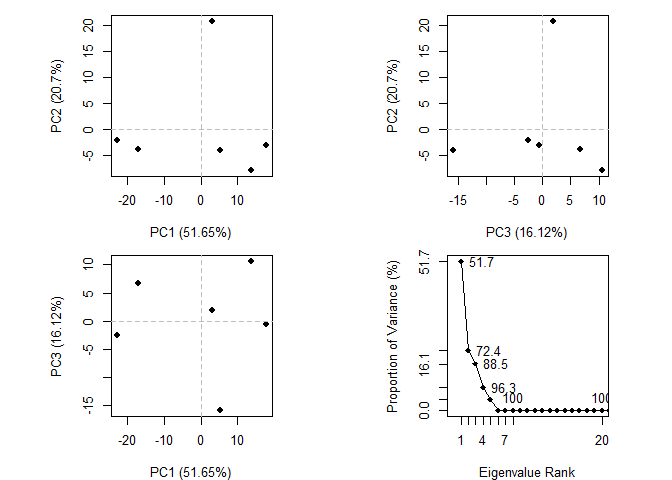

Untitled
================

## Revisit the PDB

> Q1: Download a CSV file from the PDB site (accessible from “Analyze”
> -\> “PDB Statistics” \> “by Experimental Method and Molecular Type”.
> Move this CSV file into your RStudio project and determine the
> percentage of structures solved by X-Ray and Electron Microscopy.

Downloaded a CSV file from: <https://www.rcsb.org/stats/summary> on
2019-05-08

``` r
db <- read.csv("Data Export Summary.csv",row.names=1)
(db$Total/sum(db$Total))*100
```

    ## [1] 89.35250471  8.30950090  2.06254860  0.18385018  0.09159561

Also can you determine what proportion of structures are protein?

``` r
(sum(db$Proteins)/sum(db$Total))*100
```

    ## [1] 92.76461

## Section 3. Using Bio3D

Let’s read the PDB fiLe we downloaded into R to see how things live in
this place

``` r
library(bio3d)
pdb <- read.pdb("1hsg.pdb")
pdb
```

    ## 
    ##  Call:  read.pdb(file = "1hsg.pdb")
    ## 
    ##    Total Models#: 1
    ##      Total Atoms#: 1686,  XYZs#: 5058  Chains#: 2  (values: A B)
    ## 
    ##      Protein Atoms#: 1514  (residues/Calpha atoms#: 198)
    ##      Nucleic acid Atoms#: 0  (residues/phosphate atoms#: 0)
    ## 
    ##      Non-protein/nucleic Atoms#: 172  (residues: 128)
    ##      Non-protein/nucleic resid values: [ HOH (127), MK1 (1) ]
    ## 
    ##    Protein sequence:
    ##       PQITLWQRPLVTIKIGGQLKEALLDTGADDTVLEEMSLPGRWKPKMIGGIGGFIKVRQYD
    ##       QILIEICGHKAIGTVLVGPTPVNIIGRNLLTQIGCTLNFPQITLWQRPLVTIKIGGQLKE
    ##       ALLDTGADDTVLEEMSLPGRWKPKMIGGIGGFIKVRQYDQILIEICGHKAIGTVLVGPTP
    ##       VNIIGRNLLTQIGCTLNF
    ## 
    ## + attr: atom, xyz, seqres, helix, sheet,
    ##         calpha, remark, call

``` r
aa321(pdb$seqres)
```

    ##   [1] "P" "Q" "I" "T" "L" "W" "Q" "R" "P" "L" "V" "T" "I" "K" "I" "G" "G"
    ##  [18] "Q" "L" "K" "E" "A" "L" "L" "D" "T" "G" "A" "D" "D" "T" "V" "L" "E"
    ##  [35] "E" "M" "S" "L" "P" "G" "R" "W" "K" "P" "K" "M" "I" "G" "G" "I" "G"
    ##  [52] "G" "F" "I" "K" "V" "R" "Q" "Y" "D" "Q" "I" "L" "I" "E" "I" "C" "G"
    ##  [69] "H" "K" "A" "I" "G" "T" "V" "L" "V" "G" "P" "T" "P" "V" "N" "I" "I"
    ##  [86] "G" "R" "N" "L" "L" "T" "Q" "I" "G" "C" "T" "L" "N" "F" "P" "Q" "I"
    ## [103] "T" "L" "W" "Q" "R" "P" "L" "V" "T" "I" "K" "I" "G" "G" "Q" "L" "K"
    ## [120] "E" "A" "L" "L" "D" "T" "G" "A" "D" "D" "T" "V" "L" "E" "E" "M" "S"
    ## [137] "L" "P" "G" "R" "W" "K" "P" "K" "M" "I" "G" "G" "I" "G" "G" "F" "I"
    ## [154] "K" "V" "R" "Q" "Y" "D" "Q" "I" "L" "I" "E" "I" "C" "G" "H" "K" "A"
    ## [171] "I" "G" "T" "V" "L" "V" "G" "P" "T" "P" "V" "N" "I" "I" "G" "R" "N"
    ## [188] "L" "L" "T" "Q" "I" "G" "C" "T" "L" "N" "F"

``` r
pdb$atom
```

    ##        type eleno elety  alt resid chain resno insert      x       y
    ## 1      ATOM     1     N <NA>   PRO     A     1   <NA> 29.361  39.686
    ## 2      ATOM     2    CA <NA>   PRO     A     1   <NA> 30.307  38.663
    ## 3      ATOM     3     C <NA>   PRO     A     1   <NA> 29.760  38.071
    ## 4      ATOM     4     O <NA>   PRO     A     1   <NA> 28.600  38.302
    ## 5      ATOM     5    CB <NA>   PRO     A     1   <NA> 30.508  37.541
    ## 6      ATOM     6    CG <NA>   PRO     A     1   <NA> 29.296  37.591
    ## 7      ATOM     7    CD <NA>   PRO     A     1   <NA> 28.778  39.015
    ## 8      ATOM     8     N <NA>   GLN     A     2   <NA> 30.607  37.334
    ## 9      ATOM     9    CA <NA>   GLN     A     2   <NA> 30.158  36.492
    ## 10     ATOM    10     C <NA>   GLN     A     2   <NA> 30.298  35.041
    ## 11     ATOM    11     O <NA>   GLN     A     2   <NA> 31.401  34.494
    ## 12     ATOM    12    CB <NA>   GLN     A     2   <NA> 30.970  36.738
    ## 13     ATOM    13    CG <NA>   GLN     A     2   <NA> 30.625  35.783
    ## 14     ATOM    14    CD <NA>   GLN     A     2   <NA> 31.184  36.217
    ## 15     ATOM    15   OE1 <NA>   GLN     A     2   <NA> 32.006  35.518
    ## 16     ATOM    16   NE2 <NA>   GLN     A     2   <NA> 30.684  37.339
    ## 17     ATOM    17     N <NA>   ILE     A     3   <NA> 29.160  34.436
    ## 18     ATOM    18    CA <NA>   ILE     A     3   <NA> 29.123  33.098
    ## 19     ATOM    19     C <NA>   ILE     A     3   <NA> 28.968  32.155
    ## 20     ATOM    20     O <NA>   ILE     A     3   <NA> 28.088  32.330
    ## 21     ATOM    21    CB <NA>   ILE     A     3   <NA> 27.977  32.995
    ## 22     ATOM    22   CG1 <NA>   ILE     A     3   <NA> 28.341  33.820
    ## 23     ATOM    23   CG2 <NA>   ILE     A     3   <NA> 27.692  31.548
    ## 24     ATOM    24   CD1 <NA>   ILE     A     3   <NA> 27.264  33.884
    ## 25     ATOM    25     N <NA>   THR     A     4   <NA> 29.891  31.210
    ## 26     ATOM    26    CA <NA>   THR     A     4   <NA> 29.774  30.143
    ## 27     ATOM    27     C <NA>   THR     A     4   <NA> 28.986  28.975
    ## 28     ATOM    28     O <NA>   THR     A     4   <NA> 28.690  28.948
    ## 29     ATOM    29    CB <NA>   THR     A     4   <NA> 31.165  29.618
    ## 30     ATOM    30   OG1 <NA>   THR     A     4   <NA> 31.866  29.209
    ## 31     ATOM    31   CG2 <NA>   THR     A     4   <NA> 31.980  30.688
    ## 32     ATOM    32     N <NA>   LEU     A     5   <NA> 28.641  28.019
    ## 33     ATOM    33    CA <NA>   LEU     A     5   <NA> 27.644  27.003
    ## 34     ATOM    34     C <NA>   LEU     A     5   <NA> 28.204  25.559
    ## 35     ATOM    35     O <NA>   LEU     A     5   <NA> 27.446  24.583
    ## 36     ATOM    36    CB <NA>   LEU     A     5   <NA> 26.411  27.139
    ## 37     ATOM    37    CG <NA>   LEU     A     5   <NA> 25.676  28.479
    ## 38     ATOM    38   CD1 <NA>   LEU     A     5   <NA> 24.624  28.624
    ## 39     ATOM    39   CD2 <NA>   LEU     A     5   <NA> 25.088  28.590
    ## 40     ATOM    40     N <NA>   TRP     A     6   <NA> 29.528  25.436
    ## 41     ATOM    41    CA <NA>   TRP     A     6   <NA> 30.177  24.150
    ## 42     ATOM    42     C <NA>   TRP     A     6   <NA> 29.837  23.488
    ## 43     ATOM    43     O <NA>   TRP     A     6   <NA> 29.706  22.271
    ## 44     ATOM    44    CB <NA>   TRP     A     6   <NA> 31.685  24.301
    ## 45     ATOM    45    CG <NA>   TRP     A     6   <NA> 32.152  24.955
    ## 46     ATOM    46   CD1 <NA>   TRP     A     6   <NA> 32.681  26.216
    ## 47     ATOM    47   CD2 <NA>   TRP     A     6   <NA> 32.274  24.314
    ## 48     ATOM    48   NE1 <NA>   TRP     A     6   <NA> 33.102  26.385
    ## 49     ATOM    49   CE2 <NA>   TRP     A     6   <NA> 32.864  25.258
    ## 50     ATOM    50   CE3 <NA>   TRP     A     6   <NA> 31.949  23.035
    ## 51     ATOM    51   CZ2 <NA>   TRP     A     6   <NA> 33.093  24.968
    ## 52     ATOM    52   CZ3 <NA>   TRP     A     6   <NA> 32.195  22.755
    ## 53     ATOM    53   CH2 <NA>   TRP     A     6   <NA> 32.754  23.722
    ## 54     ATOM    54     N <NA>   GLN     A     7   <NA> 29.667  24.280
    ## 55     ATOM    55    CA <NA>   GLN     A     7   <NA> 29.141  23.799
    ## 56     ATOM    56     C <NA>   GLN     A     7   <NA> 27.747  24.395
    ## 57     ATOM    57     O <NA>   GLN     A     7   <NA> 27.349  25.330
    ## 58     ATOM    58    CB <NA>   GLN     A     7   <NA> 30.072  24.227
    ## 59     ATOM    59    CG <NA>   GLN     A     7   <NA> 31.512  23.694
    ## 60     ATOM    60    CD <NA>   GLN     A     7   <NA> 32.521  24.750
    ## 61     ATOM    61   OE1 <NA>   GLN     A     7   <NA> 32.666  25.860
    ## 62     ATOM    62   NE2 <NA>   GLN     A     7   <NA> 33.268  24.374
    ## 63     ATOM    63     N <NA>   ARG     A     8   <NA> 26.992  23.877
    ## 64     ATOM    64    CA <NA>   ARG     A     8   <NA> 25.757  24.566
    ## 65     ATOM    65     C <NA>   ARG     A     8   <NA> 26.029  26.025
    ## 66     ATOM    66     O <NA>   ARG     A     8   <NA> 26.947  26.291
    ## 67     ATOM    67    CB <NA>   ARG     A     8   <NA> 25.087  23.849
    ## 68     ATOM    68    CG <NA>   ARG     A     8   <NA> 24.646  22.409
    ## 69     ATOM    69    CD <NA>   ARG     A     8   <NA> 23.728  21.896
    ## 70     ATOM    70    NE <NA>   ARG     A     8   <NA> 22.952  20.730
    ## 71     ATOM    71    CZ <NA>   ARG     A     8   <NA> 22.367  19.871
    ## 72     ATOM    72   NH1 <NA>   ARG     A     8   <NA> 22.376  20.074
    ## 73     ATOM    73   NH2 <NA>   ARG     A     8   <NA> 21.776  18.789
    ## 74     ATOM    74     N <NA>   PRO     A     9   <NA> 25.123  26.955
    ## 75     ATOM    75    CA <NA>   PRO     A     9   <NA> 25.491  28.352
    ## 76     ATOM    76     C <NA>   PRO     A     9   <NA> 25.127  28.763
    ## 77     ATOM    77     O <NA>   PRO     A     9   <NA> 24.136  29.472
    ## 78     ATOM    78    CB <NA>   PRO     A     9   <NA> 24.719  29.176
    ## 79     ATOM    79    CG <NA>   PRO     A     9   <NA> 23.625  28.254
    ## 80     ATOM    80    CD <NA>   PRO     A     9   <NA> 24.096  26.855
    ## 81     ATOM    81     N <NA>   LEU     A    10   <NA> 25.905  28.285
    ## 82     ATOM    82    CA <NA>   LEU     A    10   <NA> 25.653  28.510
    ## 83     ATOM    83     C <NA>   LEU     A    10   <NA> 26.383  29.770
    ## 84     ATOM    84     O <NA>   LEU     A    10   <NA> 27.567  29.927
    ## 85     ATOM    85    CB <NA>   LEU     A    10   <NA> 26.120  27.284
    ## 86     ATOM    86    CG <NA>   LEU     A    10   <NA> 25.161  26.082
    ## 87     ATOM    87   CD1 <NA>   LEU     A    10   <NA> 25.895  24.743
    ## 88     ATOM    88   CD2 <NA>   LEU     A    10   <NA> 24.206  26.196
    ## 89     ATOM    89     N <NA>   VAL     A    11   <NA> 25.667  30.672
    ## 90     ATOM    90    CA <NA>   VAL     A    11   <NA> 26.267  31.854
    ## 91     ATOM    91     C <NA>   VAL     A    11   <NA> 25.818  31.957
    ## 92     ATOM    92     O <NA>   VAL     A    11   <NA> 24.929  31.184
    ## 93     ATOM    93    CB <NA>   VAL     A    11   <NA> 25.824  33.131
    ## 94     ATOM    94   CG1 <NA>   VAL     A    11   <NA> 26.270  33.089
    ## 95     ATOM    95   CG2 <NA>   VAL     A    11   <NA> 24.333  33.275
    ## 96     ATOM    96     N <NA>   THR     A    12   <NA> 26.397  32.913
    ## 97     ATOM    97    CA <NA>   THR     A    12   <NA> 26.001  33.143
    ## 98     ATOM    98     C <NA>   THR     A    12   <NA> 24.915  34.200
    ## 99     ATOM    99     O <NA>   THR     A    12   <NA> 25.010  35.279
    ## 100    ATOM   100    CB <NA>   THR     A    12   <NA> 27.201  33.565
    ## 101    ATOM   101   OG1 <NA>   THR     A    12   <NA> 28.330  32.709
    ## 102    ATOM   102   CG2 <NA>   THR     A    12   <NA> 26.827  33.430
    ## 103    ATOM   103     N <NA>   ILE     A    13   <NA> 23.848  33.868
    ## 104    ATOM   104    CA <NA>   ILE     A    13   <NA> 22.842  34.875
    ## 105    ATOM   105     C <NA>   ILE     A    13   <NA> 22.770  35.114
    ## 106    ATOM   106     O <NA>   ILE     A    13   <NA> 23.328  34.363
    ## 107    ATOM   107    CB <NA>   ILE     A    13   <NA> 21.413  34.460
    ## 108    ATOM   108   CG1 <NA>   ILE     A    13   <NA> 20.878  33.229
    ## 109    ATOM   109   CG2 <NA>   ILE     A    13   <NA> 21.510  34.194
    ## 110    ATOM   110   CD1 <NA>   ILE     A    13   <NA> 19.353  33.201
    ## 111    ATOM   111     N <NA>   LYS     A    14   <NA> 22.106  36.199
    ## 112    ATOM   112    CA <NA>   LYS     A    14   <NA> 21.894  36.545
    ## 113    ATOM   113     C <NA>   LYS     A    14   <NA> 20.442  36.943
    ## 114    ATOM   114     O <NA>   LYS     A    14   <NA> 19.960  37.808
    ## 115    ATOM   115    CB <NA>   LYS     A    14   <NA> 22.777  37.724
    ## 116    ATOM   116    CG <NA>   LYS     A    14   <NA> 22.727  38.056
    ## 117    ATOM   117    CD <NA>   LYS     A    14   <NA> 23.270  39.450
    ## 118    ATOM   118    CE <NA>   LYS     A    14   <NA> 24.814  39.490
    ## 119    ATOM   119    NZ <NA>   LYS     A    14   <NA> 25.394  40.891
    ## 120    ATOM   120     N <NA>   ILE     A    15   <NA> 19.739  36.267
    ## 121    ATOM   121    CA <NA>   ILE     A    15   <NA> 18.345  36.563
    ## 122    ATOM   122     C <NA>   ILE     A    15   <NA> 18.224  36.327
    ## 123    ATOM   123     O <NA>   ILE     A    15   <NA> 18.886  35.449
    ## 124    ATOM   124    CB <NA>   ILE     A    15   <NA> 17.380  35.592
    ## 125    ATOM   125   CG1 <NA>   ILE     A    15   <NA> 15.935  35.812
    ## 126    ATOM   126   CG2 <NA>   ILE     A    15   <NA> 17.745  34.137
    ## 127    ATOM   127   CD1 <NA>   ILE     A    15   <NA> 14.929  35.116
    ## 128    ATOM   128     N <NA>   GLY     A    16   <NA> 17.446  37.139
    ## 129    ATOM   129    CA <NA>   GLY     A    16   <NA> 17.356  36.968
    ## 130    ATOM   130     C <NA>   GLY     A    16   <NA> 18.711  36.871
    ## 131    ATOM   131     O <NA>   GLY     A    16   <NA> 18.866  36.162
    ## 132    ATOM   132     N <NA>   GLY     A    17   <NA> 19.671  37.659
    ## 133    ATOM   133    CA <NA>   GLY     A    17   <NA> 20.970  37.660
    ## 134    ATOM   134     C <NA>   GLY     A    17   <NA> 21.680  36.316
    ## 135    ATOM   135     O <NA>   GLY     A    17   <NA> 22.785  36.163
    ## 136    ATOM   136     N <NA>   GLN     A    18   <NA> 21.093  35.361
    ## 137    ATOM   137    CA <NA>   GLN     A    18   <NA> 21.780  34.106
    ## 138    ATOM   138     C <NA>   GLN     A    18   <NA> 22.500  34.159
    ## 139    ATOM   139     O <NA>   GLN     A    18   <NA> 21.937  34.624
    ## 140    ATOM   140    CB <NA>   GLN     A    18   <NA> 20.776  32.957
    ## 141    ATOM   141    CG <NA>   GLN     A    18   <NA> 19.599  33.116
    ## 142    ATOM   142    CD <NA>   GLN     A    18   <NA> 19.556  31.997
    ## 143    ATOM   143   OE1 <NA>   GLN     A    18   <NA> 20.393  31.944
    ## 144    ATOM   144   NE2 <NA>   GLN     A    18   <NA> 18.647  31.035
    ## 145    ATOM   145     N <NA>   LEU     A    19   <NA> 23.733  33.672
    ## 146    ATOM   146    CA <NA>   LEU     A    19   <NA> 24.334  33.365
    ## 147    ATOM   147     C <NA>   LEU     A    19   <NA> 23.896  31.963
    ## 148    ATOM   148     O <NA>   LEU     A    19   <NA> 23.975  31.020
    ## 149    ATOM   149    CB <NA>   LEU     A    19   <NA> 25.869  33.432
    ## 150    ATOM   150    CG <NA>   LEU     A    19   <NA> 26.561  34.761
    ## 151    ATOM   151   CD1 <NA>   LEU     A    19   <NA> 28.007  34.629
    ## 152    ATOM   152   CD2 <NA>   LEU     A    19   <NA> 25.983  35.913
    ## 153    ATOM   153     N <NA>   LYS     A    20   <NA> 23.416  31.855
    ## 154    ATOM   154    CA <NA>   LYS     A    20   <NA> 23.006  30.584
    ## 155    ATOM   155     C <NA>   LYS     A    20   <NA> 23.626  30.463
    ## 156    ATOM   156     O <NA>   LYS     A    20   <NA> 24.024  31.460
    ## 157    ATOM   157    CB <NA>   LYS     A    20   <NA> 21.494  30.523
    ## 158    ATOM   158    CG <NA>   LYS     A    20   <NA> 20.778  29.875
    ## 159    ATOM   159    CD <NA>   LYS     A    20   <NA> 19.868  30.857
    ## 160    ATOM   160    CE <NA>   LYS     A    20   <NA> 19.112  30.168
    ## 161    ATOM   161    NZ <NA>   LYS     A    20   <NA> 18.467  28.892
    ## 162    ATOM   162     N <NA>   GLU     A    21   <NA> 23.725  29.250
    ## 163    ATOM   163    CA <NA>   GLU     A    21   <NA> 24.053  29.117
    ## 164    ATOM   164     C <NA>   GLU     A    21   <NA> 22.822  28.761
    ## 165    ATOM   165     O <NA>   GLU     A    21   <NA> 21.879  28.136
    ## 166    ATOM   166    CB <NA>   GLU     A    21   <NA> 25.197  28.130
    ## 167    ATOM   167    CG <NA>   GLU     A    21   <NA> 25.035  26.716
    ## 168    ATOM   168    CD <NA>   GLU     A    21   <NA> 25.878  25.743
    ## 169    ATOM   169   OE1 <NA>   GLU     A    21   <NA> 27.022  26.130
    ## 170    ATOM   170   OE2 <NA>   GLU     A    21   <NA> 25.379  24.639
    ## 171    ATOM   171     N <NA>   ALA     A    22   <NA> 22.778  29.268
    ## 172    ATOM   172    CA <NA>   ALA     A    22   <NA> 21.553  29.189
    ## 173    ATOM   173     C <NA>   ALA     A    22   <NA> 21.870  29.183
    ## 174    ATOM   174     O <NA>   ALA     A    22   <NA> 22.975  29.578
    ## 175    ATOM   175    CB <NA>   ALA     A    22   <NA> 20.625  30.359
    ## 176    ATOM   176     N <NA>   LEU     A    23   <NA> 20.893  28.726
    ## 177    ATOM   177    CA <NA>   LEU     A    23   <NA> 21.047  28.473
    ## 178    ATOM   178     C <NA>   LEU     A    23   <NA> 20.381  29.596
    ## 179    ATOM   179     O <NA>   LEU     A    23   <NA> 19.231  29.943
    ## 180    ATOM   180    CB <NA>   LEU     A    23   <NA> 20.382  27.135
    ## 181    ATOM   181    CG <NA>   LEU     A    23   <NA> 20.532  26.573
    ## 182    ATOM   182   CD1 <NA>   LEU     A    23   <NA> 21.939  26.039
    ## 183    ATOM   183   CD2 <NA>   LEU     A    23   <NA> 19.490  25.490
    ## 184    ATOM   184     N <NA>   LEU     A    24   <NA> 21.122  30.163
    ## 185    ATOM   185    CA <NA>   LEU     A    24   <NA> 20.617  31.144
    ## 186    ATOM   186     C <NA>   LEU     A    24   <NA> 19.940  30.412
    ## 187    ATOM   187     O <NA>   LEU     A    24   <NA> 20.567  29.833
    ## 188    ATOM   188    CB <NA>   LEU     A    24   <NA> 21.767  32.023
    ## 189    ATOM   189    CG <NA>   LEU     A    24   <NA> 22.647  32.673
    ## 190    ATOM   190   CD1 <NA>   LEU     A    24   <NA> 23.698  33.581
    ## 191    ATOM   191   CD2 <NA>   LEU     A    24   <NA> 21.797  33.496
    ## 192    ATOM   192     N <NA>   ASP     A    25   <NA> 18.626  30.444
    ## 193    ATOM   193    CA <NA>   ASP     A    25   <NA> 17.853  29.516
    ## 194    ATOM   194     C <NA>   ASP     A    25   <NA> 16.945  30.292
    ## 195    ATOM   195     O <NA>   ASP     A    25   <NA> 15.843  30.678
    ## 196    ATOM   196    CB <NA>   ASP     A    25   <NA> 17.047  28.642
    ## 197    ATOM   197    CG <NA>   ASP     A    25   <NA> 16.316  27.513
    ## 198    ATOM   198   OD1 <NA>   ASP     A    25   <NA> 16.236  27.458
    ## 199    ATOM   199   OD2 <NA>   ASP     A    25   <NA> 15.762  26.696
    ## 200    ATOM   200     N <NA>   THR     A    26   <NA> 17.364  30.439
    ## 201    ATOM   201    CA <NA>   THR     A    26   <NA> 16.548  31.148
    ## 202    ATOM   202     C <NA>   THR     A    26   <NA> 15.302  30.382
    ## 203    ATOM   203     O <NA>   THR     A    26   <NA> 14.412  30.939
    ## 204    ATOM   204    CB <NA>   THR     A    26   <NA> 17.328  31.419
    ## 205    ATOM   205   OG1 <NA>   THR     A    26   <NA> 17.693  30.177
    ## 206    ATOM   206   CG2 <NA>   THR     A    26   <NA> 18.601  32.197
    ## 207    ATOM   207     N <NA>   GLY     A    27   <NA> 15.213  29.111
    ## 208    ATOM   208    CA <NA>   GLY     A    27   <NA> 14.043  28.331
    ## 209    ATOM   209     C <NA>   GLY     A    27   <NA> 12.958  28.456
    ## 210    ATOM   210     O <NA>   GLY     A    27   <NA> 11.832  28.015
    ## 211    ATOM   211     N <NA>   ALA     A    28   <NA> 13.301  28.967
    ## 212    ATOM   212    CA <NA>   ALA     A    28   <NA> 12.324  29.192
    ## 213    ATOM   213     C <NA>   ALA     A    28   <NA> 11.629  30.567
    ## 214    ATOM   214     O <NA>   ALA     A    28   <NA> 12.303  31.618
    ## 215    ATOM   215    CB <NA>   ALA     A    28   <NA> 13.031  29.084
    ## 216    ATOM   216     N <NA>   ASP     A    29   <NA> 10.296  30.560
    ## 217    ATOM   217    CA <NA>   ASP     A    29   <NA>  9.512  31.798
    ## 218    ATOM   218     C <NA>   ASP     A    29   <NA>  9.632  32.481
    ## 219    ATOM   219     O <NA>   ASP     A    29   <NA>  9.671  33.706
    ## 220    ATOM   220    CB <NA>   ASP     A    29   <NA>  8.029  31.534
    ## 221    ATOM   221    CG <NA>   ASP     A    29   <NA>  7.752  31.004
    ## 222    ATOM   222   OD1 <NA>   ASP     A    29   <NA>  8.591  31.192
    ## 223    ATOM   223   OD2 <NA>   ASP     A    29   <NA>  6.661  30.410
    ## 224    ATOM   224     N <NA>   ASP     A    30   <NA>  9.698  31.685
    ## 225    ATOM   225    CA <NA>   ASP     A    30   <NA>  9.718  32.168
    ## 226    ATOM   226     C <NA>   ASP     A    30   <NA> 10.988  31.819
    ## 227    ATOM   227     O <NA>   ASP     A    30   <NA> 11.818  31.072
    ## 228    ATOM   228    CB <NA>   ASP     A    30   <NA>  8.549  31.585
    ## 229    ATOM   229    CG <NA>   ASP     A    30   <NA>  7.254  31.916
    ## 230    ATOM   230   OD1 <NA>   ASP     A    30   <NA>  6.951  33.118
    ## 231    ATOM   231   OD2 <NA>   ASP     A    30   <NA>  6.561  31.008
    ## 232    ATOM   232     N <NA>   THR     A    31   <NA> 11.161  32.408
    ## 233    ATOM   233    CA <NA>   THR     A    31   <NA> 12.248  32.053
    ## 234    ATOM   234     C <NA>   THR     A    31   <NA> 11.707  31.128
    ## 235    ATOM   235     O <NA>   THR     A    31   <NA> 10.660  31.408
    ## 236    ATOM   236    CB <NA>   THR     A    31   <NA> 12.896  33.338
    ## 237    ATOM   237   OG1 <NA>   THR     A    31   <NA> 13.451  34.082
    ## 238    ATOM   238   CG2 <NA>   THR     A    31   <NA> 14.027  32.992
    ## 239    ATOM   239     N <NA>   VAL     A    32   <NA> 12.390  30.005
    ## 240    ATOM   240    CA <NA>   VAL     A    32   <NA> 11.893  28.983
    ## 241    ATOM   241     C <NA>   VAL     A    32   <NA> 13.036  28.655
    ## 242    ATOM   242     O <NA>   VAL     A    32   <NA> 14.067  28.221
    ## 243    ATOM   243    CB <NA>   VAL     A    32   <NA> 11.528  27.683
    ## 244    ATOM   244   CG1 <NA>   VAL     A    32   <NA> 10.656  26.825
    ## 245    ATOM   245   CG2 <NA>   VAL     A    32   <NA> 10.805  27.963
    ## 246    ATOM   246     N <NA>   LEU     A    33   <NA> 12.899  28.904
    ## 247    ATOM   247    CA <NA>   LEU     A    33   <NA> 13.996  28.594
    ## 248    ATOM   248     C <NA>   LEU     A    33   <NA> 13.571  27.454
    ## 249    ATOM   249     O <NA>   LEU     A    33   <NA> 12.363  27.234
    ## 250    ATOM   250    CB <NA>   LEU     A    33   <NA> 14.337  29.799
    ## 251    ATOM   251    CG <NA>   LEU     A    33   <NA> 14.849  31.061
    ## 252    ATOM   252   CD1 <NA>   LEU     A    33   <NA> 15.091  32.156
    ## 253    ATOM   253   CD2 <NA>   LEU     A    33   <NA> 16.139  30.718
    ## 254    ATOM   254     N <NA>   GLU     A    34   <NA> 14.568  26.722
    ## 255    ATOM   255    CA <NA>   GLU     A    34   <NA> 14.390  25.650
    ## 256    ATOM   256     C <NA>   GLU     A    34   <NA> 13.739  26.125
    ## 257    ATOM   257     O <NA>   GLU     A    34   <NA> 13.982  27.222
    ## 258    ATOM   258    CB <NA>   GLU     A    34   <NA> 15.727  25.007
    ## 259    ATOM   259    CG <NA>   GLU     A    34   <NA> 16.297  24.250
    ## 260    ATOM   260    CD <NA>   GLU     A    34   <NA> 17.726  23.801
    ## 261    ATOM   261   OE1 <NA>   GLU     A    34   <NA> 18.134  23.657
    ## 262    ATOM   262   OE2 <NA>   GLU     A    34   <NA> 18.443  23.614
    ## 263    ATOM   263     N <NA>   GLU     A    35   <NA> 12.865  25.288
    ## 264    ATOM   264    CA <NA>   GLU     A    35   <NA> 12.183  25.482
    ## 265    ATOM   265     C <NA>   GLU     A    35   <NA> 12.971  26.329
    ## 266    ATOM   266     O <NA>   GLU     A    35   <NA> 13.981  25.861
    ## 267    ATOM   267    CB <NA>   GLU     A    35   <NA> 11.941  24.114
    ## 268    ATOM   268    CG <NA>   GLU     A    35   <NA> 10.800  24.049
    ## 269    ATOM   269    CD <NA>   GLU     A    35   <NA>  9.489  24.067
    ## 270    ATOM   270   OE1 <NA>   GLU     A    35   <NA>  9.134  23.066
    ## 271    ATOM   271   OE2 <NA>   GLU     A    35   <NA>  8.758  25.047
    ## 272    ATOM   272     N <NA>   MET     A    36   <NA> 12.495  27.556
    ## 273    ATOM   273    CA <NA>   MET     A    36   <NA> 13.101  28.479
    ## 274    ATOM   274     C <NA>   MET     A    36   <NA> 12.013  29.437
    ## 275    ATOM   275     O <NA>   MET     A    36   <NA> 10.969  29.535
    ## 276    ATOM   276    CB <NA>   MET     A    36   <NA> 14.216  29.306
    ## 277    ATOM   277    CG <NA>   MET     A    36   <NA> 13.741  30.341
    ## 278    ATOM   278    SD <NA>   MET     A    36   <NA> 15.123  31.051
    ## 279    ATOM   279    CE <NA>   MET     A    36   <NA> 15.783  32.224
    ## 280    ATOM   280     N <NA>   SER     A    37   <NA> 12.249  30.179
    ## 281    ATOM   281    CA <NA>   SER     A    37   <NA> 11.163  31.036
    ## 282    ATOM   282     C <NA>   SER     A    37   <NA> 11.347  32.442
    ## 283    ATOM   283     O <NA>   SER     A    37   <NA> 12.475  32.929
    ## 284    ATOM   284    CB <NA>   SER     A    37   <NA> 11.300  31.071
    ## 285    ATOM   285    OG <NA>   SER     A    37   <NA>  9.948  31.148
    ## 286    ATOM   286     N <NA>   LEU     A    38   <NA> 10.330  33.112
    ## 287    ATOM   287    CA <NA>   LEU     A    38   <NA> 10.566  34.476
    ## 288    ATOM   288     C <NA>   LEU     A    38   <NA>  9.594  35.375
    ## 289    ATOM   289     O <NA>   LEU     A    38   <NA>  8.616  34.906
    ## 290    ATOM   290    CB <NA>   LEU     A    38   <NA> 10.409  34.626
    ## 291    ATOM   291    CG <NA>   LEU     A    38   <NA> 11.559  34.187
    ## 292    ATOM   292   CD1 <NA>   LEU     A    38   <NA> 11.171  34.399
    ## 293    ATOM   293   CD2 <NA>   LEU     A    38   <NA> 12.807  34.964
    ## 294    ATOM   294     N <NA>   PRO     A    39   <NA>  9.929  36.666
    ## 295    ATOM   295    CA <NA>   PRO     A    39   <NA>  8.980  37.700
    ## 296    ATOM   296     C <NA>   PRO     A    39   <NA>  7.760  37.785
    ## 297    ATOM   297     O <NA>   PRO     A    39   <NA>  7.866  37.883
    ## 298    ATOM   298    CB <NA>   PRO     A    39   <NA>  9.778  38.989
    ## 299    ATOM   299    CG <NA>   PRO     A    39   <NA> 11.021  38.637
    ## 300    ATOM   300    CD <NA>   PRO     A    39   <NA> 11.291  37.226
    ## 301    ATOM   301     N <NA>   GLY     A    40   <NA>  6.601  37.811
    ## 302    ATOM   302    CA <NA>   GLY     A    40   <NA>  5.419  38.218
    ## 303    ATOM   303     C <NA>   GLY     A    40   <NA>  4.430  37.094
    ## 304    ATOM   304     O <NA>   GLY     A    40   <NA>  4.591  36.107
    ## 305    ATOM   305     N <NA>   ARG     A    41   <NA>  3.289  37.341
    ## 306    ATOM   306    CA <NA>   ARG     A    41   <NA>  2.382  36.252
    ## 307    ATOM   307     C <NA>   ARG     A    41   <NA>  2.606  35.713
    ## 308    ATOM   308     O <NA>   ARG     A    41   <NA>  3.225  36.383
    ## 309    ATOM   309    CB <NA>   ARG     A    41   <NA>  0.956  36.719
    ## 310    ATOM   310    CG <NA>   ARG     A    41   <NA>  0.288  36.021
    ## 311    ATOM   311    CD <NA>   ARG     A    41   <NA>  0.118  36.953
    ## 312    ATOM   312    NE <NA>   ARG     A    41   <NA>  1.356  37.143
    ## 313    ATOM   313    CZ <NA>   ARG     A    41   <NA>  1.830  38.332
    ## 314    ATOM   314   NH1 <NA>   ARG     A    41   <NA>  1.161  39.450
    ## 315    ATOM   315   NH2 <NA>   ARG     A    41   <NA>  2.973  38.402
    ## 316    ATOM   316     N <NA>   TRP     A    42   <NA>  2.145  34.493
    ## 317    ATOM   317    CA <NA>   TRP     A    42   <NA>  2.295  33.862
    ## 318    ATOM   318     C <NA>   TRP     A    42   <NA>  0.934  33.419
    ## 319    ATOM   319     O <NA>   TRP     A    42   <NA>  0.031  33.049
    ## 320    ATOM   320    CB <NA>   TRP     A    42   <NA>  3.207  32.645
    ## 321    ATOM   321    CG <NA>   TRP     A    42   <NA>  2.946  31.783
    ## 322    ATOM   322   CD1 <NA>   TRP     A    42   <NA>  3.473  31.896
    ## 323    ATOM   323   CD2 <NA>   TRP     A    42   <NA>  1.989  30.710
    ## 324    ATOM   324   NE1 <NA>   TRP     A    42   <NA>  2.882  30.973
    ## 325    ATOM   325   CE2 <NA>   TRP     A    42   <NA>  1.966  30.246
    ## 326    ATOM   326   CE3 <NA>   TRP     A    42   <NA>  1.129  30.108
    ## 327    ATOM   327   CZ2 <NA>   TRP     A    42   <NA>  1.117  29.219
    ## 328    ATOM   328   CZ3 <NA>   TRP     A    42   <NA>  0.313  29.091
    ## 329    ATOM   329   CH2 <NA>   TRP     A    42   <NA>  0.305  28.651
    ## 330    ATOM   330     N <NA>   LYS     A    43   <NA>  0.781  33.465
    ## 331    ATOM   331    CA <NA>   LYS     A    43   <NA> -0.305  32.776
    ## 332    ATOM   332     C <NA>   LYS     A    43   <NA>  0.220  31.412
    ## 333    ATOM   333     O <NA>   LYS     A    43   <NA>  1.400  31.270
    ## 334    ATOM   334    CB <NA>   LYS     A    43   <NA> -0.739  33.603
    ## 335    ATOM   335    CG <NA>   LYS     A    43   <NA> -1.311  34.967
    ## 336    ATOM   336    CD <NA>   LYS     A    43   <NA> -1.066  35.945
    ## 337    ATOM   337    CE <NA>   LYS     A    43   <NA> -1.726  37.319
    ## 338    ATOM   338    NZ <NA>   LYS     A    43   <NA> -0.979  38.292
    ## 339    ATOM   339     N <NA>   PRO     A    44   <NA> -0.601  30.363
    ## 340    ATOM   340    CA <NA>   PRO     A    44   <NA> -0.088  29.114
    ## 341    ATOM   341     C <NA>   PRO     A    44   <NA> -0.275  29.085
    ## 342    ATOM   342     O <NA>   PRO     A    44   <NA> -1.185  29.721
    ## 343    ATOM   343    CB <NA>   PRO     A    44   <NA> -0.893  28.021
    ## 344    ATOM   344    CG <NA>   PRO     A    44   <NA> -2.170  28.683
    ## 345    ATOM   345    CD <NA>   PRO     A    44   <NA> -1.825  30.129
    ## 346    ATOM   346     N <NA>   LYS     A    45   <NA>  0.586  28.336
    ## 347    ATOM   347    CA <NA>   LYS     A    45   <NA>  0.634  28.302
    ## 348    ATOM   348     C <NA>   LYS     A    45   <NA>  1.025  26.869
    ## 349    ATOM   349     O <NA>   LYS     A    45   <NA>  1.711  26.163
    ## 350    ATOM   350    CB <NA>   LYS     A    45   <NA>  1.693  29.299
    ## 351    ATOM   351    CG <NA>   LYS     A    45   <NA>  1.495  29.822
    ## 352    ATOM   352    CD <NA>   LYS     A    45   <NA>  2.628  30.791
    ## 353    ATOM   353    CE <NA>   LYS     A    45   <NA>  2.662  31.103
    ## 354    ATOM   354    NZ <NA>   LYS     A    45   <NA>  1.837  32.301
    ## 355    ATOM   355     N <NA>   MET     A    46   <NA>  0.570  26.438
    ## 356    ATOM   356    CA <NA>   MET     A    46   <NA>  1.091  25.232
    ## 357    ATOM   357     C <NA>   MET     A    46   <NA>  1.899  25.638
    ## 358    ATOM   358     O <NA>   MET     A    46   <NA>  1.385  26.292
    ## 359    ATOM   359    CB <NA>   MET     A    46   <NA> -0.047  24.319
    ## 360    ATOM   360    CG <NA>   MET     A    46   <NA> -0.970  23.867
    ## 361    ATOM   361    SD <NA>   MET     A    46   <NA> -0.348  22.459
    ## 362    ATOM   362    CE <NA>   MET     A    46   <NA> -0.585  21.081
    ## 363    ATOM   363     N <NA>   ILE     A    47   <NA>  3.167  25.258
    ## 364    ATOM   364    CA <NA>   ILE     A    47   <NA>  3.978  25.464
    ## 365    ATOM   365     C <NA>   ILE     A    47   <NA>  4.420  24.140
    ## 366    ATOM   366     O <NA>   ILE     A    47   <NA>  4.667  23.248
    ## 367    ATOM   367    CB <NA>   ILE     A    47   <NA>  5.234  26.259
    ## 368    ATOM   368   CG1 <NA>   ILE     A    47   <NA>  5.959  25.628
    ## 369    ATOM   369   CG2 <NA>   ILE     A    47   <NA>  4.898  27.703
    ## 370    ATOM   370   CD1 <NA>   ILE     A    47   <NA>  7.369  26.170
    ## 371    ATOM   371     N <NA>   GLY     A    48   <NA>  4.567  24.042
    ## 372    ATOM   372    CA <NA>   GLY     A    48   <NA>  4.886  22.777
    ## 373    ATOM   373     C <NA>   GLY     A    48   <NA>  6.265  22.720
    ## 374    ATOM   374     O <NA>   GLY     A    48   <NA>  6.723  23.689
    ## 375    ATOM   375     N <NA>   GLY     A    49   <NA>  7.015  21.688
    ## 376    ATOM   376    CA <NA>   GLY     A    49   <NA>  8.313  21.471
    ## 377    ATOM   377     C <NA>   GLY     A    49   <NA>  8.221  20.379
    ## 378    ATOM   378     O <NA>   GLY     A    49   <NA>  7.177  20.197
    ## 379    ATOM   379     N <NA>   ILE     A    50   <NA>  9.309  19.619
    ## 380    ATOM   380    CA <NA>   ILE     A    50   <NA>  9.537  18.544
    ## 381    ATOM   381     C <NA>   ILE     A    50   <NA>  8.802  17.261
    ## 382    ATOM   382     O <NA>   ILE     A    50   <NA>  8.143  16.589
    ## 383    ATOM   383    CB <NA>   ILE     A    50   <NA> 11.095  18.362
    ## 384    ATOM   384   CG1 <NA>   ILE     A    50   <NA> 11.553  18.874
    ## 385    ATOM   385   CG2 <NA>   ILE     A    50   <NA> 11.521  16.945
    ## 386    ATOM   386   CD1 <NA>   ILE     A    50   <NA> 10.910  18.225
    ## 387    ATOM   387     N <NA>   GLY     A    51   <NA>  8.865  16.952
    ## 388    ATOM   388    CA <NA>   GLY     A    51   <NA>  8.174  15.771
    ## 389    ATOM   389     C <NA>   GLY     A    51   <NA>  6.812  16.062
    ## 390    ATOM   390     O <NA>   GLY     A    51   <NA>  6.408  15.342
    ## 391    ATOM   391     N <NA>   GLY     A    52   <NA>  6.141  17.132
    ## 392    ATOM   392    CA <NA>   GLY     A    52   <NA>  4.855  17.480
    ## 393    ATOM   393     C <NA>   GLY     A    52   <NA>  4.884  18.624
    ## 394    ATOM   394     O <NA>   GLY     A    52   <NA>  5.873  19.342
    ## 395    ATOM   395     N <NA>   PHE     A    53   <NA>  3.806  18.788
    ## 396    ATOM   396    CA <NA>   PHE     A    53   <NA>  3.593  19.996
    ## 397    ATOM   397     C <NA>   PHE     A    53   <NA>  4.015  19.881
    ## 398    ATOM   398     O <NA>   PHE     A    53   <NA>  3.930  18.810
    ## 399    ATOM   399    CB <NA>   PHE     A    53   <NA>  2.121  20.351
    ## 400    ATOM   400    CG <NA>   PHE     A    53   <NA>  1.760  21.152
    ## 401    ATOM   401   CD1 <NA>   PHE     A    53   <NA>  1.725  20.567
    ## 402    ATOM   402   CD2 <NA>   PHE     A    53   <NA>  1.556  22.518
    ## 403    ATOM   403   CE1 <NA>   PHE     A    53   <NA>  1.500  21.332
    ## 404    ATOM   404   CE2 <NA>   PHE     A    53   <NA>  1.327  23.302
    ## 405    ATOM   405    CZ <NA>   PHE     A    53   <NA>  1.290  22.718
    ## 406    ATOM   406     N <NA>   ILE     A    54   <NA>  4.483  20.969
    ## 407    ATOM   407    CA <NA>   ILE     A    54   <NA>  4.689  21.005
    ## 408    ATOM   408     C <NA>   ILE     A    54   <NA>  3.921  22.179
    ## 409    ATOM   409     O <NA>   ILE     A    54   <NA>  3.575  23.139
    ## 410    ATOM   410    CB <NA>   ILE     A    54   <NA>  6.199  21.155
    ## 411    ATOM   411   CG1 <NA>   ILE     A    54   <NA>  6.796  22.408
    ## 412    ATOM   412   CG2 <NA>   ILE     A    54   <NA>  6.967  19.888
    ## 413    ATOM   413   CD1 <NA>   ILE     A    54   <NA>  8.110  22.821
    ## 414    ATOM   414     N <NA>   LYS     A    55   <NA>  3.632  22.095
    ## 415    ATOM   415    CA <NA>   LYS     A    55   <NA>  2.968  23.196
    ## 416    ATOM   416     C <NA>   LYS     A    55   <NA>  4.038  24.093
    ## 417    ATOM   417     O <NA>   LYS     A    55   <NA>  4.949  23.610
    ## 418    ATOM   418    CB <NA>   LYS     A    55   <NA>  2.021  22.661
    ## 419    ATOM   419    CG <NA>   LYS     A    55   <NA>  0.974  23.665
    ## 420    ATOM   420    CD <NA>   LYS     A    55   <NA>  0.006  23.101
    ## 421    ATOM   421    CE <NA>   LYS     A    55   <NA> -0.580  24.217
    ## 422    ATOM   422    NZ <NA>   LYS     A    55   <NA>  0.439  24.751
    ## 423    ATOM   423     N <NA>   VAL     A    56   <NA>  3.953  25.391
    ## 424    ATOM   424    CA <NA>   VAL     A    56   <NA>  4.927  26.319
    ## 425    ATOM   425     C <NA>   VAL     A    56   <NA>  4.225  27.378
    ## 426    ATOM   426     O <NA>   VAL     A    56   <NA>  3.023  27.557
    ## 427    ATOM   427    CB <NA>   VAL     A    56   <NA>  5.769  27.009
    ## 428    ATOM   428   CG1 <NA>   VAL     A    56   <NA>  6.791  26.027
    ## 429    ATOM   429   CG2 <NA>   VAL     A    56   <NA>  4.881  27.551
    ## 430    ATOM   430     N <NA>   ARG     A    57   <NA>  4.978  28.079
    ## 431    ATOM   431    CA <NA>   ARG     A    57   <NA>  4.459  29.271
    ## 432    ATOM   432     C <NA>   ARG     A    57   <NA>  5.038  30.502
    ## 433    ATOM   433     O <NA>   ARG     A    57   <NA>  6.242  30.596
    ## 434    ATOM   434    CB <NA>   ARG     A    57   <NA>  4.824  29.245
    ## 435    ATOM   435    CG <NA>   ARG     A    57   <NA>  4.168  28.102
    ## 436    ATOM   436    CD <NA>   ARG     A    57   <NA>  4.656  28.068
    ## 437    ATOM   437    NE <NA>   ARG     A    57   <NA>  6.032  27.573
    ## 438    ATOM   438    CZ <NA>   ARG     A    57   <NA>  7.027  28.273
    ## 439    ATOM   439   NH1 <NA>   ARG     A    57   <NA>  6.825  29.532
    ## 440    ATOM   440   NH2 <NA>   ARG     A    57   <NA>  8.223  27.723
    ## 441    ATOM   441     N <NA>   GLN     A    58   <NA>  4.171  31.431
    ## 442    ATOM   442    CA <NA>   GLN     A    58   <NA>  4.570  32.596
    ## 443    ATOM   443     C <NA>   GLN     A    58   <NA>  4.681  33.818
    ## 444    ATOM   444     O <NA>   GLN     A    58   <NA>  3.694  34.242
    ## 445    ATOM   445    CB <NA>   GLN     A    58   <NA>  3.539  32.859
    ## 446    ATOM   446    CG <NA>   GLN     A    58   <NA>  3.736  34.104
    ## 447    ATOM   447    CD <NA>   GLN     A    58   <NA>  2.500  34.473
    ## 448    ATOM   448   OE1 <NA>   GLN     A    58   <NA>  1.530  33.703
    ## 449    ATOM   449   NE2 <NA>   GLN     A    58   <NA>  2.508  35.651
    ## 450    ATOM   450     N <NA>   TYR     A    59   <NA>  5.883  34.378
    ## 451    ATOM   451    CA <NA>   TYR     A    59   <NA>  6.097  35.658
    ## 452    ATOM   452     C <NA>   TYR     A    59   <NA>  6.304  36.752
    ## 453    ATOM   453     O <NA>   TYR     A    59   <NA>  6.923  36.513
    ## 454    ATOM   454    CB <NA>   TYR     A    59   <NA>  7.354  35.588
    ## 455    ATOM   455    CG <NA>   TYR     A    59   <NA>  7.213  34.624
    ## 456    ATOM   456   CD1 <NA>   TYR     A    59   <NA>  7.479  33.237
    ## 457    ATOM   457   CD2 <NA>   TYR     A    59   <NA>  6.795  35.087
    ## 458    ATOM   458   CE1 <NA>   TYR     A    59   <NA>  7.345  32.365
    ## 459    ATOM   459   CE2 <NA>   TYR     A    59   <NA>  6.638  34.224
    ## 460    ATOM   460    CZ <NA>   TYR     A    59   <NA>  6.926  32.869
    ## 461    ATOM   461    OH <NA>   TYR     A    59   <NA>  6.967  32.076
    ## 462    ATOM   462     N <NA>   ASP     A    60   <NA>  5.767  37.940
    ## 463    ATOM   463    CA <NA>   ASP     A    60   <NA>  6.022  39.045
    ## 464    ATOM   464     C <NA>   ASP     A    60   <NA>  7.025  40.015
    ## 465    ATOM   465     O <NA>   ASP     A    60   <NA>  7.340  39.951
    ## 466    ATOM   466    CB <NA>   ASP     A    60   <NA>  4.719  39.777
    ## 467    ATOM   467    CG <NA>   ASP     A    60   <NA>  3.699  38.899
    ## 468    ATOM   468   OD1 <NA>   ASP     A    60   <NA>  3.989  38.368
    ## 469    ATOM   469   OD2 <NA>   ASP     A    60   <NA>  2.570  38.799
    ## 470    ATOM   470     N <NA>   GLN     A    61   <NA>  7.529  40.913
    ## 471    ATOM   471    CA <NA>   GLN     A    61   <NA>  8.337  42.060
    ## 472    ATOM   472     C <NA>   GLN     A    61   <NA>  9.535  41.630
    ## 473    ATOM   473     O <NA>   GLN     A    61   <NA>  9.777  42.191
    ## 474    ATOM   474    CB <NA>   GLN     A    61   <NA>  7.471  43.051
    ## 475    ATOM   475    CG <NA>   GLN     A    61   <NA>  7.718  44.555
    ## 476    ATOM   476    CD <NA>   GLN     A    61   <NA>  7.182  45.552
    ## 477    ATOM   477   OE1 <NA>   GLN     A    61   <NA>  7.936  46.461
    ## 478    ATOM   478   NE2 <NA>   GLN     A    61   <NA>  5.892  45.377
    ## 479    ATOM   479     N <NA>   ILE     A    62   <NA> 10.283  40.645
    ## 480    ATOM   480    CA <NA>   ILE     A    62   <NA> 11.484  40.115
    ## 481    ATOM   481     C <NA>   ILE     A    62   <NA> 12.745  40.584
    ## 482    ATOM   482     O <NA>   ILE     A    62   <NA> 12.830  40.485
    ## 483    ATOM   483    CB <NA>   ILE     A    62   <NA> 11.465  38.545
    ## 484    ATOM   484   CG1 <NA>   ILE     A    62   <NA> 10.152  38.035
    ## 485    ATOM   485   CG2 <NA>   ILE     A    62   <NA> 12.688  37.973
    ## 486    ATOM   486   CD1 <NA>   ILE     A    62   <NA>  9.966  38.380
    ## 487    ATOM   487     N <NA>   LEU     A    63   <NA> 13.722  41.086
    ## 488    ATOM   488    CA <NA>   LEU     A    63   <NA> 15.038  41.476
    ## 489    ATOM   489     C <NA>   LEU     A    63   <NA> 16.033  40.304
    ## 490    ATOM   490     O <NA>   LEU     A    63   <NA> 16.195  39.661
    ## 491    ATOM   491    CB <NA>   LEU     A    63   <NA> 15.631  42.666
    ## 492    ATOM   492    CG <NA>   LEU     A    63   <NA> 16.776  43.426
    ## 493    ATOM   493   CD1 <NA>   LEU     A    63   <NA> 16.560  44.922
    ## 494    ATOM   494   CD2 <NA>   LEU     A    63   <NA> 18.103  43.062
    ## 495    ATOM   495     N <NA>   ILE     A    64   <NA> 16.686  40.036
    ## 496    ATOM   496    CA <NA>   ILE     A    64   <NA> 17.760  39.039
    ## 497    ATOM   497     C <NA>   ILE     A    64   <NA> 18.991  39.753
    ## 498    ATOM   498     O <NA>   ILE     A    64   <NA> 18.862  40.632
    ## 499    ATOM   499    CB <NA>   ILE     A    64   <NA> 17.390  37.875
    ## 500    ATOM   500   CG1 <NA>   ILE     A    64   <NA> 16.127  37.137
    ## 501    ATOM   501   CG2 <NA>   ILE     A    64   <NA> 18.551  36.857
    ## 502    ATOM   502   CD1 <NA>   ILE     A    64   <NA> 16.194  35.643
    ## 503    ATOM   503     N <NA>   GLU     A    65   <NA> 20.181  39.387
    ## 504    ATOM   504    CA <NA>   GLU     A    65   <NA> 21.406  39.983
    ## 505    ATOM   505     C <NA>   GLU     A    65   <NA> 22.192  39.019
    ## 506    ATOM   506     O <NA>   GLU     A    65   <NA> 22.866  38.128
    ## 507    ATOM   507    CB <NA>   GLU     A    65   <NA> 22.307  40.439
    ## 508    ATOM   508    CG <NA>   GLU     A    65   <NA> 21.987  41.843
    ## 509    ATOM   509    CD <NA>   GLU     A    65   <NA> 23.228  42.558
    ## 510    ATOM   510   OE1 <NA>   GLU     A    65   <NA> 24.094  42.925
    ## 511    ATOM   511   OE2 <NA>   GLU     A    65   <NA> 23.348  42.730
    ## 512    ATOM   512     N <NA>   ILE     A    66   <NA> 22.148  39.215
    ## 513    ATOM   513    CA <NA>   ILE     A    66   <NA> 22.818  38.327
    ## 514    ATOM   514     C <NA>   ILE     A    66   <NA> 24.123  38.945
    ## 515    ATOM   515     O <NA>   ILE     A    66   <NA> 24.114  39.903
    ## 516    ATOM   516    CB <NA>   ILE     A    66   <NA> 21.831  37.964
    ## 517    ATOM   517   CG1 <NA>   ILE     A    66   <NA> 20.481  37.516
    ## 518    ATOM   518   CG2 <NA>   ILE     A    66   <NA> 22.444  36.880
    ## 519    ATOM   519   CD1 <NA>   ILE     A    66   <NA> 19.263  38.072
    ## 520    ATOM   520     N <NA>   CYS     A    67   <NA> 25.251  38.396
    ## 521    ATOM   521    CA <NA>   CYS     A    67   <NA> 26.590  38.871
    ## 522    ATOM   522     C <NA>   CYS     A    67   <NA> 26.798  40.370
    ## 523    ATOM   523     O <NA>   CYS     A    67   <NA> 27.461  41.045
    ## 524    ATOM   524    CB <NA>   CYS     A    67   <NA> 26.907  38.497
    ## 525    ATOM   525    SG <NA>   CYS     A    67   <NA> 27.274  36.734
    ## 526    ATOM   526     N <NA>   GLY     A    68   <NA> 26.239  40.887
    ## 527    ATOM   527    CA <NA>   GLY     A    68   <NA> 26.319  42.307
    ## 528    ATOM   528     C <NA>   GLY     A    68   <NA> 24.980  42.946
    ## 529    ATOM   529     O <NA>   GLY     A    68   <NA> 24.371  43.518
    ## 530    ATOM   530     N <NA>   HIS     A    69   <NA> 24.449  42.689
    ## 531    ATOM   531    CA <NA>   HIS     A    69   <NA> 23.251  43.368
    ## 532    ATOM   532     C <NA>   HIS     A    69   <NA> 22.009  43.025
    ## 533    ATOM   533     O <NA>   HIS     A    69   <NA> 21.626  41.865
    ## 534    ATOM   534    CB <NA>   HIS     A    69   <NA> 22.975  43.009
    ## 535    ATOM   535    CG <NA>   HIS     A    69   <NA> 24.157  43.172
    ## 536    ATOM   536   ND1 <NA>   HIS     A    69   <NA> 25.294  42.398
    ## 537    ATOM   537   CD2 <NA>   HIS     A    69   <NA> 24.283  43.886
    ## 538    ATOM   538   CE1 <NA>   HIS     A    69   <NA> 26.075  42.630
    ## 539    ATOM   539   NE2 <NA>   HIS     A    69   <NA> 25.505  43.532
    ## 540    ATOM   540     N <NA>   LYS     A    70   <NA> 21.364  44.050
    ## 541    ATOM   541    CA <NA>   LYS     A    70   <NA> 20.030  43.883
    ## 542    ATOM   542     C <NA>   LYS     A    70   <NA> 18.929  43.698
    ## 543    ATOM   543     O <NA>   LYS     A    70   <NA> 19.000  44.197
    ## 544    ATOM   544    CB <NA>   LYS     A    70   <NA> 19.667  45.075
    ## 545    ATOM   545    CG <NA>   LYS     A    70   <NA> 20.422  45.141
    ## 546    ATOM   546    CD <NA>   LYS     A    70   <NA> 19.885  46.281
    ## 547    ATOM   547    CE <NA>   LYS     A    70   <NA> 20.905  46.699
    ## 548    ATOM   548    NZ <NA>   LYS     A    70   <NA> 20.376  47.817
    ## 549    ATOM   549     N <NA>   ALA     A    71   <NA> 17.879  43.010
    ## 550    ATOM   550    CA <NA>   ALA     A    71   <NA> 16.703  42.737
    ## 551    ATOM   551     C <NA>   ALA     A    71   <NA> 15.600  42.546
    ## 552    ATOM   552     O <NA>   ALA     A    71   <NA> 15.880  42.175
    ## 553    ATOM   553    CB <NA>   ALA     A    71   <NA> 16.937  41.464
    ## 554    ATOM   554     N <NA>   ILE     A    72   <NA> 14.366  42.881
    ## 555    ATOM   555    CA <NA>   ILE     A    72   <NA> 13.233  42.663
    ## 556    ATOM   556     C <NA>   ILE     A    72   <NA> 12.196  41.969
    ## 557    ATOM   557     O <NA>   ILE     A    72   <NA> 12.083  42.266
    ## 558    ATOM   558    CB <NA>   ILE     A    72   <NA> 12.635  44.019
    ## 559    ATOM   559   CG1 <NA>   ILE     A    72   <NA> 13.664  44.777
    ## 560    ATOM   560   CG2 <NA>   ILE     A    72   <NA> 11.353  43.782
    ## 561    ATOM   561   CD1 <NA>   ILE     A    72   <NA> 13.437  46.286
    ## 562    ATOM   562     N <NA>   GLY     A    73   <NA> 11.457  41.034
    ## 563    ATOM   563    CA <NA>   GLY     A    73   <NA> 10.359  40.420
    ## 564    ATOM   564     C <NA>   GLY     A    73   <NA>  9.750  39.238
    ## 565    ATOM   565     O <NA>   GLY     A    73   <NA> 10.019  39.007
    ## 566    ATOM   566     N <NA>   THR     A    74   <NA>  8.853  38.524
    ## 567    ATOM   567    CA <NA>   THR     A    74   <NA>  8.224  37.361
    ## 568    ATOM   568     C <NA>   THR     A    74   <NA>  9.169  36.194
    ## 569    ATOM   569     O <NA>   THR     A    74   <NA>  9.964  35.908
    ## 570    ATOM   570    CB <NA>   THR     A    74   <NA>  6.961  36.929
    ## 571    ATOM   571   OG1 <NA>   THR     A    74   <NA>  6.030  38.013
    ## 572    ATOM   572   CG2 <NA>   THR     A    74   <NA>  6.287  35.760
    ## 573    ATOM   573     N <NA>   VAL     A    75   <NA>  9.085  35.534
    ## 574    ATOM   574    CA <NA>   VAL     A    75   <NA>  9.944  34.420
    ## 575    ATOM   575     C <NA>   VAL     A    75   <NA>  9.018  33.325
    ## 576    ATOM   576     O <NA>   VAL     A    75   <NA>  8.104  33.576
    ## 577    ATOM   577    CB <NA>   VAL     A    75   <NA> 11.002  34.791
    ## 578    ATOM   578   CG1 <NA>   VAL     A    75   <NA> 11.638  33.561
    ## 579    ATOM   579   CG2 <NA>   VAL     A    75   <NA> 12.070  35.661
    ## 580    ATOM   580     N <NA>   LEU     A    76   <NA>  9.200  32.127
    ## 581    ATOM   581    CA <NA>   LEU     A    76   <NA>  8.353  30.995
    ## 582    ATOM   582     C <NA>   LEU     A    76   <NA>  9.229  30.084
    ## 583    ATOM   583     O <NA>   LEU     A    76   <NA> 10.409  29.923
    ## 584    ATOM   584    CB <NA>   LEU     A    76   <NA>  7.937  30.247
    ## 585    ATOM   585    CG <NA>   LEU     A    76   <NA>  7.222  30.919
    ## 586    ATOM   586   CD1 <NA>   LEU     A    76   <NA>  6.909  29.914
    ## 587    ATOM   587   CD2 <NA>   LEU     A    76   <NA>  5.961  31.526
    ## 588    ATOM   588     N <NA>   VAL     A    77   <NA>  8.689  29.507
    ## 589    ATOM   589    CA <NA>   VAL     A    77   <NA>  9.519  28.691
    ## 590    ATOM   590     C <NA>   VAL     A    77   <NA>  8.852  27.309
    ## 591    ATOM   591     O <NA>   VAL     A    77   <NA>  7.621  27.241
    ## 592    ATOM   592    CB <NA>   VAL     A    77   <NA>  9.648  29.353
    ## 593    ATOM   593   CG1 <NA>   VAL     A    77   <NA> 10.306  28.419
    ## 594    ATOM   594   CG2 <NA>   VAL     A    77   <NA> 10.426  30.686
    ## 595    ATOM   595     N <NA>   GLY     A    78   <NA>  9.637  26.227
    ## 596    ATOM   596    CA <NA>   GLY     A    78   <NA>  9.027  24.918
    ## 597    ATOM   597     C <NA>   GLY     A    78   <NA> 10.005  23.782
    ## 598    ATOM   598     O <NA>   GLY     A    78   <NA> 11.215  24.012
    ## 599    ATOM   599     N <NA>   PRO     A    79   <NA>  9.538  22.542
    ## 600    ATOM   600    CA <NA>   PRO     A    79   <NA> 10.442  21.388
    ## 601    ATOM   601     C <NA>   PRO     A    79   <NA> 11.136  21.242
    ## 602    ATOM   602     O <NA>   PRO     A    79   <NA> 10.748  20.397
    ## 603    ATOM   603    CB <NA>   PRO     A    79   <NA>  9.515  20.215
    ## 604    ATOM   604    CG <NA>   PRO     A    79   <NA>  8.239  20.616
    ## 605    ATOM   605    CD <NA>   PRO     A    79   <NA>  8.170  22.144
    ## 606    ATOM   606     N <NA>   THR     A    80   <NA> 12.138  22.078
    ## 607    ATOM   607    CA <NA>   THR     A    80   <NA> 12.910  22.043
    ## 608    ATOM   608     C <NA>   THR     A    80   <NA> 14.280  21.503
    ## 609    ATOM   609     O <NA>   THR     A    80   <NA> 14.692  21.666
    ## 610    ATOM   610    CB <NA>   THR     A    80   <NA> 13.031  23.467
    ## 611    ATOM   611   OG1 <NA>   THR     A    80   <NA> 13.971  23.419
    ## 612    ATOM   612   CG2 <NA>   THR     A    80   <NA> 13.542  24.478
    ## 613    ATOM   613     N <NA>   PRO     A    81   <NA> 14.915  20.725
    ## 614    ATOM   614    CA <NA>   PRO     A    81   <NA> 16.233  20.170
    ## 615    ATOM   615     C <NA>   PRO     A    81   <NA> 17.352  21.205
    ## 616    ATOM   616     O <NA>   PRO     A    81   <NA> 18.306  21.085
    ## 617    ATOM   617    CB <NA>   PRO     A    81   <NA> 16.467  19.139
    ## 618    ATOM   618    CG <NA>   PRO     A    81   <NA> 15.477  19.489
    ## 619    ATOM   619    CD <NA>   PRO     A    81   <NA> 14.331  20.114
    ## 620    ATOM   620     N <NA>   VAL     A    82   <NA> 17.220  22.219
    ## 621    ATOM   621    CA <NA>   VAL     A    82   <NA> 18.236  23.243
    ## 622    ATOM   622     C <NA>   VAL     A    82   <NA> 17.549  24.626
    ## 623    ATOM   623     O <NA>   VAL     A    82   <NA> 16.328  24.735
    ## 624    ATOM   624    CB <NA>   VAL     A    82   <NA> 18.969  23.017
    ## 625    ATOM   625   CG1 <NA>   VAL     A    82   <NA> 18.009  22.769
    ## 626    ATOM   626   CG2 <NA>   VAL     A    82   <NA> 19.843  24.144
    ## 627    ATOM   627     N <NA>   ASN     A    83   <NA> 18.292  25.671
    ## 628    ATOM   628    CA <NA>   ASN     A    83   <NA> 17.731  27.051
    ## 629    ATOM   629     C <NA>   ASN     A    83   <NA> 17.799  27.628
    ## 630    ATOM   630     O <NA>   ASN     A    83   <NA> 18.794  27.456
    ## 631    ATOM   631    CB <NA>   ASN     A    83   <NA> 18.508  27.950
    ## 632    ATOM   632    CG <NA>   ASN     A    83   <NA> 18.236  27.600
    ## 633    ATOM   633   OD1 <NA>   ASN     A    83   <NA> 17.102  27.381
    ## 634    ATOM   634   ND2 <NA>   ASN     A    83   <NA> 19.287  27.475
    ## 635    ATOM   635     N <NA>   ILE     A    84   <NA> 16.729  28.283
    ## 636    ATOM   636    CA <NA>   ILE     A    84   <NA> 16.588  28.651
    ## 637    ATOM   637     C <NA>   ILE     A    84   <NA> 16.190  30.132
    ## 638    ATOM   638     O <NA>   ILE     A    84   <NA> 15.178  30.600
    ## 639    ATOM   639    CB <NA>   ILE     A    84   <NA> 15.504  27.755
    ## 640    ATOM   640   CG1 <NA>   ILE     A    84   <NA> 16.049  26.365
    ## 641    ATOM   641   CG2 <NA>   ILE     A    84   <NA> 15.081  28.324
    ## 642    ATOM   642   CD1 <NA>   ILE     A    84   <NA> 14.957  25.345
    ## 643    ATOM   643     N <NA>   ILE     A    85   <NA> 16.991  30.863
    ## 644    ATOM   644    CA <NA>   ILE     A    85   <NA> 16.710  32.257
    ## 645    ATOM   645     C <NA>   ILE     A    85   <NA> 16.155  32.252
    ## 646    ATOM   646     O <NA>   ILE     A    85   <NA> 16.857  31.950
    ## 647    ATOM   647    CB <NA>   ILE     A    85   <NA> 17.999  33.119
    ## 648    ATOM   648   CG1 <NA>   ILE     A    85   <NA> 18.724  32.983
    ## 649    ATOM   649   CG2 <NA>   ILE     A    85   <NA> 17.653  34.600
    ## 650    ATOM   650   CD1 <NA>   ILE     A    85   <NA> 17.830  33.204
    ## 651    ATOM   651     N <NA>   GLY     A    86   <NA> 14.888  32.608
    ## 652    ATOM   652    CA <NA>   GLY     A    86   <NA> 14.238  32.655
    ## 653    ATOM   653     C <NA>   GLY     A    86   <NA> 14.181  34.034
    ## 654    ATOM   654     O <NA>   GLY     A    86   <NA> 14.714  34.991
    ## 655    ATOM   655     N <NA>   ARG     A    87   <NA> 13.398  34.131
    ## 656    ATOM   656    CA <NA>   ARG     A    87   <NA> 13.370  35.302
    ## 657    ATOM   657     C <NA>   ARG     A    87   <NA> 12.931  36.548
    ## 658    ATOM   658     O <NA>   ARG     A    87   <NA> 13.429  37.633
    ## 659    ATOM   659    CB <NA>   ARG     A    87   <NA> 12.459  35.018
    ## 660    ATOM   660    CG <NA>   ARG     A    87   <NA> 13.030  34.044
    ## 661    ATOM   661    CD <NA>   ARG     A    87   <NA> 12.310  34.101
    ## 662    ATOM   662    NE <NA>   ARG     A    87   <NA> 10.903  33.713
    ## 663    ATOM   663    CZ <NA>   ARG     A    87   <NA>  9.899  34.575
    ## 664    ATOM   664   NH1 <NA>   ARG     A    87   <NA> 10.126  35.860
    ## 665    ATOM   665   NH2 <NA>   ARG     A    87   <NA>  8.657  34.143
    ## 666    ATOM   666     N <NA>   ASN     A    88   <NA> 12.063  36.352
    ## 667    ATOM   667    CA <NA>   ASN     A    88   <NA> 11.458  37.455
    ## 668    ATOM   668     C <NA>   ASN     A    88   <NA> 12.511  38.266
    ## 669    ATOM   669     O <NA>   ASN     A    88   <NA> 12.419  39.481
    ## 670    ATOM   670    CB <NA>   ASN     A    88   <NA> 10.359  36.959
    ## 671    ATOM   671    CG <NA>   ASN     A    88   <NA> 10.892  36.309
    ## 672    ATOM   672   OD1 <NA>   ASN     A    88   <NA> 11.577  35.273
    ## 673    ATOM   673   ND2 <NA>   ASN     A    88   <NA> 10.446  36.809
    ## 674    ATOM   674     N <NA>   LEU     A    89   <NA> 13.551  37.601
    ## 675    ATOM   675    CA <NA>   LEU     A    89   <NA> 14.633  38.337
    ## 676    ATOM   676     C <NA>   LEU     A    89   <NA> 15.802  38.487
    ## 677    ATOM   677     O <NA>   LEU     A    89   <NA> 16.580  39.394
    ## 678    ATOM   678    CB <NA>   LEU     A    89   <NA> 15.096  37.687
    ## 679    ATOM   679    CG <NA>   LEU     A    89   <NA> 14.146  37.555
    ## 680    ATOM   680   CD1 <NA>   LEU     A    89   <NA> 14.939  37.022
    ## 681    ATOM   681   CD2 <NA>   LEU     A    89   <NA> 13.508  38.913
    ## 682    ATOM   682     N <NA>   LEU     A    90   <NA> 15.910  37.651
    ## 683    ATOM   683    CA <NA>   LEU     A    90   <NA> 17.078  37.773
    ## 684    ATOM   684     C <NA>   LEU     A    90   <NA> 17.048  39.068
    ## 685    ATOM   685     O <NA>   LEU     A    90   <NA> 18.098  39.613
    ## 686    ATOM   686    CB <NA>   LEU     A    90   <NA> 17.200  36.561
    ## 687    ATOM   687    CG <NA>   LEU     A    90   <NA> 17.754  35.226
    ## 688    ATOM   688   CD1 <NA>   LEU     A    90   <NA> 17.798  34.207
    ## 689    ATOM   689   CD2 <NA>   LEU     A    90   <NA> 19.138  35.441
    ## 690    ATOM   690     N <NA>   THR     A    91   <NA> 15.835  39.547
    ## 691    ATOM   691    CA <NA>   THR     A    91   <NA> 15.653  40.738
    ## 692    ATOM   692     C <NA>   THR     A    91   <NA> 16.137  41.999
    ## 693    ATOM   693     O <NA>   THR     A    91   <NA> 16.848  42.870
    ## 694    ATOM   694    CB <NA>   THR     A    91   <NA> 14.157  40.860
    ## 695    ATOM   695   OG1 <NA>   THR     A    91   <NA> 13.342  40.810
    ## 696    ATOM   696   CG2 <NA>   THR     A    91   <NA> 13.740  39.709
    ## 697    ATOM   697     N <NA>   GLN     A    92   <NA> 15.842  42.001
    ## 698    ATOM   698    CA <NA>   GLN     A    92   <NA> 16.170  43.099
    ## 699    ATOM   699     C <NA>   GLN     A    92   <NA> 17.650  43.315
    ## 700    ATOM   700     O <NA>   GLN     A    92   <NA> 18.071  44.440
    ## 701    ATOM   701    CB <NA>   GLN     A    92   <NA> 15.580  42.837
    ## 702    ATOM   702    CG <NA>   GLN     A    92   <NA> 14.081  42.603
    ## 703    ATOM   703    CD <NA>   GLN     A    92   <NA> 13.318  43.811
    ## 704    ATOM   704   OE1 <NA>   GLN     A    92   <NA> 12.836  43.807
    ## 705    ATOM   705   NE2 <NA>   GLN     A    92   <NA> 13.349  44.892
    ## 706    ATOM   706     N <NA>   ILE     A    93   <NA> 18.444  42.266
    ## 707    ATOM   707    CA <NA>   ILE     A    93   <NA> 19.887  42.417
    ## 708    ATOM   708     C <NA>   ILE     A    93   <NA> 20.530  42.555
    ## 709    ATOM   709     O <NA>   ILE     A    93   <NA> 21.744  42.639
    ## 710    ATOM   710    CB <NA>   ILE     A    93   <NA> 20.557  41.231
    ## 711    ATOM   711   CG1 <NA>   ILE     A    93   <NA> 20.472  39.878
    ## 712    ATOM   712   CG2 <NA>   ILE     A    93   <NA> 19.926  41.182
    ## 713    ATOM   713   CD1 <NA>   ILE     A    93   <NA> 21.520  38.796
    ## 714    ATOM   714     N <NA>   GLY     A    94   <NA> 19.713  42.563
    ## 715    ATOM   715    CA <NA>   GLY     A    94   <NA> 20.226  42.870
    ## 716    ATOM   716     C <NA>   GLY     A    94   <NA> 20.843  41.689
    ## 717    ATOM   717     O <NA>   GLY     A    94   <NA> 21.680  41.866
    ## 718    ATOM   718     N <NA>   CYS     A    95   <NA> 20.294  40.507
    ## 719    ATOM   719    CA <NA>   CYS     A    95   <NA> 20.890  39.296
    ## 720    ATOM   720     C <NA>   CYS     A    95   <NA> 20.407  39.005
    ## 721    ATOM   721     O <NA>   CYS     A    95   <NA> 19.217  39.101
    ## 722    ATOM   722    CB <NA>   CYS     A    95   <NA> 20.585  38.134
    ## 723    ATOM   723    SG <NA>   CYS     A    95   <NA> 21.505  36.663
    ## 724    ATOM   724     N <NA>   THR     A    96   <NA> 21.339  38.698
    ## 725    ATOM   725    CA <NA>   THR     A    96   <NA> 20.969  38.276
    ## 726    ATOM   726     C <NA>   THR     A    96   <NA> 21.721  37.024
    ## 727    ATOM   727     O <NA>   THR     A    96   <NA> 22.753  36.645
    ## 728    ATOM   728    CB <NA>   THR     A    96   <NA> 21.298  39.331
    ## 729    ATOM   729   OG1 <NA>   THR     A    96   <NA> 22.688  39.698
    ## 730    ATOM   730   CG2 <NA>   THR     A    96   <NA> 20.405  40.560
    ## 731    ATOM   731     N <NA>   LEU     A    97   <NA> 21.183  36.413
    ## 732    ATOM   732    CA <NA>   LEU     A    97   <NA> 21.718  35.228
    ## 733    ATOM   733     C <NA>   LEU     A    97   <NA> 22.314  35.753
    ## 734    ATOM   734     O <NA>   LEU     A    97   <NA> 21.616  36.396
    ## 735    ATOM   735    CB <NA>   LEU     A    97   <NA> 20.518  34.349
    ## 736    ATOM   736    CG <NA>   LEU     A    97   <NA> 20.318  32.897
    ## 737    ATOM   737   CD1 <NA>   LEU     A    97   <NA> 21.285  32.388
    ## 738    ATOM   738   CD2 <NA>   LEU     A    97   <NA> 18.896  32.782
    ## 739    ATOM   739     N <NA>   ASN     A    98   <NA> 23.577  35.469
    ## 740    ATOM   740    CA <NA>   ASN     A    98   <NA> 24.207  35.904
    ## 741    ATOM   741     C <NA>   ASN     A    98   <NA> 24.863  34.748
    ## 742    ATOM   742     O <NA>   ASN     A    98   <NA> 25.635  33.982
    ## 743    ATOM   743    CB <NA>   ASN     A    98   <NA> 25.229  36.991
    ## 744    ATOM   744    CG <NA>   ASN     A    98   <NA> 24.609  38.190
    ## 745    ATOM   745   OD1 <NA>   ASN     A    98   <NA> 24.263  38.112
    ## 746    ATOM   746   ND2 <NA>   ASN     A    98   <NA> 24.354  39.252
    ## 747    ATOM   747     N <NA>   PHE     A    99   <NA> 24.539  34.602
    ## 748    ATOM   748    CA <NA>   PHE     A    99   <NA> 25.376  33.754
    ## 749    ATOM   749     C <NA>   PHE     A    99   <NA> 25.726  34.383
    ## 750    ATOM   750     O <NA>   PHE     A    99   <NA> 24.797  34.890
    ## 751    ATOM   751    CB <NA>   PHE     A    99   <NA> 24.743  32.354
    ## 752    ATOM   752    CG <NA>   PHE     A    99   <NA> 23.328  32.389
    ## 753    ATOM   753   CD1 <NA>   PHE     A    99   <NA> 22.303  32.588
    ## 754    ATOM   754   CD2 <NA>   PHE     A    99   <NA> 23.029  32.118
    ## 755    ATOM   755   CE1 <NA>   PHE     A    99   <NA> 21.000  32.515
    ## 756    ATOM   756   CE2 <NA>   PHE     A    99   <NA> 21.730  32.028
    ## 757    ATOM   757    CZ <NA>   PHE     A    99   <NA> 20.700  32.221
    ## 758    ATOM   759     N <NA>   PRO     B     1   <NA> 22.659  36.727
    ## 759    ATOM   760    CA <NA>   PRO     B     1   <NA> 21.708  37.741
    ## 760    ATOM   761     C <NA>   PRO     B     1   <NA> 21.931  37.939
    ## 761    ATOM   762     O <NA>   PRO     B     1   <NA> 22.755  37.283
    ## 762    ATOM   763    CB <NA>   PRO     B     1   <NA> 20.263  37.289
    ## 763    ATOM   764    CG <NA>   PRO     B     1   <NA> 20.385  35.811
    ## 764    ATOM   765    CD <NA>   PRO     B     1   <NA> 21.753  35.755
    ## 765    ATOM   766     N <NA>   GLN     B     2   <NA> 21.203  38.873
    ## 766    ATOM   767    CA <NA>   GLN     B     2   <NA> 21.156  39.043
    ## 767    ATOM   768     C <NA>   GLN     B     2   <NA> 19.698  38.882
    ## 768    ATOM   769     O <NA>   GLN     B     2   <NA> 18.850  39.538
    ## 769    ATOM   770    CB <NA>   GLN     B     2   <NA> 21.625  40.447
    ## 770    ATOM   771    CG <NA>   GLN     B     2   <NA> 21.353  40.777
    ## 771    ATOM   772    CD <NA>   GLN     B     2   <NA> 22.139  41.975
    ## 772    ATOM   773   OE1 <NA>   GLN     B     2   <NA> 21.577  42.881
    ## 773    ATOM   774   NE2 <NA>   GLN     B     2   <NA> 23.450  41.976
    ## 774    ATOM   775     N <NA>   ILE     B     3   <NA> 19.405  38.008
    ## 775    ATOM   776    CA <NA>   ILE     B     3   <NA> 18.037  37.742
    ## 776    ATOM   777     C <NA>   ILE     B     3   <NA> 17.832  38.164
    ## 777    ATOM   778     O <NA>   ILE     B     3   <NA> 18.457  37.631
    ## 778    ATOM   779    CB <NA>   ILE     B     3   <NA> 17.694  36.224
    ## 779    ATOM   780   CG1 <NA>   ILE     B     3   <NA> 17.788  35.772
    ## 780    ATOM   781   CG2 <NA>   ILE     B     3   <NA> 16.284  35.967
    ## 781    ATOM   782   CD1 <NA>   ILE     B     3   <NA> 18.183  34.327
    ## 782    ATOM   783     N <NA>   THR     B     4   <NA> 16.960  39.132
    ## 783    ATOM   784    CA <NA>   THR     B     4   <NA> 16.635  39.571
    ## 784    ATOM   785     C <NA>   THR     B     4   <NA> 15.555  38.634
    ## 785    ATOM   786     O <NA>   THR     B     4   <NA> 15.066  37.784
    ## 786    ATOM   787    CB <NA>   THR     B     4   <NA> 16.147  41.074
    ## 787    ATOM   788   OG1 <NA>   THR     B     4   <NA> 15.093  41.256
    ## 788    ATOM   789   CG2 <NA>   THR     B     4   <NA> 17.283  42.019
    ## 789    ATOM   790     N <NA>   LEU     B     5   <NA> 15.157  38.761
    ## 790    ATOM   791    CA <NA>   LEU     B     5   <NA> 14.466  37.636
    ## 791    ATOM   792     C <NA>   LEU     B     5   <NA> 13.125  38.065
    ## 792    ATOM   793     O <NA>   LEU     B     5   <NA> 12.585  37.446
    ## 793    ATOM   794    CB <NA>   LEU     B     5   <NA> 15.340  37.047
    ## 794    ATOM   795    CG <NA>   LEU     B     5   <NA> 16.622  36.365
    ## 795    ATOM   796   CD1 <NA>   LEU     B     5   <NA> 17.455  35.953
    ## 796    ATOM   797   CD2 <NA>   LEU     B     5   <NA> 16.248  35.136
    ## 797    ATOM   798     N <NA>   TRP     B     6   <NA> 12.567  39.127
    ## 798    ATOM   799    CA <NA>   TRP     B     6   <NA> 11.260  39.582
    ## 799    ATOM   800     C <NA>   TRP     B     6   <NA> 10.196  38.601
    ## 800    ATOM   801     O <NA>   TRP     B     6   <NA>  9.192  38.404
    ## 801    ATOM   802    CB <NA>   TRP     B     6   <NA> 11.004  40.992
    ## 802    ATOM   803    CG <NA>   TRP     B     6   <NA> 12.065  42.014
    ## 803    ATOM   804   CD1 <NA>   TRP     B     6   <NA> 13.157  42.366
    ## 804    ATOM   805   CD2 <NA>   TRP     B     6   <NA> 12.209  42.716
    ## 805    ATOM   806   NE1 <NA>   TRP     B     6   <NA> 13.979  43.196
    ## 806    ATOM   807   CE2 <NA>   TRP     B     6   <NA> 13.433  43.441
    ## 807    ATOM   808   CE3 <NA>   TRP     B     6   <NA> 11.443  42.805
    ## 808    ATOM   809   CZ2 <NA>   TRP     B     6   <NA> 13.914  44.211
    ## 809    ATOM   810   CZ3 <NA>   TRP     B     6   <NA> 11.903  43.585
    ## 810    ATOM   811   CH2 <NA>   TRP     B     6   <NA> 13.148  44.273
    ## 811    ATOM   812     N <NA>   GLN     B     7   <NA> 10.396  38.008
    ## 812    ATOM   813    CA <NA>   GLN     B     7   <NA>  9.518  36.960
    ## 813    ATOM   814     C <NA>   GLN     B     7   <NA> 10.321  35.670
    ## 814    ATOM   815     O <NA>   GLN     B     7   <NA> 11.546  35.694
    ## 815    ATOM   816    CB <NA>   GLN     B     7   <NA>  9.215  37.238
    ## 816    ATOM   817    CG <NA>   GLN     B     7   <NA>  8.278  38.433
    ## 817    ATOM   818    CD <NA>   GLN     B     7   <NA>  7.629  38.332
    ## 818    ATOM   819   OE1 <NA>   GLN     B     7   <NA>  8.319  38.100
    ## 819    ATOM   820   NE2 <NA>   GLN     B     7   <NA>  6.307  38.532
    ## 820    ATOM   821     N <NA>   ARG     B     8   <NA>  9.661  34.528
    ## 821    ATOM   822    CA <NA>   ARG     B     8   <NA> 10.385  33.251
    ## 822    ATOM   823     C <NA>   ARG     B     8   <NA> 11.348  33.305
    ## 823    ATOM   824     O <NA>   ARG     B     8   <NA> 10.964  33.682
    ## 824    ATOM   825    CB <NA>   ARG     B     8   <NA>  9.435  32.061
    ## 825    ATOM   826    CG <NA>   ARG     B     8   <NA>  8.623  31.716
    ## 826    ATOM   827    CD <NA>   ARG     B     8   <NA>  7.828  30.471
    ## 827    ATOM   828    NE <NA>   ARG     B     8   <NA>  7.143  30.102
    ## 828    ATOM   829    CZ <NA>   ARG     B     8   <NA>  6.523  28.938
    ## 829    ATOM   830   NH1 <NA>   ARG     B     8   <NA>  6.476  28.028
    ## 830    ATOM   831   NH2 <NA>   ARG     B     8   <NA>  5.925  28.688
    ## 831    ATOM   832     N <NA>   PRO     B     9   <NA> 12.533  32.711
    ## 832    ATOM   833    CA <NA>   PRO     B     9   <NA> 13.443  32.743
    ## 833    ATOM   834     C <NA>   PRO     B     9   <NA> 13.174  31.592
    ## 834    ATOM   835     O <NA>   PRO     B     9   <NA> 13.897  30.587
    ## 835    ATOM   836    CB <NA>   PRO     B     9   <NA> 14.813  32.658
    ## 836    ATOM   837    CG <NA>   PRO     B     9   <NA> 14.564  31.823
    ## 837    ATOM   838    CD <NA>   PRO     B     9   <NA> 13.238  32.289
    ## 838    ATOM   839     N <NA>   LEU     B    10   <NA> 12.134  31.727
    ## 839    ATOM   840    CA <NA>   LEU     B    10   <NA> 11.816  30.740
    ## 840    ATOM   841     C <NA>   LEU     B    10   <NA> 12.459  31.075
    ## 841    ATOM   842     O <NA>   LEU     B    10   <NA> 12.274  32.150
    ## 842    ATOM   843    CB <NA>   LEU     B    10   <NA> 10.303  30.637
    ## 843    ATOM   844    CG <NA>   LEU     B    10   <NA>  9.483  30.307
    ## 844    ATOM   845   CD1 <NA>   LEU     B    10   <NA>  8.028  30.334
    ## 845    ATOM   846   CD2 <NA>   LEU     B    10   <NA>  9.845  28.975
    ## 846    ATOM   847     N <NA>   VAL     B    11   <NA> 13.225  30.141
    ## 847    ATOM   848    CA <NA>   VAL     B    11   <NA> 13.759  30.227
    ## 848    ATOM   849     C <NA>   VAL     B    11   <NA> 13.103  29.153
    ## 849    ATOM   850     O <NA>   VAL     B    11   <NA> 12.381  28.285
    ## 850    ATOM   851    CB <NA>   VAL     B    11   <NA> 15.253  29.988
    ## 851    ATOM   852   CG1 <NA>   VAL     B    11   <NA> 15.898  31.108
    ## 852    ATOM   853   CG2 <NA>   VAL     B    11   <NA> 15.573  28.635
    ## 853    ATOM   854     N <NA>   THR     B    12   <NA> 13.346  29.214
    ## 854    ATOM   855    CA <NA>   THR     B    12   <NA> 12.809  28.220
    ## 855    ATOM   856     C <NA>   THR     B    12   <NA> 13.951  27.253
    ## 856    ATOM   857     O <NA>   THR     B    12   <NA> 15.089  27.656
    ## 857    ATOM   858    CB <NA>   THR     B    12   <NA> 12.259  28.907
    ## 858    ATOM   859   OG1 <NA>   THR     B    12   <NA> 11.693  27.933
    ## 859    ATOM   860   CG2 <NA>   THR     B    12   <NA> 13.341  29.639
    ## 860    ATOM   861     N <NA>   ILE     B    13   <NA> 13.684  25.961
    ## 861    ATOM   862    CA <NA>   ILE     B    13   <NA> 14.708  24.966
    ## 862    ATOM   863     C <NA>   ILE     B    13   <NA> 14.230  24.165
    ## 863    ATOM   864     O <NA>   ILE     B    13   <NA> 13.014  24.057
    ## 864    ATOM   865    CB <NA>   ILE     B    13   <NA> 14.993  23.953
    ## 865    ATOM   866   CG1 <NA>   ILE     B    13   <NA> 13.699  23.190
    ## 866    ATOM   867   CG2 <NA>   ILE     B    13   <NA> 15.564  24.705
    ## 867    ATOM   868   CD1 <NA>   ILE     B    13   <NA> 13.900  22.077
    ## 868    ATOM   869     N <NA>   LYS     B    14   <NA> 15.186  23.630
    ## 869    ATOM   870    CA <NA>   LYS     B    14   <NA> 14.828  22.733
    ## 870    ATOM   871     C <NA>   LYS     B    14   <NA> 15.482  21.387
    ## 871    ATOM   872     O <NA>   LYS     B    14   <NA> 16.690  21.305
    ## 872    ATOM   873    CB <NA>   LYS     B    14   <NA> 15.340  23.256
    ## 873    ATOM   874    CG <NA>   LYS     B    14   <NA> 14.868  22.447
    ## 874    ATOM   875    CD <NA>   LYS     B    14   <NA> 14.687  23.295
    ## 875    ATOM   876    CE <NA>   LYS     B    14   <NA> 15.979  23.453
    ## 876    ATOM   877    NZ <NA>   LYS     B    14   <NA> 15.739  23.451
    ## 877    ATOM   878     N <NA>   ILE     B    15   <NA> 14.660  20.354
    ## 878    ATOM   879    CA <NA>   ILE     B    15   <NA> 15.108  18.999
    ## 879    ATOM   880     C <NA>   ILE     B    15   <NA> 14.188  18.067
    ## 880    ATOM   881     O <NA>   ILE     B    15   <NA> 12.968  18.199
    ## 881    ATOM   882    CB <NA>   ILE     B    15   <NA> 15.090  18.663
    ## 882    ATOM   883   CG1 <NA>   ILE     B    15   <NA> 15.694  17.283
    ## 883    ATOM   884   CG2 <NA>   ILE     B    15   <NA> 13.682  18.760
    ## 884    ATOM   885   CD1 <NA>   ILE     B    15   <NA> 16.011  17.036
    ## 885    ATOM   886     N <NA>   GLY     B    16   <NA> 14.799  17.159
    ## 886    ATOM   887    CA <NA>   GLY     B    16   <NA> 14.024  16.279
    ## 887    ATOM   888     C <NA>   GLY     B    16   <NA> 13.311  17.029
    ## 888    ATOM   889     O <NA>   GLY     B    16   <NA> 12.318  16.549
    ## 889    ATOM   890     N <NA>   GLY     B    17   <NA> 13.887  18.145
    ## 890    ATOM   891    CA <NA>   GLY     B    17   <NA> 13.243  18.938
    ## 891    ATOM   892     C <NA>   GLY     B    17   <NA> 12.009  19.638
    ## 892    ATOM   893     O <NA>   GLY     B    17   <NA> 11.392  20.369
    ## 893    ATOM   894     N <NA>   GLN     B    18   <NA> 11.676  19.486
    ## 894    ATOM   895    CA <NA>   GLN     B    18   <NA> 10.572  20.249
    ## 895    ATOM   896     C <NA>   GLN     B    18   <NA> 11.056  21.466
    ## 896    ATOM   897     O <NA>   GLN     B    18   <NA> 12.196  21.494
    ## 897    ATOM   898    CB <NA>   GLN     B    18   <NA>  9.708  19.388
    ## 898    ATOM   899    CG <NA>   GLN     B    18   <NA>  8.936  18.297
    ## 899    ATOM   900    CD <NA>   GLN     B    18   <NA>  9.088  16.973
    ## 900    ATOM   901   OE1 <NA>   GLN     B    18   <NA>  9.813  16.078
    ## 901    ATOM   902   NE2 <NA>   GLN     B    18   <NA>  8.488  16.884
    ## 902    ATOM   903     N <NA>   LEU     B    19   <NA> 10.186  22.475
    ## 903    ATOM   904    CA <NA>   LEU     B    19   <NA> 10.450  23.647
    ## 904    ATOM   905     C <NA>   LEU     B    19   <NA>  9.631  23.511
    ## 905    ATOM   906     O <NA>   LEU     B    19   <NA>  8.432  23.277
    ## 906    ATOM   907    CB <NA>   LEU     B    19   <NA> 10.010  24.932
    ## 907    ATOM   908    CG <NA>   LEU     B    19   <NA> 10.775  25.419
    ## 908    ATOM   909   CD1 <NA>   LEU     B    19   <NA> 10.226  26.727
    ## 909    ATOM   910   CD2 <NA>   LEU     B    19   <NA> 12.241  25.543
    ## 910    ATOM   911     N <NA>   LYS     B    20   <NA> 10.273  23.619
    ## 911    ATOM   912    CA <NA>   LYS     B    20   <NA>  9.576  23.583
    ## 912    ATOM   913     C <NA>   LYS     B    20   <NA> 10.018  24.784
    ## 913    ATOM   914     O <NA>   LYS     B    20   <NA> 10.998  25.429
    ## 914    ATOM   915    CB <NA>   LYS     B    20   <NA>  9.970  22.364
    ## 915    ATOM   916    CG <NA>   LYS     B    20   <NA> 10.281  21.123
    ## 916    ATOM   917    CD <NA>   LYS     B    20   <NA>  9.037  20.289
    ## 917    ATOM   918    CE <NA>   LYS     B    20   <NA>  9.400  18.836
    ## 918    ATOM   919    NZ <NA>   LYS     B    20   <NA>  9.672  18.102
    ## 919    ATOM   920     N <NA>   GLU     B    21   <NA>  9.324  25.048
    ## 920    ATOM   921    CA <NA>   GLU     B    21   <NA>  9.705  26.075
    ## 921    ATOM   922     C <NA>   GLU     B    21   <NA> 10.311  25.408
    ## 922    ATOM   923     O <NA>   GLU     B    21   <NA>  9.847  24.351
    ## 923    ATOM   924    CB <NA>   GLU     B    21   <NA>  8.468  26.848
    ## 924    ATOM   925    CG <NA>   GLU     B    21   <NA>  8.676  28.343
    ## 925    ATOM   926    CD <NA>   GLU     B    21   <NA>  7.419  29.111
    ## 926    ATOM   927   OE1 <NA>   GLU     B    21   <NA>  6.374  28.877
    ## 927    ATOM   928   OE2 <NA>   GLU     B    21   <NA>  7.461  29.911
    ## 928    ATOM   929     N <NA>   ALA     B    22   <NA> 11.348  26.008
    ## 929    ATOM   930    CA <NA>   ALA     B    22   <NA> 12.025  25.431
    ## 930    ATOM   931     C <NA>   ALA     B    22   <NA> 12.472  26.569
    ## 931    ATOM   932     O <NA>   ALA     B    22   <NA> 12.709  27.701
    ## 932    ATOM   933    CB <NA>   ALA     B    22   <NA> 13.248  24.643
    ## 933    ATOM   934     N <NA>   LEU     B    23   <NA> 12.560  26.257
    ## 934    ATOM   935    CA <NA>   LEU     B    23   <NA> 13.017  27.151
    ## 935    ATOM   936     C <NA>   LEU     B    23   <NA> 14.518  27.005
    ## 936    ATOM   937     O <NA>   LEU     B    23   <NA> 15.008  25.915
    ## 937    ATOM   938    CB <NA>   LEU     B    23   <NA> 12.330  26.721
    ## 938    ATOM   939    CG <NA>   LEU     B    23   <NA> 12.592  27.472
    ## 939    ATOM   940   CD1 <NA>   LEU     B    23   <NA> 12.006  28.877
    ## 940    ATOM   941   CD2 <NA>   LEU     B    23   <NA> 11.917  26.658
    ## 941    ATOM   942     N <NA>   LEU     B    24   <NA> 15.266  28.090
    ## 942    ATOM   943    CA <NA>   LEU     B    24   <NA> 16.672  28.114
    ## 943    ATOM   944     C <NA>   LEU     B    24   <NA> 16.809  28.098
    ## 944    ATOM   945     O <NA>   LEU     B    24   <NA> 16.417  29.019
    ## 945    ATOM   946    CB <NA>   LEU     B    24   <NA> 17.416  29.342
    ## 946    ATOM   947    CG <NA>   LEU     B    24   <NA> 17.444  29.528
    ## 947    ATOM   948   CD1 <NA>   LEU     B    24   <NA> 18.151  30.843
    ## 948    ATOM   949   CD2 <NA>   LEU     B    24   <NA> 18.170  28.385
    ## 949    ATOM   950     N <NA>   ASP     B    25   <NA> 17.407  27.054
    ## 950    ATOM   951    CA <NA>   ASP     B    25   <NA> 17.227  26.751
    ## 951    ATOM   952     C <NA>   ASP     B    25   <NA> 18.555  26.446
    ## 952    ATOM   953     O <NA>   ASP     B    25   <NA> 19.003  25.309
    ## 953    ATOM   954    CB <NA>   ASP     B    25   <NA> 16.258  25.572
    ## 954    ATOM   955    CG <NA>   ASP     B    25   <NA> 15.759  25.336
    ## 955    ATOM   956   OD1 <NA>   ASP     B    25   <NA> 16.399  25.780
    ## 956    ATOM   957   OD2 <NA>   ASP     B    25   <NA> 14.731  24.675
    ## 957    ATOM   958     N <NA>   THR     B    26   <NA> 19.163  27.455
    ## 958    ATOM   959    CA <NA>   THR     B    26   <NA> 20.441  27.290
    ## 959    ATOM   960     C <NA>   THR     B    26   <NA> 20.319  26.393
    ## 960    ATOM   961     O <NA>   THR     B    26   <NA> 21.316  25.867
    ## 961    ATOM   962    CB <NA>   THR     B    26   <NA> 21.063  28.678
    ## 962    ATOM   963   OG1 <NA>   THR     B    26   <NA> 20.188  29.407
    ## 963    ATOM   964   CG2 <NA>   THR     B    26   <NA> 21.279  29.499
    ## 964    ATOM   965     N <NA>   GLY     B    27   <NA> 19.106  26.199
    ## 965    ATOM   966    CA <NA>   GLY     B    27   <NA> 18.957  25.372
    ## 966    ATOM   967     C <NA>   GLY     B    27   <NA> 18.845  23.903
    ## 967    ATOM   968     O <NA>   GLY     B    27   <NA> 18.660  23.054
    ## 968    ATOM   969     N <NA>   ALA     B    28   <NA> 18.819  23.600
    ## 969    ATOM   970    CA <NA>   ALA     B    28   <NA> 18.721  22.211
    ## 970    ATOM   971     C <NA>   ALA     B    28   <NA> 20.089  21.661
    ## 971    ATOM   972     O <NA>   ALA     B    28   <NA> 20.749  22.243
    ## 972    ATOM   973    CB <NA>   ALA     B    28   <NA> 17.682  22.117
    ## 973    ATOM   974     N <NA>   ASP     B    29   <NA> 20.536  20.559
    ## 974    ATOM   975    CA <NA>   ASP     B    29   <NA> 21.779  19.912
    ## 975    ATOM   976     C <NA>   ASP     B    29   <NA> 21.693  19.374
    ## 976    ATOM   977     O <NA>   ASP     B    29   <NA> 22.642  19.502
    ## 977    ATOM   978    CB <NA>   ASP     B    29   <NA> 22.169  18.827
    ## 978    ATOM   979    CG <NA>   ASP     B    29   <NA> 22.272  19.337
    ## 979    ATOM   980   OD1 <NA>   ASP     B    29   <NA> 22.714  20.482
    ## 980    ATOM   981   OD2 <NA>   ASP     B    29   <NA> 21.836  18.647
    ## 981    ATOM   982     N <NA>   ASP     B    30   <NA> 20.524  18.868
    ## 982    ATOM   983    CA <NA>   ASP     B    30   <NA> 20.355  18.227
    ## 983    ATOM   984     C <NA>   ASP     B    30   <NA> 19.212  18.807
    ## 984    ATOM   985     O <NA>   ASP     B    30   <NA> 18.383  19.523
    ## 985    ATOM   986    CB <NA>   ASP     B    30   <NA> 20.084  16.745
    ## 986    ATOM   987    CG <NA>   ASP     B    30   <NA> 21.023  16.088
    ## 987    ATOM   988   OD1 <NA>   ASP     B    30   <NA> 22.233  15.970
    ## 988    ATOM   989   OD2 <NA>   ASP     B    30   <NA> 20.531  15.682
    ## 989    ATOM   990     N <NA>   THR     B    31   <NA> 19.152  18.428
    ## 990    ATOM   991    CA <NA>   THR     B    31   <NA> 18.113  18.843
    ## 991    ATOM   992     C <NA>   THR     B    31   <NA> 17.019  17.743
    ## 992    ATOM   993     O <NA>   THR     B    31   <NA> 17.342  16.586
    ## 993    ATOM   994    CB <NA>   THR     B    31   <NA> 18.810  19.051
    ## 994    ATOM   995   OG1 <NA>   THR     B    31   <NA> 19.740  20.123
    ## 995    ATOM   996   CG2 <NA>   THR     B    31   <NA> 17.844  19.330
    ## 996    ATOM   997     N <NA>   VAL     B    32   <NA> 15.750  18.102
    ## 997    ATOM   998    CA <NA>   VAL     B    32   <NA> 14.628  17.162
    ## 998    ATOM   999     C <NA>   VAL     B    32   <NA> 13.618  17.726
    ## 999    ATOM  1000     O <NA>   VAL     B    32   <NA> 13.169  18.861
    ## 1000   ATOM  1001    CB <NA>   VAL     B    32   <NA> 13.781  17.005
    ## 1001   ATOM  1002   CG1 <NA>   VAL     B    32   <NA> 13.297  15.592
    ## 1002   ATOM  1003   CG2 <NA>   VAL     B    32   <NA> 14.518  17.455
    ## 1003   ATOM  1004     N <NA>   LEU     B    33   <NA> 13.199  16.926
    ## 1004   ATOM  1005    CA <NA>   LEU     B    33   <NA> 12.141  17.335
    ## 1005   ATOM  1006     C <NA>   LEU     B    33   <NA> 10.876  16.500
    ## 1006   ATOM  1007     O <NA>   LEU     B    33   <NA> 10.948  15.389
    ## 1007   ATOM  1008    CB <NA>   LEU     B    33   <NA> 12.618  17.139
    ## 1008   ATOM  1009    CG <NA>   LEU     B    33   <NA> 13.889  17.846
    ## 1009   ATOM  1010   CD1 <NA>   LEU     B    33   <NA> 13.942  17.794
    ## 1010   ATOM  1011   CD2 <NA>   LEU     B    33   <NA> 13.897  19.266
    ## 1011   ATOM  1012     N <NA>   GLU     B    34   <NA>  9.719  17.083
    ## 1012   ATOM  1013    CA <NA>   GLU     B    34   <NA>  8.442  16.392
    ## 1013   ATOM  1014     C <NA>   GLU     B    34   <NA>  8.514  15.172
    ## 1014   ATOM  1015     O <NA>   GLU     B    34   <NA>  9.413  15.013
    ## 1015   ATOM  1016    CB <NA>   GLU     B    34   <NA>  7.316  17.305
    ## 1016   ATOM  1017    CG <NA>   GLU     B    34   <NA>  6.914  18.362
    ## 1017   ATOM  1018    CD <NA>   GLU     B    34   <NA>  6.205  19.552
    ## 1018   ATOM  1019   OE1 <NA>   GLU     B    34   <NA>  6.323  19.742
    ## 1019   ATOM  1020   OE2 <NA>   GLU     B    34   <NA>  5.613  20.369
    ## 1020   ATOM  1021     N <NA>   GLU     B    35   <NA>  7.526  14.309
    ## 1021   ATOM  1022    CA <NA>   GLU     B    35   <NA>  7.425  13.006
    ## 1022   ATOM  1023     C <NA>   GLU     B    35   <NA>  7.528  13.141
    ## 1023   ATOM  1024     O <NA>   GLU     B    35   <NA>  6.660  13.711
    ## 1024   ATOM  1025    CB <NA>   GLU     B    35   <NA>  6.100  12.361
    ## 1025   ATOM  1026    CG <NA>   GLU     B    35   <NA>  5.907  10.953
    ## 1026   ATOM  1027    CD <NA>   GLU     B    35   <NA>  7.182  10.093
    ## 1027   ATOM  1028   OE1 <NA>   GLU     B    35   <NA>  7.743   9.853
    ## 1028   ATOM  1029   OE2 <NA>   GLU     B    35   <NA>  7.521   9.561
    ## 1029   ATOM  1030     N <NA>   MET     B    36   <NA>  8.627  12.651
    ## 1030   ATOM  1031    CA <NA>   MET     B    36   <NA>  8.791  12.578
    ## 1031   ATOM  1032     C <NA>   MET     B    36   <NA>  9.583  11.322
    ## 1032   ATOM  1033     O <NA>   MET     B    36   <NA> 10.100  10.637
    ## 1033   ATOM  1034    CB <NA>   MET     B    36   <NA>  9.546  13.808
    ## 1034   ATOM  1035    CG <NA>   MET     B    36   <NA> 10.867  14.095
    ## 1035   ATOM  1036    SD <NA>   MET     B    36   <NA> 11.575  15.547
    ## 1036   ATOM  1037    CE <NA>   MET     B    36   <NA> 11.710  15.108
    ## 1037   ATOM  1038     N <NA>   SER     B    37   <NA>  9.657  11.016
    ## 1038   ATOM  1039    CA <NA>   SER     B    37   <NA> 10.411   9.858
    ## 1039   ATOM  1040     C <NA>   SER     B    37   <NA> 11.673  10.374
    ## 1040   ATOM  1041     O <NA>   SER     B    37   <NA> 11.636  11.272
    ## 1041   ATOM  1042    CB <NA>   SER     B    37   <NA>  9.573   9.049
    ## 1042   ATOM  1043    OG <NA>   SER     B    37   <NA>  8.330   8.594
    ## 1043   ATOM  1044     N <NA>   LEU     B    38   <NA> 12.793   9.884
    ## 1044   ATOM  1045    CA <NA>   LEU     B    38   <NA> 14.091  10.261
    ## 1045   ATOM  1046     C <NA>   LEU     B    38   <NA> 14.818   9.018
    ## 1046   ATOM  1047     O <NA>   LEU     B    38   <NA> 14.416   7.898
    ## 1047   ATOM  1048    CB <NA>   LEU     B    38   <NA> 14.866  10.942
    ## 1048   ATOM  1049    CG <NA>   LEU     B    38   <NA> 14.480  12.376
    ## 1049   ATOM  1050   CD1 <NA>   LEU     B    38   <NA> 15.159  12.900
    ## 1050   ATOM  1051   CD2 <NA>   LEU     B    38   <NA> 14.955  13.131
    ## 1051   ATOM  1052     N <NA>   PRO     B    39   <NA> 15.767   9.161
    ## 1052   ATOM  1053    CA <NA>   PRO     B    39   <NA> 16.525   8.031
    ## 1053   ATOM  1054     C <NA>   PRO     B    39   <NA> 17.366   7.241
    ## 1054   ATOM  1055     O <NA>   PRO     B    39   <NA> 17.943   7.817
    ## 1055   ATOM  1056    CB <NA>   PRO     B    39   <NA> 17.407   8.673
    ## 1056   ATOM  1057    CG <NA>   PRO     B    39   <NA> 17.532  10.100
    ## 1057   ATOM  1058    CD <NA>   PRO     B    39   <NA> 16.150  10.405
    ## 1058   ATOM  1059     N <NA>   GLY     B    40   <NA> 17.477   5.932
    ## 1059   ATOM  1060    CA <NA>   GLY     B    40   <NA> 18.494   5.171
    ## 1060   ATOM  1061     C <NA>   GLY     B    40   <NA> 18.048   4.556
    ## 1061   ATOM  1062     O <NA>   GLY     B    40   <NA> 16.865   4.438
    ## 1062   ATOM  1063     N <NA>   ARG     B    41   <NA> 19.000   3.939
    ## 1063   ATOM  1064    CA <NA>   ARG     B    41   <NA> 18.722   3.282
    ## 1064   ATOM  1065     C <NA>   ARG     B    41   <NA> 18.615   4.306
    ## 1065   ATOM  1066     O <NA>   ARG     B    41   <NA> 19.168   5.390
    ## 1066   ATOM  1067    CB <NA>   ARG     B    41   <NA> 19.852   2.333
    ## 1067   ATOM  1068    CG <NA>   ARG     B    41   <NA> 20.359   1.417
    ## 1068   ATOM  1069    CD <NA>   ARG     B    41   <NA> 20.905   0.188
    ## 1069   ATOM  1070    NE <NA>   ARG     B    41   <NA> 19.927  -0.864
    ## 1070   ATOM  1071    CZ <NA>   ARG     B    41   <NA> 19.354  -1.538
    ## 1071   ATOM  1072   NH1 <NA>   ARG     B    41   <NA> 19.839  -1.513
    ## 1072   ATOM  1073   NH2 <NA>   ARG     B    41   <NA> 18.333  -2.314
    ## 1073   ATOM  1074     N <NA>   TRP     B    42   <NA> 17.989   3.918
    ## 1074   ATOM  1075    CA <NA>   TRP     B    42   <NA> 17.920   4.766
    ## 1075   ATOM  1076     C <NA>   TRP     B    42   <NA> 18.295   3.969
    ## 1076   ATOM  1077     O <NA>   TRP     B    42   <NA> 18.163   2.742
    ## 1077   ATOM  1078    CB <NA>   TRP     B    42   <NA> 16.525   5.338
    ## 1078   ATOM  1079    CG <NA>   TRP     B    42   <NA> 15.444   4.372
    ## 1079   ATOM  1080   CD1 <NA>   TRP     B    42   <NA> 14.681   3.834
    ## 1080   ATOM  1081   CD2 <NA>   TRP     B    42   <NA> 14.840   3.957
    ## 1081   ATOM  1082   NE1 <NA>   TRP     B    42   <NA> 13.640   3.121
    ## 1082   ATOM  1083   CE2 <NA>   TRP     B    42   <NA> 13.719   3.166
    ## 1083   ATOM  1084   CE3 <NA>   TRP     B    42   <NA> 15.154   4.180
    ## 1084   ATOM  1085   CZ2 <NA>   TRP     B    42   <NA> 12.881   2.589
    ## 1085   ATOM  1086   CZ3 <NA>   TRP     B    42   <NA> 14.300   3.625
    ## 1086   ATOM  1087   CH2 <NA>   TRP     B    42   <NA> 13.168   2.842
    ## 1087   ATOM  1088     N <NA>   LYS     B    43   <NA> 18.801   4.689
    ## 1088   ATOM  1089    CA <NA>   LYS     B    43   <NA> 19.180   4.182
    ## 1089   ATOM  1090     C <NA>   LYS     B    43   <NA> 18.127   4.736
    ## 1090   ATOM  1091     O <NA>   LYS     B    43   <NA> 17.442   5.729
    ## 1091   ATOM  1092    CB <NA>   LYS     B    43   <NA> 20.561   4.731
    ## 1092   ATOM  1093    CG <NA>   LYS     B    43   <NA> 21.777   4.400
    ## 1093   ATOM  1094    CD <NA>   LYS     B    43   <NA> 22.996   5.295
    ## 1094   ATOM  1095    CE <NA>   LYS     B    43   <NA> 24.193   5.280
    ## 1095   ATOM  1096    NZ <NA>   LYS     B    43   <NA> 25.251   6.324
    ## 1096   ATOM  1097     N <NA>   PRO     B    44   <NA> 18.053   4.208
    ## 1097   ATOM  1098    CA <NA>   PRO     B    44   <NA> 17.102   4.804
    ## 1098   ATOM  1099     C <NA>   PRO     B    44   <NA> 17.754   5.853
    ## 1099   ATOM  1100     O <NA>   PRO     B    44   <NA> 18.929   5.769
    ## 1100   ATOM  1101    CB <NA>   PRO     B    44   <NA> 16.596   3.610
    ## 1101   ATOM  1102    CG <NA>   PRO     B    44   <NA> 17.803   2.676
    ## 1102   ATOM  1103    CD <NA>   PRO     B    44   <NA> 18.649   2.962
    ## 1103   ATOM  1104     N <NA>   LYS     B    45   <NA> 16.974   6.847
    ## 1104   ATOM  1105    CA <NA>   LYS     B    45   <NA> 17.443   7.812
    ## 1105   ATOM  1106     C <NA>   LYS     B    45   <NA> 16.334   8.328
    ## 1106   ATOM  1107     O <NA>   LYS     B    45   <NA> 15.192   8.470
    ## 1107   ATOM  1108    CB <NA>   LYS     B    45   <NA> 18.177   8.988
    ## 1108   ATOM  1109    CG <NA>   LYS     B    45   <NA> 19.183   9.659
    ## 1109   ATOM  1110    CD <NA>   LYS     B    45   <NA> 20.095  10.640
    ## 1110   ATOM  1111    CE <NA>   LYS     B    45   <NA> 20.751  11.491
    ## 1111   ATOM  1112    NZ <NA>   LYS     B    45   <NA> 21.413  12.705
    ## 1112   ATOM  1113     N <NA>   MET     B    46   <NA> 16.672   8.585
    ## 1113   ATOM  1114    CA <NA>   MET     B    46   <NA> 15.755   9.281
    ## 1114   ATOM  1115     C <NA>   MET     B    46   <NA> 16.373  10.584
    ## 1115   ATOM  1116     O <NA>   MET     B    46   <NA> 17.542  10.636
    ## 1116   ATOM  1117    CB <NA>   MET     B    46   <NA> 15.562   8.530
    ## 1117   ATOM  1118    CG <NA>   MET     B    46   <NA> 14.763   7.266
    ## 1118   ATOM  1119    SD <NA>   MET     B    46   <NA> 13.357   7.367
    ## 1119   ATOM  1120    CE <NA>   MET     B    46   <NA> 14.146   6.922
    ## 1120   ATOM  1121     N <NA>   ILE     B    47   <NA> 15.582  11.636
    ## 1121   ATOM  1122    CA <NA>   ILE     B    47   <NA> 16.003  12.986
    ## 1122   ATOM  1123     C <NA>   ILE     B    47   <NA> 15.018  13.507
    ## 1123   ATOM  1124     O <NA>   ILE     B    47   <NA> 13.822  13.222
    ## 1124   ATOM  1125    CB <NA>   ILE     B    47   <NA> 16.040  13.915
    ## 1125   ATOM  1126   CG1 <NA>   ILE     B    47   <NA> 14.745  13.761
    ## 1126   ATOM  1127   CG2 <NA>   ILE     B    47   <NA> 17.229  13.534
    ## 1127   ATOM  1128   CD1 <NA>   ILE     B    47   <NA> 14.742  14.561
    ## 1128   ATOM  1129     N <NA>   GLY     B    48   <NA> 15.542  14.239
    ## 1129   ATOM  1130    CA <NA>   GLY     B    48   <NA> 14.714  14.799
    ## 1130   ATOM  1131     C <NA>   GLY     B    48   <NA> 14.762  16.314
    ## 1131   ATOM  1132     O <NA>   GLY     B    48   <NA> 15.803  16.952
    ## 1132   ATOM  1133     N <NA>   GLY     B    49   <NA> 13.583  16.896
    ## 1133   ATOM  1134    CA <NA>   GLY     B    49   <NA> 13.484  18.319
    ## 1134   ATOM  1135     C <NA>   GLY     B    49   <NA> 12.647  18.565
    ## 1135   ATOM  1136     O <NA>   GLY     B    49   <NA> 12.880  17.976
    ## 1136   ATOM  1137     N <NA>   ILE     B    50   <NA> 11.850  19.611
    ## 1137   ATOM  1138    CA <NA>   ILE     B    50   <NA> 10.858  19.974
    ## 1138   ATOM  1139     C <NA>   ILE     B    50   <NA>  9.707  18.988
    ## 1139   ATOM  1140     O <NA>   ILE     B    50   <NA>  9.341  18.670
    ## 1140   ATOM  1141    CB <NA>   ILE     B    50   <NA> 10.365  21.453
    ## 1141   ATOM  1142   CG1 <NA>   ILE     B    50   <NA> 11.556  22.421
    ## 1142   ATOM  1143   CG2 <NA>   ILE     B    50   <NA>  9.299  21.862
    ## 1143   ATOM  1144   CD1 <NA>   ILE     B    50   <NA> 11.936  22.850
    ## 1144   ATOM  1145     N <NA>   GLY     B    51   <NA>  9.164  18.455
    ## 1145   ATOM  1146    CA <NA>   GLY     B    51   <NA>  8.011  17.583
    ## 1146   ATOM  1147     C <NA>   GLY     B    51   <NA>  8.360  16.130
    ## 1147   ATOM  1148     O <NA>   GLY     B    51   <NA>  7.494  15.283
    ## 1148   ATOM  1149     N <NA>   GLY     B    52   <NA>  9.638  15.842
    ## 1149   ATOM  1150    CA <NA>   GLY     B    52   <NA> 10.123  14.474
    ## 1150   ATOM  1151     C <NA>   GLY     B    52   <NA> 10.860  14.080
    ## 1151   ATOM  1152     O <NA>   GLY     B    52   <NA> 11.419  14.930
    ## 1152   ATOM  1153     N <NA>   PHE     B    53   <NA> 10.878  12.788
    ## 1153   ATOM  1154    CA <NA>   PHE     B    53   <NA> 11.638  12.302
    ## 1154   ATOM  1155     C <NA>   PHE     B    53   <NA> 10.739  11.914
    ## 1155   ATOM  1156     O <NA>   PHE     B    53   <NA>  9.601  11.543
    ## 1156   ATOM  1157    CB <NA>   PHE     B    53   <NA> 12.458  11.126
    ## 1157   ATOM  1158    CG <NA>   PHE     B    53   <NA> 13.464  11.471
    ## 1158   ATOM  1159   CD1 <NA>   PHE     B    53   <NA> 13.092  11.697
    ## 1159   ATOM  1160   CD2 <NA>   PHE     B    53   <NA> 14.789  11.625
    ## 1160   ATOM  1161   CE1 <NA>   PHE     B    53   <NA> 14.036  12.076
    ## 1161   ATOM  1162   CE2 <NA>   PHE     B    53   <NA> 15.753  12.001
    ## 1162   ATOM  1163    CZ <NA>   PHE     B    53   <NA> 15.392  12.225
    ## 1163   ATOM  1164     N <NA>   ILE     B    54   <NA> 11.204  12.078
    ## 1164   ATOM  1165    CA <NA>   ILE     B    54   <NA> 10.538  11.431
    ## 1165   ATOM  1166     C <NA>   ILE     B    54   <NA> 11.513  10.453
    ## 1166   ATOM  1167     O <NA>   ILE     B    54   <NA> 12.727  10.529
    ## 1167   ATOM  1168    CB <NA>   ILE     B    54   <NA>  9.923  12.446
    ## 1168   ATOM  1169   CG1 <NA>   ILE     B    54   <NA> 10.968  13.414
    ## 1169   ATOM  1170   CG2 <NA>   ILE     B    54   <NA>  8.754  13.195
    ## 1170   ATOM  1171   CD1 <NA>   ILE     B    54   <NA> 10.571  14.020
    ## 1171   ATOM  1172     N <NA>   LYS     B    55   <NA> 10.983   9.503
    ## 1172   ATOM  1173    CA <NA>   LYS     B    55   <NA> 11.816   8.478
    ## 1173   ATOM  1174     C <NA>   LYS     B    55   <NA> 11.862   8.988
    ## 1174   ATOM  1175     O <NA>   LYS     B    55   <NA> 10.827   9.256
    ## 1175   ATOM  1176    CB <NA>   LYS     B    55   <NA> 11.062   7.136
    ## 1176   ATOM  1177    CG <NA>   LYS     B    55   <NA> 11.699   5.963
    ## 1177   ATOM  1178    CD <NA>   LYS     B    55   <NA> 13.070   5.502
    ## 1178   ATOM  1179    CE <NA>   LYS     B    55   <NA> 12.949   4.923
    ## 1179   ATOM  1180    NZ <NA>   LYS     B    55   <NA> 13.964   5.445
    ## 1180   ATOM  1181     N <NA>   VAL     B    56   <NA> 13.024   9.137
    ## 1181   ATOM  1182    CA <NA>   VAL     B    56   <NA> 13.072   9.652
    ## 1182   ATOM  1183     C <NA>   VAL     B    56   <NA> 13.885   8.719
    ## 1183   ATOM  1184     O <NA>   VAL     B    56   <NA> 14.547   7.817
    ## 1184   ATOM  1185    CB <NA>   VAL     B    56   <NA> 13.757  11.033
    ## 1185   ATOM  1186   CG1 <NA>   VAL     B    56   <NA> 12.766  12.134
    ## 1186   ATOM  1187   CG2 <NA>   VAL     B    56   <NA> 15.032  11.016
    ## 1187   ATOM  1188     N <NA>   ARG     B    57   <NA> 13.889   8.977
    ## 1188   ATOM  1189    CA <NA>   ARG     B    57   <NA> 14.697   8.220
    ## 1189   ATOM  1190     C <NA>   ARG     B    57   <NA> 15.894   9.023
    ## 1190   ATOM  1191     O <NA>   ARG     B    57   <NA> 15.735  10.066
    ## 1191   ATOM  1192    CB <NA>   ARG     B    57   <NA> 13.862   7.854
    ## 1192   ATOM  1193    CG <NA>   ARG     B    57   <NA> 12.767   6.845
    ## 1193   ATOM  1194    CD <NA>   ARG     B    57   <NA> 12.224   6.316
    ## 1194   ATOM  1195    NE <NA>   ARG     B    57   <NA> 10.944   6.937
    ## 1195   ATOM  1196    CZ <NA>   ARG     B    57   <NA> 10.717   7.776
    ## 1196   ATOM  1197   NH1 <NA>   ARG     B    57   <NA> 11.534   7.792
    ## 1197   ATOM  1198   NH2 <NA>   ARG     B    57   <NA>  9.555   8.403
    ## 1198   ATOM  1199     N <NA>   GLN     B    58   <NA> 17.095   8.516
    ## 1199   ATOM  1200    CA <NA>   GLN     B    58   <NA> 18.306   9.218
    ## 1200   ATOM  1201     C <NA>   GLN     B    58   <NA> 18.742   8.833
    ## 1201   ATOM  1202     O <NA>   GLN     B    58   <NA> 19.157   7.694
    ## 1202   ATOM  1203    CB <NA>   GLN     B    58   <NA> 19.465   8.920
    ## 1203   ATOM  1204    CG <NA>   GLN     B    58   <NA> 20.738   9.622
    ## 1204   ATOM  1205    CD <NA>   GLN     B    58   <NA> 21.825   9.463
    ## 1205   ATOM  1206   OE1 <NA>   GLN     B    58   <NA> 21.554   9.424
    ## 1206   ATOM  1207   NE2 <NA>   GLN     B    58   <NA> 23.045   9.365
    ## 1207   ATOM  1208     N <NA>   TYR     B    59   <NA> 18.705   9.773
    ## 1208   ATOM  1209    CA <NA>   TYR     B    59   <NA> 19.361   9.587
    ## 1209   ATOM  1210     C <NA>   TYR     B    59   <NA> 20.689  10.330
    ## 1210   ATOM  1211     O <NA>   TYR     B    59   <NA> 20.860  11.368
    ## 1211   ATOM  1212    CB <NA>   TYR     B    59   <NA> 18.472  10.082
    ## 1212   ATOM  1213    CG <NA>   TYR     B    59   <NA> 17.116   9.383
    ## 1213   ATOM  1214   CD1 <NA>   TYR     B    59   <NA> 16.157   9.612
    ## 1214   ATOM  1215   CD2 <NA>   TYR     B    59   <NA> 16.814   8.484
    ## 1215   ATOM  1216   CE1 <NA>   TYR     B    59   <NA> 14.959   8.977
    ## 1216   ATOM  1217   CE2 <NA>   TYR     B    59   <NA> 15.647   7.851
    ## 1217   ATOM  1218    CZ <NA>   TYR     B    59   <NA> 14.704   8.066
    ## 1218   ATOM  1219    OH <NA>   TYR     B    59   <NA> 13.561   7.307
    ## 1219   ATOM  1220     N <NA>   ASP     B    60   <NA> 21.665   9.797
    ## 1220   ATOM  1221    CA <NA>   ASP     B    60   <NA> 22.959  10.470
    ## 1221   ATOM  1222     C <NA>   ASP     B    60   <NA> 23.303  10.921
    ## 1222   ATOM  1223     O <NA>   ASP     B    60   <NA> 22.793  10.396
    ## 1223   ATOM  1224    CB <NA>   ASP     B    60   <NA> 24.042   9.554
    ## 1224   ATOM  1225    CG <NA>   ASP     B    60   <NA> 23.843   9.184
    ## 1225   ATOM  1226   OD1 <NA>   ASP     B    60   <NA> 23.463  10.074
    ## 1226   ATOM  1227   OD2 <NA>   ASP     B    60   <NA> 24.107   8.012
    ## 1227   ATOM  1228     N <NA>   GLN     B    61   <NA> 24.189  11.897
    ## 1228   ATOM  1229    CA <NA>   GLN     B    61   <NA> 24.622  12.478
    ## 1229   ATOM  1230     C <NA>   GLN     B    61   <NA> 23.474  12.903
    ## 1230   ATOM  1231     O <NA>   GLN     B    61   <NA> 23.492  12.665
    ## 1231   ATOM  1232    CB <NA>   GLN     B    61   <NA> 25.596  11.549
    ## 1232   ATOM  1233    CG <NA>   GLN     B    61   <NA> 26.892  12.283
    ## 1233   ATOM  1234    CD <NA>   GLN     B    61   <NA> 28.007  11.392
    ## 1234   ATOM  1235   OE1 <NA>   GLN     B    61   <NA> 28.747  11.845
    ## 1235   ATOM  1236   NE2 <NA>   GLN     B    61   <NA> 28.197  10.173
    ## 1236   ATOM  1237     N <NA>   ILE     B    62   <NA> 22.493  13.589
    ## 1237   ATOM  1238    CA <NA>   ILE     B    62   <NA> 21.380  14.141
    ## 1238   ATOM  1239     C <NA>   ILE     B    62   <NA> 21.710  15.575
    ## 1239   ATOM  1240     O <NA>   ILE     B    62   <NA> 22.247  16.373
    ## 1240   ATOM  1241    CB <NA>   ILE     B    62   <NA> 20.090  14.147
    ## 1241   ATOM  1242   CG1 <NA>   ILE     B    62   <NA> 19.709  12.702
    ## 1242   ATOM  1243   CG2 <NA>   ILE     B    62   <NA> 18.950  14.826
    ## 1243   ATOM  1244   CD1 <NA>   ILE     B    62   <NA> 19.068  11.933
    ## 1244   ATOM  1245     N <NA>   LEU     B    63   <NA> 21.400  15.900
    ## 1245   ATOM  1246    CA <NA>   LEU     B    63   <NA> 21.600  17.263
    ## 1246   ATOM  1247     C <NA>   LEU     B    63   <NA> 20.386  18.085
    ## 1247   ATOM  1248     O <NA>   LEU     B    63   <NA> 19.260  17.703
    ## 1248   ATOM  1249    CB <NA>   LEU     B    63   <NA> 21.769  17.265
    ## 1249   ATOM  1250    CG <NA>   LEU     B    63   <NA> 21.792  18.587
    ## 1250   ATOM  1251   CD1 <NA>   LEU     B    63   <NA> 22.903  19.529
    ## 1251   ATOM  1252   CD2 <NA>   LEU     B    63   <NA> 21.997  18.246
    ## 1252   ATOM  1253     N <NA>   ILE     B    64   <NA> 20.626  19.203
    ## 1253   ATOM  1254    CA <NA>   ILE     B    64   <NA> 19.548  20.111
    ## 1254   ATOM  1255     C <NA>   ILE     B    64   <NA> 20.089  21.523
    ## 1255   ATOM  1256     O <NA>   ILE     B    64   <NA> 21.175  21.858
    ## 1256   ATOM  1257    CB <NA>   ILE     B    64   <NA> 19.107  19.880
    ## 1257   ATOM  1258   CG1 <NA>   ILE     B    64   <NA> 18.216  20.990
    ## 1258   ATOM  1259   CG2 <NA>   ILE     B    64   <NA> 20.311  19.766
    ## 1259   ATOM  1260   CD1 <NA>   ILE     B    64   <NA> 17.324  20.544
    ## 1260   ATOM  1261     N <NA>   GLU     B    65   <NA> 19.327  22.330
    ## 1261   ATOM  1262    CA <NA>   GLU     B    65   <NA> 19.661  23.719
    ## 1262   ATOM  1263     C <NA>   GLU     B    65   <NA> 18.938  24.686
    ## 1263   ATOM  1264     O <NA>   GLU     B    65   <NA> 17.700  24.745
    ## 1264   ATOM  1265    CB <NA>   GLU     B    65   <NA> 19.282  24.017
    ## 1265   ATOM  1266    CG <NA>   GLU     B    65   <NA> 20.180  25.011
    ## 1266   ATOM  1267    CD <NA>   GLU     B    65   <NA> 19.960  25.126
    ## 1267   ATOM  1268   OE1 <NA>   GLU     B    65   <NA> 19.601  24.094
    ## 1268   ATOM  1269   OE2 <NA>   GLU     B    65   <NA> 20.214  26.241
    ## 1269   ATOM  1270     N <NA>   ILE     B    66   <NA> 19.709  25.427
    ## 1270   ATOM  1271    CA <NA>   ILE     B    66   <NA> 19.159  26.431
    ## 1271   ATOM  1272     C <NA>   ILE     B    66   <NA> 19.519  27.864
    ## 1272   ATOM  1273     O <NA>   ILE     B    66   <NA> 20.684  28.254
    ## 1273   ATOM  1274    CB <NA>   ILE     B    66   <NA> 19.663  26.199
    ## 1274   ATOM  1275   CG1 <NA>   ILE     B    66   <NA> 19.566  24.717
    ## 1275   ATOM  1276   CG2 <NA>   ILE     B    66   <NA> 18.824  27.018
    ## 1276   ATOM  1277   CD1 <NA>   ILE     B    66   <NA> 20.510  24.280
    ## 1277   ATOM  1278     N <NA>   CYS     B    67   <NA> 18.504  28.630
    ## 1278   ATOM  1279    CA <NA>   CYS     B    67   <NA> 18.684  29.971
    ## 1279   ATOM  1280     C <NA>   CYS     B    67   <NA> 19.685  29.990
    ## 1280   ATOM  1281     O <NA>   CYS     B    67   <NA> 20.565  30.852
    ## 1281   ATOM  1282    CB <NA>   CYS     B    67   <NA> 19.124  30.970
    ## 1282   ATOM  1283    SG <NA>   CYS     B    67   <NA> 17.736  31.542
    ## 1283   ATOM  1284     N <NA>   GLY     B    68   <NA> 19.562  29.010
    ## 1284   ATOM  1285    CA <NA>   GLY     B    68   <NA> 20.485  28.891
    ## 1285   ATOM  1286     C <NA>   GLY     B    68   <NA> 21.899  28.603
    ## 1286   ATOM  1287     O <NA>   GLY     B    68   <NA> 22.843  28.970
    ## 1287   ATOM  1288     N <NA>   HIS     B    69   <NA> 22.059  28.002
    ## 1288   ATOM  1289    CA <NA>   HIS     B    69   <NA> 23.354  27.479
    ## 1289   ATOM  1290     C <NA>   HIS     B    69   <NA> 23.178  25.984
    ## 1290   ATOM  1291     O <NA>   HIS     B    69   <NA> 22.307  25.523
    ## 1291   ATOM  1292    CB <NA>   HIS     B    69   <NA> 23.711  27.993
    ## 1292   ATOM  1293    CG <NA>   HIS     B    69   <NA> 23.976  29.473
    ## 1293   ATOM  1294   ND1 <NA>   HIS     B    69   <NA> 25.177  29.994
    ## 1294   ATOM  1295   CD2 <NA>   HIS     B    69   <NA> 23.114  30.512
    ## 1295   ATOM  1296   CE1 <NA>   HIS     B    69   <NA> 25.058  31.325
    ## 1296   ATOM  1297   NE2 <NA>   HIS     B    69   <NA> 23.849  31.652
    ## 1297   ATOM  1298     N <NA>   LYS     B    70   <NA> 23.995  25.240
    ## 1298   ATOM  1299    CA <NA>   LYS     B    70   <NA> 23.935  23.791
    ## 1299   ATOM  1300     C <NA>   LYS     B    70   <NA> 24.749  23.243
    ## 1300   ATOM  1301     O <NA>   LYS     B    70   <NA> 25.875  23.676
    ## 1301   ATOM  1302    CB <NA>   LYS     B    70   <NA> 24.423  23.212
    ## 1302   ATOM  1303    CG <NA>   LYS     B    70   <NA> 23.463  23.445
    ## 1303   ATOM  1304    CD <NA>   LYS     B    70   <NA> 24.261  23.524
    ## 1304   ATOM  1305    CE <NA>   LYS     B    70   <NA> 23.377  23.737
    ## 1305   ATOM  1306    NZ <NA>   LYS     B    70   <NA> 22.863  22.443
    ## 1306   ATOM  1307     N <NA>   ALA     B    71   <NA> 24.104  22.353
    ## 1307   ATOM  1308    CA <NA>   ALA     B    71   <NA> 24.689  21.612
    ## 1308   ATOM  1309     C <NA>   ALA     B    71   <NA> 24.391  20.156
    ## 1309   ATOM  1310     O <NA>   ALA     B    71   <NA> 23.339  19.865
    ## 1310   ATOM  1311    CB <NA>   ALA     B    71   <NA> 23.991  21.992
    ## 1311   ATOM  1312     N <NA>   ILE     B    72   <NA> 25.330  19.253
    ## 1312   ATOM  1313    CA <NA>   ILE     B    72   <NA> 25.048  17.816
    ## 1313   ATOM  1314     C <NA>   ILE     B    72   <NA> 25.312  17.246
    ## 1314   ATOM  1315     O <NA>   ILE     B    72   <NA> 26.442  17.315
    ## 1315   ATOM  1316    CB <NA>   ILE     B    72   <NA> 26.029  17.094
    ## 1316   ATOM  1317   CG1 <NA>   ILE     B    72   <NA> 26.092  17.805
    ## 1317   ATOM  1318   CG2 <NA>   ILE     B    72   <NA> 25.615  15.649
    ## 1318   ATOM  1319   CD1 <NA>   ILE     B    72   <NA> 27.241  17.224
    ## 1319   ATOM  1320     N <NA>   GLY     B    73   <NA> 24.303  16.690
    ## 1320   ATOM  1321    CA <NA>   GLY     B    73   <NA> 24.545  16.248
    ## 1321   ATOM  1322     C <NA>   GLY     B    73   <NA> 23.470  15.337
    ## 1322   ATOM  1323     O <NA>   GLY     B    73   <NA> 22.674  14.852
    ## 1323   ATOM  1324     N <NA>   THR     B    74   <NA> 23.517  15.041
    ## 1324   ATOM  1325    CA <NA>   THR     B    74   <NA> 22.568  14.162
    ## 1325   ATOM  1326     C <NA>   THR     B    74   <NA> 21.280  14.889
    ## 1326   ATOM  1327     O <NA>   THR     B    74   <NA> 21.299  16.005
    ## 1327   ATOM  1328    CB <NA>   THR     B    74   <NA> 23.128  13.638
    ## 1328   ATOM  1329   OG1 <NA>   THR     B    74   <NA> 24.323  12.880
    ## 1329   ATOM  1330   CG2 <NA>   THR     B    74   <NA> 22.071  12.763
    ## 1330   ATOM  1331     N <NA>   VAL     B    75   <NA> 20.177  14.227
    ## 1331   ATOM  1332    CA <NA>   VAL     B    75   <NA> 18.832  14.773
    ## 1332   ATOM  1333     C <NA>   VAL     B    75   <NA> 17.989  13.688
    ## 1333   ATOM  1334     O <NA>   VAL     B    75   <NA> 17.993  12.504
    ## 1334   ATOM  1335    CB <NA>   VAL     B    75   <NA> 18.229  15.113
    ## 1335   ATOM  1336   CG1 <NA>   VAL     B    75   <NA> 16.760  15.421
    ## 1336   ATOM  1337   CG2 <NA>   VAL     B    75   <NA> 18.967  16.317
    ## 1337   ATOM  1338     N <NA>   LEU     B    76   <NA> 17.295  14.086
    ## 1338   ATOM  1339    CA <NA>   LEU     B    76   <NA> 16.390  13.196
    ## 1339   ATOM  1340     C <NA>   LEU     B    76   <NA> 14.972  13.423
    ## 1340   ATOM  1341     O <NA>   LEU     B    76   <NA> 14.652  14.514
    ## 1341   ATOM  1342    CB <NA>   LEU     B    76   <NA> 16.450  13.476
    ## 1342   ATOM  1343    CG <NA>   LEU     B    76   <NA> 17.787  13.595
    ## 1343   ATOM  1344   CD1 <NA>   LEU     B    76   <NA> 17.591  13.640
    ## 1344   ATOM  1345   CD2 <NA>   LEU     B    76   <NA> 18.678  12.463
    ## 1345   ATOM  1346     N <NA>   VAL     B    77   <NA> 14.135  12.391
    ## 1346   ATOM  1347    CA <NA>   VAL     B    77   <NA> 12.749  12.509
    ## 1347   ATOM  1348     C <NA>   VAL     B    77   <NA> 11.826  11.894
    ## 1348   ATOM  1349     O <NA>   VAL     B    77   <NA> 12.052  10.766
    ## 1349   ATOM  1350    CB <NA>   VAL     B    77   <NA> 12.502  11.835
    ## 1350   ATOM  1351   CG1 <NA>   VAL     B    77   <NA> 11.065  12.148
    ## 1351   ATOM  1352   CG2 <NA>   VAL     B    77   <NA> 13.593  12.322
    ## 1352   ATOM  1353     N <NA>   GLY     B    78   <NA> 10.778  12.616
    ## 1353   ATOM  1354    CA <NA>   GLY     B    78   <NA> 10.004  12.229
    ## 1354   ATOM  1355     C <NA>   GLY     B    78   <NA>  8.832  13.128
    ## 1355   ATOM  1356     O <NA>   GLY     B    78   <NA>  8.614  14.117
    ## 1356   ATOM  1357     N <NA>   PRO     B    79   <NA>  8.032  12.814
    ## 1357   ATOM  1358    CA <NA>   PRO     B    79   <NA>  6.887  13.664
    ## 1358   ATOM  1359     C <NA>   PRO     B    79   <NA>  7.292  14.915
    ## 1359   ATOM  1360     O <NA>   PRO     B    79   <NA>  7.007  15.036
    ## 1360   ATOM  1361    CB <NA>   PRO     B    79   <NA>  5.951  12.742
    ## 1361   ATOM  1362    CG <NA>   PRO     B    79   <NA>  6.838  11.781
    ## 1362   ATOM  1363    CD <NA>   PRO     B    79   <NA>  8.096  11.665
    ## 1363   ATOM  1364     N <NA>   THR     B    80   <NA>  7.997  15.816
    ## 1364   ATOM  1365    CA <NA>   THR     B    80   <NA>  8.324  17.137
    ## 1365   ATOM  1366     C <NA>   THR     B    80   <NA>  7.227  18.114
    ## 1366   ATOM  1367     O <NA>   THR     B    80   <NA>  6.528  17.896
    ## 1367   ATOM  1368    CB <NA>   THR     B    80   <NA>  9.677  17.594
    ## 1368   ATOM  1369   OG1 <NA>   THR     B    80   <NA>  9.952  18.951
    ## 1369   ATOM  1370   CG2 <NA>   THR     B    80   <NA>  9.688  17.449
    ## 1370   ATOM  1371     N <NA>   PRO     B    81   <NA>  6.922  19.074
    ## 1371   ATOM  1372    CA <NA>   PRO     B    81   <NA>  5.896  20.066
    ## 1372   ATOM  1373     C <NA>   PRO     B    81   <NA>  6.244  20.969
    ## 1373   ATOM  1374     O <NA>   PRO     B    81   <NA>  5.343  21.294
    ## 1374   ATOM  1375    CB <NA>   PRO     B    81   <NA>  5.694  20.874
    ## 1375   ATOM  1376    CG <NA>   PRO     B    81   <NA>  6.274  19.954
    ## 1376   ATOM  1377    CD <NA>   PRO     B    81   <NA>  7.387  19.243
    ## 1377   ATOM  1378     N <NA>   VAL     B    82   <NA>  7.520  21.355
    ## 1378   ATOM  1379    CA <NA>   VAL     B    82   <NA>  7.990  22.207
    ## 1379   ATOM  1380     C <NA>   VAL     B    82   <NA>  9.255  21.636
    ## 1380   ATOM  1381     O <NA>   VAL     B    82   <NA>  9.973  20.911
    ## 1381   ATOM  1382    CB <NA>   VAL     B    82   <NA>  8.375  23.616
    ## 1382   ATOM  1383   CG1 <NA>   VAL     B    82   <NA>  7.122  24.513
    ## 1383   ATOM  1384   CG2 <NA>   VAL     B    82   <NA>  9.101  23.485
    ## 1384   ATOM  1385     N <NA>   ASN     B    83   <NA>  9.588  21.960
    ## 1385   ATOM  1386    CA <NA>   ASN     B    83   <NA> 10.914  21.521
    ## 1386   ATOM  1387     C <NA>   ASN     B    83   <NA> 11.922  22.373
    ## 1387   ATOM  1388     O <NA>   ASN     B    83   <NA> 11.716  23.574
    ## 1388   ATOM  1389    CB <NA>   ASN     B    83   <NA> 11.068  21.763
    ## 1389   ATOM  1390    CG <NA>   ASN     B    83   <NA> 10.096  20.950
    ## 1390   ATOM  1391   OD1 <NA>   ASN     B    83   <NA> 10.013  19.733
    ## 1391   ATOM  1392   ND2 <NA>   ASN     B    83   <NA>  9.305  21.627
    ## 1392   ATOM  1393     N <NA>   ILE     B    84   <NA> 12.983  21.755
    ## 1393   ATOM  1394    CA <NA>   ILE     B    84   <NA> 13.979  22.449
    ## 1394   ATOM  1395     C <NA>   ILE     B    84   <NA> 15.345  22.255
    ## 1395   ATOM  1396     O <NA>   ILE     B    84   <NA> 15.779  21.111
    ## 1396   ATOM  1397    CB <NA>   ILE     B    84   <NA> 14.041  21.833
    ## 1397   ATOM  1398   CG1 <NA>   ILE     B    84   <NA> 12.754  22.151
    ## 1398   ATOM  1399   CG2 <NA>   ILE     B    84   <NA> 15.323  22.264
    ## 1399   ATOM  1400   CD1 <NA>   ILE     B    84   <NA> 12.438  21.217
    ## 1400   ATOM  1401     N <NA>   ILE     B    85   <NA> 16.044  23.346
    ## 1401   ATOM  1402    CA <NA>   ILE     B    85   <NA> 17.441  23.243
    ## 1402   ATOM  1403     C <NA>   ILE     B    85   <NA> 18.305  23.504
    ## 1403   ATOM  1404     O <NA>   ILE     B    85   <NA> 18.262  24.613
    ## 1404   ATOM  1405    CB <NA>   ILE     B    85   <NA> 17.805  24.332
    ## 1405   ATOM  1406   CG1 <NA>   ILE     B    85   <NA> 16.809  24.299
    ## 1406   ATOM  1407   CG2 <NA>   ILE     B    85   <NA> 19.271  24.191
    ## 1407   ATOM  1408   CD1 <NA>   ILE     B    85   <NA> 16.672  22.956
    ## 1408   ATOM  1409     N <NA>   GLY     B    86   <NA> 19.121  22.530
    ## 1409   ATOM  1410    CA <NA>   GLY     B    86   <NA> 19.857  22.642
    ## 1410   ATOM  1411     C <NA>   GLY     B    86   <NA> 21.324  22.800
    ## 1411   ATOM  1412     O <NA>   GLY     B    86   <NA> 21.750  22.958
    ## 1412   ATOM  1413     N <NA>   ARG     B    87   <NA> 22.117  22.755
    ## 1413   ATOM  1414    CA <NA>   ARG     B    87   <NA> 23.533  23.126
    ## 1414   ATOM  1415     C <NA>   ARG     B    87   <NA> 24.413  22.356
    ## 1415   ATOM  1416     O <NA>   ARG     B    87   <NA> 25.398  22.903
    ## 1416   ATOM  1417    CB <NA>   ARG     B    87   <NA> 24.171  23.147
    ## 1417   ATOM  1418    CG <NA>   ARG     B    87   <NA> 23.646  24.256
    ## 1418   ATOM  1419    CD <NA>   ARG     B    87   <NA> 24.429  24.306
    ## 1419   ATOM  1420    NE <NA>   ARG     B    87   <NA> 24.362  23.068
    ## 1420   ATOM  1421    CZ <NA>   ARG     B    87   <NA> 25.357  22.185
    ## 1421   ATOM  1422   NH1 <NA>   ARG     B    87   <NA> 26.467  22.303
    ## 1422   ATOM  1423   NH2 <NA>   ARG     B    87   <NA> 25.255  21.190
    ## 1423   ATOM  1424     N <NA>   ASN     B    88   <NA> 24.074  21.101
    ## 1424   ATOM  1425    CA <NA>   ASN     B    88   <NA> 24.950  20.312
    ## 1425   ATOM  1426     C <NA>   ASN     B    88   <NA> 24.980  20.893
    ## 1426   ATOM  1427     O <NA>   ASN     B    88   <NA> 26.015  20.853
    ## 1427   ATOM  1428    CB <NA>   ASN     B    88   <NA> 24.512  18.849
    ## 1428   ATOM  1429    CG <NA>   ASN     B    88   <NA> 23.126  18.649
    ## 1429   ATOM  1430   OD1 <NA>   ASN     B    88   <NA> 22.167  19.280
    ## 1430   ATOM  1431   ND2 <NA>   ASN     B    88   <NA> 23.020  17.775
    ## 1431   ATOM  1432     N <NA>   LEU     B    89   <NA> 23.863  21.490
    ## 1432   ATOM  1433    CA <NA>   LEU     B    89   <NA> 23.811  22.125
    ## 1433   ATOM  1434     C <NA>   LEU     B    89   <NA> 24.018  23.645
    ## 1434   ATOM  1435     O <NA>   LEU     B    89   <NA> 24.321  24.242
    ## 1435   ATOM  1436    CB <NA>   LEU     B    89   <NA> 22.457  21.815
    ## 1436   ATOM  1437    CG <NA>   LEU     B    89   <NA> 22.219  20.372
    ## 1437   ATOM  1438   CD1 <NA>   LEU     B    89   <NA> 20.937  20.300
    ## 1438   ATOM  1439   CD2 <NA>   LEU     B    89   <NA> 23.408  19.901
    ## 1439   ATOM  1440     N <NA>   LEU     B    90   <NA> 23.819  24.255
    ## 1440   ATOM  1441    CA <NA>   LEU     B    90   <NA> 24.020  25.701
    ## 1441   ATOM  1442     C <NA>   LEU     B    90   <NA> 25.511  26.005
    ## 1442   ATOM  1443     O <NA>   LEU     B    90   <NA> 25.907  26.959
    ## 1443   ATOM  1444    CB <NA>   LEU     B    90   <NA> 23.430  26.234
    ## 1444   ATOM  1445    CG <NA>   LEU     B    90   <NA> 21.900  26.309
    ## 1445   ATOM  1446   CD1 <NA>   LEU     B    90   <NA> 21.487  26.779
    ## 1446   ATOM  1447   CD2 <NA>   LEU     B    90   <NA> 21.358  27.241
    ## 1447   ATOM  1448     N <NA>   THR     B    91   <NA> 26.336  25.143
    ## 1448   ATOM  1449    CA <NA>   THR     B    91   <NA> 27.785  25.304
    ## 1449   ATOM  1450     C <NA>   THR     B    91   <NA> 28.270  25.184
    ## 1450   ATOM  1451     O <NA>   THR     B    91   <NA> 29.168  25.903
    ## 1451   ATOM  1452    CB <NA>   THR     B    91   <NA> 28.501  24.261
    ## 1452   ATOM  1453   OG1 <NA>   THR     B    91   <NA> 27.898  22.990
    ## 1453   ATOM  1454   CG2 <NA>   THR     B    91   <NA> 28.366  24.579
    ## 1454   ATOM  1455     N <NA>   GLN     B    92   <NA> 27.619  24.323
    ## 1455   ATOM  1456    CA <NA>   GLN     B    92   <NA> 28.009  24.110
    ## 1456   ATOM  1457     C <NA>   GLN     B    92   <NA> 27.823  25.361
    ## 1457   ATOM  1458     O <NA>   GLN     B    92   <NA> 28.719  25.701
    ## 1458   ATOM  1459    CB <NA>   GLN     B    92   <NA> 27.226  22.956
    ## 1459   ATOM  1460    CG <NA>   GLN     B    92   <NA> 27.720  21.588
    ## 1460   ATOM  1461    CD <NA>   GLN     B    92   <NA> 27.313  20.496
    ## 1461   ATOM  1462   OE1 <NA>   GLN     B    92   <NA> 27.138  20.746
    ## 1462   ATOM  1463   NE2 <NA>   GLN     B    92   <NA> 27.230  19.281
    ## 1463   ATOM  1464     N <NA>   ILE     B    93   <NA> 26.683  26.043
    ## 1464   ATOM  1465    CA <NA>   ILE     B    93   <NA> 26.362  27.233
    ## 1465   ATOM  1466     C <NA>   ILE     B    93   <NA> 26.904  28.524
    ## 1466   ATOM  1467     O <NA>   ILE     B    93   <NA> 26.574  29.627
    ## 1467   ATOM  1468    CB <NA>   ILE     B    93   <NA> 24.838  27.349
    ## 1468   ATOM  1469   CG1 <NA>   ILE     B    93   <NA> 24.103  27.648
    ## 1469   ATOM  1470   CG2 <NA>   ILE     B    93   <NA> 24.300  26.092
    ## 1470   ATOM  1471   CD1 <NA>   ILE     B    93   <NA> 22.672  28.017
    ## 1471   ATOM  1472     N <NA>   GLY     B    94   <NA> 27.741  28.369
    ## 1472   ATOM  1473    CA <NA>   GLY     B    94   <NA> 28.481  29.498
    ## 1473   ATOM  1474     C <NA>   GLY     B    94   <NA> 27.749  30.439
    ## 1474   ATOM  1475     O <NA>   GLY     B    94   <NA> 28.177  31.555
    ## 1475   ATOM  1476     N <NA>   CYS     B    95   <NA> 26.808  29.899
    ## 1476   ATOM  1477    CA <NA>   CYS     B    95   <NA> 25.895  30.718
    ## 1477   ATOM  1478     C <NA>   CYS     B    95   <NA> 26.408  30.993
    ## 1478   ATOM  1479     O <NA>   CYS     B    95   <NA> 26.769  30.065
    ## 1479   ATOM  1480    CB <NA>   CYS     B    95   <NA> 24.578  29.989
    ## 1480   ATOM  1481    SG <NA>   CYS     B    95   <NA> 23.221  30.929
    ## 1481   ATOM  1482     N <NA>   THR     B    96   <NA> 26.473  32.277
    ## 1482   ATOM  1483    CA <NA>   THR     B    96   <NA> 26.794  32.734
    ## 1483   ATOM  1484     C <NA>   THR     B    96   <NA> 25.672  33.544
    ## 1484   ATOM  1485     O <NA>   THR     B    96   <NA> 24.760  34.079
    ## 1485   ATOM  1486    CB <NA>   THR     B    96   <NA> 28.051  33.660
    ## 1486   ATOM  1487   OG1 <NA>   THR     B    96   <NA> 27.888  34.689
    ## 1487   ATOM  1488   CG2 <NA>   THR     B    96   <NA> 29.316  32.870
    ## 1488   ATOM  1489     N <NA>   LEU     B    97   <NA> 25.759  33.617
    ## 1489   ATOM  1490    CA <NA>   LEU     B    97   <NA> 24.902  34.468
    ## 1490   ATOM  1491     C <NA>   LEU     B    97   <NA> 25.714  35.689
    ## 1491   ATOM  1492     O <NA>   LEU     B    97   <NA> 26.854  35.558
    ## 1492   ATOM  1493    CB <NA>   LEU     B    97   <NA> 24.489  33.718
    ## 1493   ATOM  1494    CG <NA>   LEU     B    97   <NA> 23.211  32.901
    ## 1494   ATOM  1495   CD1 <NA>   LEU     B    97   <NA> 23.114  32.358
    ## 1495   ATOM  1496   CD2 <NA>   LEU     B    97   <NA> 22.037  33.773
    ## 1496   ATOM  1497     N <NA>   ASN     B    98   <NA> 25.121  36.868
    ## 1497   ATOM  1498    CA <NA>   ASN     B    98   <NA> 25.870  38.101
    ## 1498   ATOM  1499     C <NA>   ASN     B    98   <NA> 25.102  39.038
    ## 1499   ATOM  1500     O <NA>   ASN     B    98   <NA> 23.889  39.124
    ## 1500   ATOM  1501    CB <NA>   ASN     B    98   <NA> 26.140  38.756
    ## 1501   ATOM  1502    CG <NA>   ASN     B    98   <NA> 27.048  37.921
    ## 1502   ATOM  1503   OD1 <NA>   ASN     B    98   <NA> 28.268  37.895
    ## 1503   ATOM  1504   ND2 <NA>   ASN     B    98   <NA> 26.455  37.192
    ## 1504   ATOM  1505     N <NA>   PHE     B    99   <NA> 25.809  39.706
    ## 1505   ATOM  1506    CA <NA>   PHE     B    99   <NA> 25.267  40.855
    ## 1506   ATOM  1507     C <NA>   PHE     B    99   <NA> 26.351  41.742
    ## 1507   ATOM  1508     O <NA>   PHE     B    99   <NA> 27.448  41.208
    ## 1508   ATOM  1509    CB <NA>   PHE     B    99   <NA> 24.284  40.418
    ## 1509   ATOM  1510    CG <NA>   PHE     B    99   <NA> 24.859  39.479
    ## 1510   ATOM  1511   CD1 <NA>   PHE     B    99   <NA> 25.061  38.150
    ## 1511   ATOM  1512   CD2 <NA>   PHE     B    99   <NA> 25.071  39.890
    ## 1512   ATOM  1513   CE1 <NA>   PHE     B    99   <NA> 25.450  37.240
    ## 1513   ATOM  1514   CE2 <NA>   PHE     B    99   <NA> 25.473  38.988
    ## 1514   ATOM  1515    CZ <NA>   PHE     B    99   <NA> 25.658  37.663
    ## 1515 HETATM  1517    N1 <NA>   MK1     B   902   <NA>  9.280  23.763
    ## 1516 HETATM  1518    C1 <NA>   MK1     B   902   <NA>  9.498  23.983
    ## 1517 HETATM  1519    C2 <NA>   MK1     B   902   <NA> 10.591  24.905
    ## 1518 HETATM  1520    C3 <NA>   MK1     B   902   <NA> 10.591  24.864
    ## 1519 HETATM  1521    O1 <NA>   MK1     B   902   <NA> 10.937  23.849
    ## 1520 HETATM  1522    N2 <NA>   MK1     B   902   <NA> 10.193  25.953
    ## 1521 HETATM  1523    C4 <NA>   MK1     B   902   <NA> 10.145  26.250
    ## 1522 HETATM  1524    C5 <NA>   MK1     B   902   <NA>  9.379  27.577
    ## 1523 HETATM  1525    C6 <NA>   MK1     B   902   <NA> 11.398  26.347
    ## 1524 HETATM  1526    C7 <NA>   MK1     B   902   <NA>  9.364  25.283
    ## 1525 HETATM  1527    N3 <NA>   MK1     B   902   <NA> 11.819  24.282
    ## 1526 HETATM  1528    C8 <NA>   MK1     B   902   <NA> 11.753  23.776
    ## 1527 HETATM  1529    C9 <NA>   MK1     B   902   <NA> 10.440  23.182
    ## 1528 HETATM  1530   C10 <NA>   MK1     B   902   <NA> 13.083  24.963
    ## 1529 HETATM  1531   C11 <NA>   MK1     B   902   <NA> 14.203  24.064
    ## 1530 HETATM  1532    O2 <NA>   MK1     B   902   <NA> 15.242  24.884
    ## 1531 HETATM  1533   C12 <NA>   MK1     B   902   <NA> 14.440  23.761
    ## 1532 HETATM  1534   C13 <NA>   MK1     B   902   <NA> 15.573  22.821
    ## 1533 HETATM  1535   C14 <NA>   MK1     B   902   <NA> 15.644  22.664
    ## 1534 HETATM  1536   C15 <NA>   MK1     B   902   <NA> 16.733  21.750
    ## 1535 HETATM  1537   C16 <NA>   MK1     B   902   <NA> 18.058  21.916
    ## 1536 HETATM  1538   C17 <NA>   MK1     B   902   <NA> 19.037  21.016
    ## 1537 HETATM  1539   C18 <NA>   MK1     B   902   <NA> 18.673  19.939
    ## 1538 HETATM  1540   C19 <NA>   MK1     B   902   <NA> 17.347  19.773
    ## 1539 HETATM  1541   C20 <NA>   MK1     B   902   <NA> 16.374  20.687
    ## 1540 HETATM  1542   C21 <NA>   MK1     B   902   <NA> 15.447  21.440
    ## 1541 HETATM  1543    O3 <NA>   MK1     B   902   <NA> 14.367  20.831
    ## 1542 HETATM  1544    N4 <NA>   MK1     B   902   <NA> 16.583  20.913
    ## 1543 HETATM  1545   C22 <NA>   MK1     B   902   <NA> 16.692  19.500
    ## 1544 HETATM  1546   C23 <NA>   MK1     B   902   <NA> 18.067  18.945
    ## 1545 HETATM  1547    O4 <NA>   MK1     B   902   <NA> 19.061  19.938
    ## 1546 HETATM  1548   C24 <NA>   MK1     B   902   <NA> 18.226  17.726
    ## 1547 HETATM  1549   C25 <NA>   MK1     B   902   <NA> 17.476  17.904
    ## 1548 HETATM  1550   C26 <NA>   MK1     B   902   <NA> 17.500  17.363
    ## 1549 HETATM  1551   C27 <NA>   MK1     B   902   <NA> 16.613  17.872
    ## 1550 HETATM  1552   C28 <NA>   MK1     B   902   <NA> 15.722  18.906
    ## 1551 HETATM  1553   C29 <NA>   MK1     B   902   <NA> 15.683  19.479
    ## 1552 HETATM  1554   C30 <NA>   MK1     B   902   <NA> 16.504  19.061
    ## 1553 HETATM  1555   C31 <NA>   MK1     B   902   <NA>  8.033  23.100
    ## 1554 HETATM  1556   C32 <NA>   MK1     B   902   <NA>  6.666  23.739
    ## 1555 HETATM  1557   C33 <NA>   MK1     B   902   <NA>  6.158  24.808
    ## 1556 HETATM  1558    N5 <NA>   MK1     B   902   <NA>  4.911  25.430
    ## 1557 HETATM  1559   C34 <NA>   MK1     B   902   <NA>  4.207  24.839
    ## 1558 HETATM  1560   C35 <NA>   MK1     B   902   <NA>  4.654  23.774
    ## 1559 HETATM  1561   C36 <NA>   MK1     B   902   <NA>  5.905  23.211
    ## 1560 HETATM  1562     O <NA>   HOH     A   305   <NA> 20.857  43.192
    ## 1561 HETATM  1563     O <NA>   HOH     A   307   <NA> 14.076  19.789
    ## 1562 HETATM  1564     O <NA>   HOH     A   309   <NA> 28.075  21.177
    ## 1563 HETATM  1565     O <NA>   HOH     A   314   <NA> 16.759  40.274
    ## 1564 HETATM  1566     O <NA>   HOH     A   315   <NA> 13.997  22.233
    ## 1565 HETATM  1567     O <NA>   HOH     A   324   <NA> 11.282  30.738
    ## 1566 HETATM  1568     O <NA>   HOH     A   325   <NA> 16.774  42.740
    ## 1567 HETATM  1569     O <NA>   HOH     A   327   <NA> 14.623  29.552
    ## 1568 HETATM  1570     O <NA>   HOH     A   328   <NA>  1.651  36.463
    ## 1569 HETATM  1571     O <NA>   HOH     A   329   <NA> 14.435  44.966
    ## 1570 HETATM  1572     O <NA>   HOH     A   330   <NA> 19.877  40.160
    ## 1571 HETATM  1573     O <NA>   HOH     A   331   <NA> 17.126  45.934
    ## 1572 HETATM  1574     O <NA>   HOH     A   332   <NA>  8.840  28.026
    ## 1573 HETATM  1575     O <NA>   HOH     A   335   <NA> 10.341  18.480
    ## 1574 HETATM  1576     O <NA>   HOH     A   341   <NA> 19.233  16.711
    ## 1575 HETATM  1577     O <NA>   HOH     A   342   <NA> 23.799  21.928
    ## 1576 HETATM  1578     O <NA>   HOH     A   344   <NA>  9.953  37.934
    ## 1577 HETATM  1579     O <NA>   HOH     A   345   <NA>  8.478  35.995
    ## 1578 HETATM  1580     O <NA>   HOH     A   357   <NA>  3.960  19.389
    ## 1579 HETATM  1581     O <NA>   HOH     A   373   <NA> 27.561  43.155
    ## 1580 HETATM  1582     O <NA>   HOH     A   384   <NA>  1.245  19.292
    ## 1581 HETATM  1583     O <NA>   HOH     A   386   <NA> 31.402  27.051
    ## 1582 HETATM  1584     O <NA>   HOH     A   389   <NA> 32.446  31.200
    ## 1583 HETATM  1585     O <NA>   HOH     A   391   <NA> 25.480  38.468
    ## 1584 HETATM  1586     O <NA>   HOH     A   394   <NA> 23.940  41.721
    ## 1585 HETATM  1587     O <NA>   HOH     A   401   <NA>  5.912  15.727
    ## 1586 HETATM  1588     O <NA>   HOH     A   406   <NA>  9.272  33.891
    ## 1587 HETATM  1589     O <NA>   HOH     A   408   <NA> 21.185  25.233
    ## 1588 HETATM  1590     O <NA>   HOH     A   416   <NA> 18.474  26.012
    ## 1589 HETATM  1591     O <NA>   HOH     A   420   <NA>  9.469  16.910
    ## 1590 HETATM  1592     O <NA>   HOH     A   422   <NA> 13.074  17.786
    ## 1591 HETATM  1593     O <NA>   HOH     A   439   <NA> 28.821  29.338
    ## 1592 HETATM  1594     O <NA>   HOH     A   457   <NA> 23.284  23.107
    ## 1593 HETATM  1595     O <NA>   HOH     A   468   <NA>  3.114  26.260
    ## 1594 HETATM  1596     O <NA>   HOH     A   501   <NA>  6.382  26.424
    ## 1595 HETATM  1597     O <NA>   HOH     A   503   <NA> 35.293  43.006
    ## 1596 HETATM  1598     O <NA>   HOH     A   510   <NA> 21.891  49.715
    ## 1597 HETATM  1599     O <NA>   HOH     A   524   <NA> 34.085  32.735
    ## 1598 HETATM  1600     O <NA>   HOH     A   529   <NA> 31.491  41.524
    ## 1599 HETATM  1601     O <NA>   HOH     A   553   <NA>  5.943  34.223
    ## 1600 HETATM  1602     O <NA>   HOH     A   561   <NA>  0.934  40.259
    ## 1601 HETATM  1603     O <NA>   HOH     A   567   <NA> 29.539  25.486
    ## 1602 HETATM  1604     O <NA>   HOH     A   572   <NA> 24.552  17.352
    ## 1603 HETATM  1605     O <NA>   HOH     A   575   <NA> 23.112  15.510
    ## 1604 HETATM  1606     O <NA>   HOH     B   301   <NA> 20.445   8.036
    ## 1605 HETATM  1607     O <NA>   HOH     B   303   <NA> 20.044  14.822
    ## 1606 HETATM  1608     O <NA>   HOH     B   304   <NA> 21.538   6.875
    ## 1607 HETATM  1609     O <NA>   HOH     B   306   <NA> 22.449  23.958
    ## 1608 HETATM  1610     O <NA>   HOH     B   308   <NA> 11.720  21.289
    ## 1609 HETATM  1611     O <NA>   HOH     B   312   <NA> 14.097   5.111
    ## 1610 HETATM  1612     O <NA>   HOH     B   313   <NA> 20.998  21.834
    ## 1611 HETATM  1613     O <NA>   HOH     B   316   <NA> 22.659  14.583
    ## 1612 HETATM  1614     O <NA>   HOH     B   317   <NA> 28.724  15.629
    ## 1613 HETATM  1615     O <NA>   HOH     B   318   <NA> 16.539  45.207
    ## 1614 HETATM  1616     O <NA>   HOH     B   319   <NA> 23.678  14.931
    ## 1615 HETATM  1617     O <NA>   HOH     B   321   <NA> 20.718  15.976
    ## 1616 HETATM  1618     O <NA>   HOH     B   323   <NA> 31.249  26.796
    ## 1617 HETATM  1619     O <NA>   HOH     B   326   <NA> 28.813  28.445
    ## 1618 HETATM  1620     O <NA>   HOH     B   333   <NA> 12.251  39.551
    ## 1619 HETATM  1621     O <NA>   HOH     B   334   <NA> 25.465  12.592
    ## 1620 HETATM  1622     O <NA>   HOH     B   338   <NA> 12.998  36.205
    ## 1621 HETATM  1623     O <NA>   HOH     B   339   <NA> 17.541  17.060
    ## 1622 HETATM  1624     O <NA>   HOH     B   340   <NA>  5.321  14.325
    ## 1623 HETATM  1625     O <NA>   HOH     B   346   <NA>  9.314  17.330
    ## 1624 HETATM  1626     O <NA>   HOH     B   347   <NA>  7.435  26.652
    ## 1625 HETATM  1627     O <NA>   HOH     B   348   <NA>  4.405  16.704
    ## 1626 HETATM  1628     O <NA>   HOH     B   349   <NA> 19.414   7.026
    ## 1627 HETATM  1629     O <NA>   HOH     B   350   <NA>  6.718  34.538
    ## 1628 HETATM  1630     O <NA>   HOH     B   354   <NA> 15.041  31.743
    ## 1629 HETATM  1631     O <NA>   HOH     B   355   <NA> 27.404  32.078
    ## 1630 HETATM  1632     O <NA>   HOH     B   356   <NA> 27.673  18.789
    ## 1631 HETATM  1633     O <NA>   HOH     B   358   <NA> 21.289  -1.161
    ## 1632 HETATM  1634     O <NA>   HOH     B   359   <NA>  6.973  36.523
    ## 1633 HETATM  1635     O <NA>   HOH     B   360   <NA> 27.602  21.234
    ## 1634 HETATM  1636     O <NA>   HOH     B   362   <NA>  3.902   9.376
    ## 1635 HETATM  1637     O <NA>   HOH     B   364   <NA> 28.498  36.632
    ## 1636 HETATM  1638     O <NA>   HOH     B   366   <NA> 18.572  40.567
    ## 1637 HETATM  1639     O <NA>   HOH     B   367   <NA> 25.658  18.970
    ## 1638 HETATM  1640     O <NA>   HOH     B   369   <NA> 20.843   1.263
    ## 1639 HETATM  1641     O <NA>   HOH     B   370   <NA> 13.975  15.741
    ## 1640 HETATM  1642     O <NA>   HOH     B   374   <NA>  7.661  23.876
    ## 1641 HETATM  1643     O <NA>   HOH     B   375   <NA> 10.125   5.706
    ## 1642 HETATM  1644     O <NA>   HOH     B   376   <NA> 18.450  20.497
    ## 1643 HETATM  1645     O <NA>   HOH     B   377   <NA> 29.267  20.487
    ## 1644 HETATM  1646     O <NA>   HOH     B   379   <NA>  6.685  26.541
    ## 1645 HETATM  1647     O <NA>   HOH     B   381   <NA> 25.810  26.789
    ## 1646 HETATM  1648     O <NA>   HOH     B   383   <NA> 21.144  -4.428
    ## 1647 HETATM  1649     O <NA>   HOH     B   387   <NA> 16.904  27.594
    ## 1648 HETATM  1650     O <NA>   HOH     B   388   <NA> 23.926  45.612
    ## 1649 HETATM  1651     O <NA>   HOH     B   390   <NA> 25.300  17.493
    ## 1650 HETATM  1652     O <NA>   HOH     B   392   <NA>  6.618  28.079
    ## 1651 HETATM  1653     O <NA>   HOH     B   393   <NA> 19.795  13.651
    ## 1652 HETATM  1654     O <NA>   HOH     B   395   <NA>  7.202   9.982
    ## 1653 HETATM  1655     O <NA>   HOH     B   400   <NA>  8.474  34.203
    ## 1654 HETATM  1656     O <NA>   HOH     B   405   <NA> 16.659  15.866
    ## 1655 HETATM  1657     O <NA>   HOH     B   410   <NA> 26.400  10.057
    ## 1656 HETATM  1658     O <NA>   HOH     B   414   <NA>  9.503   3.489
    ## 1657 HETATM  1659     O <NA>   HOH     B   419   <NA> 15.438  12.973
    ## 1658 HETATM  1660     O <NA>   HOH     B   425   <NA> 11.428  19.956
    ## 1659 HETATM  1661     O <NA>   HOH     B   430   <NA> 18.725  43.171
    ## 1660 HETATM  1662     O <NA>   HOH     B   436   <NA> 32.141  29.620
    ## 1661 HETATM  1663     O <NA>   HOH     B   443   <NA>  8.811  13.667
    ## 1662 HETATM  1664     O <NA>   HOH     B   444   <NA>  4.071  26.169
    ## 1663 HETATM  1665     O <NA>   HOH     B   461   <NA> 11.425  44.636
    ## 1664 HETATM  1666     O <NA>   HOH     B   469   <NA>  6.902  23.686
    ## 1665 HETATM  1667     O <NA>   HOH     B   471   <NA>  5.749  25.785
    ## 1666 HETATM  1668     O <NA>   HOH     B   500   <NA> 25.592  16.404
    ## 1667 HETATM  1669     O <NA>   HOH     B   502   <NA>  4.040  15.516
    ## 1668 HETATM  1670     O <NA>   HOH     B   505   <NA> 28.640  34.232
    ## 1669 HETATM  1671     O <NA>   HOH     B   506   <NA>  8.979  11.173
    ## 1670 HETATM  1672     O <NA>   HOH     B   509   <NA> 19.882   3.986
    ## 1671 HETATM  1673     O <NA>   HOH     B   514   <NA> 27.409  15.355
    ## 1672 HETATM  1674     O <NA>   HOH     B   515   <NA> 17.222  39.766
    ## 1673 HETATM  1675     O <NA>   HOH     B   517   <NA> 28.742  24.158
    ## 1674 HETATM  1676     O <NA>   HOH     B   525   <NA> 22.694  -2.192
    ## 1675 HETATM  1677     O <NA>   HOH     B   526   <NA> 17.901  43.157
    ## 1676 HETATM  1678     O <NA>   HOH     B   531   <NA> 18.192   8.914
    ## 1677 HETATM  1679     O <NA>   HOH     B   532   <NA> 19.507  45.215
    ## 1678 HETATM  1680     O <NA>   HOH     B   548   <NA>  1.442  14.700
    ## 1679 HETATM  1681     O <NA>   HOH     B   549   <NA> 19.908   8.718
    ## 1680 HETATM  1682     O <NA>   HOH     B   556   <NA> 21.499  44.884
    ## 1681 HETATM  1683     O <NA>   HOH     B   564   <NA> 10.031   8.593
    ## 1682 HETATM  1684     O <NA>   HOH     B   568   <NA>  2.817  28.133
    ## 1683 HETATM  1685     O <NA>   HOH     B   591   <NA> 15.835  40.105
    ## 1684 HETATM  1686     O <NA>   HOH     B   595   <NA>  4.515  36.451
    ## 1685 HETATM  1687     O <NA>   HOH     B   613   <NA> 24.127 -10.994
    ## 1686 HETATM  1688     O <NA>   HOH     B   617   <NA> 30.112  17.912
    ##            z o     b segid elesy charge
    ## 1      5.862 1 38.10  <NA>     N   <NA>
    ## 2      5.319 1 40.62  <NA>     C   <NA>
    ## 3      4.022 1 42.64  <NA>     C   <NA>
    ## 4      3.676 1 43.40  <NA>     O   <NA>
    ## 5      6.342 1 37.87  <NA>     C   <NA>
    ## 6      7.162 1 38.40  <NA>     C   <NA>
    ## 7      7.019 1 38.74  <NA>     C   <NA>
    ## 8      3.305 1 41.76  <NA>     N   <NA>
    ## 9      2.199 1 41.30  <NA>     C   <NA>
    ## 10     2.643 1 41.38  <NA>     C   <NA>
    ## 11     2.763 1 43.09  <NA>     O   <NA>
    ## 12     0.926 1 40.81  <NA>     C   <NA>
    ## 13    -0.201 1 46.61  <NA>     C   <NA>
    ## 14    -1.549 1 50.36  <NA>     C   <NA>
    ## 15    -2.156 1 53.89  <NA>     O   <NA>
    ## 16    -2.061 1 51.46  <NA>     N   <NA>
    ## 17     2.919 1 37.80  <NA>     N   <NA>
    ## 18     3.397 1 34.13  <NA>     C   <NA>
    ## 19     2.198 1 33.19  <NA>     C   <NA>
    ## 20     1.368 1 32.74  <NA>     O   <NA>
    ## 21     4.409 1 34.34  <NA>     C   <NA>
    ## 22     5.652 1 33.95  <NA>     C   <NA>
    ## 23     4.745 1 33.06  <NA>     C   <NA>
    ## 24     6.696 1 32.50  <NA>     C   <NA>
    ## 25     2.066 1 31.65  <NA>     N   <NA>
    ## 26     1.062 1 30.14  <NA>     C   <NA>
    ## 27     1.658 1 29.74  <NA>     C   <NA>
    ## 28     2.875 1 27.88  <NA>     O   <NA>
    ## 29     0.634 1 29.24  <NA>     C   <NA>
    ## 30     1.815 1 27.60  <NA>     O   <NA>
    ## 31    -0.085 1 26.26  <NA>     C   <NA>
    ## 32     0.803 1 29.27  <NA>     N   <NA>
    ## 33     1.144 1 30.12  <NA>     C   <NA>
    ## 34     1.071 1 32.98  <NA>     C   <NA>
    ## 35     0.969 1 32.32  <NA>     O   <NA>
    ## 36     0.226 1 26.21  <NA>     C   <NA>
    ## 37     0.352 1 24.56  <NA>     C   <NA>
    ## 38    -0.753 1 20.74  <NA>     C   <NA>
    ## 39     1.745 1 21.87  <NA>     C   <NA>
    ## 40     1.146 1 31.52  <NA>     N   <NA>
    ## 41     1.279 1 30.82  <NA>     C   <NA>
    ## 42     2.611 1 31.90  <NA>     C   <NA>
    ## 43     2.673 1 33.26  <NA>     O   <NA>
    ## 44     1.109 1 28.66  <NA>     C   <NA>
    ## 45    -0.189 1 26.42  <NA>     C   <NA>
    ## 46    -0.345 1 28.49  <NA>     C   <NA>
    ## 47    -1.478 1 28.47  <NA>     C   <NA>
    ## 48    -1.655 1 29.88  <NA>     N   <NA>
    ## 49    -2.369 1 28.86  <NA>     C   <NA>
    ## 50    -1.986 1 25.06  <NA>     C   <NA>
    ## 51    -3.717 1 32.14  <NA>     C   <NA>
    ## 52    -3.294 1 27.41  <NA>     C   <NA>
    ## 53    -4.169 1 30.03  <NA>     C   <NA>
    ## 54     3.667 1 33.01  <NA>     N   <NA>
    ## 55     4.960 1 32.37  <NA>     C   <NA>
    ## 56     5.208 1 29.95  <NA>     C   <NA>
    ## 57     4.547 1 26.55  <NA>     O   <NA>
    ## 58     6.100 1 38.12  <NA>     C   <NA>
    ## 59     5.995 1 48.91  <NA>     C   <NA>
    ## 60     5.469 1 59.75  <NA>     C   <NA>
    ## 61     6.038 1 61.83  <NA>     O   <NA>
    ## 62     4.419 1 59.99  <NA>     N   <NA>
    ## 63     6.169 1 27.34  <NA>     N   <NA>
    ## 64     6.593 1 29.87  <NA>     C   <NA>
    ## 65     6.996 1 31.94  <NA>     C   <NA>
    ## 66     7.775 1 33.83  <NA>     O   <NA>
    ## 67     7.776 1 28.16  <NA>     C   <NA>
    ## 68     7.505 1 27.47  <NA>     C   <NA>
    ## 69     8.637 1 25.45  <NA>     C   <NA>
    ## 70     8.230 1 23.06  <NA>     N   <NA>
    ## 71     9.064 1 28.80  <NA>     C   <NA>
    ## 72    10.370 1 30.95  <NA>     N   <NA>
    ## 73     8.589 1 26.02  <NA>     N   <NA>
    ## 74     6.645 1 30.21  <NA>     N   <NA>
    ## 75     6.938 1 29.48  <NA>     C   <NA>
    ## 76     8.364 1 29.45  <NA>     C   <NA>
    ## 77     8.578 1 28.45  <NA>     O   <NA>
    ## 78     5.916 1 27.88  <NA>     C   <NA>
    ## 79     5.407 1 28.12  <NA>     C   <NA>
    ## 80     5.591 1 31.64  <NA>     C   <NA>
    ## 81     9.330 1 28.83  <NA>     N   <NA>
    ## 82    10.750 1 31.57  <NA>     C   <NA>
    ## 83    11.208 1 30.48  <NA>     C   <NA>
    ## 84    10.938 1 31.00  <NA>     O   <NA>
    ## 85    11.573 1 31.09  <NA>     C   <NA>
    ## 86    11.544 1 35.91  <NA>     C   <NA>
    ## 87    11.662 1 40.15  <NA>     C   <NA>
    ## 88    12.696 1 40.51  <NA>     C   <NA>
    ## 89    11.872 1 30.80  <NA>     N   <NA>
    ## 90    12.497 1 30.14  <NA>     C   <NA>
    ## 91    13.955 1 33.13  <NA>     C   <NA>
    ## 92    14.402 1 34.48  <NA>     O   <NA>
    ## 93    11.791 1 27.12  <NA>     C   <NA>
    ## 94    10.323 1 28.48  <NA>     C   <NA>
    ## 95    11.879 1 26.29  <NA>     C   <NA>
    ## 96    14.700 1 32.34  <NA>     N   <NA>
    ## 97    16.102 1 32.56  <NA>     C   <NA>
    ## 98    16.204 1 33.07  <NA>     C   <NA>
    ## 99    15.610 1 33.62  <NA>     O   <NA>
    ## 100   16.998 1 33.81  <NA>     C   <NA>
    ## 101   16.751 1 40.47  <NA>     O   <NA>
    ## 102   18.450 1 34.22  <NA>     C   <NA>
    ## 103   16.909 1 31.84  <NA>     N   <NA>
    ## 104   17.206 1 32.26  <NA>     C   <NA>
    ## 105   18.707 1 33.69  <NA>     C   <NA>
    ## 106   19.500 1 30.43  <NA>     O   <NA>
    ## 107   16.661 1 32.80  <NA>     C   <NA>
    ## 108   17.431 1 31.81  <NA>     C   <NA>
    ## 109   15.162 1 27.69  <NA>     C   <NA>
    ## 110   17.603 1 32.46  <NA>     C   <NA>
    ## 111   19.087 1 36.78  <NA>     N   <NA>
    ## 112   20.492 1 38.20  <NA>     C   <NA>
    ## 113   20.615 1 37.51  <NA>     C   <NA>
    ## 114   19.873 1 33.78  <NA>     O   <NA>
    ## 115   20.896 1 43.07  <NA>     C   <NA>
    ## 116   22.383 1 50.67  <NA>     C   <NA>
    ## 117   22.678 1 56.97  <NA>     C   <NA>
    ## 118   22.755 1 62.89  <NA>     C   <NA>
    ## 119   22.572 1 69.50  <NA>     N   <NA>
    ## 120   21.512 1 40.26  <NA>     N   <NA>
    ## 121   21.813 1 46.34  <NA>     C   <NA>
    ## 122   23.316 1 49.77  <NA>     C   <NA>
    ## 123   23.864 1 52.38  <NA>     O   <NA>
    ## 124   21.022 1 45.04  <NA>     C   <NA>
    ## 125   21.435 1 46.91  <NA>     C   <NA>
    ## 126   21.266 1 47.78  <NA>     C   <NA>
    ## 127   20.526 1 50.24  <NA>     C   <NA>
    ## 128   24.012 1 53.37  <NA>     N   <NA>
    ## 129   25.459 1 56.32  <NA>     C   <NA>
    ## 130   26.160 1 56.91  <NA>     C   <NA>
    ## 131   27.153 1 55.53  <NA>     O   <NA>
    ## 132   25.697 1 57.90  <NA>     N   <NA>
    ## 133   26.340 1 59.71  <NA>     C   <NA>
    ## 134   26.278 1 60.57  <NA>     C   <NA>
    ## 135   26.794 1 63.20  <NA>     O   <NA>
    ## 136   25.572 1 59.37  <NA>     N   <NA>
    ## 137   25.263 1 58.98  <NA>     C   <NA>
    ## 138   23.907 1 56.87  <NA>     C   <NA>
    ## 139   22.915 1 56.84  <NA>     O   <NA>
    ## 140   25.228 1 63.37  <NA>     C   <NA>
    ## 141   26.176 1 67.60  <NA>     C   <NA>
    ## 142   27.179 1 72.39  <NA>     C   <NA>
    ## 143   28.082 1 76.16  <NA>     O   <NA>
    ## 144   26.975 1 74.55  <NA>     N   <NA>
    ## 145   23.848 1 53.88  <NA>     N   <NA>
    ## 146   22.552 1 49.32  <NA>     C   <NA>
    ## 147   22.106 1 46.38  <NA>     C   <NA>
    ## 148   22.863 1 43.18  <NA>     O   <NA>
    ## 149   22.625 1 47.14  <NA>     C   <NA>
    ## 150   22.968 1 46.02  <NA>     C   <NA>
    ## 151   22.620 1 46.45  <NA>     C   <NA>
    ## 152   22.194 1 46.45  <NA>     C   <NA>
    ## 153   20.876 1 44.76  <NA>     N   <NA>
    ## 154   20.266 1 44.52  <NA>     C   <NA>
    ## 155   18.874 1 42.87  <NA>     C   <NA>
    ## 156   18.283 1 41.39  <NA>     O   <NA>
    ## 157   20.107 1 43.50  <NA>     C   <NA>
    ## 158   21.264 1 46.90  <NA>     C   <NA>
    ## 159   21.939 1 49.38  <NA>     C   <NA>
    ## 160   23.043 1 54.07  <NA>     C   <NA>
    ## 161   22.571 1 60.37  <NA>     N   <NA>
    ## 162   18.342 1 41.75  <NA>     N   <NA>
    ## 163   16.931 1 40.02  <NA>     C   <NA>
    ## 164   16.150 1 35.18  <NA>     C   <NA>
    ## 165   16.672 1 30.96  <NA>     O   <NA>
    ## 166   16.679 1 45.21  <NA>     C   <NA>
    ## 167   17.168 1 55.20  <NA>     C   <NA>
    ## 168   16.334 1 63.88  <NA>     C   <NA>
    ## 169   15.972 1 67.73  <NA>     O   <NA>
    ## 170   15.983 1 60.14  <NA>     O   <NA>
    ## 171   14.927 1 30.04  <NA>     N   <NA>
    ## 172   14.165 1 26.79  <NA>     C   <NA>
    ## 173   12.682 1 26.36  <NA>     C   <NA>
    ## 174   12.252 1 24.88  <NA>     O   <NA>
    ## 175   14.524 1 22.80  <NA>     C   <NA>
    ## 176   11.903 1 25.58  <NA>     N   <NA>
    ## 177   10.476 1 25.08  <NA>     C   <NA>
    ## 178    9.664 1 23.67  <NA>     C   <NA>
    ## 179    9.912 1 25.94  <NA>     O   <NA>
    ## 180   10.174 1 27.31  <NA>     C   <NA>
    ## 181    8.786 1 27.99  <NA>     C   <NA>
    ## 182    8.621 1 29.29  <NA>     C   <NA>
    ## 183    8.627 1 31.05  <NA>     C   <NA>
    ## 184    8.715 1 21.67  <NA>     N   <NA>
    ## 185    7.775 1 18.03  <NA>     C   <NA>
    ## 186    6.617 1 19.77  <NA>     C   <NA>
    ## 187    5.740 1 20.40  <NA>     O   <NA>
    ## 188    7.262 1 15.36  <NA>     C   <NA>
    ## 189    8.359 1 18.86  <NA>     C   <NA>
    ## 190    7.738 1 16.70  <NA>     C   <NA>
    ## 191    9.368 1 18.96  <NA>     C   <NA>
    ## 192    6.627 1 18.83  <NA>     N   <NA>
    ## 193    5.837 1 18.91  <NA>     C   <NA>
    ## 194    4.886 1 16.83  <NA>     C   <NA>
    ## 195    5.237 1 17.64  <NA>     O   <NA>
    ## 196    6.811 1 16.55  <NA>     C   <NA>
    ## 197    6.146 1 21.74  <NA>     C   <NA>
    ## 198    4.905 1 22.87  <NA>     O   <NA>
    ## 199    6.882 1 24.00  <NA>     O   <NA>
    ## 200    3.645 1 15.44  <NA>     N   <NA>
    ## 201    2.684 1 15.16  <NA>     C   <NA>
    ## 202    2.289 1 15.12  <NA>     C   <NA>
    ## 203    1.615 1 12.07  <NA>     O   <NA>
    ## 204    1.447 1 17.69  <NA>     C   <NA>
    ## 205    0.863 1 16.60  <NA>     O   <NA>
    ## 206    1.773 1 13.90  <NA>     C   <NA>
    ## 207    2.702 1 17.61  <NA>     N   <NA>
    ## 208    2.349 1 14.06  <NA>     C   <NA>
    ## 209    3.394 1 13.84  <NA>     C   <NA>
    ## 210    3.171 1 14.08  <NA>     O   <NA>
    ## 211    4.569 1 12.94  <NA>     N   <NA>
    ## 212    5.642 1 13.20  <NA>     C   <NA>
    ## 213    5.554 1 17.23  <NA>     C   <NA>
    ## 214    5.504 1 15.43  <NA>     O   <NA>
    ## 215    6.978 1 12.92  <NA>     C   <NA>
    ## 216    5.587 1 17.65  <NA>     N   <NA>
    ## 217    5.651 1 19.68  <NA>     C   <NA>
    ## 218    6.994 1 21.65  <NA>     C   <NA>
    ## 219    7.056 1 26.39  <NA>     O   <NA>
    ## 220    5.402 1 18.61  <NA>     C   <NA>
    ## 221    4.015 1 23.38  <NA>     C   <NA>
    ## 222    3.104 1 23.84  <NA>     O   <NA>
    ## 223    3.833 1 24.58  <NA>     O   <NA>
    ## 224    8.062 1 23.67  <NA>     N   <NA>
    ## 225    9.444 1 22.55  <NA>     C   <NA>
    ## 226   10.163 1 20.55  <NA>     C   <NA>
    ## 227    9.679 1 22.98  <NA>     O   <NA>
    ## 228   10.214 1 24.31  <NA>     C   <NA>
    ## 229    9.579 1 25.77  <NA>     C   <NA>
    ## 230    9.473 1 37.03  <NA>     O   <NA>
    ## 231    9.099 1 33.64  <NA>     O   <NA>
    ## 232   11.326 1 21.65  <NA>     N   <NA>
    ## 233   12.215 1 19.28  <NA>     C   <NA>
    ## 234   13.318 1 20.65  <NA>     C   <NA>
    ## 235   13.910 1 21.27  <NA>     O   <NA>
    ## 236   12.795 1 21.21  <NA>     C   <NA>
    ## 237   11.707 1 17.85  <NA>     O   <NA>
    ## 238   13.816 1 20.08  <NA>     C   <NA>
    ## 239   13.537 1 19.73  <NA>     N   <NA>
    ## 240   14.419 1 20.18  <NA>     C   <NA>
    ## 241   15.292 1 18.49  <NA>     C   <NA>
    ## 242   14.821 1 21.86  <NA>     O   <NA>
    ## 243   13.690 1 20.27  <NA>     C   <NA>
    ## 244   14.592 1 21.42  <NA>     C   <NA>
    ## 245   12.423 1 20.29  <NA>     C   <NA>
    ## 246   16.576 1 21.84  <NA>     N   <NA>
    ## 247   17.500 1 24.48  <NA>     C   <NA>
    ## 248   18.396 1 25.37  <NA>     C   <NA>
    ## 249   18.612 1 25.11  <NA>     O   <NA>
    ## 250   18.375 1 24.32  <NA>     C   <NA>
    ## 251   17.691 1 28.97  <NA>     C   <NA>
    ## 252   18.733 1 31.03  <NA>     C   <NA>
    ## 253   16.927 1 30.18  <NA>     C   <NA>
    ## 254   18.889 1 29.09  <NA>     N   <NA>
    ## 255   19.874 1 32.79  <NA>     C   <NA>
    ## 256   21.160 1 33.96  <NA>     C   <NA>
    ## 257   21.618 1 34.70  <NA>     O   <NA>
    ## 258   20.190 1 36.48  <NA>     C   <NA>
    ## 259   18.988 1 43.49  <NA>     C   <NA>
    ## 260   19.191 1 49.89  <NA>     C   <NA>
    ## 261   20.375 1 52.23  <NA>     O   <NA>
    ## 262   18.182 1 53.58  <NA>     O   <NA>
    ## 263   21.703 1 32.88  <NA>     N   <NA>
    ## 264   22.981 1 33.85  <NA>     C   <NA>
    ## 265   23.986 1 34.72  <NA>     C   <NA>
    ## 266   24.497 1 34.03  <NA>     O   <NA>
    ## 267   23.581 1 35.16  <NA>     C   <NA>
    ## 268   24.516 1 39.66  <NA>     C   <NA>
    ## 269   23.809 1 45.60  <NA>     C   <NA>
    ## 270   23.120 1 50.36  <NA>     O   <NA>
    ## 271   24.035 1 47.94  <NA>     O   <NA>
    ## 272   24.269 1 33.77  <NA>     N   <NA>
    ## 273   25.261 1 32.08  <NA>     C   <NA>
    ## 274   25.755 1 33.50  <NA>     C   <NA>
    ## 275   25.133 1 33.82  <NA>     O   <NA>
    ## 276   24.621 1 31.77  <NA>     C   <NA>
    ## 277   23.590 1 33.78  <NA>     C   <NA>
    ## 278   22.667 1 38.76  <NA>     S   <NA>
    ## 279   23.828 1 34.69  <NA>     C   <NA>
    ## 280   26.852 1 34.23  <NA>     N   <NA>
    ## 281   27.460 1 33.81  <NA>     C   <NA>
    ## 282   26.960 1 32.96  <NA>     C   <NA>
    ## 283   27.007 1 32.62  <NA>     O   <NA>
    ## 284   28.976 1 34.02  <NA>     C   <NA>
    ## 285   29.559 1 38.20  <NA>     O   <NA>
    ## 286   26.459 1 35.12  <NA>     N   <NA>
    ## 287   26.033 1 38.10  <NA>     C   <NA>
    ## 288   26.756 1 42.61  <NA>     C   <NA>
    ## 289   27.343 1 41.25  <NA>     O   <NA>
    ## 290   24.500 1 35.60  <NA>     C   <NA>
    ## 291   23.577 1 33.68  <NA>     C   <NA>
    ## 292   22.132 1 33.91  <NA>     C   <NA>
    ## 293   23.875 1 34.05  <NA>     C   <NA>
    ## 294   26.880 1 45.17  <NA>     N   <NA>
    ## 295   27.301 1 45.32  <NA>     C   <NA>
    ## 296   26.410 1 44.13  <NA>     C   <NA>
    ## 297   25.194 1 44.57  <NA>     O   <NA>
    ## 298   27.220 1 48.51  <NA>     C   <NA>
    ## 299   26.370 1 47.48  <NA>     C   <NA>
    ## 300   26.725 1 48.21  <NA>     C   <NA>
    ## 301   27.029 1 43.26  <NA>     N   <NA>
    ## 302   26.302 1 44.04  <NA>     C   <NA>
    ## 303   26.331 1 46.02  <NA>     C   <NA>
    ## 304   27.055 1 48.40  <NA>     O   <NA>
    ## 305   25.729 1 47.22  <NA>     N   <NA>
    ## 306   25.509 1 48.14  <NA>     C   <NA>
    ## 307   24.096 1 45.12  <NA>     C   <NA>
    ## 308   23.273 1 43.73  <NA>     O   <NA>
    ## 309   25.748 1 53.98  <NA>     C   <NA>
    ## 310   26.959 1 61.76  <NA>     C   <NA>
    ## 311   28.169 1 64.66  <NA>     C   <NA>
    ## 312   28.933 1 67.95  <NA>     N   <NA>
    ## 313   29.318 1 69.74  <NA>     C   <NA>
    ## 314   29.040 1 69.56  <NA>     N   <NA>
    ## 315   29.994 1 68.51  <NA>     N   <NA>
    ## 316   23.834 1 42.00  <NA>     N   <NA>
    ## 317   22.533 1 40.42  <NA>     C   <NA>
    ## 318   21.959 1 40.51  <NA>     C   <NA>
    ## 319   22.694 1 41.61  <NA>     O   <NA>
    ## 320   22.642 1 42.08  <NA>     C   <NA>
    ## 321   23.787 1 42.80  <NA>     C   <NA>
    ## 322   25.041 1 46.14  <NA>     C   <NA>
    ## 323   23.857 1 44.40  <NA>     C   <NA>
    ## 324   25.884 1 48.15  <NA>     N   <NA>
    ## 325   25.193 1 45.80  <NA>     C   <NA>
    ## 326   22.909 1 44.14  <NA>     C   <NA>
    ## 327   25.618 1 47.06  <NA>     C   <NA>
    ## 328   23.334 1 45.02  <NA>     C   <NA>
    ## 329   24.686 1 47.76  <NA>     C   <NA>
    ## 330   20.639 1 39.07  <NA>     N   <NA>
    ## 331   19.928 1 38.61  <NA>     C   <NA>
    ## 332   19.477 1 38.09  <NA>     C   <NA>
    ## 333   19.145 1 37.97  <NA>     O   <NA>
    ## 334   18.700 1 40.22  <NA>     C   <NA>
    ## 335   19.027 1 40.71  <NA>     C   <NA>
    ## 336   17.886 1 46.25  <NA>     C   <NA>
    ## 337   18.156 1 53.77  <NA>     C   <NA>
    ## 338   19.067 1 55.67  <NA>     N   <NA>
    ## 339   19.541 1 36.78  <NA>     N   <NA>
    ## 340   18.966 1 36.73  <NA>     C   <NA>
    ## 341   17.454 1 35.93  <NA>     C   <NA>
    ## 342   16.929 1 35.84  <NA>     O   <NA>
    ## 343   19.667 1 37.26  <NA>     C   <NA>
    ## 344   20.012 1 38.05  <NA>     C   <NA>
    ## 345   20.325 1 40.15  <NA>     C   <NA>
    ## 346   16.762 1 34.68  <NA>     N   <NA>
    ## 347   15.290 1 31.98  <NA>     C   <NA>
    ## 348   14.873 1 29.00  <NA>     C   <NA>
    ## 349   15.608 1 27.87  <NA>     O   <NA>
    ## 350   14.799 1 31.87  <NA>     C   <NA>
    ## 351   13.396 1 32.85  <NA>     C   <NA>
    ## 352   12.986 1 39.51  <NA>     C   <NA>
    ## 353   11.471 1 38.60  <NA>     C   <NA>
    ## 354   11.181 1 45.48  <NA>     N   <NA>
    ## 355   13.707 1 28.78  <NA>     N   <NA>
    ## 356   13.081 1 28.75  <NA>     C   <NA>
    ## 357   11.874 1 26.81  <NA>     C   <NA>
    ## 358   10.965 1 28.48  <NA>     O   <NA>
    ## 359   12.624 1 30.70  <NA>     C   <NA>
    ## 360   13.745 1 34.30  <NA>     C   <NA>
    ## 361   14.681 1 42.21  <NA>     S   <NA>
    ## 362   13.426 1 43.40  <NA>     C   <NA>
    ## 363   11.849 1 25.63  <NA>     N   <NA>
    ## 364   10.655 1 25.64  <NA>     C   <NA>
    ## 365   10.114 1 23.79  <NA>     C   <NA>
    ## 366   10.887 1 25.39  <NA>     O   <NA>
    ## 367   10.953 1 25.82  <NA>     C   <NA>
    ## 368   12.127 1 27.41  <NA>     C   <NA>
    ## 369   11.148 1 29.47  <NA>     C   <NA>
    ## 370   12.291 1 33.28  <NA>     C   <NA>
    ## 371    8.795 1 23.56  <NA>     N   <NA>
    ## 372    8.145 1 28.25  <NA>     C   <NA>
    ## 373    7.521 1 30.81  <NA>     C   <NA>
    ## 374    6.900 1 30.06  <NA>     O   <NA>
    ## 375    7.884 1 31.96  <NA>     N   <NA>
    ## 376    7.276 1 33.92  <NA>     C   <NA>
    ## 377    6.232 1 37.71  <NA>     C   <NA>
    ## 378    5.583 1 36.71  <NA>     O   <NA>
    ## 379    6.155 1 39.37  <NA>     N   <NA>
    ## 380    5.194 1 40.56  <NA>     C   <NA>
    ## 381    5.658 1 39.02  <NA>     C   <NA>
    ## 382    4.863 1 40.72  <NA>     O   <NA>
    ## 383    5.046 1 40.75  <NA>     C   <NA>
    ## 384    3.682 1 39.18  <NA>     C   <NA>
    ## 385    5.317 1 42.58  <NA>     C   <NA>
    ## 386    2.567 1 39.03  <NA>     C   <NA>
    ## 387    6.945 1 35.64  <NA>     N   <NA>
    ## 388    7.405 1 37.36  <NA>     C   <NA>
    ## 389    7.983 1 38.38  <NA>     C   <NA>
    ## 390    8.870 1 42.43  <NA>     O   <NA>
    ## 391    7.563 1 35.83  <NA>     N   <NA>
    ## 392    8.157 1 34.71  <NA>     C   <NA>
    ## 393    9.170 1 32.77  <NA>     C   <NA>
    ## 394    9.280 1 33.65  <NA>     O   <NA>
    ## 395    9.925 1 31.50  <NA>     N   <NA>
    ## 396   10.731 1 30.76  <NA>     C   <NA>
    ## 397   12.194 1 31.86  <NA>     C   <NA>
    ## 398   12.781 1 36.37  <NA>     O   <NA>
    ## 399   10.670 1 28.77  <NA>     C   <NA>
    ## 400    9.484 1 30.51  <NA>     C   <NA>
    ## 401    8.216 1 27.94  <NA>     C   <NA>
    ## 402    9.607 1 30.74  <NA>     C   <NA>
    ## 403    7.075 1 29.27  <NA>     C   <NA>
    ## 404    8.496 1 32.36  <NA>     C   <NA>
    ## 405    7.212 1 28.01  <NA>     C   <NA>
    ## 406   12.792 1 28.86  <NA>     N   <NA>
    ## 407   14.248 1 28.83  <NA>     C   <NA>
    ## 408   14.858 1 29.53  <NA>     C   <NA>
    ## 409   14.182 1 28.42  <NA>     O   <NA>
    ## 410   14.625 1 28.74  <NA>     C   <NA>
    ## 411   13.939 1 27.76  <NA>     C   <NA>
    ## 412   14.203 1 28.78  <NA>     C   <NA>
    ## 413   14.465 1 23.65  <NA>     C   <NA>
    ## 414   16.145 1 31.86  <NA>     N   <NA>
    ## 415   16.823 1 31.37  <NA>     C   <NA>
    ## 416   17.449 1 31.40  <NA>     C   <NA>
    ## 417   18.157 1 30.39  <NA>     O   <NA>
    ## 418   17.895 1 34.83  <NA>     C   <NA>
    ## 419   18.300 1 41.25  <NA>     C   <NA>
    ## 420   19.304 1 48.65  <NA>     C   <NA>
    ## 421   20.149 1 52.68  <NA>     C   <NA>
    ## 422   21.104 1 56.46  <NA>     N   <NA>
    ## 423   17.185 1 27.17  <NA>     N   <NA>
    ## 424   17.754 1 26.79  <NA>     C   <NA>
    ## 425   18.556 1 25.98  <NA>     C   <NA>
    ## 426   18.455 1 28.45  <NA>     O   <NA>
    ## 427   16.663 1 23.58  <NA>     C   <NA>
    ## 428   16.120 1 24.00  <NA>     C   <NA>
    ## 429   15.567 1 19.88  <NA>     C   <NA>
    ## 430   19.377 1 27.52  <NA>     N   <NA>
    ## 431   20.026 1 29.29  <NA>     C   <NA>
    ## 432   19.335 1 26.53  <NA>     C   <NA>
    ## 433   19.138 1 26.51  <NA>     O   <NA>
    ## 434   21.505 1 33.25  <NA>     C   <NA>
    ## 435   22.260 1 39.60  <NA>     C   <NA>
    ## 436   23.693 1 44.47  <NA>     C   <NA>
    ## 437   23.790 1 50.18  <NA>     N   <NA>
    ## 438   24.317 1 49.84  <NA>     C   <NA>
    ## 439   24.678 1 51.65  <NA>     N   <NA>
    ## 440   24.467 1 52.43  <NA>     N   <NA>
    ## 441   18.958 1 25.48  <NA>     N   <NA>
    ## 442   18.172 1 27.73  <NA>     C   <NA>
    ## 443   19.085 1 30.15  <NA>     C   <NA>
    ## 444   19.683 1 33.75  <NA>     O   <NA>
    ## 445   17.094 1 26.15  <NA>     C   <NA>
    ## 446   16.321 1 29.09  <NA>     C   <NA>
    ## 447   15.541 1 37.13  <NA>     C   <NA>
    ## 448   15.489 1 40.89  <NA>     O   <NA>
    ## 449   14.940 1 39.09  <NA>     N   <NA>
    ## 450   19.196 1 32.83  <NA>     N   <NA>
    ## 451   19.896 1 34.57  <NA>     C   <NA>
    ## 452   18.835 1 35.86  <NA>     C   <NA>
    ## 453   17.800 1 38.78  <NA>     O   <NA>
    ## 454   20.765 1 33.06  <NA>     C   <NA>
    ## 455   21.955 1 36.56  <NA>     C   <NA>
    ## 456   21.805 1 37.53  <NA>     C   <NA>
    ## 457   23.223 1 33.33  <NA>     C   <NA>
    ## 458   22.871 1 34.69  <NA>     C   <NA>
    ## 459   24.268 1 33.09  <NA>     C   <NA>
    ## 460   24.102 1 33.21  <NA>     C   <NA>
    ## 461   25.200 1 40.16  <NA>     O   <NA>
    ## 462   19.049 1 37.21  <NA>     N   <NA>
    ## 463   18.125 1 36.50  <NA>     C   <NA>
    ## 464   18.725 1 35.62  <NA>     C   <NA>
    ## 465   19.900 1 33.30  <NA>     O   <NA>
    ## 466   17.832 1 43.82  <NA>     C   <NA>
    ## 467   17.148 1 49.03  <NA>     C   <NA>
    ## 468   16.050 1 53.15  <NA>     O   <NA>
    ## 469   17.672 1 54.18  <NA>     O   <NA>
    ## 470   17.896 1 35.15  <NA>     N   <NA>
    ## 471   18.331 1 37.27  <NA>     C   <NA>
    ## 472   19.179 1 36.83  <NA>     C   <NA>
    ## 473   20.264 1 39.02  <NA>     O   <NA>
    ## 474   19.131 1 41.54  <NA>     C   <NA>
    ## 475   18.814 1 53.40  <NA>     C   <NA>
    ## 476   19.907 1 61.08  <NA>     C   <NA>
    ## 477   20.398 1 65.46  <NA>     O   <NA>
    ## 478   20.306 1 58.46  <NA>     N   <NA>
    ## 479   18.676 1 33.10  <NA>     N   <NA>
    ## 480   19.328 1 33.95  <NA>     C   <NA>
    ## 481   18.614 1 35.70  <NA>     C   <NA>
    ## 482   17.396 1 38.95  <NA>     O   <NA>
    ## 483   19.309 1 33.50  <NA>     C   <NA>
    ## 484   19.930 1 31.68  <NA>     C   <NA>
    ## 485   20.027 1 33.86  <NA>     C   <NA>
    ## 486   21.363 1 35.62  <NA>     C   <NA>
    ## 487   19.369 1 38.14  <NA>     N   <NA>
    ## 488   18.822 1 41.38  <NA>     C   <NA>
    ## 489   18.862 1 42.34  <NA>     C   <NA>
    ## 490   19.897 1 43.91  <NA>     O   <NA>
    ## 491   19.619 1 41.40  <NA>     C   <NA>
    ## 492   18.914 1 42.58  <NA>     C   <NA>
    ## 493   18.993 1 46.33  <NA>     C   <NA>
    ## 494   19.558 1 45.30  <NA>     C   <NA>
    ## 495   17.738 1 44.21  <NA>     N   <NA>
    ## 496   17.653 1 46.55  <NA>     C   <NA>
    ## 497   17.116 1 46.30  <NA>     C   <NA>
    ## 498   16.288 1 45.60  <NA>     O   <NA>
    ## 499   16.634 1 48.42  <NA>     C   <NA>
    ## 500   17.110 1 51.56  <NA>     C   <NA>
    ## 501   16.518 1 45.78  <NA>     C   <NA>
    ## 502   16.885 1 52.26  <NA>     C   <NA>
    ## 503   17.573 1 48.38  <NA>     N   <NA>
    ## 504   17.036 1 52.65  <NA>     C   <NA>
    ## 505   16.135 1 53.34  <NA>     C   <NA>
    ## 506   16.631 1 57.14  <NA>     O   <NA>
    ## 507   18.180 1 53.39  <NA>     C   <NA>
    ## 508   18.676 1 58.82  <NA>     C   <NA>
    ## 509   19.187 1 61.85  <NA>     C   <NA>
    ## 510   18.348 1 62.51  <NA>     O   <NA>
    ## 511   20.429 1 63.85  <NA>     O   <NA>
    ## 512   14.823 1 54.18  <NA>     N   <NA>
    ## 513   13.863 1 53.69  <NA>     C   <NA>
    ## 514   13.303 1 55.63  <NA>     C   <NA>
    ## 515   12.521 1 55.17  <NA>     O   <NA>
    ## 516   12.694 1 53.26  <NA>     C   <NA>
    ## 517   13.278 1 50.35  <NA>     C   <NA>
    ## 518   11.799 1 51.36  <NA>     C   <NA>
    ## 519   12.560 1 49.54  <NA>     C   <NA>
    ## 520   13.731 1 57.47  <NA>     N   <NA>
    ## 521   13.351 1 59.30  <NA>     C   <NA>
    ## 522   13.560 1 58.98  <NA>     C   <NA>
    ## 523   12.763 1 59.83  <NA>     O   <NA>
    ## 524   11.905 1 60.45  <NA>     C   <NA>
    ## 525   11.705 1 66.26  <NA>     S   <NA>
    ## 526   14.650 1 58.28  <NA>     N   <NA>
    ## 527   14.938 1 56.53  <NA>     C   <NA>
    ## 528   14.665 1 54.84  <NA>     C   <NA>
    ## 529   15.561 1 55.20  <NA>     O   <NA>
    ## 530   13.479 1 52.63  <NA>     N   <NA>
    ## 531   13.013 1 49.83  <NA>     C   <NA>
    ## 532   13.836 1 49.49  <NA>     C   <NA>
    ## 533   13.958 1 50.24  <NA>     O   <NA>
    ## 534   11.568 1 48.37  <NA>     C   <NA>
    ## 535   10.639 1 48.55  <NA>     C   <NA>
    ## 536   10.762 1 46.92  <NA>     N   <NA>
    ## 537    9.518 1 47.07  <NA>     C   <NA>
    ## 538    9.723 1 45.30  <NA>     C   <NA>
    ## 539    8.946 1 49.32  <NA>     N   <NA>
    ## 540   14.376 1 48.04  <NA>     N   <NA>
    ## 541   14.945 1 44.00  <NA>     C   <NA>
    ## 542   13.882 1 40.53  <NA>     C   <NA>
    ## 543   12.761 1 37.44  <NA>     O   <NA>
    ## 544   15.840 1 46.06  <NA>     C   <NA>
    ## 545   17.154 1 48.65  <NA>     C   <NA>
    ## 546   18.036 1 52.10  <NA>     C   <NA>
    ## 547   19.095 1 52.81  <NA>     C   <NA>
    ## 548   19.946 1 57.49  <NA>     N   <NA>
    ## 549   14.305 1 37.00  <NA>     N   <NA>
    ## 550   13.499 1 33.57  <NA>     C   <NA>
    ## 551   14.556 1 31.56  <NA>     C   <NA>
    ## 552   15.705 1 34.29  <NA>     O   <NA>
    ## 553   12.683 1 28.40  <NA>     C   <NA>
    ## 554   14.219 1 28.94  <NA>     N   <NA>
    ## 555   15.111 1 26.93  <NA>     C   <NA>
    ## 556   14.237 1 25.42  <NA>     C   <NA>
    ## 557   13.025 1 23.83  <NA>     O   <NA>
    ## 558   15.609 1 34.11  <NA>     C   <NA>
    ## 559   16.446 1 39.50  <NA>     C   <NA>
    ## 560   16.409 1 34.28  <NA>     C   <NA>
    ## 561   16.451 1 44.26  <NA>     C   <NA>
    ## 562   14.821 1 23.40  <NA>     N   <NA>
    ## 563   14.090 1 22.07  <NA>     C   <NA>
    ## 564   14.835 1 24.48  <NA>     C   <NA>
    ## 565   16.009 1 24.29  <NA>     O   <NA>
    ## 566   14.181 1 23.67  <NA>     N   <NA>
    ## 567   14.786 1 24.46  <NA>     C   <NA>
    ## 568   14.895 1 25.63  <NA>     C   <NA>
    ## 569   14.007 1 25.67  <NA>     O   <NA>
    ## 570   14.010 1 24.94  <NA>     C   <NA>
    ## 571   14.001 1 29.61  <NA>     O   <NA>
    ## 572   14.688 1 19.06  <NA>     C   <NA>
    ## 573   16.025 1 25.14  <NA>     N   <NA>
    ## 574   16.291 1 26.87  <NA>     C   <NA>
    ## 575   16.795 1 27.97  <NA>     C   <NA>
    ## 576   17.594 1 27.87  <NA>     O   <NA>
    ## 577   17.336 1 25.74  <NA>     C   <NA>
    ## 578   17.884 1 27.82  <NA>     C   <NA>
    ## 579   16.648 1 21.53  <NA>     C   <NA>
    ## 580   16.258 1 27.21  <NA>     N   <NA>
    ## 581   16.628 1 25.80  <NA>     C   <NA>
    ## 582   17.483 1 24.05  <NA>     C   <NA>
    ## 583   17.194 1 23.89  <NA>     O   <NA>
    ## 584   15.365 1 24.57  <NA>     C   <NA>
    ## 585   14.207 1 24.94  <NA>     C   <NA>
    ## 586   13.139 1 21.47  <NA>     C   <NA>
    ## 587   14.713 1 22.70  <NA>     C   <NA>
    ## 588   18.538 1 22.25  <NA>     N   <NA>
    ## 589   19.405 1 25.77  <NA>     C   <NA>
    ## 590   19.499 1 25.41  <NA>     C   <NA>
    ## 591   19.608 1 21.46  <NA>     O   <NA>
    ## 592   20.800 1 26.64  <NA>     C   <NA>
    ## 593   21.773 1 24.10  <NA>     C   <NA>
    ## 594   20.648 1 24.74  <NA>     C   <NA>
    ## 595   19.375 1 23.37  <NA>     N   <NA>
    ## 596   19.185 1 25.28  <NA>     C   <NA>
    ## 597   18.984 1 24.69  <NA>     C   <NA>
    ## 598   19.065 1 27.34  <NA>     O   <NA>
    ## 599   18.758 1 24.96  <NA>     N   <NA>
    ## 600   18.731 1 26.27  <NA>     C   <NA>
    ## 601   17.389 1 27.30  <NA>     C   <NA>
    ## 602   16.559 1 30.31  <NA>     O   <NA>
    ## 603   18.995 1 26.15  <NA>     C   <NA>
    ## 604   18.339 1 27.52  <NA>     C   <NA>
    ## 605   18.383 1 27.77  <NA>     C   <NA>
    ## 606   17.162 1 27.82  <NA>     N   <NA>
    ## 607   15.936 1 27.04  <NA>     C   <NA>
    ## 608   16.325 1 28.49  <NA>     C   <NA>
    ## 609   17.473 1 33.89  <NA>     O   <NA>
    ## 610   15.319 1 24.34  <NA>     C   <NA>
    ## 611   14.244 1 28.59  <NA>     O   <NA>
    ## 612   16.300 1 17.97  <NA>     C   <NA>
    ## 613   15.449 1 27.56  <NA>     N   <NA>
    ## 614   15.766 1 28.35  <NA>     C   <NA>
    ## 615   15.795 1 32.18  <NA>     C   <NA>
    ## 616   16.567 1 35.74  <NA>     O   <NA>
    ## 617   14.669 1 28.05  <NA>     C   <NA>
    ## 618   13.607 1 24.27  <NA>     C   <NA>
    ## 619   14.238 1 24.21  <NA>     C   <NA>
    ## 620   14.948 1 31.78  <NA>     N   <NA>
    ## 621   14.762 1 30.36  <NA>     C   <NA>
    ## 622   14.801 1 29.01  <NA>     C   <NA>
    ## 623   14.569 1 28.83  <NA>     O   <NA>
    ## 624   13.388 1 27.70  <NA>     C   <NA>
    ## 625   12.263 1 25.82  <NA>     C   <NA>
    ## 626   13.080 1 29.05  <NA>     C   <NA>
    ## 627   15.167 1 28.44  <NA>     N   <NA>
    ## 628   15.193 1 23.14  <NA>     C   <NA>
    ## 629   13.799 1 20.40  <NA>     C   <NA>
    ## 630   13.113 1 22.72  <NA>     O   <NA>
    ## 631   16.161 1 23.96  <NA>     C   <NA>
    ## 632   17.636 1 19.36  <NA>     C   <NA>
    ## 633   18.051 1 24.75  <NA>     O   <NA>
    ## 634   18.398 1 23.07  <NA>     N   <NA>
    ## 635   13.370 1 19.46  <NA>     N   <NA>
    ## 636   11.955 1 18.70  <NA>     C   <NA>
    ## 637   11.811 1 15.24  <NA>     C   <NA>
    ## 638   12.384 1 16.01  <NA>     O   <NA>
    ## 639   11.242 1 18.01  <NA>     C   <NA>
    ## 640   11.040 1 21.46  <NA>     C   <NA>
    ## 641    9.932 1 18.09  <NA>     C   <NA>
    ## 642   11.321 1 21.77  <NA>     C   <NA>
    ## 643   11.053 1 17.41  <NA>     N   <NA>
    ## 644   10.821 1 17.84  <NA>     C   <NA>
    ## 645    9.420 1 18.00  <NA>     C   <NA>
    ## 646    8.464 1 16.33  <NA>     O   <NA>
    ## 647   10.844 1 19.87  <NA>     C   <NA>
    ## 648   12.207 1 21.72  <NA>     C   <NA>
    ## 649   10.517 1 19.84  <NA>     C   <NA>
    ## 650   13.418 1 23.27  <NA>     C   <NA>
    ## 651    9.302 1 17.67  <NA>     N   <NA>
    ## 652    8.011 1 19.47  <NA>     C   <NA>
    ## 653    7.393 1 20.59  <NA>     C   <NA>
    ## 654    7.894 1 19.31  <NA>     O   <NA>
    ## 655    6.334 1 19.04  <NA>     N   <NA>
    ## 656    5.456 1 21.43  <NA>     C   <NA>
    ## 657    6.216 1 20.84  <NA>     C   <NA>
    ## 658    5.958 1 24.40  <NA>     O   <NA>
    ## 659    4.263 1 15.37  <NA>     C   <NA>
    ## 660    3.318 1 18.83  <NA>     C   <NA>
    ## 661    1.966 1 21.67  <NA>     C   <NA>
    ## 662    2.088 1 21.37  <NA>     N   <NA>
    ## 663    2.137 1 22.28  <NA>     C   <NA>
    ## 664    1.922 1 20.00  <NA>     N   <NA>
    ## 665    2.300 1 21.02  <NA>     N   <NA>
    ## 666    7.198 1 21.72  <NA>     N   <NA>
    ## 667    7.919 1 19.12  <NA>     C   <NA>
    ## 668    8.653 1 21.99  <NA>     C   <NA>
    ## 669    8.723 1 24.63  <NA>     O   <NA>
    ## 670    8.863 1 17.71  <NA>     C   <NA>
    ## 671   10.125 1 23.05  <NA>     C   <NA>
    ## 672   10.065 1 24.51  <NA>     O   <NA>
    ## 673   11.283 1 21.17  <NA>     N   <NA>
    ## 674    9.136 1 21.73  <NA>     N   <NA>
    ## 675    9.729 1 21.46  <NA>     C   <NA>
    ## 676    8.783 1 21.01  <NA>     C   <NA>
    ## 677    8.941 1 22.81  <NA>     O   <NA>
    ## 678   11.029 1 24.37  <NA>     C   <NA>
    ## 679   12.221 1 26.43  <NA>     C   <NA>
    ## 680   13.434 1 27.76  <NA>     C   <NA>
    ## 681   12.527 1 29.10  <NA>     C   <NA>
    ## 682    7.761 1 18.04  <NA>     N   <NA>
    ## 683    6.865 1 21.90  <NA>     C   <NA>
    ## 684    6.049 1 22.24  <NA>     C   <NA>
    ## 685    5.652 1 20.42  <NA>     O   <NA>
    ## 686    5.913 1 21.44  <NA>     C   <NA>
    ## 687    6.440 1 19.50  <NA>     C   <NA>
    ## 688    5.340 1 20.48  <NA>     C   <NA>
    ## 689    7.022 1 15.96  <NA>     C   <NA>
    ## 690    5.808 1 20.88  <NA>     N   <NA>
    ## 691    4.985 1 25.31  <NA>     C   <NA>
    ## 692    5.772 1 25.69  <NA>     C   <NA>
    ## 693    5.252 1 29.29  <NA>     O   <NA>
    ## 694    4.594 1 21.94  <NA>     C   <NA>
    ## 695    5.786 1 20.91  <NA>     O   <NA>
    ## 696    3.681 1 24.44  <NA>     C   <NA>
    ## 697    7.064 1 23.55  <NA>     N   <NA>
    ## 698    7.967 1 23.15  <NA>     C   <NA>
    ## 699    8.126 1 25.63  <NA>     C   <NA>
    ## 700    8.459 1 29.05  <NA>     O   <NA>
    ## 701    9.347 1 17.48  <NA>     C   <NA>
    ## 702    9.325 1 12.58  <NA>     C   <NA>
    ## 703    8.800 1 23.01  <NA>     C   <NA>
    ## 704    7.683 1 24.98  <NA>     O   <NA>
    ## 705    9.543 1 15.18  <NA>     N   <NA>
    ## 706    7.913 1 25.00  <NA>     N   <NA>
    ## 707    8.035 1 25.37  <NA>     C   <NA>
    ## 708    6.677 1 24.18  <NA>     C   <NA>
    ## 709    6.577 1 26.26  <NA>     O   <NA>
    ## 710    8.872 1 24.44  <NA>     C   <NA>
    ## 711    8.113 1 24.46  <NA>     C   <NA>
    ## 712   10.272 1 22.23  <NA>     C   <NA>
    ## 713    8.533 1 24.68  <NA>     C   <NA>
    ## 714    5.636 1 24.04  <NA>     N   <NA>
    ## 715    4.327 1 25.09  <NA>     C   <NA>
    ## 716    3.611 1 27.08  <NA>     C   <NA>
    ## 717    2.723 1 28.80  <NA>     O   <NA>
    ## 718    3.844 1 27.02  <NA>     N   <NA>
    ## 719    3.297 1 26.34  <NA>     C   <NA>
    ## 720    1.897 1 26.35  <NA>     C   <NA>
    ## 721    1.606 1 28.34  <NA>     O   <NA>
    ## 722    4.215 1 27.62  <NA>     C   <NA>
    ## 723    3.848 1 32.32  <NA>     S   <NA>
    ## 724    1.005 1 27.53  <NA>     N   <NA>
    ## 725   -0.346 1 27.51  <NA>     C   <NA>
    ## 726   -0.758 1 27.27  <NA>     C   <NA>
    ## 727   -0.178 1 27.30  <NA>     O   <NA>
    ## 728   -1.459 1 28.47  <NA>     C   <NA>
    ## 729   -1.364 1 28.16  <NA>     O   <NA>
    ## 730   -1.303 1 26.73  <NA>     C   <NA>
    ## 731   -1.805 1 28.68  <NA>     N   <NA>
    ## 732   -2.473 1 26.62  <NA>     C   <NA>
    ## 733   -3.779 1 25.49  <NA>     C   <NA>
    ## 734   -4.577 1 23.96  <NA>     O   <NA>
    ## 735   -2.810 1 24.94  <NA>     C   <NA>
    ## 736   -2.464 1 28.32  <NA>     C   <NA>
    ## 737   -1.422 1 27.79  <NA>     C   <NA>
    ## 738   -2.010 1 26.48  <NA>     C   <NA>
    ## 739   -4.026 1 26.29  <NA>     N   <NA>
    ## 740   -5.257 1 29.12  <NA>     C   <NA>
    ## 741   -5.999 1 29.85  <NA>     C   <NA>
    ## 742   -5.396 1 26.89  <NA>     O   <NA>
    ## 743   -4.938 1 33.75  <NA>     C   <NA>
    ## 744   -4.212 1 40.13  <NA>     C   <NA>
    ## 745   -3.019 1 43.34  <NA>     O   <NA>
    ## 746   -4.955 1 42.07  <NA>     N   <NA>
    ## 747   -7.287 1 31.14  <NA>     N   <NA>
    ## 748   -8.172 1 35.14  <NA>     C   <NA>
    ## 749   -9.544 1 34.93  <NA>     C   <NA>
    ## 750  -10.226 1 36.66  <NA>     O   <NA>
    ## 751   -8.375 1 32.92  <NA>     C   <NA>
    ## 752   -8.856 1 31.47  <NA>     C   <NA>
    ## 753   -7.961 1 29.83  <NA>     C   <NA>
    ## 754  -10.181 1 28.13  <NA>     C   <NA>
    ## 755   -8.357 1 27.98  <NA>     C   <NA>
    ## 756  -10.613 1 25.49  <NA>     C   <NA>
    ## 757   -9.700 1 27.25  <NA>     C   <NA>
    ## 758  -10.823 1 48.12  <NA>     N   <NA>
    ## 759  -10.269 1 43.36  <NA>     C   <NA>
    ## 760   -8.779 1 39.59  <NA>     C   <NA>
    ## 761   -8.190 1 37.70  <NA>     O   <NA>
    ## 762  -10.512 1 46.58  <NA>     C   <NA>
    ## 763  -10.891 1 48.47  <NA>     C   <NA>
    ## 764  -11.555 1 50.98  <NA>     C   <NA>
    ## 765   -8.191 1 36.85  <NA>     N   <NA>
    ## 766   -6.744 1 37.15  <NA>     C   <NA>
    ## 767   -6.389 1 36.43  <NA>     C   <NA>
    ## 768   -6.975 1 39.41  <NA>     O   <NA>
    ## 769   -6.329 1 38.60  <NA>     C   <NA>
    ## 770   -4.865 1 39.92  <NA>     C   <NA>
    ## 771   -4.358 1 44.52  <NA>     C   <NA>
    ## 772   -3.752 1 48.57  <NA>     O   <NA>
    ## 773   -4.586 1 45.25  <NA>     N   <NA>
    ## 774   -5.448 1 32.18  <NA>     N   <NA>
    ## 775   -5.100 1 30.91  <NA>     C   <NA>
    ## 776   -3.660 1 28.84  <NA>     C   <NA>
    ## 777   -2.746 1 28.43  <NA>     O   <NA>
    ## 778   -5.238 1 33.01  <NA>     C   <NA>
    ## 779   -6.692 1 35.76  <NA>     C   <NA>
    ## 780   -4.750 1 31.17  <NA>     C   <NA>
    ## 781   -6.802 1 36.59  <NA>     C   <NA>
    ## 782   -3.461 1 24.52  <NA>     N   <NA>
    ## 783   -2.117 1 26.46  <NA>     C   <NA>
    ## 784   -1.627 1 23.26  <NA>     C   <NA>
    ## 785   -2.372 1 23.16  <NA>     O   <NA>
    ## 786   -2.110 1 30.32  <NA>     C   <NA>
    ## 787   -3.079 1 32.67  <NA>     O   <NA>
    ## 788   -2.472 1 30.57  <NA>     C   <NA>
    ## 789   -0.379 1 21.95  <NA>     N   <NA>
    ## 790    0.259 1 21.45  <NA>     C   <NA>
    ## 791    0.821 1 22.43  <NA>     C   <NA>
    ## 792    1.733 1 22.26  <NA>     O   <NA>
    ## 793    1.374 1 18.69  <NA>     C   <NA>
    ## 794    0.892 1 18.41  <NA>     C   <NA>
    ## 795    2.080 1 16.32  <NA>     C   <NA>
    ## 796   -0.006 1 16.07  <NA>     C   <NA>
    ## 797    0.262 1 21.66  <NA>     N   <NA>
    ## 798    0.682 1 21.58  <NA>     C   <NA>
    ## 799    0.218 1 21.21  <NA>     C   <NA>
    ## 800    0.903 1 22.05  <NA>     O   <NA>
    ## 801    0.135 1 19.59  <NA>     C   <NA>
    ## 802    0.478 1 18.40  <NA>     C   <NA>
    ## 803   -0.279 1 17.80  <NA>     C   <NA>
    ## 804    1.739 1 14.37  <NA>     C   <NA>
    ## 805    0.470 1 17.13  <NA>     N   <NA>
    ## 806    1.686 1 17.08  <NA>     C   <NA>
    ## 807    2.913 1 17.33  <NA>     C   <NA>
    ## 808    2.785 1 16.59  <NA>     C   <NA>
    ## 809    3.953 1 15.43  <NA>     C   <NA>
    ## 810    3.896 1 18.86  <NA>     C   <NA>
    ## 811   -0.958 1 23.30  <NA>     N   <NA>
    ## 812   -1.516 1 24.55  <NA>     C   <NA>
    ## 813   -1.433 1 23.64  <NA>     C   <NA>
    ## 814   -1.298 1 23.66  <NA>     O   <NA>
    ## 815   -3.000 1 32.55  <NA>     C   <NA>
    ## 816   -3.326 1 41.57  <NA>     C   <NA>
    ## 817   -4.744 1 50.90  <NA>     C   <NA>
    ## 818   -5.754 1 55.87  <NA>     O   <NA>
    ## 819   -4.814 1 51.09  <NA>     N   <NA>
    ## 820   -1.525 1 21.29  <NA>     N   <NA>
    ## 821   -1.642 1 20.70  <NA>     C   <NA>
    ## 822   -2.780 1 19.16  <NA>     C   <NA>
    ## 823   -3.906 1 22.46  <NA>     O   <NA>
    ## 824   -1.862 1 21.59  <NA>     C   <NA>
    ## 825   -0.644 1 27.03  <NA>     C   <NA>
    ## 826   -0.844 1 28.48  <NA>     C   <NA>
    ## 827    0.378 1 38.82  <NA>     N   <NA>
    ## 828    0.561 1 45.44  <NA>     C   <NA>
    ## 829   -0.411 1 47.55  <NA>     N   <NA>
    ## 830    1.719 1 49.71  <NA>     N   <NA>
    ## 831   -2.598 1 18.31  <NA>     N   <NA>
    ## 832   -3.746 1 16.67  <NA>     C   <NA>
    ## 833   -4.703 1 18.20  <NA>     C   <NA>
    ## 834   -4.698 1 17.79  <NA>     O   <NA>
    ## 835   -3.125 1 15.13  <NA>     C   <NA>
    ## 836   -1.917 1 13.81  <NA>     C   <NA>
    ## 837   -1.373 1 15.31  <NA>     C   <NA>
    ## 838   -5.504 1 18.74  <NA>     N   <NA>
    ## 839   -6.534 1 24.75  <NA>     C   <NA>
    ## 840   -7.877 1 28.33  <NA>     C   <NA>
    ## 841   -8.406 1 34.15  <NA>     O   <NA>
    ## 842   -6.738 1 22.30  <NA>     C   <NA>
    ## 843   -5.497 1 26.19  <NA>     C   <NA>
    ## 844   -5.876 1 26.68  <NA>     C   <NA>
    ## 845   -4.951 1 25.72  <NA>     C   <NA>
    ## 846   -8.420 1 29.04  <NA>     N   <NA>
    ## 847   -9.768 1 25.94  <NA>     C   <NA>
    ## 848  -10.641 1 28.64  <NA>     C   <NA>
    ## 849  -10.135 1 26.28  <NA>     O   <NA>
    ## 850   -9.735 1 26.71  <NA>     C   <NA>
    ## 851   -8.939 1 26.27  <NA>     C   <NA>
    ## 852   -9.104 1 23.17  <NA>     C   <NA>
    ## 853  -11.949 1 29.16  <NA>     N   <NA>
    ## 854  -12.873 1 29.59  <NA>     C   <NA>
    ## 855  -13.210 1 27.37  <NA>     C   <NA>
    ## 856  -13.442 1 28.24  <NA>     O   <NA>
    ## 857  -14.158 1 33.38  <NA>     C   <NA>
    ## 858  -15.028 1 41.16  <NA>     O   <NA>
    ## 859  -14.925 1 37.24  <NA>     C   <NA>
    ## 860  -13.124 1 27.04  <NA>     N   <NA>
    ## 861  -13.446 1 26.55  <NA>     C   <NA>
    ## 862  -14.639 1 28.05  <NA>     C   <NA>
    ## 863  -14.918 1 25.03  <NA>     O   <NA>
    ## 864  -12.269 1 25.84  <NA>     C   <NA>
    ## 865  -11.870 1 28.87  <NA>     C   <NA>
    ## 866  -11.094 1 20.54  <NA>     C   <NA>
    ## 867  -10.834 1 29.32  <NA>     C   <NA>
    ## 868  -15.378 1 27.45  <NA>     N   <NA>
    ## 869  -16.464 1 26.92  <NA>     C   <NA>
    ## 870  -16.141 1 26.01  <NA>     C   <NA>
    ## 871  -15.886 1 24.75  <NA>     O   <NA>
    ## 872  -17.814 1 25.93  <NA>     C   <NA>
    ## 873  -18.992 1 27.04  <NA>     C   <NA>
    ## 874  -20.194 1 32.12  <NA>     C   <NA>
    ## 875  -20.922 1 34.02  <NA>     C   <NA>
    ## 876  -22.389 1 41.05  <NA>     N   <NA>
    ## 877  -16.136 1 26.74  <NA>     N   <NA>
    ## 878  -15.906 1 30.24  <NA>     C   <NA>
    ## 879  -16.702 1 33.16  <NA>     C   <NA>
    ## 880  -16.719 1 31.38  <NA>     O   <NA>
    ## 881  -14.360 1 31.34  <NA>     C   <NA>
    ## 882  -14.101 1 32.33  <NA>     C   <NA>
    ## 883  -13.780 1 28.02  <NA>     C   <NA>
    ## 884  -12.625 1 33.84  <NA>     C   <NA>
    ## 885  -17.438 1 36.75  <NA>     N   <NA>
    ## 886  -18.286 1 39.96  <NA>     C   <NA>
    ## 887  -19.391 1 40.86  <NA>     C   <NA>
    ## 888  -19.924 1 42.44  <NA>     O   <NA>
    ## 889  -19.823 1 40.79  <NA>     N   <NA>
    ## 890  -20.850 1 37.08  <NA>     C   <NA>
    ## 891  -20.345 1 35.82  <NA>     C   <NA>
    ## 892  -21.084 1 37.78  <NA>     O   <NA>
    ## 893  -19.073 1 32.85  <NA>     N   <NA>
    ## 894  -18.515 1 35.03  <NA>     C   <NA>
    ## 895  -17.699 1 34.53  <NA>     C   <NA>
    ## 896  -17.175 1 33.51  <NA>     O   <NA>
    ## 897  -17.619 1 40.01  <NA>     C   <NA>
    ## 898  -18.309 1 47.43  <NA>     C   <NA>
    ## 899  -17.566 1 53.35  <NA>     C   <NA>
    ## 900  -18.014 1 55.74  <NA>     O   <NA>
    ## 901  -16.371 1 54.03  <NA>     N   <NA>
    ## 902  -17.590 1 32.63  <NA>     N   <NA>
    ## 903  -16.749 1 29.37  <NA>     C   <NA>
    ## 904  -15.483 1 28.10  <NA>     C   <NA>
    ## 905  -15.551 1 29.04  <NA>     O   <NA>
    ## 906  -17.474 1 28.40  <NA>     C   <NA>
    ## 907  -18.723 1 26.42  <NA>     C   <NA>
    ## 908  -19.190 1 22.91  <NA>     C   <NA>
    ## 909  -18.395 1 23.99  <NA>     C   <NA>
    ## 910  -14.329 1 28.58  <NA>     N   <NA>
    ## 911  -13.044 1 25.77  <NA>     C   <NA>
    ## 912  -12.260 1 26.35  <NA>     C   <NA>
    ## 913  -12.605 1 25.15  <NA>     O   <NA>
    ## 914  -12.236 1 29.54  <NA>     C   <NA>
    ## 915  -13.051 1 36.66  <NA>     C   <NA>
    ## 916  -13.305 1 41.68  <NA>     C   <NA>
    ## 917  -13.595 1 45.08  <NA>     C   <NA>
    ## 918  -12.328 1 46.33  <NA>     N   <NA>
    ## 919  -11.162 1 24.88  <NA>     N   <NA>
    ## 920  -10.199 1 25.39  <NA>     C   <NA>
    ## 921   -8.990 1 23.31  <NA>     C   <NA>
    ## 922   -8.547 1 25.34  <NA>     O   <NA>
    ## 923   -9.767 1 32.42  <NA>     C   <NA>
    ## 924   -9.687 1 47.17  <NA>     C   <NA>
    ## 925  -10.041 1 57.11  <NA>     C   <NA>
    ## 926   -9.383 1 62.83  <NA>     O   <NA>
    ## 927  -11.004 1 64.02  <NA>     O   <NA>
    ## 928   -8.443 1 16.20  <NA>     N   <NA>
    ## 929   -7.271 1 14.52  <NA>     C   <NA>
    ## 930   -6.331 1 15.55  <NA>     C   <NA>
    ## 931   -6.765 1 17.95  <NA>     O   <NA>
    ## 932   -7.708 1 11.99  <NA>     C   <NA>
    ## 933   -5.054 1 14.37  <NA>     N   <NA>
    ## 934   -4.001 1 15.39  <NA>     C   <NA>
    ## 935   -3.822 1 15.08  <NA>     C   <NA>
    ## 936   -3.588 1 14.05  <NA>     O   <NA>
    ## 937   -2.741 1 16.68  <NA>     C   <NA>
    ## 938   -1.469 1 20.94  <NA>     C   <NA>
    ## 939   -1.562 1 18.77  <NA>     C   <NA>
    ## 940   -0.379 1 21.23  <NA>     C   <NA>
    ## 941   -3.963 1 13.16  <NA>     N   <NA>
    ## 942   -3.511 1 17.92  <NA>     C   <NA>
    ## 943   -1.992 1 18.17  <NA>     C   <NA>
    ## 944   -1.338 1 19.32  <NA>     O   <NA>
    ## 945   -4.065 1 17.42  <NA>     C   <NA>
    ## 946   -5.585 1 19.17  <NA>     C   <NA>
    ## 947   -5.884 1 20.12  <NA>     C   <NA>
    ## 948   -6.270 1 19.21  <NA>     C   <NA>
    ## 949   -1.437 1 19.08  <NA>     N   <NA>
    ## 950   -0.026 1 18.20  <NA>     C   <NA>
    ## 951    0.653 1 19.09  <NA>     C   <NA>
    ## 952    0.692 1 18.68  <NA>     O   <NA>
    ## 953    0.084 1 18.15  <NA>     C   <NA>
    ## 954    1.493 1 20.90  <NA>     C   <NA>
    ## 955    2.453 1 23.13  <NA>     O   <NA>
    ## 956    1.645 1 22.18  <NA>     O   <NA>
    ## 957    1.257 1 14.92  <NA>     N   <NA>
    ## 958    1.920 1 13.68  <NA>     C   <NA>
    ## 959    3.168 1 15.84  <NA>     C   <NA>
    ## 960    3.637 1 18.69  <NA>     O   <NA>
    ## 961    2.282 1 15.43  <NA>     C   <NA>
    ## 962    3.146 1 15.52  <NA>     O   <NA>
    ## 963    1.024 1 15.01  <NA>     C   <NA>
    ## 964    3.688 1 13.19  <NA>     N   <NA>
    ## 965    4.876 1 13.54  <NA>     C   <NA>
    ## 966    4.520 1 17.44  <NA>     C   <NA>
    ## 967    5.417 1 18.85  <NA>     O   <NA>
    ## 968    3.217 1 17.91  <NA>     N   <NA>
    ## 969    2.738 1 18.89  <NA>     C   <NA>
    ## 970    2.292 1 20.66  <NA>     C   <NA>
    ## 971    1.403 1 22.38  <NA>     O   <NA>
    ## 972    1.578 1 13.77  <NA>     C   <NA>
    ## 973    2.918 1 20.64  <NA>     N   <NA>
    ## 974    2.496 1 14.85  <NA>     C   <NA>
    ## 975    1.107 1 14.01  <NA>     C   <NA>
    ## 976    0.361 1 17.76  <NA>     O   <NA>
    ## 977    3.447 1 15.99  <NA>     C   <NA>
    ## 978    4.844 1 22.55  <NA>     C   <NA>
    ## 979    5.029 1 27.81  <NA>     O   <NA>
    ## 980    5.778 1 29.43  <NA>     O   <NA>
    ## 981    0.719 1 16.70  <NA>     N   <NA>
    ## 982   -0.584 1 15.10  <NA>     C   <NA>
    ## 983   -1.371 1 16.38  <NA>     C   <NA>
    ## 984   -0.846 1 17.11  <NA>     O   <NA>
    ## 985   -0.413 1 21.76  <NA>     C   <NA>
    ## 986    0.586 1 25.41  <NA>     C   <NA>
    ## 987    0.265 1 25.58  <NA>     O   <NA>
    ## 988    1.672 1 27.89  <NA>     O   <NA>
    ## 989   -2.643 1 18.44  <NA>     N   <NA>
    ## 990   -3.603 1 15.45  <NA>     C   <NA>
    ## 991   -3.682 1 19.23  <NA>     C   <NA>
    ## 992   -3.904 1 18.95  <NA>     O   <NA>
    ## 993   -4.967 1 12.28  <NA>     C   <NA>
    ## 994   -4.831 1 13.54  <NA>     O   <NA>
    ## 995   -6.078 1 10.95  <NA>     C   <NA>
    ## 996   -3.440 1 19.53  <NA>     N   <NA>
    ## 997   -3.514 1 18.71  <NA>     C   <NA>
    ## 998   -4.436 1 19.01  <NA>     C   <NA>
    ## 999   -4.263 1 19.90  <NA>     O   <NA>
    ## 1000  -2.245 1 20.49  <NA>     C   <NA>
    ## 1001  -2.184 1 26.38  <NA>     C   <NA>
    ## 1002  -1.007 1 20.87  <NA>     C   <NA>
    ## 1003  -5.401 1 22.78  <NA>     N   <NA>
    ## 1004  -6.327 1 23.84  <NA>     C   <NA>
    ## 1005  -6.065 1 27.19  <NA>     C   <NA>
    ## 1006  -5.534 1 26.71  <NA>     O   <NA>
    ## 1007  -7.766 1 21.02  <NA>     C   <NA>
    ## 1008  -8.247 1 20.79  <NA>     C   <NA>
    ## 1009  -9.731 1 21.64  <NA>     C   <NA>
    ## 1010  -7.782 1 23.27  <NA>     C   <NA>
    ## 1011  -6.361 1 26.46  <NA>     N   <NA>
    ## 1012  -6.346 1 26.40  <NA>     C   <NA>
    ## 1013  -7.224 1 26.66  <NA>     C   <NA>
    ## 1014  -8.040 1 26.75  <NA>     O   <NA>
    ## 1015  -6.819 1 24.89  <NA>     C   <NA>
    ## 1016  -5.808 1 31.34  <NA>     C   <NA>
    ## 1017  -6.439 1 32.62  <NA>     C   <NA>
    ## 1018  -7.666 1 39.77  <NA>     O   <NA>
    ## 1019  -5.715 1 39.65  <NA>     O   <NA>
    ## 1020  -7.044 1 30.87  <NA>     N   <NA>
    ## 1021  -7.682 1 32.05  <NA>     C   <NA>
    ## 1022  -9.172 1 32.29  <NA>     C   <NA>
    ## 1023  -9.819 1 37.80  <NA>     O   <NA>
    ## 1024  -7.297 1 35.17  <NA>     C   <NA>
    ## 1025  -7.838 1 44.03  <NA>     C   <NA>
    ## 1026  -7.854 1 44.48  <NA>     C   <NA>
    ## 1027  -6.766 1 38.16  <NA>     O   <NA>
    ## 1028  -8.946 1 46.13  <NA>     O   <NA>
    ## 1029  -9.705 1 31.85  <NA>     N   <NA>
    ## 1030 -11.145 1 33.53  <NA>     C   <NA>
    ## 1031 -11.483 1 33.93  <NA>     C   <NA>
    ## 1032 -10.616 1 36.78  <NA>     O   <NA>
    ## 1033 -11.654 1 35.97  <NA>     C   <NA>
    ## 1034 -11.014 1 35.75  <NA>     C   <NA>
    ## 1035 -11.778 1 43.16  <NA>     S   <NA>
    ## 1036 -13.551 1 42.89  <NA>     C   <NA>
    ## 1037 -12.763 1 33.54  <NA>     N   <NA>
    ## 1038 -13.218 1 35.84  <NA>     C   <NA>
    ## 1039 -13.825 1 34.42  <NA>     C   <NA>
    ## 1040 -14.685 1 33.84  <NA>     O   <NA>
    ## 1041 -14.221 1 38.59  <NA>     C   <NA>
    ## 1042 -13.579 1 41.47  <NA>     O   <NA>
    ## 1043 -13.330 1 35.38  <NA>     N   <NA>
    ## 1044 -13.857 1 34.72  <NA>     C   <NA>
    ## 1045 -14.330 1 36.10  <NA>     C   <NA>
    ## 1046 -13.995 1 35.71  <NA>     O   <NA>
    ## 1047 -12.759 1 30.77  <NA>     C   <NA>
    ## 1048 -12.556 1 26.92  <NA>     C   <NA>
    ## 1049 -11.300 1 29.33  <NA>     C   <NA>
    ## 1050 -13.766 1 27.40  <NA>     C   <NA>
    ## 1051 -15.261 1 39.43  <NA>     N   <NA>
    ## 1052 -15.798 1 40.91  <NA>     C   <NA>
    ## 1053 -14.777 1 41.38  <NA>     C   <NA>
    ## 1054 -13.847 1 42.07  <NA>     O   <NA>
    ## 1055 -16.857 1 41.75  <NA>     C   <NA>
    ## 1056 -16.423 1 41.42  <NA>     C   <NA>
    ## 1057 -15.968 1 42.37  <NA>     C   <NA>
    ## 1058 -14.999 1 35.62  <NA>     N   <NA>
    ## 1059 -14.302 1 33.54  <NA>     C   <NA>
    ## 1060 -12.995 1 29.12  <NA>     C   <NA>
    ## 1061 -12.729 1 28.38  <NA>     O   <NA>
    ## 1062 -12.313 1 27.66  <NA>     N   <NA>
    ## 1063 -11.042 1 28.95  <NA>     C   <NA>
    ## 1064  -9.916 1 30.49  <NA>     C   <NA>
    ## 1065 -10.018 1 31.54  <NA>     O   <NA>
    ## 1066 -10.662 1 28.94  <NA>     C   <NA>
    ## 1067 -11.726 1 34.11  <NA>     C   <NA>
    ## 1068 -11.023 1 34.17  <NA>     C   <NA>
    ## 1069 -11.169 1 38.61  <NA>     N   <NA>
    ## 1070 -10.177 1 35.13  <NA>     C   <NA>
    ## 1071  -8.939 1 27.84  <NA>     N   <NA>
    ## 1072 -10.472 1 27.82  <NA>     N   <NA>
    ## 1073  -8.810 1 27.94  <NA>     N   <NA>
    ## 1074  -7.634 1 28.18  <NA>     C   <NA>
    ## 1075  -6.380 1 30.79  <NA>     C   <NA>
    ## 1076  -6.361 1 28.97  <NA>     O   <NA>
    ## 1077  -7.459 1 24.28  <NA>     C   <NA>
    ## 1078  -7.312 1 18.74  <NA>     C   <NA>
    ## 1079  -8.299 1 16.49  <NA>     C   <NA>
    ## 1080  -6.079 1 18.74  <NA>     C   <NA>
    ## 1081  -7.756 1 16.06  <NA>     N   <NA>
    ## 1082  -6.402 1 14.09  <NA>     C   <NA>
    ## 1083  -4.715 1 20.09  <NA>     C   <NA>
    ## 1084  -5.411 1 18.75  <NA>     C   <NA>
    ## 1085  -3.745 1 22.86  <NA>     C   <NA>
    ## 1086  -4.106 1 20.90  <NA>     C   <NA>
    ## 1087  -5.365 1 31.89  <NA>     N   <NA>
    ## 1088  -4.032 1 30.18  <NA>     C   <NA>
    ## 1089  -3.089 1 27.53  <NA>     C   <NA>
    ## 1090  -3.400 1 25.86  <NA>     O   <NA>
    ## 1091  -3.581 1 33.16  <NA>     C   <NA>
    ## 1092  -4.445 1 40.56  <NA>     C   <NA>
    ## 1093  -4.048 1 49.90  <NA>     C   <NA>
    ## 1094  -5.063 1 52.53  <NA>     C   <NA>
    ## 1095  -4.725 1 52.90  <NA>     N   <NA>
    ## 1096  -1.878 1 25.82  <NA>     N   <NA>
    ## 1097  -0.946 1 25.30  <NA>     C   <NA>
    ## 1098  -0.023 1 27.71  <NA>     C   <NA>
    ## 1099   0.330 1 25.94  <NA>     O   <NA>
    ## 1100  -0.171 1 25.59  <NA>     C   <NA>
    ## 1101  -0.117 1 26.07  <NA>     C   <NA>
    ## 1102  -1.335 1 27.58  <NA>     C   <NA>
    ## 1103   0.381 1 29.96  <NA>     N   <NA>
    ## 1104   1.371 1 28.39  <NA>     C   <NA>
    ## 1105   2.257 1 27.43  <NA>     C   <NA>
    ## 1106   1.828 1 26.93  <NA>     O   <NA>
    ## 1107   0.701 1 27.50  <NA>     C   <NA>
    ## 1108   1.670 1 27.69  <NA>     C   <NA>
    ## 1109   1.011 1 25.34  <NA>     C   <NA>
    ## 1110   2.069 1 32.56  <NA>     C   <NA>
    ## 1111   1.509 1 32.92  <NA>     N   <NA>
    ## 1112   3.514 1 29.02  <NA>     N   <NA>
    ## 1113   4.404 1 31.16  <NA>     C   <NA>
    ## 1114   4.732 1 29.75  <NA>     C   <NA>
    ## 1115   5.104 1 29.99  <NA>     O   <NA>
    ## 1116   5.708 1 38.22  <NA>     C   <NA>
    ## 1117   5.540 1 45.23  <NA>     C   <NA>
    ## 1118   6.566 1 52.02  <NA>     S   <NA>
    ## 1119   8.167 1 49.41  <NA>     C   <NA>
    ## 1120   4.604 1 30.87  <NA>     N   <NA>
    ## 1121   4.955 1 29.85  <NA>     C   <NA>
    ## 1122   5.961 1 27.34  <NA>     C   <NA>
    ## 1123   5.884 1 26.79  <NA>     O   <NA>
    ## 1124   3.699 1 29.30  <NA>     C   <NA>
    ## 1125   2.918 1 25.99  <NA>     C   <NA>
    ## 1126   2.782 1 28.73  <NA>     C   <NA>
    ## 1127   1.698 1 27.41  <NA>     C   <NA>
    ## 1128   6.941 1 31.53  <NA>     N   <NA>
    ## 1129   8.014 1 31.93  <NA>     C   <NA>
    ## 1130   8.114 1 33.10  <NA>     C   <NA>
    ## 1131   7.888 1 30.88  <NA>     O   <NA>
    ## 1132   8.239 1 32.08  <NA>     N   <NA>
    ## 1133   8.459 1 34.90  <NA>     C   <NA>
    ## 1134   9.672 1 35.58  <NA>     C   <NA>
    ## 1135  10.721 1 36.70  <NA>     O   <NA>
    ## 1136   9.584 1 35.37  <NA>     N   <NA>
    ## 1137  10.594 1 35.93  <NA>     C   <NA>
    ## 1138  10.393 1 35.51  <NA>     C   <NA>
    ## 1139   9.251 1 34.79  <NA>     O   <NA>
    ## 1140  10.316 1 36.57  <NA>     C   <NA>
    ## 1141  10.394 1 38.14  <NA>     C   <NA>
    ## 1142  11.270 1 34.90  <NA>     C   <NA>
    ## 1143  11.773 1 36.99  <NA>     C   <NA>
    ## 1144  11.474 1 32.76  <NA>     N   <NA>
    ## 1145  11.313 1 34.23  <NA>     C   <NA>
    ## 1146  11.054 1 37.16  <NA>     C   <NA>
    ## 1147  11.167 1 40.75  <NA>     O   <NA>
    ## 1148  10.818 1 36.36  <NA>     N   <NA>
    ## 1149  10.792 1 35.14  <NA>     C   <NA>
    ## 1150   9.524 1 35.06  <NA>     C   <NA>
    ## 1151   8.826 1 33.99  <NA>     O   <NA>
    ## 1152   9.221 1 33.56  <NA>     N   <NA>
    ## 1153   8.079 1 33.93  <NA>     C   <NA>
    ## 1154   6.924 1 33.07  <NA>     C   <NA>
    ## 1155   7.137 1 35.98  <NA>     O   <NA>
    ## 1156   8.531 1 35.25  <NA>     C   <NA>
    ## 1157   9.564 1 39.11  <NA>     C   <NA>
    ## 1158  10.886 1 40.72  <NA>     C   <NA>
    ## 1159   9.189 1 40.77  <NA>     C   <NA>
    ## 1160  11.825 1 42.79  <NA>     C   <NA>
    ## 1161  10.078 1 41.95  <NA>     C   <NA>
    ## 1162  11.421 1 44.36  <NA>     C   <NA>
    ## 1163   5.695 1 30.50  <NA>     N   <NA>
    ## 1164   4.563 1 28.82  <NA>     C   <NA>
    ## 1165   3.866 1 28.68  <NA>     C   <NA>
    ## 1166   4.052 1 30.25  <NA>     O   <NA>
    ## 1167   3.500 1 25.49  <NA>     C   <NA>
    ## 1168   2.964 1 24.37  <NA>     C   <NA>
    ## 1169   4.090 1 27.89  <NA>     C   <NA>
    ## 1170   1.616 1 16.71  <NA>     C   <NA>
    ## 1171   3.111 1 29.03  <NA>     N   <NA>
    ## 1172   2.482 1 31.48  <NA>     C   <NA>
    ## 1173   1.074 1 28.45  <NA>     C   <NA>
    ## 1174   0.525 1 28.39  <NA>     O   <NA>
    ## 1175   2.489 1 38.52  <NA>     C   <NA>
    ## 1176   3.273 1 45.52  <NA>     C   <NA>
    ## 1177   2.689 1 51.68  <NA>     C   <NA>
    ## 1178   1.253 1 55.32  <NA>     C   <NA>
    ## 1179   0.291 1 51.46  <NA>     N   <NA>
    ## 1180   0.474 1 25.88  <NA>     N   <NA>
    ## 1181  -0.897 1 26.87  <NA>     C   <NA>
    ## 1182  -1.786 1 26.06  <NA>     C   <NA>
    ## 1183  -1.279 1 29.12  <NA>     O   <NA>
    ## 1184  -0.959 1 27.47  <NA>     C   <NA>
    ## 1185  -0.523 1 27.66  <NA>     C   <NA>
    ## 1186  -0.119 1 29.79  <NA>     C   <NA>
    ## 1187  -3.102 1 24.26  <NA>     N   <NA>
    ## 1188  -4.083 1 21.61  <NA>     C   <NA>
    ## 1189  -4.591 1 20.76  <NA>     C   <NA>
    ## 1190  -5.210 1 24.14  <NA>     O   <NA>
    ## 1191  -5.298 1 20.35  <NA>     C   <NA>
    ## 1192  -5.041 1 26.15  <NA>     C   <NA>
    ## 1193  -6.354 1 24.10  <NA>     C   <NA>
    ## 1194  -6.617 1 34.58  <NA>     N   <NA>
    ## 1195  -7.614 1 31.59  <NA>     C   <NA>
    ## 1196  -8.658 1 33.77  <NA>     N   <NA>
    ## 1197  -7.678 1 29.56  <NA>     N   <NA>
    ## 1198  -4.388 1 19.42  <NA>     N   <NA>
    ## 1199  -4.819 1 21.62  <NA>     C   <NA>
    ## 1200  -6.226 1 23.18  <NA>     C   <NA>
    ## 1201  -6.438 1 26.34  <NA>     O   <NA>
    ## 1202  -3.861 1 20.63  <NA>     C   <NA>
    ## 1203  -4.271 1 18.81  <NA>     C   <NA>
    ## 1204  -3.248 1 20.16  <NA>     C   <NA>
    ## 1205  -2.048 1 28.16  <NA>     O   <NA>
    ## 1206  -3.692 1 21.91  <NA>     N   <NA>
    ## 1207  -7.167 1 21.35  <NA>     N   <NA>
    ## 1208  -8.464 1 19.01  <NA>     C   <NA>
    ## 1209  -8.544 1 21.82  <NA>     C   <NA>
    ## 1210  -7.943 1 25.32  <NA>     O   <NA>
    ## 1211  -9.563 1 18.59  <NA>     C   <NA>
    ## 1212  -9.609 1 15.73  <NA>     C   <NA>
    ## 1213  -8.615 1 15.43  <NA>     C   <NA>
    ## 1214 -10.637 1 19.10  <NA>     C   <NA>
    ## 1215  -8.640 1 16.84  <NA>     C   <NA>
    ## 1216 -10.673 1 19.50  <NA>     C   <NA>
    ## 1217  -9.679 1 22.02  <NA>     C   <NA>
    ## 1218  -9.711 1 23.01  <NA>     O   <NA>
    ## 1219  -9.258 1 26.17  <NA>     N   <NA>
    ## 1220  -9.336 1 25.69  <NA>     C   <NA>
    ## 1221 -10.737 1 27.15  <NA>     C   <NA>
    ## 1222 -11.707 1 26.71  <NA>     O   <NA>
    ## 1223  -8.834 1 30.50  <NA>     C   <NA>
    ## 1224  -7.407 1 36.31  <NA>     C   <NA>
    ## 1225  -6.620 1 37.41  <NA>     O   <NA>
    ## 1226  -7.044 1 40.37  <NA>     O   <NA>
    ## 1227 -10.837 1 27.15  <NA>     N   <NA>
    ## 1228 -12.111 1 29.27  <NA>     C   <NA>
    ## 1229 -13.022 1 28.21  <NA>     C   <NA>
    ## 1230 -14.229 1 29.57  <NA>     O   <NA>
    ## 1231 -12.869 1 35.98  <NA>     C   <NA>
    ## 1232 -13.369 1 45.09  <NA>     C   <NA>
    ## 1233 -13.985 1 50.40  <NA>     C   <NA>
    ## 1234 -14.875 1 49.27  <NA>     O   <NA>
    ## 1235 -13.442 1 55.52  <NA>     N   <NA>
    ## 1236 -12.452 1 26.57  <NA>     N   <NA>
    ## 1237 -13.224 1 24.82  <NA>     C   <NA>
    ## 1238 -13.686 1 25.46  <NA>     C   <NA>
    ## 1239 -12.924 1 25.12  <NA>     O   <NA>
    ## 1240 -12.331 1 24.26  <NA>     C   <NA>
    ## 1241 -11.952 1 23.74  <NA>     C   <NA>
    ## 1242 -13.045 1 21.48  <NA>     C   <NA>
    ## 1243 -13.057 1 23.09  <NA>     C   <NA>
    ## 1244 -14.931 1 25.95  <NA>     N   <NA>
    ## 1245 -15.431 1 29.84  <NA>     C   <NA>
    ## 1246 -15.052 1 30.58  <NA>     C   <NA>
    ## 1247 -15.355 1 31.36  <NA>     O   <NA>
    ## 1248 -16.962 1 32.16  <NA>     C   <NA>
    ## 1249 -17.759 1 33.80  <NA>     C   <NA>
    ## 1250 -17.300 1 36.66  <NA>     C   <NA>
    ## 1251 -19.205 1 38.83  <NA>     C   <NA>
    ## 1252 -14.381 1 31.59  <NA>     N   <NA>
    ## 1253 -14.029 1 31.52  <NA>     C   <NA>
    ## 1254 -14.223 1 33.29  <NA>     C   <NA>
    ## 1255 -13.763 1 33.56  <NA>     O   <NA>
    ## 1256 -12.540 1 29.35  <NA>     C   <NA>
    ## 1257 -12.036 1 30.67  <NA>     C   <NA>
    ## 1258 -11.655 1 34.19  <NA>     C   <NA>
    ## 1259 -10.930 1 34.50  <NA>     C   <NA>
    ## 1260 -14.953 1 35.37  <NA>     N   <NA>
    ## 1261 -15.251 1 34.26  <NA>     C   <NA>
    ## 1262 -14.338 1 33.11  <NA>     C   <NA>
    ## 1263 -14.345 1 32.35  <NA>     O   <NA>
    ## 1264 -16.688 1 37.05  <NA>     C   <NA>
    ## 1265 -17.326 1 48.15  <NA>     C   <NA>
    ## 1266 -18.805 1 54.00  <NA>     C   <NA>
    ## 1267 -19.445 1 54.40  <NA>     O   <NA>
    ## 1268 -19.314 1 59.11  <NA>     O   <NA>
    ## 1269 -13.547 1 34.12  <NA>     N   <NA>
    ## 1270 -12.654 1 36.05  <NA>     C   <NA>
    ## 1271 -13.127 1 37.57  <NA>     C   <NA>
    ## 1272 -13.167 1 36.67  <NA>     O   <NA>
    ## 1273 -11.203 1 33.70  <NA>     C   <NA>
    ## 1274 -10.848 1 32.55  <NA>     C   <NA>
    ## 1275 -10.232 1 33.60  <NA>     C   <NA>
    ## 1276  -9.745 1 35.00  <NA>     C   <NA>
    ## 1277 -13.516 1 41.68  <NA>     N   <NA>
    ## 1278 -14.104 1 44.87  <NA>     C   <NA>
    ## 1279 -15.245 1 44.44  <NA>     C   <NA>
    ## 1280 -15.294 1 42.31  <NA>     O   <NA>
    ## 1281 -13.037 1 48.45  <NA>     C   <NA>
    ## 1282 -12.037 1 54.18  <NA>     S   <NA>
    ## 1283 -16.143 1 43.24  <NA>     N   <NA>
    ## 1284 -17.256 1 41.28  <NA>     C   <NA>
    ## 1285 -16.811 1 41.98  <NA>     C   <NA>
    ## 1286 -17.493 1 46.85  <NA>     O   <NA>
    ## 1287 -15.633 1 40.00  <NA>     N   <NA>
    ## 1288 -15.197 1 36.63  <NA>     C   <NA>
    ## 1289 -15.087 1 34.62  <NA>     C   <NA>
    ## 1290 -14.354 1 32.72  <NA>     O   <NA>
    ## 1291 -13.810 1 39.25  <NA>     C   <NA>
    ## 1292 -13.740 1 44.38  <NA>     C   <NA>
    ## 1293 -13.361 1 46.88  <NA>     N   <NA>
    ## 1294 -13.920 1 45.80  <NA>     C   <NA>
    ## 1295 -13.286 1 50.18  <NA>     C   <NA>
    ## 1296 -13.613 1 47.74  <NA>     N   <NA>
    ## 1297 -15.820 1 33.27  <NA>     N   <NA>
    ## 1298 -15.800 1 31.17  <NA>     C   <NA>
    ## 1299 -14.652 1 29.41  <NA>     C   <NA>
    ## 1300 -14.403 1 29.56  <NA>     O   <NA>
    ## 1301 -17.115 1 32.71  <NA>     C   <NA>
    ## 1302 -18.279 1 34.39  <NA>     C   <NA>
    ## 1303 -19.576 1 44.19  <NA>     C   <NA>
    ## 1304 -20.816 1 48.61  <NA>     C   <NA>
    ## 1305 -21.404 1 54.35  <NA>     N   <NA>
    ## 1306 -13.909 1 24.69  <NA>     N   <NA>
    ## 1307 -12.802 1 23.65  <NA>     C   <NA>
    ## 1308 -13.159 1 24.51  <NA>     C   <NA>
    ## 1309 -13.735 1 24.89  <NA>     O   <NA>
    ## 1310 -11.485 1 16.65  <NA>     C   <NA>
    ## 1311 -12.902 1 25.50  <NA>     N   <NA>
    ## 1312 -13.016 1 24.06  <NA>     C   <NA>
    ## 1313 -11.637 1 22.15  <NA>     C   <NA>
    ## 1314 -11.167 1 23.87  <NA>     O   <NA>
    ## 1315 -13.983 1 24.38  <NA>     C   <NA>
    ## 1316 -15.333 1 26.24  <NA>     C   <NA>
    ## 1317 -14.171 1 23.69  <NA>     C   <NA>
    ## 1318 -16.197 1 23.26  <NA>     C   <NA>
    ## 1319 -10.975 1 19.12  <NA>     N   <NA>
    ## 1320  -9.616 1 19.31  <NA>     C   <NA>
    ## 1321  -9.095 1 19.37  <NA>     C   <NA>
    ## 1322  -9.881 1 21.87  <NA>     O   <NA>
    ## 1323  -7.794 1 19.61  <NA>     N   <NA>
    ## 1324  -7.116 1 19.07  <NA>     C   <NA>
    ## 1325  -6.829 1 22.17  <NA>     C   <NA>
    ## 1326  -6.275 1 19.62  <NA>     O   <NA>
    ## 1327  -5.748 1 19.04  <NA>     C   <NA>
    ## 1328  -5.961 1 24.28  <NA>     O   <NA>
    ## 1329  -5.030 1 17.43  <NA>     C   <NA>
    ## 1330  -7.192 1 18.83  <NA>     N   <NA>
    ## 1331  -7.068 1 20.46  <NA>     C   <NA>
    ## 1332  -6.360 1 22.85  <NA>     C   <NA>
    ## 1333  -6.743 1 20.15  <NA>     O   <NA>
    ## 1334  -8.501 1 22.69  <NA>     C   <NA>
    ## 1335  -8.434 1 19.10  <NA>     C   <NA>
    ## 1336  -9.099 1 18.68  <NA>     C   <NA>
    ## 1337  -5.303 1 21.32  <NA>     N   <NA>
    ## 1338  -4.575 1 19.82  <NA>     C   <NA>
    ## 1339  -5.073 1 21.74  <NA>     C   <NA>
    ## 1340  -5.518 1 25.18  <NA>     O   <NA>
    ## 1341  -3.067 1 16.45  <NA>     C   <NA>
    ## 1342  -2.330 1 15.15  <NA>     C   <NA>
    ## 1343  -0.845 1 14.83  <NA>     C   <NA>
    ## 1344  -2.705 1 20.59  <NA>     C   <NA>
    ## 1345  -5.049 1 23.03  <NA>     N   <NA>
    ## 1346  -5.485 1 17.63  <NA>     C   <NA>
    ## 1347  -4.472 1 17.51  <NA>     C   <NA>
    ## 1348  -3.999 1 16.69  <NA>     O   <NA>
    ## 1349  -6.868 1 18.16  <NA>     C   <NA>
    ## 1350  -7.398 1 20.02  <NA>     C   <NA>
    ## 1351  -7.843 1 16.66  <NA>     C   <NA>
    ## 1352  -4.125 1 16.55  <NA>     N   <NA>
    ## 1353  -2.965 1 20.06  <NA>     C   <NA>
    ## 1354  -2.672 1 21.31  <NA>     C   <NA>
    ## 1355  -3.393 1 24.13  <NA>     O   <NA>
    ## 1356  -1.646 1 19.47  <NA>     N   <NA>
    ## 1357  -1.350 1 21.78  <NA>     C   <NA>
    ## 1358  -0.550 1 21.89  <NA>     C   <NA>
    ## 1359   0.638 1 22.16  <NA>     O   <NA>
    ## 1360  -0.594 1 17.28  <NA>     C   <NA>
    ## 1361   0.040 1 20.54  <NA>     C   <NA>
    ## 1362  -0.739 1 20.64  <NA>     C   <NA>
    ## 1363  -1.220 1 24.38  <NA>     N   <NA>
    ## 1364  -0.702 1 22.15  <NA>     C   <NA>
    ## 1365  -1.090 1 20.84  <NA>     C   <NA>
    ## 1366  -2.080 1 20.99  <NA>     O   <NA>
    ## 1367  -1.299 1 21.20  <NA>     C   <NA>
    ## 1368  -0.924 1 22.05  <NA>     O   <NA>
    ## 1369  -2.825 1 13.16  <NA>     C   <NA>
    ## 1370  -0.214 1 24.57  <NA>     N   <NA>
    ## 1371  -0.556 1 24.68  <NA>     C   <NA>
    ## 1372  -1.727 1 26.51  <NA>     C   <NA>
    ## 1373  -2.509 1 32.43  <NA>     O   <NA>
    ## 1374   0.729 1 22.89  <NA>     C   <NA>
    ## 1375   1.831 1 24.08  <NA>     C   <NA>
    ## 1376   1.190 1 21.46  <NA>     C   <NA>
    ## 1377  -1.868 1 23.91  <NA>     N   <NA>
    ## 1378  -2.983 1 24.09  <NA>     C   <NA>
    ## 1379  -3.581 1 21.54  <NA>     C   <NA>
    ## 1380  -2.929 1 26.47  <NA>     O   <NA>
    ## 1381  -2.484 1 26.47  <NA>     C   <NA>
    ## 1382  -2.361 1 26.39  <NA>     C   <NA>
    ## 1383  -1.163 1 24.12  <NA>     C   <NA>
    ## 1384  -4.812 1 16.61  <NA>     N   <NA>
    ## 1385  -5.319 1 16.90  <NA>     C   <NA>
    ## 1386  -4.576 1 19.55  <NA>     C   <NA>
    ## 1387  -4.429 1 18.36  <NA>     O   <NA>
    ## 1388  -6.823 1 16.55  <NA>     C   <NA>
    ## 1389  -7.647 1 22.00  <NA>     C   <NA>
    ## 1390  -7.494 1 23.24  <NA>     O   <NA>
    ## 1391  -8.498 1 22.85  <NA>     N   <NA>
    ## 1392  -4.066 1 17.31  <NA>     N   <NA>
    ## 1393  -3.233 1 13.51  <NA>     C   <NA>
    ## 1394  -3.870 1 19.87  <NA>     C   <NA>
    ## 1395  -4.072 1 20.54  <NA>     O   <NA>
    ## 1396  -1.837 1 10.82  <NA>     C   <NA>
    ## 1397  -1.088 1 13.42  <NA>     C   <NA>
    ## 1398  -1.122 1 11.48  <NA>     C   <NA>
    ## 1399   0.060 1 20.08  <NA>     C   <NA>
    ## 1400  -4.167 1 19.47  <NA>     N   <NA>
    ## 1401  -4.575 1 19.69  <NA>     C   <NA>
    ## 1402  -3.345 1 22.78  <NA>     C   <NA>
    ## 1403  -2.802 1 24.74  <NA>     O   <NA>
    ## 1404  -5.644 1 18.51  <NA>     C   <NA>
    ## 1405  -6.827 1 19.44  <NA>     C   <NA>
    ## 1406  -6.067 1 14.76  <NA>     C   <NA>
    ## 1407  -7.581 1 22.90  <NA>     C   <NA>
    ## 1408  -2.936 1 19.72  <NA>     N   <NA>
    ## 1409  -1.690 1 14.65  <NA>     C   <NA>
    ## 1410  -1.940 1 13.18  <NA>     C   <NA>
    ## 1411  -3.056 1 13.07  <NA>     O   <NA>
    ## 1412  -0.887 1 11.71  <NA>     N   <NA>
    ## 1413  -0.985 1 14.23  <NA>     C   <NA>
    ## 1414  -1.973 1 19.73  <NA>     C   <NA>
    ## 1415  -2.461 1 17.28  <NA>     O   <NA>
    ## 1416   0.403 1 15.02  <NA>     C   <NA>
    ## 1417   1.283 1  8.76  <NA>     C   <NA>
    ## 1418   2.576 1 16.02  <NA>     C   <NA>
    ## 1419   3.371 1 21.61  <NA>     N   <NA>
    ## 1420   3.495 1 21.15  <NA>     C   <NA>
    ## 1421   2.795 1 18.57  <NA>     N   <NA>
    ## 1422   4.368 1 26.79  <NA>     N   <NA>
    ## 1423  -2.275 1 18.56  <NA>     N   <NA>
    ## 1424  -3.132 1 17.41  <NA>     C   <NA>
    ## 1425  -4.527 1 19.59  <NA>     C   <NA>
    ## 1426  -5.202 1 20.40  <NA>     O   <NA>
    ## 1427  -3.197 1 19.90  <NA>     C   <NA>
    ## 1428  -3.777 1 15.28  <NA>     C   <NA>
    ## 1429  -3.351 1 22.61  <NA>     O   <NA>
    ## 1430  -4.767 1 16.65  <NA>     N   <NA>
    ## 1431  -4.949 1 20.98  <NA>     N   <NA>
    ## 1432  -6.273 1 21.49  <NA>     C   <NA>
    ## 1433  -6.231 1 20.99  <NA>     C   <NA>
    ## 1434  -7.236 1 21.25  <NA>     O   <NA>
    ## 1435  -6.962 1 20.00  <NA>     C   <NA>
    ## 1436  -7.436 1 17.87  <NA>     C   <NA>
    ## 1437  -8.243 1 20.88  <NA>     C   <NA>
    ## 1438  -8.273 1 17.17  <NA>     C   <NA>
    ## 1439  -5.075 1 20.01  <NA>     N   <NA>
    ## 1440  -4.954 1 22.17  <NA>     C   <NA>
    ## 1441  -5.072 1 19.95  <NA>     C   <NA>
    ## 1442  -5.732 1 21.08  <NA>     O   <NA>
    ## 1443  -3.624 1 17.71  <NA>     C   <NA>
    ## 1444  -3.475 1 16.96  <NA>     C   <NA>
    ## 1445  -2.081 1 11.88  <NA>     C   <NA>
    ## 1446  -4.506 1 18.70  <NA>     C   <NA>
    ## 1447  -4.491 1 23.70  <NA>     N   <NA>
    ## 1448  -4.546 1 23.96  <NA>     C   <NA>
    ## 1449  -5.969 1 24.81  <NA>     C   <NA>
    ## 1450  -6.378 1 26.72  <NA>     O   <NA>
    ## 1451  -3.669 1 21.26  <NA>     C   <NA>
    ## 1452  -3.894 1 25.49  <NA>     O   <NA>
    ## 1453  -2.208 1 17.64  <NA>     C   <NA>
    ## 1454  -6.741 1 25.95  <NA>     N   <NA>
    ## 1455  -8.150 1 27.31  <NA>     C   <NA>
    ## 1456  -8.999 1 27.97  <NA>     C   <NA>
    ## 1457  -9.794 1 30.31  <NA>     O   <NA>
    ## 1458  -8.793 1 24.09  <NA>     C   <NA>
    ## 1459  -8.406 1 25.97  <NA>     C   <NA>
    ## 1460  -9.421 1 27.56  <NA>     C   <NA>
    ## 1461 -10.620 1 26.23  <NA>     O   <NA>
    ## 1462  -8.941 1 27.50  <NA>     N   <NA>
    ## 1463  -8.820 1 28.73  <NA>     N   <NA>
    ## 1464  -9.606 1 28.11  <NA>     C   <NA>
    ## 1465  -8.963 1 30.61  <NA>     C   <NA>
    ## 1466  -9.385 1 32.40  <NA>     O   <NA>
    ## 1467  -9.857 1 23.33  <NA>     C   <NA>
    ## 1468  -8.559 1 25.74  <NA>     C   <NA>
    ## 1469 -10.460 1 21.29  <NA>     C   <NA>
    ## 1470  -8.785 1 27.65  <NA>     C   <NA>
    ## 1471  -7.949 1 30.93  <NA>     N   <NA>
    ## 1472  -7.421 1 31.94  <NA>     C   <NA>
    ## 1473  -6.488 1 30.20  <NA>     C   <NA>
    ## 1474  -6.261 1 31.24  <NA>     O   <NA>
    ## 1475  -5.748 1 27.82  <NA>     N   <NA>
    ## 1476  -5.004 1 26.76  <NA>     C   <NA>
    ## 1477  -3.598 1 27.20  <NA>     C   <NA>
    ## 1478  -2.870 1 27.85  <NA>     O   <NA>
    ## 1479  -4.978 1 27.09  <NA>     C   <NA>
    ## 1480  -4.410 1 36.34  <NA>     S   <NA>
    ## 1481  -3.244 1 26.04  <NA>     N   <NA>
    ## 1482  -1.882 1 25.60  <NA>     C   <NA>
    ## 1483  -1.205 1 24.26  <NA>     C   <NA>
    ## 1484  -1.852 1 23.28  <NA>     O   <NA>
    ## 1485  -1.858 1 27.82  <NA>     C   <NA>
    ## 1486  -2.857 1 31.12  <NA>     O   <NA>
    ## 1487  -2.141 1 24.73  <NA>     C   <NA>
    ## 1488   0.119 1 24.54  <NA>     N   <NA>
    ## 1489   0.963 1 27.92  <NA>     C   <NA>
    ## 1490   1.398 1 30.25  <NA>     C   <NA>
    ## 1491   1.870 1 29.52  <NA>     O   <NA>
    ## 1492   2.236 1 27.18  <NA>     C   <NA>
    ## 1493   2.344 1 22.23  <NA>     C   <NA>
    ## 1494   3.719 1 23.52  <NA>     C   <NA>
    ## 1495   2.076 1 20.87  <NA>     C   <NA>
    ## 1496   1.264 1 32.20  <NA>     N   <NA>
    ## 1497   1.449 1 34.86  <NA>     C   <NA>
    ## 1498   2.370 1 34.26  <NA>     C   <NA>
    ## 1499   2.261 1 36.18  <NA>     O   <NA>
    ## 1500   0.086 1 31.24  <NA>     C   <NA>
    ## 1501  -0.814 1 33.93  <NA>     C   <NA>
    ## 1502  -0.630 1 37.15  <NA>     O   <NA>
    ## 1503  -1.754 1 33.06  <NA>     N   <NA>
    ## 1504   3.283 1 36.76  <NA>     N   <NA>
    ## 1505   4.034 1 36.49  <NA>     C   <NA>
    ## 1506   4.659 1 35.50  <NA>     C   <NA>
    ## 1507   5.013 1 37.49  <NA>     O   <NA>
    ## 1508   5.127 1 34.88  <NA>     C   <NA>
    ## 1509   6.130 1 36.75  <NA>     C   <NA>
    ## 1510   5.808 1 37.04  <NA>     C   <NA>
    ## 1511   7.436 1 38.13  <NA>     C   <NA>
    ## 1512   6.756 1 37.02  <NA>     C   <NA>
    ## 1513   8.409 1 37.11  <NA>     C   <NA>
    ## 1514   8.073 1 36.24  <NA>     C   <NA>
    ## 1515   3.004 1 28.25  <NA>     N   <NA>
    ## 1516   4.459 1 30.30  <NA>     C   <NA>
    ## 1517   4.962 1 27.27  <NA>     C   <NA>
    ## 1518   6.466 1 28.85  <NA>     C   <NA>
    ## 1519   7.057 1 29.59  <NA>     O   <NA>
    ## 1520   7.094 1 22.29  <NA>     N   <NA>
    ## 1521   8.490 1 23.47  <NA>     C   <NA>
    ## 1522   8.641 1 27.66  <NA>     C   <NA>
    ## 1523   9.074 1 21.71  <NA>     C   <NA>
    ## 1524   9.268 1 22.75  <NA>     C   <NA>
    ## 1525   4.355 1 28.91  <NA>     N   <NA>
    ## 1526   2.961 1 26.24  <NA>     C   <NA>
    ## 1527   2.493 1 27.47  <NA>     C   <NA>
    ## 1528   4.552 1 20.86  <NA>     C   <NA>
    ## 1529   5.078 1 21.68  <NA>     C   <NA>
    ## 1530   4.634 1 15.87  <NA>     O   <NA>
    ## 1531   6.569 1 21.49  <NA>     C   <NA>
    ## 1532   7.005 1 26.89  <NA>     C   <NA>
    ## 1533   8.534 1 28.67  <NA>     C   <NA>
    ## 1534   8.961 1 26.89  <NA>     C   <NA>
    ## 1535   8.553 1 29.22  <NA>     C   <NA>
    ## 1536   8.947 1 29.22  <NA>     C   <NA>
    ## 1537   9.758 1 30.97  <NA>     C   <NA>
    ## 1538  10.176 1 29.25  <NA>     C   <NA>
    ## 1539   9.772 1 29.96  <NA>     C   <NA>
    ## 1540   6.373 1 29.35  <NA>     C   <NA>
    ## 1541   6.397 1 32.66  <NA>     O   <NA>
    ## 1542   5.924 1 31.19  <NA>     N   <NA>
    ## 1543   5.604 1 29.22  <NA>     C   <NA>
    ## 1544   5.936 1 28.82  <NA>     C   <NA>
    ## 1545   5.729 1 28.32  <NA>     O   <NA>
    ## 1546   5.057 1 32.05  <NA>     C   <NA>
    ## 1547   3.760 1 31.29  <NA>     C   <NA>
    ## 1548   2.496 1 32.00  <NA>     C   <NA>
    ## 1549   1.541 1 28.00  <NA>     C   <NA>
    ## 1550   1.865 1 29.01  <NA>     C   <NA>
    ## 1551   3.129 1 27.70  <NA>     C   <NA>
    ## 1552   4.128 1 31.86  <NA>     C   <NA>
    ## 1553   2.604 1 36.25  <NA>     C   <NA>
    ## 1554   2.876 1 42.75  <NA>     C   <NA>
    ## 1555   2.124 1 47.41  <NA>     C   <NA>
    ## 1556   2.300 1 51.38  <NA>     N   <NA>
    ## 1557   3.348 1 50.60  <NA>     C   <NA>
    ## 1558   4.136 1 49.34  <NA>     C   <NA>
    ## 1559   3.897 1 44.71  <NA>     C   <NA>
    ## 1560  21.450 1 63.07  <NA>     O   <NA>
    ## 1561  19.440 1 63.34  <NA>     O   <NA>
    ## 1562   7.222 1 66.96  <NA>     O   <NA>
    ## 1563   1.287 1 36.09  <NA>     O   <NA>
    ## 1564  21.468 1 64.67  <NA>     O   <NA>
    ## 1565   1.625 1 21.55  <NA>     O   <NA>
    ## 1566   2.296 1 26.65  <NA>     O   <NA>
    ## 1567  28.235 1 60.45  <NA>     O   <NA>
    ## 1568  19.459 1 25.82  <NA>     O   <NA>
    ## 1569  11.913 1 32.52  <NA>     O   <NA>
    ## 1570  21.917 1 41.02  <NA>     O   <NA>
    ## 1571  10.801 1 41.93  <NA>     O   <NA>
    ## 1572   4.860 1 27.94  <NA>     O   <NA>
    ## 1573  14.477 1 51.87  <NA>     O   <NA>
    ## 1574   9.027 1 66.74  <NA>     O   <NA>
    ## 1575  12.391 1 65.58  <NA>     O   <NA>
    ## 1576   4.548 1 67.74  <NA>     O   <NA>
    ## 1577   5.789 1 43.98  <NA>     O   <NA>
    ## 1578  17.384 1 37.23  <NA>     O   <NA>
    ## 1579  19.015 1 69.15  <NA>     O   <NA>
    ## 1580  18.124 1 70.78  <NA>     O   <NA>
    ## 1581   3.335 1 21.93  <NA>     O   <NA>
    ## 1582   4.417 1 46.57  <NA>     O   <NA>
    ## 1583  17.938 1 63.81  <NA>     O   <NA>
    ## 1584   0.346 1 47.08  <NA>     O   <NA>
    ## 1585   3.369 1 63.52  <NA>     O   <NA>
    ## 1586  12.681 1 31.73  <NA>     O   <NA>
    ## 1587  16.048 1 49.24  <NA>     O   <NA>
    ## 1588  21.664 1 65.44  <NA>     O   <NA>
    ## 1589  17.371 1 75.86  <NA>     O   <NA>
    ## 1590  16.615 1 67.42  <NA>     O   <NA>
    ## 1591   7.342 1 57.13  <NA>     O   <NA>
    ## 1592  15.132 1 60.42  <NA>     O   <NA>
    ## 1593   6.773 1 75.52  <NA>     O   <NA>
    ## 1594   5.893 1 38.21  <NA>     O   <NA>
    ## 1595   5.212 1 50.02  <NA>     O   <NA>
    ## 1596   7.192 1 53.78  <NA>     O   <NA>
    ## 1597   2.849 1 61.00  <NA>     O   <NA>
    ## 1598   6.678 1 73.78  <NA>     O   <NA>
    ## 1599   6.748 1 61.39  <NA>     O   <NA>
    ## 1600  19.405 1 49.60  <NA>     O   <NA>
    ## 1601  13.281 1 71.88  <NA>     O   <NA>
    ## 1602  10.295 1 66.74  <NA>     O   <NA>
    ## 1603   8.776 1 70.97  <NA>     O   <NA>
    ## 1604 -12.631 1 63.94  <NA>     O   <NA>
    ## 1605   4.638 1 73.81  <NA>     O   <NA>
    ## 1606 -10.099 1 42.37  <NA>     O   <NA>
    ## 1607   5.252 1 51.24  <NA>     O   <NA>
    ## 1608   7.190 1 18.18  <NA>     O   <NA>
    ## 1609 -11.638 1 53.13  <NA>     O   <NA>
    ## 1610   6.561 1 47.68  <NA>     O   <NA>
    ## 1611  -2.196 1 65.44  <NA>     O   <NA>
    ## 1612 -11.660 1 38.53  <NA>     O   <NA>
    ## 1613   0.079 1 32.25  <NA>     O   <NA>
    ## 1614   2.680 1 61.86  <NA>     O   <NA>
    ## 1615  -3.657 1 22.69  <NA>     O   <NA>
    ## 1616  -9.595 1 59.93  <NA>     O   <NA>
    ## 1617  -2.106 1 33.99  <NA>     O   <NA>
    ## 1618  -2.672 1 79.22  <NA>     O   <NA>
    ## 1619  -8.670 1 31.58  <NA>     O   <NA>
    ## 1620  -3.972 1 47.41  <NA>     O   <NA>
    ## 1621 -17.194 1 46.59  <NA>     O   <NA>
    ## 1622  -4.866 1 48.25  <NA>     O   <NA>
    ## 1623  -9.801 1 48.73  <NA>     O   <NA>
    ## 1624 -14.854 1 54.68  <NA>     O   <NA>
    ## 1625  -3.635 1 37.86  <NA>     O   <NA>
    ## 1626   4.428 1 68.44  <NA>     O   <NA>
    ## 1627  -1.322 1 42.81  <NA>     O   <NA>
    ## 1628 -13.235 1 60.62  <NA>     O   <NA>
    ## 1629 -10.860 1 61.36  <NA>     O   <NA>
    ## 1630  -6.155 1 35.03  <NA>     O   <NA>
    ## 1631  -5.102 1 62.75  <NA>     O   <NA>
    ## 1632   1.489 1 71.64  <NA>     O   <NA>
    ## 1633  -0.635 1 57.53  <NA>     O   <NA>
    ## 1634  -0.027 1 50.97  <NA>     O   <NA>
    ## 1635  -7.529 1 73.30  <NA>     O   <NA>
    ## 1636 -10.042 1 62.30  <NA>     O   <NA>
    ## 1637   0.428 1 65.69  <NA>     O   <NA>
    ## 1638  -7.014 1 61.76  <NA>     O   <NA>
    ## 1639  12.070 1 67.21  <NA>     O   <NA>
    ## 1640  -6.324 1 61.89  <NA>     O   <NA>
    ## 1641  -1.458 1 74.72  <NA>     O   <NA>
    ## 1642 -18.728 1 48.75  <NA>     O   <NA>
    ## 1643  -3.497 1 60.17  <NA>     O   <NA>
    ## 1644  -5.608 1 43.92  <NA>     O   <NA>
    ## 1645 -19.106 1 70.16  <NA>     O   <NA>
    ## 1646 -11.331 1 22.10  <NA>     O   <NA>
    ## 1647 -15.938 1 27.84  <NA>     O   <NA>
    ## 1648  -4.998 1 65.78  <NA>     O   <NA>
    ## 1649   3.076 1 67.04  <NA>     O   <NA>
    ## 1650  -3.427 1 53.99  <NA>     O   <NA>
    ## 1651 -16.606 1 54.21  <NA>     O   <NA>
    ## 1652  -4.103 1 62.03  <NA>     O   <NA>
    ## 1653  -4.893 1 63.64  <NA>     O   <NA>
    ## 1654  11.446 1 42.47  <NA>     O   <NA>
    ## 1655  -3.287 1 65.50  <NA>     O   <NA>
    ## 1656  -4.419 1 65.50  <NA>     O   <NA>
    ## 1657 -18.484 1 73.55  <NA>     O   <NA>
    ## 1658 -24.551 1 63.48  <NA>     O   <NA>
    ## 1659  -5.575 1 52.97  <NA>     O   <NA>
    ## 1660  -8.580 1 72.75  <NA>     O   <NA>
    ## 1661 -20.256 1 75.75  <NA>     O   <NA>
    ## 1662  -0.230 1 38.25  <NA>     O   <NA>
    ## 1663  -3.033 1 68.43  <NA>     O   <NA>
    ## 1664 -10.066 1 54.20  <NA>     O   <NA>
    ## 1665 -19.792 1 63.96  <NA>     O   <NA>
    ## 1666  -5.805 1 23.98  <NA>     O   <NA>
    ## 1667  -7.200 1 52.93  <NA>     O   <NA>
    ## 1668  -5.637 1 58.06  <NA>     O   <NA>
    ## 1669  11.112 1 64.79  <NA>     O   <NA>
    ## 1670 -18.136 1 55.54  <NA>     O   <NA>
    ## 1671   2.200 1 61.69  <NA>     O   <NA>
    ## 1672 -23.774 1 69.12  <NA>     O   <NA>
    ## 1673 -16.641 1 78.93  <NA>     O   <NA>
    ## 1674 -12.589 1 71.37  <NA>     O   <NA>
    ## 1675 -14.082 1 78.14  <NA>     O   <NA>
    ## 1676  11.344 1 54.05  <NA>     O   <NA>
    ## 1677   1.709 1 72.78  <NA>     O   <NA>
    ## 1678  -6.128 1 58.40  <NA>     O   <NA>
    ## 1679 -19.215 1 58.78  <NA>     O   <NA>
    ## 1680  -1.280 1 68.40  <NA>     O   <NA>
    ## 1681 -22.052 1 64.90  <NA>     O   <NA>
    ## 1682   2.191 1 67.95  <NA>     O   <NA>
    ## 1683  -5.971 1 53.68  <NA>     O   <NA>
    ## 1684  -4.499 1 49.41  <NA>     O   <NA>
    ## 1685  -0.982 1 64.49  <NA>     O   <NA>
    ## 1686  -4.791 1 54.09  <NA>     O   <NA>

### Atom selection examples

Let’s select residu 10

``` r
inds <- atom.select(pdb, resno = 1)
inds$atom
```

    ##  [1]   1   2   3   4   5   6   7 758 759 760 761 762 763 764

``` r
pdb$atom[inds$atom,]
```

    ##     type eleno elety  alt resid chain resno insert      x      y       z o
    ## 1   ATOM     1     N <NA>   PRO     A     1   <NA> 29.361 39.686   5.862 1
    ## 2   ATOM     2    CA <NA>   PRO     A     1   <NA> 30.307 38.663   5.319 1
    ## 3   ATOM     3     C <NA>   PRO     A     1   <NA> 29.760 38.071   4.022 1
    ## 4   ATOM     4     O <NA>   PRO     A     1   <NA> 28.600 38.302   3.676 1
    ## 5   ATOM     5    CB <NA>   PRO     A     1   <NA> 30.508 37.541   6.342 1
    ## 6   ATOM     6    CG <NA>   PRO     A     1   <NA> 29.296 37.591   7.162 1
    ## 7   ATOM     7    CD <NA>   PRO     A     1   <NA> 28.778 39.015   7.019 1
    ## 758 ATOM   759     N <NA>   PRO     B     1   <NA> 22.659 36.727 -10.823 1
    ## 759 ATOM   760    CA <NA>   PRO     B     1   <NA> 21.708 37.741 -10.269 1
    ## 760 ATOM   761     C <NA>   PRO     B     1   <NA> 21.931 37.939  -8.779 1
    ## 761 ATOM   762     O <NA>   PRO     B     1   <NA> 22.755 37.283  -8.190 1
    ## 762 ATOM   763    CB <NA>   PRO     B     1   <NA> 20.263 37.289 -10.512 1
    ## 763 ATOM   764    CG <NA>   PRO     B     1   <NA> 20.385 35.811 -10.891 1
    ## 764 ATOM   765    CD <NA>   PRO     B     1   <NA> 21.753 35.755 -11.555 1
    ##         b segid elesy charge
    ## 1   38.10  <NA>     N   <NA>
    ## 2   40.62  <NA>     C   <NA>
    ## 3   42.64  <NA>     C   <NA>
    ## 4   43.40  <NA>     O   <NA>
    ## 5   37.87  <NA>     C   <NA>
    ## 6   38.40  <NA>     C   <NA>
    ## 7   38.74  <NA>     C   <NA>
    ## 758 48.12  <NA>     N   <NA>
    ## 759 43.36  <NA>     C   <NA>
    ## 760 39.59  <NA>     C   <NA>
    ## 761 37.70  <NA>     O   <NA>
    ## 762 46.58  <NA>     C   <NA>
    ## 763 48.47  <NA>     C   <NA>
    ## 764 50.98  <NA>     C   <NA>

### Make a protein only and ligand only PDB file

Here we need to select our protein with `atom.select()` then use
`write.pdb()`

``` r
p_pdb <- atom.select(pdb,"protein",value = TRUE)
write.pdb(p_pdb,"1hsg_protein.pdb")
l_pdb <- atom.select(pdb,"ligand",value = TRUE)
write.pdb(l_pdb, "1hsg_ligand.pdb")
```

``` r
# Load the package
library("bio3d.view")
# view the 3D structure
view(pdb, "overview", col="sse")
```

    ## Computing connectivity from coordinates...

## Section 6. Working with multiple PDB files

### Aligning multiple structures

``` r
# Download some example PDB files
ids <- c("1TND_B","1AGR_A","1TAG_A","1GG2_A","1KJY_A","4G5Q_A")
files <- get.pdb(ids, split = TRUE)
```

    ## Warning in get.pdb(ids, split = TRUE): ./1TND.pdb exists. Skipping download

    ## Warning in get.pdb(ids, split = TRUE): ./1AGR.pdb exists. Skipping download

    ## Warning in get.pdb(ids, split = TRUE): ./1TAG.pdb exists. Skipping download

    ## Warning in get.pdb(ids, split = TRUE): ./1GG2.pdb exists. Skipping download

    ## Warning in get.pdb(ids, split = TRUE): ./1KJY.pdb exists. Skipping download

    ## Warning in get.pdb(ids, split = TRUE): ./4G5Q.pdb exists. Skipping download

    ## 
      |                                                                       
      |                                                                 |   0%
      |                                                                       
      |===========                                                      |  17%
      |                                                                       
      |======================                                           |  33%
      |                                                                       
      |================================                                 |  50%
      |                                                                       
      |===========================================                      |  67%
      |                                                                       
      |======================================================           |  83%
      |                                                                       
      |=================================================================| 100%

``` r
# Extract and align the chains we are interested in
pdbs <- pdbaln(files, fit = TRUE)
```

    ## Reading PDB files:
    ## ./split_chain/1TND_B.pdb
    ## ./split_chain/1AGR_A.pdb
    ## ./split_chain/1TAG_A.pdb
    ## ./split_chain/1GG2_A.pdb
    ## ./split_chain/1KJY_A.pdb
    ## ./split_chain/4G5Q_A.pdb
    ## .....   PDB has ALT records, taking A only, rm.alt=TRUE
    ## .
    ## 
    ## Extracting sequences
    ## 
    ## pdb/seq: 1   name: ./split_chain/1TND_B.pdb 
    ## pdb/seq: 2   name: ./split_chain/1AGR_A.pdb 
    ## pdb/seq: 3   name: ./split_chain/1TAG_A.pdb 
    ## pdb/seq: 4   name: ./split_chain/1GG2_A.pdb 
    ## pdb/seq: 5   name: ./split_chain/1KJY_A.pdb 
    ## pdb/seq: 6   name: ./split_chain/4G5Q_A.pdb 
    ##    PDB has ALT records, taking A only, rm.alt=TRUE

``` r
# Access the first 5 rows, and 8 columns
pdbs$ali[1:5, 1:8]
```

    ##                          [,1] [,2] [,3] [,4] [,5] [,6] [,7] [,8]
    ## ./split_chain/1TND_B.pdb "-"  "-"  "-"  "-"  "-"  "-"  "-"  "-" 
    ## ./split_chain/1AGR_A.pdb "L"  "S"  "A"  "E"  "D"  "K"  "A"  "A" 
    ## ./split_chain/1TAG_A.pdb "-"  "-"  "-"  "-"  "-"  "-"  "-"  "-" 
    ## ./split_chain/1GG2_A.pdb "L"  "S"  "A"  "E"  "D"  "K"  "A"  "A" 
    ## ./split_chain/1KJY_A.pdb "-"  "-"  "-"  "-"  "-"  "-"  "-"  "-"

``` r
# Associated residues numbers
pdbs$resno[1:5, 1:8]
```

    ##                          [,1] [,2] [,3] [,4] [,5] [,6] [,7] [,8]
    ## ./split_chain/1TND_B.pdb   NA   NA   NA   NA   NA   NA   NA   NA
    ## ./split_chain/1AGR_A.pdb    5    6    7    8    9   10   11   12
    ## ./split_chain/1TAG_A.pdb   NA   NA   NA   NA   NA   NA   NA   NA
    ## ./split_chain/1GG2_A.pdb    5    6    7    8    9   10   11   12
    ## ./split_chain/1KJY_A.pdb   NA   NA   NA   NA   NA   NA   NA   NA

``` r
# Perform PCA
pc.xray <- pca(pdbs)
# Plot our results summary (PCA score plot and scree-plot)
plot(pc.xray)
```

<!-- -->
