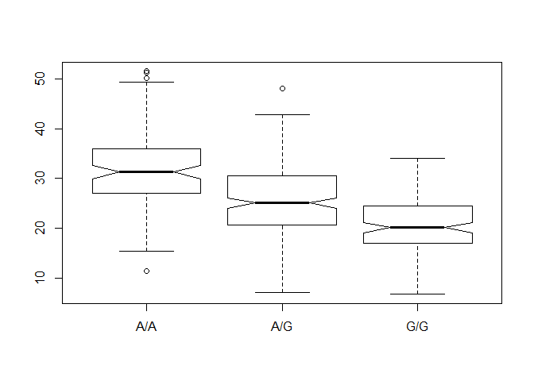

cLASS 13: Genome Informatics (Pt. 1)
================

## Ensemble 1000 Genome data

What proportion of the Mexican Ancestry in Los Angeles sample population
(MXL) are homozygous for the asthma associated SNP
(G|G)?

``` r
SNP <- read.csv("373531-SampleGenotypes-Homo_sapiens_Variation_Sample_rs8067378.csv", header = TRUE)
table(SNP$Genotype..forward.strand.)
```

    ## 
    ## A|A A|G G|A G|G 
    ##  22  21  12   9

``` r
#proportion
table(SNP$Genotype..forward.strand.)/nrow(SNP)
```

    ## 
    ##      A|A      A|G      G|A      G|G 
    ## 0.343750 0.328125 0.187500 0.140625

## Quality scores in FASTQ filses

``` r
library(seqinr)
library(gtools)
phred <- asc( s2c("DDDDCDEDCDDDDBBDDDCC@") ) - 33
phred
```

    ##  D  D  D  D  C  D  E  D  C  D  D  D  D  B  B  D  D  D  C  C  @ 
    ## 35 35 35 35 34 35 36 35 34 35 35 35 35 33 33 35 35 35 34 34 31

## Population Scale Analysis

Read this file into R and determine the sample size for each genotype
and their corresponding median expression levels for each of these
genotypes.

``` r
snp_data <- read.table("rs8067378_ENSG00000172057.6.txt")
summary(snp_data)
```

    ##      sample     geno          exp        
    ##  HG00096:  1   A/A:108   Min.   : 6.675  
    ##  HG00097:  1   A/G:233   1st Qu.:20.004  
    ##  HG00099:  1   G/G:121   Median :25.116  
    ##  HG00100:  1             Mean   :25.640  
    ##  HG00101:  1             3rd Qu.:30.779  
    ##  HG00102:  1             Max.   :51.518  
    ##  (Other):456

``` r
inds <- (snp_data$geno == "G/G")
snp_gg <- snp_data[inds,]
summary(snp_gg$exp)
```

    ##    Min. 1st Qu.  Median    Mean 3rd Qu.    Max. 
    ##   6.675  16.903  20.074  20.594  24.457  33.956

``` r
snp_ag <- snp_data[(snp_data$geno == "A/G"),]
summary(snp_ag$exp)
```

    ##    Min. 1st Qu.  Median    Mean 3rd Qu.    Max. 
    ##   7.075  20.626  25.065  25.397  30.552  48.034

``` r
snp_aa <- snp_data[(snp_data$geno == "A/A"),]
summary(snp_aa$exp)
```

    ##    Min. 1st Qu.  Median    Mean 3rd Qu.    Max. 
    ##   11.40   27.02   31.25   31.82   35.92   51.52

First try at a boxplot to show this data

``` r
boxplot(formula = snp_data$exp ~ snp_data$geno, notch = TRUE)
```

<!-- -->
