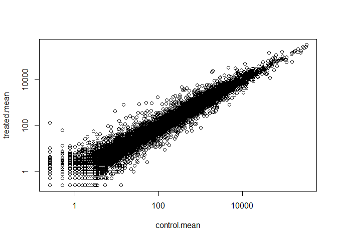
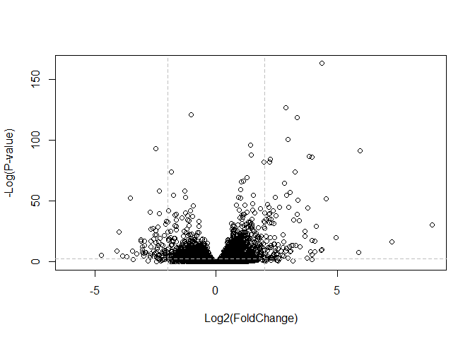
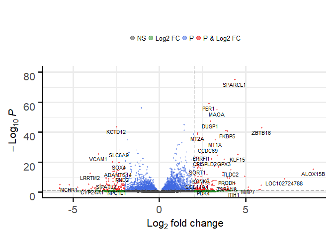

Class 14: Transcriptomics and the analysis of RNA-Seq data
================

## 2\. Import our countData and colData into R

``` r
counts <- read.csv("data/airway_scaledcounts.csv", stringsAsFactors = FALSE)
metadata <- read.csv("data/airway_metadata.csv", stringsAsFactors = FALSE)
head(counts)
```

    ##           ensgene SRR1039508 SRR1039509 SRR1039512 SRR1039513 SRR1039516
    ## 1 ENSG00000000003        723        486        904        445       1170
    ## 2 ENSG00000000005          0          0          0          0          0
    ## 3 ENSG00000000419        467        523        616        371        582
    ## 4 ENSG00000000457        347        258        364        237        318
    ## 5 ENSG00000000460         96         81         73         66        118
    ## 6 ENSG00000000938          0          0          1          0          2
    ##   SRR1039517 SRR1039520 SRR1039521
    ## 1       1097        806        604
    ## 2          0          0          0
    ## 3        781        417        509
    ## 4        447        330        324
    ## 5         94        102         74
    ## 6          0          0          0

``` r
head(metadata)
```

    ##           id     dex celltype     geo_id
    ## 1 SRR1039508 control   N61311 GSM1275862
    ## 2 SRR1039509 treated   N61311 GSM1275863
    ## 3 SRR1039512 control  N052611 GSM1275866
    ## 4 SRR1039513 treated  N052611 GSM1275867
    ## 5 SRR1039516 control  N080611 GSM1275870
    ## 6 SRR1039517 treated  N080611 GSM1275871

> Q1. How many genes are in this dataset?

``` r
nrow(counts)
```

    ## [1] 38694

> Q2. How many ‘control’ cell lines do we have?

``` r
table(metadata$dex)
```

    ## 
    ## control treated 
    ##       4       4

Let’s check if the cols of `counts` is the same as the id column in
`metadata`

``` r
all (colnames(counts)[-1] == metadata$id)
```

    ## [1] TRUE

## 3\. Try differential gene expression

Let’s access just their control counts data so we can calculate an
average counts value for each gene in these control samples

``` r
control <- metadata[metadata$dex == "control",]
```

Now we want to get the cols in counts with these `control$id` colnames

``` r
control.mean <- rowSums( counts[ ,control$id] )/ nrow(control)
names(control.mean) <- counts$ensgene
```

Now do the same for the `treated` samples.

``` r
treated <- metadata[metadata$dex == "treated",]
treated.mean <- rowSums(counts[,treated$id])/ nrow(treated)
names(treated.mean) <- counts$ensgene
head(treated.mean)
```

    ## ENSG00000000003 ENSG00000000005 ENSG00000000419 ENSG00000000457 
    ##          658.00            0.00          546.00          316.50 
    ## ENSG00000000460 ENSG00000000938 
    ##           78.75            0.00

Let’s put these together into a new data.frame called `meancounts`

``` r
meancounts <- data.frame(control.mean, treated.mean)
colSums(meancounts)
```

    ## control.mean treated.mean 
    ##     23005324     22196524

``` r
plot(control.mean, treated.mean)
```

<!-- -->

Plot on log scale for both
    axis

``` r
plot(control.mean, treated.mean, log="xy")
```

    ## Warning in xy.coords(x, y, xlabel, ylabel, log): 15032 x values <= 0
    ## omitted from logarithmic plot

    ## Warning in xy.coords(x, y, xlabel, ylabel, log): 15281 y values <= 0
    ## omitted from logarithmic plot

<!-- -->

``` r
meancounts$log2fc <- log2(meancounts$treated.mean/meancounts$control.mean)
View(meancounts)
```

``` r
# Identify the row that contains zero
zero.vals <- which(meancounts[,1:2]==0, arr.ind = TRUE)
#Remove these rows as we can't really say much about them
to.rm <- unique(zero.vals[,1])
mycounts <- meancounts[-to.rm,]
```

A common threshold used for calling something differentially expressed
is a log2(FoldChange) of greater than 2 or less than -2. Let’s filter
the dataset both ways to see how many genes are up or down-regulated.

> Q8. Using the up.ind vector above can you determine how many up
> regulated genes we have at the greater than 2fc level?

``` r
up.ind <- mycounts$log2fc>2
down.ind <- mycounts$log2fc<(-2)
sum(up.ind)
```

    ## [1] 250

``` r
sum(down.ind)
```

    ## [1] 367

## 4\. Adding annotation data

``` r
anno <- read.csv("data/annotables_grch38.csv")
head(anno)
```

    ##           ensgene entrez   symbol chr     start       end strand
    ## 1 ENSG00000000003   7105   TSPAN6   X 100627109 100639991     -1
    ## 2 ENSG00000000005  64102     TNMD   X 100584802 100599885      1
    ## 3 ENSG00000000419   8813     DPM1  20  50934867  50958555     -1
    ## 4 ENSG00000000457  57147    SCYL3   1 169849631 169894267     -1
    ## 5 ENSG00000000460  55732 C1orf112   1 169662007 169854080      1
    ## 6 ENSG00000000938   2268      FGR   1  27612064  27635277     -1
    ##          biotype
    ## 1 protein_coding
    ## 2 protein_coding
    ## 3 protein_coding
    ## 4 protein_coding
    ## 5 protein_coding
    ## 6 protein_coding
    ##                                                                                                  description
    ## 1                                                          tetraspanin 6 [Source:HGNC Symbol;Acc:HGNC:11858]
    ## 2                                                            tenomodulin [Source:HGNC Symbol;Acc:HGNC:17757]
    ## 3 dolichyl-phosphate mannosyltransferase polypeptide 1, catalytic subunit [Source:HGNC Symbol;Acc:HGNC:3005]
    ## 4                                               SCY1-like, kinase-like 3 [Source:HGNC Symbol;Acc:HGNC:19285]
    ## 5                                    chromosome 1 open reading frame 112 [Source:HGNC Symbol;Acc:HGNC:25565]
    ## 6                          FGR proto-oncogene, Src family tyrosine kinase [Source:HGNC Symbol;Acc:HGNC:3697]

``` r
mycounts.anno <- merge(mycounts, anno, by.x= 0, by.y= "ensgene")
```

## We can use bioconductor to do this too.

``` r
library("AnnotationDbi")
```

    ## Loading required package: stats4

    ## Loading required package: BiocGenerics

    ## Loading required package: parallel

    ## 
    ## Attaching package: 'BiocGenerics'

    ## The following objects are masked from 'package:parallel':
    ## 
    ##     clusterApply, clusterApplyLB, clusterCall, clusterEvalQ,
    ##     clusterExport, clusterMap, parApply, parCapply, parLapply,
    ##     parLapplyLB, parRapply, parSapply, parSapplyLB

    ## The following objects are masked from 'package:stats':
    ## 
    ##     IQR, mad, sd, var, xtabs

    ## The following objects are masked from 'package:base':
    ## 
    ##     anyDuplicated, append, as.data.frame, basename, cbind,
    ##     colMeans, colnames, colSums, dirname, do.call, duplicated,
    ##     eval, evalq, Filter, Find, get, grep, grepl, intersect,
    ##     is.unsorted, lapply, lengths, Map, mapply, match, mget, order,
    ##     paste, pmax, pmax.int, pmin, pmin.int, Position, rank, rbind,
    ##     Reduce, rowMeans, rownames, rowSums, sapply, setdiff, sort,
    ##     table, tapply, union, unique, unsplit, which, which.max,
    ##     which.min

    ## Loading required package: Biobase

    ## Welcome to Bioconductor
    ## 
    ##     Vignettes contain introductory material; view with
    ##     'browseVignettes()'. To cite Bioconductor, see
    ##     'citation("Biobase")', and for packages 'citation("pkgname")'.

    ## Loading required package: IRanges

    ## Loading required package: S4Vectors

    ## 
    ## Attaching package: 'S4Vectors'

    ## The following object is masked from 'package:base':
    ## 
    ##     expand.grid

    ## 
    ## Attaching package: 'IRanges'

    ## The following object is masked from 'package:grDevices':
    ## 
    ##     windows

``` r
library("org.Hs.eg.db")
```

    ## 

``` r
columns(org.Hs.eg.db)
```

    ##  [1] "ACCNUM"       "ALIAS"        "ENSEMBL"      "ENSEMBLPROT" 
    ##  [5] "ENSEMBLTRANS" "ENTREZID"     "ENZYME"       "EVIDENCE"    
    ##  [9] "EVIDENCEALL"  "GENENAME"     "GO"           "GOALL"       
    ## [13] "IPI"          "MAP"          "OMIM"         "ONTOLOGY"    
    ## [17] "ONTOLOGYALL"  "PATH"         "PFAM"         "PMID"        
    ## [21] "PROSITE"      "REFSEQ"       "SYMBOL"       "UCSCKG"      
    ## [25] "UNIGENE"      "UNIPROT"

``` r
mycounts$symbol <- mapIds(org.Hs.eg.db,
                     keys=row.names(mycounts), # Our genenames
                     keytype="ENSEMBL",        # The format of our genenames
                     column="SYMBOL",          # The new format we want to add
                     multiVals="first")
```

    ## 'select()' returned 1:many mapping between keys and columns

``` r
mycounts$entrez <- mapIds(org.Hs.eg.db,
                     keys=row.names(mycounts), # Our genenames
                     keytype="ENSEMBL",        # The format of our genenames
                     column="ENTREZID",          # The new format we want to add
                     multiVals="first")
```

    ## 'select()' returned 1:many mapping between keys and columns

``` r
mycounts$uniprot <- mapIds(org.Hs.eg.db,
                     keys=row.names(mycounts),
                     column="UNIPROT",
                     keytype="ENSEMBL",
                     multiVals="first")
```

    ## 'select()' returned 1:many mapping between keys and columns

``` r
View( mycounts[up.ind,] )
```

## 5\. DESeq2 analysis

``` r
library("DESeq2")
```

    ## Loading required package: GenomicRanges

    ## Loading required package: GenomeInfoDb

    ## Loading required package: SummarizedExperiment

    ## Loading required package: DelayedArray

    ## Loading required package: matrixStats

    ## 
    ## Attaching package: 'matrixStats'

    ## The following objects are masked from 'package:Biobase':
    ## 
    ##     anyMissing, rowMedians

    ## Loading required package: BiocParallel

    ## 
    ## Attaching package: 'DelayedArray'

    ## The following objects are masked from 'package:matrixStats':
    ## 
    ##     colMaxs, colMins, colRanges, rowMaxs, rowMins, rowRanges

    ## The following objects are masked from 'package:base':
    ## 
    ##     aperm, apply

``` r
citation("DESeq2")
```

    ## 
    ##   Love, M.I., Huber, W., Anders, S. Moderated estimation of fold
    ##   change and dispersion for RNA-seq data with DESeq2 Genome
    ##   Biology 15(12):550 (2014)
    ## 
    ## A BibTeX entry for LaTeX users is
    ## 
    ##   @Article{,
    ##     title = {Moderated estimation of fold change and dispersion for RNA-seq data with DESeq2},
    ##     author = {Michael I. Love and Wolfgang Huber and Simon Anders},
    ##     year = {2014},
    ##     journal = {Genome Biology},
    ##     doi = {10.1186/s13059-014-0550-8},
    ##     volume = {15},
    ##     issue = {12},
    ##     pages = {550},
    ##   }

Build our deseq dataset object need for running deseq analysis

``` r
dds <- DESeqDataSetFromMatrix(countData=counts, 
                              colData=metadata, 
                              design=~dex, 
                              tidy=TRUE)
```

    ## converting counts to integer mode

    ## Warning in DESeqDataSet(se, design = design, ignoreRank): some variables in
    ## design formula are characters, converting to factors

``` r
dds
```

    ## class: DESeqDataSet 
    ## dim: 38694 8 
    ## metadata(1): version
    ## assays(1): counts
    ## rownames(38694): ENSG00000000003 ENSG00000000005 ...
    ##   ENSG00000283120 ENSG00000283123
    ## rowData names(0):
    ## colnames(8): SRR1039508 SRR1039509 ... SRR1039520 SRR1039521
    ## colData names(4): id dex celltype geo_id

``` r
dds <- DESeq(dds)
```

    ## estimating size factors

    ## estimating dispersions

    ## gene-wise dispersion estimates

    ## mean-dispersion relationship

    ## final dispersion estimates

    ## fitting model and testing

Get our resluts

``` r
res <- results(dds)
```

``` r
summary(res)
```

    ## 
    ## out of 25258 with nonzero total read count
    ## adjusted p-value < 0.1
    ## LFC > 0 (up)       : 1564, 6.2%
    ## LFC < 0 (down)     : 1188, 4.7%
    ## outliers [1]       : 142, 0.56%
    ## low counts [2]     : 9971, 39%
    ## (mean count < 10)
    ## [1] see 'cooksCutoff' argument of ?results
    ## [2] see 'independentFiltering' argument of ?results

``` r
res05 <- results(dds,alpha = 0.05)
summary(res05)
```

    ## 
    ## out of 25258 with nonzero total read count
    ## adjusted p-value < 0.05
    ## LFC > 0 (up)       : 1237, 4.9%
    ## LFC < 0 (down)     : 933, 3.7%
    ## outliers [1]       : 142, 0.56%
    ## low counts [2]     : 9033, 36%
    ## (mean count < 6)
    ## [1] see 'cooksCutoff' argument of ?results
    ## [2] see 'independentFiltering' argument of ?results

``` r
plot(res$log2FoldChange,-log(res$padj),
     xlab="Log2(FoldChange)",
     ylab="-Log(P-value)")
abline(v=c(-2,2), col="gray", lty=2)
abline(h=-log(0.1), col="gray", lty=2)
```

<!-- -->

``` r
mycols <- rep("gray", nrow(res))
mycols[abs(res$log2FoldChange) > 2] <- "red"
mycols[(abs(res$log2FoldChange) > 2) & ((res$padj)< 0.01)] <- "blue"
plot(res$log2FoldChange,-log(res$padj),
     xlab="Log2(FoldChange)",
     ylab="-Log(P-value)",
     col=mycols)
abline(v=c(-2,2), col="gray", lty=2)
abline(h=-log(0.1), col="gray", lty=2)
```

<!-- -->

Another way to plot this is with the Enhanced

But first let’s put proper genenames on our results (i.e. gene
‘symbols’)

``` r
x <- as.data.frame(res)
x$symbol <- mapIds(org.Hs.eg.db, 
                   keys=row.names(x),
                   keytype="ENSEMBL",
                   column="SYMBOL",
                   multiVals="first")
```

    ## 'select()' returned 1:many mapping between keys and columns

``` r
library(EnhancedVolcano)
```

    ## Loading required package: ggplot2

    ## Loading required package: ggrepel

``` r
EnhancedVolcano(x,
    lab = x$symbol,
    x = 'log2FoldChange',
    y = 'pvalue')
```

    ## Warning: Removed 13578 rows containing missing values (geom_point).

    ## Warning: Removed 24 rows containing missing values (geom_text).

<!-- -->
