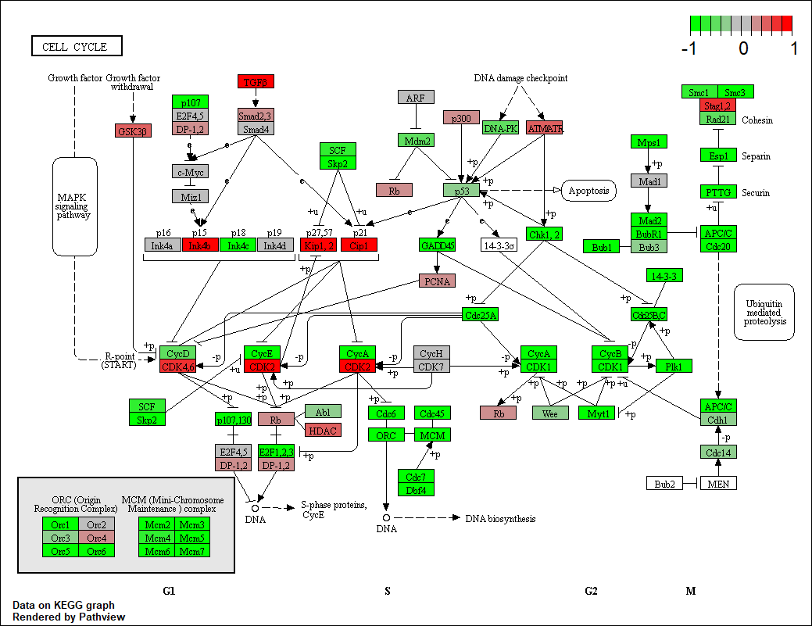
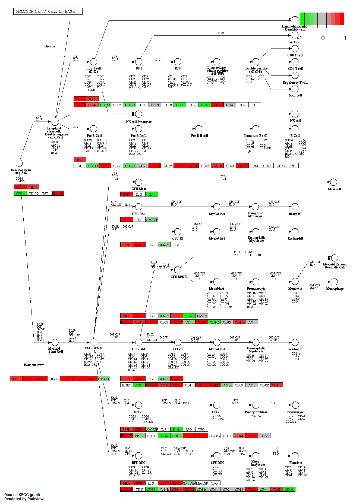
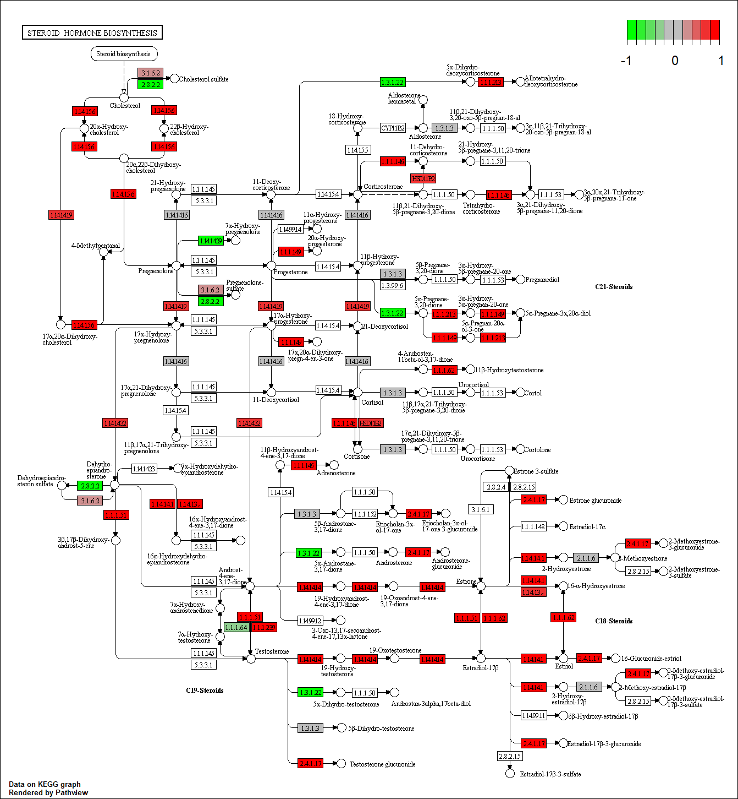
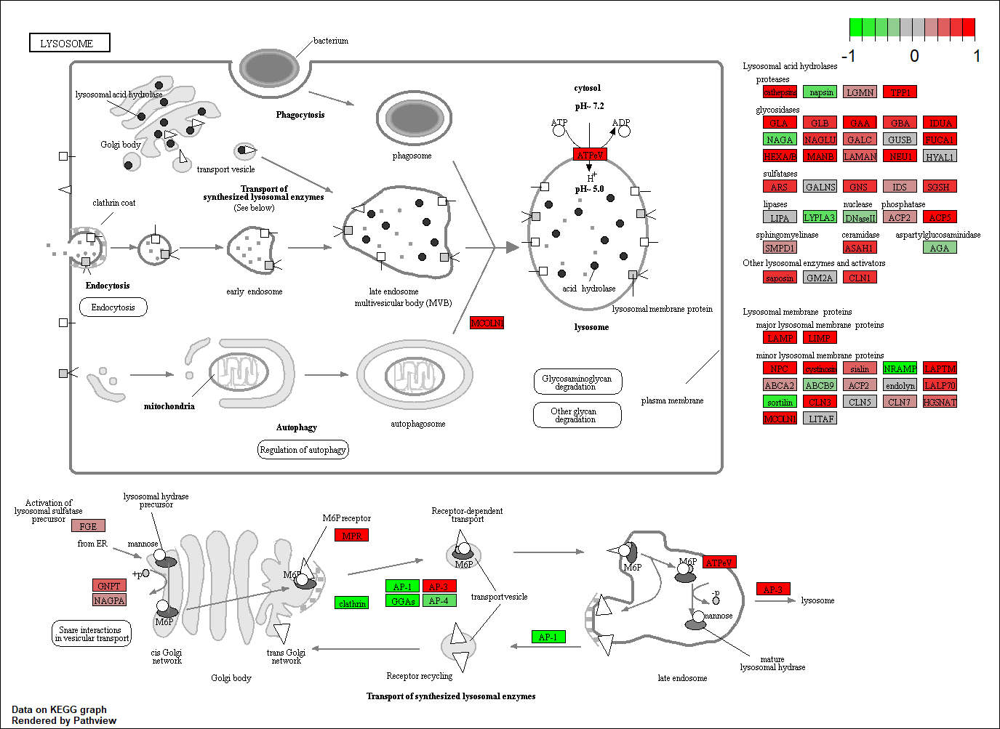
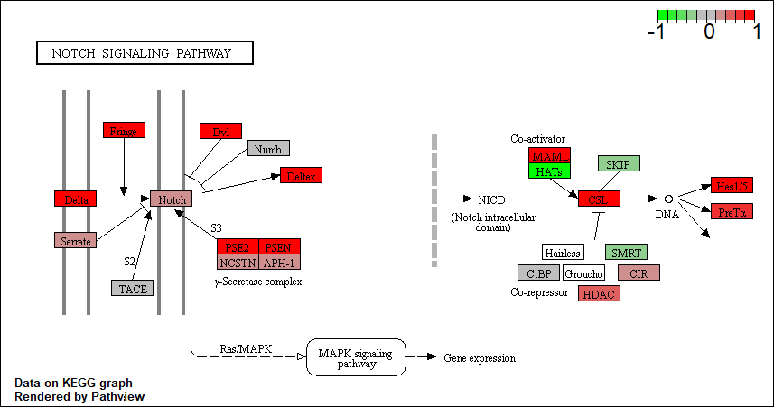

```{r setup, include=FALSE}
knitr::opts_chunk$set(echo = TRUE)
```

## Section 1. Differential Expression Analysis

```{r}
library(DESeq2)
```

Load our data files

```{r}
counts <- read.csv("GSE37704_featurecounts.csv", row.names = 1)
metadata <- read.csv("GSE37704_metadata.csv", row.names = 1)
```

> Q. Complete the code below to remove the troublesome first column from countData

```{r}
#Note we need to remove the odd first $length col
counts <- as.matrix(counts[,-1])
```

This looks better but there are lots of zero entries in there so let's get rid of them as we have no data for these.

> Q. Complete the code below to filter countData to exclude genes (i.e. rows) where we have 0 read count across all samples (i.e. columns).

```{r}
counts <- counts[rowSums(counts) != 0 ,]
head(counts)
nrow(counts)
```

### Running DESeq2

```{r}
dds = DESeqDataSetFromMatrix(countData=counts,
                             colData=metadata,
                             design=~condition)
dds = DESeq(dds)
```

```{r}
dds
```

Get our results

```{r}
res <- results(dds)
head(res)
```

> Q. Call the summary() function on your results to get a sense of how many genes are up or down-regulated at the default 0.1 p-value cutoff.

```{r}
summary(res)
```

### Volcano plot

Now we will make a volcano plot, a commonly produced visualization from this type of data that we introduced last day. Basically it's a plot of log2 fold change vs -log adjusted p-value.

```{r}
plot( res$log2FoldChange, -log(res$padj) )
```

> Q. Improve this plot by completing the below code, which adds color and axis labels

```{r}
# Make a color vector for all genes
mycols <- rep("gray", nrow(res) )

# Color red the genes with absolute fold change above 2
mycols[ abs(res$log2FoldChange) > 2 ] <- "red"

# Color blue those with adjusted p-value less than 0.01
#  and absolute fold change more than 2
inds <- ((res$padj)<0.01 & (abs(res$log2FoldChange) > 2 ))
mycols[ inds ] <- "blue"

plot( res$log2FoldChange, -log(res$padj), col=mycols, xlab="Log2(FoldChange)", ylab="-Log(P-value)" )
abline(v=c(-2,2), col="black", lty=2)
abline(h=-log(0.1), col="black", lty=2)
```

### Adding gene annotation

Since we mapped and counted against the Ensembl annotation, our results only have information about Ensembl gene IDs. However, our pathway analysis downstream will use KEGG pathways, and genes in KEGG pathways are annotated with Entrez gene IDs. So lets add them as we did the last day.

> Q. Use the mapIDs() function multiple times to add SYMBOL, ENTREZID and GENENAME annotation to our results by completing the code below.

```{r}
library("AnnotationDbi")
library("org.Hs.eg.db")

columns(org.Hs.eg.db)

res$symbol = mapIds(org.Hs.eg.db,
                    keys=row.names(res), 
                    keytype="ENSEMBL",
                    column="SYMBOL",
                    multiVals="first")

res$entrez = mapIds(org.Hs.eg.db,
                    keys=row.names(res),
                    keytype="ENSEMBL",
                    column="ENTREZID",
                    multiVals="first")

res$name =   mapIds(org.Hs.eg.db,
                    keys=row.names(res),
                    keytype="ENSEMBL",
                    column="GENENAME",
                    multiVals="first")

head(res, 10)

```

## Section 2. Pathway Analysis

```{r}
library(pathview)
library(gage)
library(gageData)
```

```{r}
data(kegg.sets.hs)
data(sigmet.idx.hs)

# Focus on signaling and metabolic pathways only
kegg.sets.hs = kegg.sets.hs[sigmet.idx.hs]

# Examine the first 3 pathways
head(kegg.sets.hs, 3)
```

The main gage() function requires a named vector of fold changes, where the names of the values are the Entrez gene IDs.

```{r}
foldchanges  <-  res$log2FoldChange
names(foldchanges) = res$entrez
head(foldchanges)
```

```{r}
# Get the results
keggres = gage(foldchanges, gsets=kegg.sets.hs)
attributes(keggres)
```

```{r}
pathview(gene.data=foldchanges, pathway.id="hsa04110")
```



Now, let's process our results a bit more to automagicaly pull out the top 5 upregulated pathways, then further process that just to get the pathway IDs needed by the `pathview()` function. We'll use these KEGG pathway IDs for pathview plotting below.

```{r}
## Focus on top 5 upregulated pathways here for demo purposes only
keggrespathways <- rownames(keggres$greater)[1:5]

# Extract the 8 character long IDs part of each string
keggresids = substr(keggrespathways, start=1, stop=8)
keggresids
pathview(gene.data=foldchanges, pathway.id=keggresids, species="hsa")
```










## Section 3. Gene Ontology (GO)

Again we will use **gage()** but this time with GO genesets rather than KEGG

```{r}
data(go.sets.hs)
data(go.subs.hs)

# Focus on Biological Process subset of GO
gobpsets = go.sets.hs[go.subs.hs$BP]

gobpres = gage(foldchanges, gsets=gobpsets, same.dir=TRUE)

lapply(gobpres, head)
```