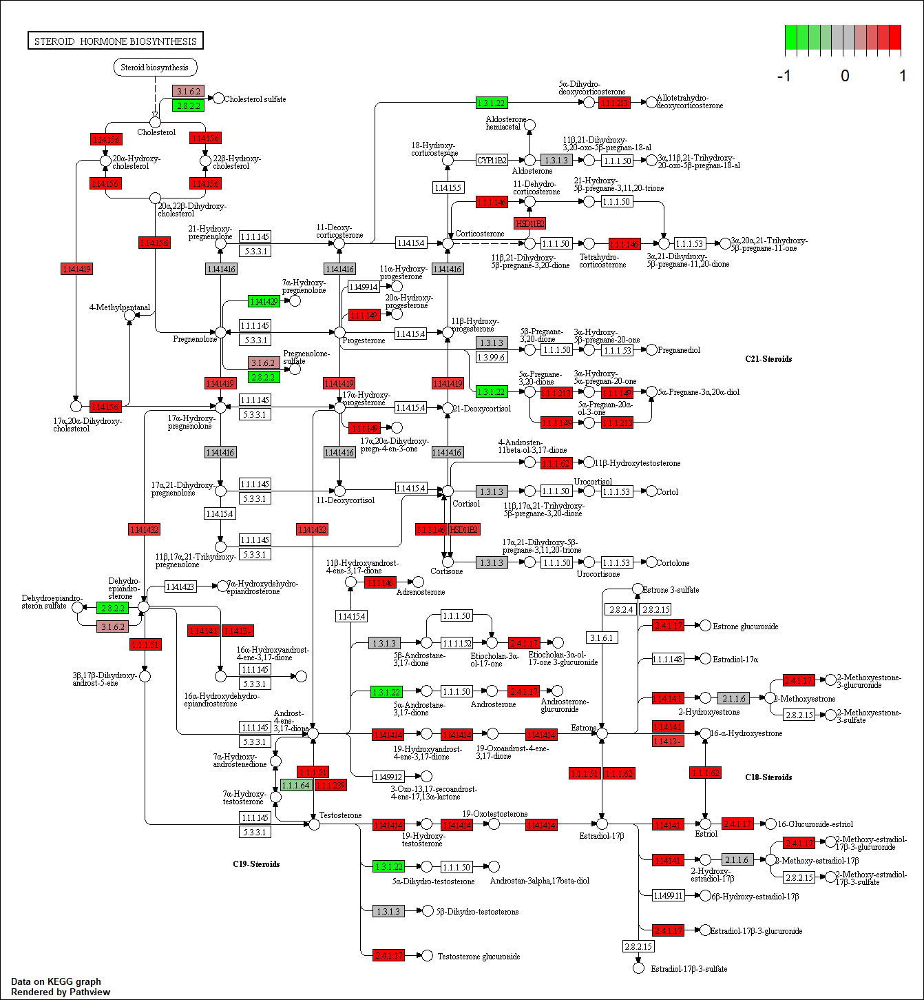
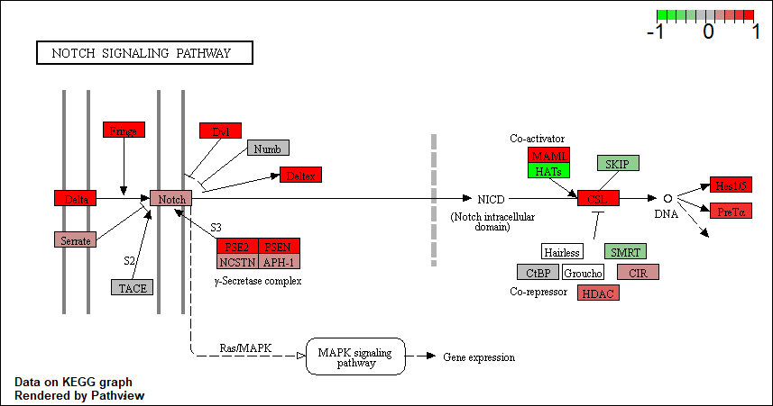

Class 15: Pathway Analysis from RNA-Seq Results
================

## Section 1. Differential Expression Analysis

``` r
library(DESeq2)
```

    ## Loading required package: S4Vectors

    ## Loading required package: stats4

    ## Loading required package: BiocGenerics

    ## Loading required package: parallel

    ## 
    ## Attaching package: 'BiocGenerics'

    ## The following objects are masked from 'package:parallel':
    ## 
    ##     clusterApply, clusterApplyLB, clusterCall, clusterEvalQ,
    ##     clusterExport, clusterMap, parApply, parCapply, parLapply,
    ##     parLapplyLB, parRapply, parSapply, parSapplyLB

    ## The following objects are masked from 'package:stats':
    ## 
    ##     IQR, mad, sd, var, xtabs

    ## The following objects are masked from 'package:base':
    ## 
    ##     anyDuplicated, append, as.data.frame, basename, cbind,
    ##     colMeans, colnames, colSums, dirname, do.call, duplicated,
    ##     eval, evalq, Filter, Find, get, grep, grepl, intersect,
    ##     is.unsorted, lapply, lengths, Map, mapply, match, mget, order,
    ##     paste, pmax, pmax.int, pmin, pmin.int, Position, rank, rbind,
    ##     Reduce, rowMeans, rownames, rowSums, sapply, setdiff, sort,
    ##     table, tapply, union, unique, unsplit, which, which.max,
    ##     which.min

    ## 
    ## Attaching package: 'S4Vectors'

    ## The following object is masked from 'package:base':
    ## 
    ##     expand.grid

    ## Loading required package: IRanges

    ## 
    ## Attaching package: 'IRanges'

    ## The following object is masked from 'package:grDevices':
    ## 
    ##     windows

    ## Loading required package: GenomicRanges

    ## Loading required package: GenomeInfoDb

    ## Loading required package: SummarizedExperiment

    ## Loading required package: Biobase

    ## Welcome to Bioconductor
    ## 
    ##     Vignettes contain introductory material; view with
    ##     'browseVignettes()'. To cite Bioconductor, see
    ##     'citation("Biobase")', and for packages 'citation("pkgname")'.

    ## Loading required package: DelayedArray

    ## Loading required package: matrixStats

    ## 
    ## Attaching package: 'matrixStats'

    ## The following objects are masked from 'package:Biobase':
    ## 
    ##     anyMissing, rowMedians

    ## Loading required package: BiocParallel

    ## 
    ## Attaching package: 'DelayedArray'

    ## The following objects are masked from 'package:matrixStats':
    ## 
    ##     colMaxs, colMins, colRanges, rowMaxs, rowMins, rowRanges

    ## The following objects are masked from 'package:base':
    ## 
    ##     aperm, apply

Load our data files

``` r
counts <- read.csv("GSE37704_featurecounts.csv", row.names = 1)
metadata <- read.csv("GSE37704_metadata.csv", row.names = 1)
```

> Q. Complete the code below to remove the troublesome first column from
> countData

``` r
#Note we need to remove the odd first $length col
counts <- as.matrix(counts[,-1])
```

This looks better but there are lots of zero entries in there so let’s
get rid of them as we have no data for these.

> Q. Complete the code below to filter countData to exclude genes
> (i.e. rows) where we have 0 read count across all samples
> (i.e. columns).

``` r
counts <- counts[rowSums(counts) != 0 ,]
head(counts)
```

    ##                 SRR493366 SRR493367 SRR493368 SRR493369 SRR493370
    ## ENSG00000279457        23        28        29        29        28
    ## ENSG00000187634       124       123       205       207       212
    ## ENSG00000188976      1637      1831      2383      1226      1326
    ## ENSG00000187961       120       153       180       236       255
    ## ENSG00000187583        24        48        65        44        48
    ## ENSG00000187642         4         9        16        14        16
    ##                 SRR493371
    ## ENSG00000279457        46
    ## ENSG00000187634       258
    ## ENSG00000188976      1504
    ## ENSG00000187961       357
    ## ENSG00000187583        64
    ## ENSG00000187642        16

``` r
nrow(counts)
```

    ## [1] 15975

### Running DESeq2

``` r
dds = DESeqDataSetFromMatrix(countData=counts,
                             colData=metadata,
                             design=~condition)
dds = DESeq(dds)
```

    ## estimating size factors

    ## estimating dispersions

    ## gene-wise dispersion estimates

    ## mean-dispersion relationship

    ## final dispersion estimates

    ## fitting model and testing

``` r
dds
```

    ## class: DESeqDataSet 
    ## dim: 15975 6 
    ## metadata(1): version
    ## assays(4): counts mu H cooks
    ## rownames(15975): ENSG00000279457 ENSG00000187634 ...
    ##   ENSG00000276345 ENSG00000271254
    ## rowData names(22): baseMean baseVar ... deviance maxCooks
    ## colnames(6): SRR493366 SRR493367 ... SRR493370 SRR493371
    ## colData names(2): condition sizeFactor

Get our results

``` r
res <- results(dds)
head(res)
```

    ## log2 fold change (MLE): condition hoxa1 kd vs control sirna 
    ## Wald test p-value: condition hoxa1 kd vs control sirna 
    ## DataFrame with 6 rows and 6 columns
    ##                         baseMean     log2FoldChange              lfcSE
    ##                        <numeric>          <numeric>          <numeric>
    ## ENSG00000279457 29.9135794276176  0.179257083543324  0.324821566918811
    ## ENSG00000187634 183.229649921658  0.426457118513849  0.140265821358809
    ## ENSG00000188976 1651.18807619944 -0.692720464791275 0.0548465424860911
    ## ENSG00000187961 209.637938486147  0.729755610542653  0.131859900882201
    ## ENSG00000187583 47.2551232589398 0.0405765280481789  0.271892810160349
    ## ENSG00000187642 11.9797501642461  0.542810491962931  0.521559852177308
    ##                              stat               pvalue
    ##                         <numeric>            <numeric>
    ## ENSG00000279457 0.551863243699359     0.58104205296243
    ## ENSG00000187634  3.04034949057864  0.00236303765813393
    ## ENSG00000188976 -12.6301574063114 1.43989919007885e-36
    ## ENSG00000187961  5.53432548985905 3.12428316941044e-08
    ## ENSG00000187583  0.14923722339053    0.881366448843415
    ## ENSG00000187642  1.04074439337482    0.297994193826297
    ##                                 padj
    ##                            <numeric>
    ## ENSG00000279457    0.686554780450596
    ## ENSG00000187634  0.00515718184593185
    ## ENSG00000188976 1.76549369911665e-35
    ## ENSG00000187961 1.13413018105347e-07
    ## ENSG00000187583    0.919030615753096
    ## ENSG00000187642     0.40337931514274

> Q. Call the summary() function on your results to get a sense of how
> many genes are up or down-regulated at the default 0.1 p-value cutoff.

``` r
summary(res)
```

    ## 
    ## out of 15975 with nonzero total read count
    ## adjusted p-value < 0.1
    ## LFC > 0 (up)       : 4349, 27%
    ## LFC < 0 (down)     : 4396, 28%
    ## outliers [1]       : 0, 0%
    ## low counts [2]     : 1237, 7.7%
    ## (mean count < 0)
    ## [1] see 'cooksCutoff' argument of ?results
    ## [2] see 'independentFiltering' argument of ?results

### Volcano plot

Now we will make a volcano plot, a commonly produced visualization from
this type of data that we introduced last day. Basically it’s a plot of
log2 fold change vs -log adjusted p-value.

``` r
plot( res$log2FoldChange, -log(res$padj) )
```

<!-- -->

> Q. Improve this plot by completing the below code, which adds color
> and axis labels

``` r
# Make a color vector for all genes
mycols <- rep("gray", nrow(res) )

# Color red the genes with absolute fold change above 2
mycols[ abs(res$log2FoldChange) > 2 ] <- "red"

# Color blue those with adjusted p-value less than 0.01
#  and absolute fold change more than 2
inds <- ((res$padj)<0.01 & (abs(res$log2FoldChange) > 2 ))
mycols[ inds ] <- "blue"

plot( res$log2FoldChange, -log(res$padj), col=mycols, xlab="Log2(FoldChange)", ylab="-Log(P-value)" )
abline(v=c(-2,2), col="black", lty=2)
abline(h=-log(0.1), col="black", lty=2)
```

<!-- -->

### Adding gene annotation

Since we mapped and counted against the Ensembl annotation, our results
only have information about Ensembl gene IDs. However, our pathway
analysis downstream will use KEGG pathways, and genes in KEGG pathways
are annotated with Entrez gene IDs. So lets add them as we did the last
day.

> Q. Use the mapIDs() function multiple times to add SYMBOL, ENTREZID
> and GENENAME annotation to our results by completing the code below.

``` r
library("AnnotationDbi")
library("org.Hs.eg.db")
```

    ## 

``` r
columns(org.Hs.eg.db)
```

    ##  [1] "ACCNUM"       "ALIAS"        "ENSEMBL"      "ENSEMBLPROT" 
    ##  [5] "ENSEMBLTRANS" "ENTREZID"     "ENZYME"       "EVIDENCE"    
    ##  [9] "EVIDENCEALL"  "GENENAME"     "GO"           "GOALL"       
    ## [13] "IPI"          "MAP"          "OMIM"         "ONTOLOGY"    
    ## [17] "ONTOLOGYALL"  "PATH"         "PFAM"         "PMID"        
    ## [21] "PROSITE"      "REFSEQ"       "SYMBOL"       "UCSCKG"      
    ## [25] "UNIGENE"      "UNIPROT"

``` r
res$symbol = mapIds(org.Hs.eg.db,
                    keys=row.names(res), 
                    keytype="ENSEMBL",
                    column="SYMBOL",
                    multiVals="first")
```

    ## 'select()' returned 1:many mapping between keys and columns

``` r
res$entrez = mapIds(org.Hs.eg.db,
                    keys=row.names(res),
                    keytype="ENSEMBL",
                    column="ENTREZID",
                    multiVals="first")
```

    ## 'select()' returned 1:many mapping between keys and columns

``` r
res$name =   mapIds(org.Hs.eg.db,
                    keys=row.names(res),
                    keytype="ENSEMBL",
                    column="GENENAME",
                    multiVals="first")
```

    ## 'select()' returned 1:many mapping between keys and columns

``` r
head(res, 10)
```

    ## log2 fold change (MLE): condition hoxa1 kd vs control sirna 
    ## Wald test p-value: condition hoxa1 kd vs control sirna 
    ## DataFrame with 10 rows and 9 columns
    ##                          baseMean     log2FoldChange              lfcSE
    ##                         <numeric>          <numeric>          <numeric>
    ## ENSG00000279457  29.9135794276176  0.179257083543324  0.324821566918811
    ## ENSG00000187634  183.229649921658  0.426457118513849  0.140265821358809
    ## ENSG00000188976  1651.18807619944 -0.692720464791275 0.0548465424860911
    ## ENSG00000187961  209.637938486147  0.729755610542653  0.131859900882201
    ## ENSG00000187583  47.2551232589398 0.0405765280481789  0.271892810160349
    ## ENSG00000187642  11.9797501642461  0.542810491962931  0.521559852177308
    ## ENSG00000188290  108.922127976716   2.05706383469129  0.196905313983705
    ## ENSG00000187608   350.71686801731  0.257383686590174  0.102726560900025
    ## ENSG00000188157    9128.439421961  0.389908792023376 0.0467163405556556
    ## ENSG00000237330 0.158192358990472  0.785955208142751    4.0804728567969
    ##                              stat               pvalue
    ##                         <numeric>            <numeric>
    ## ENSG00000279457 0.551863243699359     0.58104205296243
    ## ENSG00000187634  3.04034949057864  0.00236303765813393
    ## ENSG00000188976 -12.6301574063114 1.43989919007885e-36
    ## ENSG00000187961  5.53432548985905 3.12428316941044e-08
    ## ENSG00000187583  0.14923722339053    0.881366448843415
    ## ENSG00000187642  1.04074439337482    0.297994193826297
    ## ENSG00000188290  10.4469696275516  1.5128195811837e-25
    ## ENSG00000187608   2.5055222752046   0.0122270696352063
    ## ENSG00000188157  8.34630425640589 7.04322218409625e-17
    ## ENSG00000237330 0.192613757210411    0.847261469988086
    ##                                 padj      symbol      entrez
    ##                            <numeric> <character> <character>
    ## ENSG00000279457    0.686554780450596      WASH9P   102723897
    ## ENSG00000187634  0.00515718184593185      SAMD11      148398
    ## ENSG00000188976 1.76549369911665e-35       NOC2L       26155
    ## ENSG00000187961 1.13413018105347e-07      KLHL17      339451
    ## ENSG00000187583    0.919030615753096     PLEKHN1       84069
    ## ENSG00000187642     0.40337931514274       PERM1       84808
    ## ENSG00000188290 1.30538261050851e-24        HES4       57801
    ## ENSG00000187608   0.0237452302389868       ISG15        9636
    ## ENSG00000188157 4.21963449387034e-16        AGRN      375790
    ## ENSG00000237330                   NA      RNF223      401934
    ##                                                                     name
    ##                                                              <character>
    ## ENSG00000279457                 WAS protein family homolog 9, pseudogene
    ## ENSG00000187634                 sterile alpha motif domain containing 11
    ## ENSG00000188976 NOC2 like nucleolar associated transcriptional repressor
    ## ENSG00000187961                              kelch like family member 17
    ## ENSG00000187583                 pleckstrin homology domain containing N1
    ## ENSG00000187642             PPARGC1 and ESRR induced regulator, muscle 1
    ## ENSG00000188290                   hes family bHLH transcription factor 4
    ## ENSG00000187608                            ISG15 ubiquitin-like modifier
    ## ENSG00000188157                                                    agrin
    ## ENSG00000237330                                  ring finger protein 223

## Section 2. Pathway Analysis

``` r
library(pathview)
```

    ## ##############################################################################
    ## Pathview is an open source software package distributed under GNU General
    ## Public License version 3 (GPLv3). Details of GPLv3 is available at
    ## http://www.gnu.org/licenses/gpl-3.0.html. Particullary, users are required to
    ## formally cite the original Pathview paper (not just mention it) in publications
    ## or products. For details, do citation("pathview") within R.
    ## 
    ## The pathview downloads and uses KEGG data. Non-academic uses may require a KEGG
    ## license agreement (details at http://www.kegg.jp/kegg/legal.html).
    ## ##############################################################################

``` r
library(gage)
library(gageData)
```

``` r
data(kegg.sets.hs)
data(sigmet.idx.hs)

# Focus on signaling and metabolic pathways only
kegg.sets.hs = kegg.sets.hs[sigmet.idx.hs]

# Examine the first 3 pathways
head(kegg.sets.hs, 3)
```

    ## $`hsa00232 Caffeine metabolism`
    ## [1] "10"   "1544" "1548" "1549" "1553" "7498" "9"   
    ## 
    ## $`hsa00983 Drug metabolism - other enzymes`
    ##  [1] "10"     "1066"   "10720"  "10941"  "151531" "1548"   "1549"  
    ##  [8] "1551"   "1553"   "1576"   "1577"   "1806"   "1807"   "1890"  
    ## [15] "221223" "2990"   "3251"   "3614"   "3615"   "3704"   "51733" 
    ## [22] "54490"  "54575"  "54576"  "54577"  "54578"  "54579"  "54600" 
    ## [29] "54657"  "54658"  "54659"  "54963"  "574537" "64816"  "7083"  
    ## [36] "7084"   "7172"   "7363"   "7364"   "7365"   "7366"   "7367"  
    ## [43] "7371"   "7372"   "7378"   "7498"   "79799"  "83549"  "8824"  
    ## [50] "8833"   "9"      "978"   
    ## 
    ## $`hsa00230 Purine metabolism`
    ##   [1] "100"    "10201"  "10606"  "10621"  "10622"  "10623"  "107"   
    ##   [8] "10714"  "108"    "10846"  "109"    "111"    "11128"  "11164" 
    ##  [15] "112"    "113"    "114"    "115"    "122481" "122622" "124583"
    ##  [22] "132"    "158"    "159"    "1633"   "171568" "1716"   "196883"
    ##  [29] "203"    "204"    "205"    "221823" "2272"   "22978"  "23649" 
    ##  [36] "246721" "25885"  "2618"   "26289"  "270"    "271"    "27115" 
    ##  [43] "272"    "2766"   "2977"   "2982"   "2983"   "2984"   "2986"  
    ##  [50] "2987"   "29922"  "3000"   "30833"  "30834"  "318"    "3251"  
    ##  [57] "353"    "3614"   "3615"   "3704"   "377841" "471"    "4830"  
    ##  [64] "4831"   "4832"   "4833"   "4860"   "4881"   "4882"   "4907"  
    ##  [71] "50484"  "50940"  "51082"  "51251"  "51292"  "5136"   "5137"  
    ##  [78] "5138"   "5139"   "5140"   "5141"   "5142"   "5143"   "5144"  
    ##  [85] "5145"   "5146"   "5147"   "5148"   "5149"   "5150"   "5151"  
    ##  [92] "5152"   "5153"   "5158"   "5167"   "5169"   "51728"  "5198"  
    ##  [99] "5236"   "5313"   "5315"   "53343"  "54107"  "5422"   "5424"  
    ## [106] "5425"   "5426"   "5427"   "5430"   "5431"   "5432"   "5433"  
    ## [113] "5434"   "5435"   "5436"   "5437"   "5438"   "5439"   "5440"  
    ## [120] "5441"   "5471"   "548644" "55276"  "5557"   "5558"   "55703" 
    ## [127] "55811"  "55821"  "5631"   "5634"   "56655"  "56953"  "56985" 
    ## [134] "57804"  "58497"  "6240"   "6241"   "64425"  "646625" "654364"
    ## [141] "661"    "7498"   "8382"   "84172"  "84265"  "84284"  "84618" 
    ## [148] "8622"   "8654"   "87178"  "8833"   "9060"   "9061"   "93034" 
    ## [155] "953"    "9533"   "954"    "955"    "956"    "957"    "9583"  
    ## [162] "9615"

The main gage() function requires a named vector of fold changes, where
the names of the values are the Entrez gene IDs.

``` r
foldchanges  <-  res$log2FoldChange
names(foldchanges) = res$entrez
head(foldchanges)
```

    ##   102723897      148398       26155      339451       84069       84808 
    ##  0.17925708  0.42645712 -0.69272046  0.72975561  0.04057653  0.54281049

``` r
# Get the results
keggres = gage(foldchanges, gsets=kegg.sets.hs)
attributes(keggres)
```

    ## $names
    ## [1] "greater" "less"    "stats"

``` r
pathview(gene.data=foldchanges, pathway.id="hsa04110")
```

    ## 'select()' returned 1:1 mapping between keys and columns

    ## Info: Working in directory D:/courses/2019SPRING/BGGN213/Rstudio/projects/bggn213_github/class15

    ## Info: Writing image file hsa04110.pathview.png


Now, let’s process our results a bit more to automagicaly pull out the
top 5 upregulated pathways, then further process that just to get the
pathway IDs needed by the `pathview()` function. We’ll use these KEGG
pathway IDs for pathview plotting below.

``` r
## Focus on top 5 upregulated pathways here for demo purposes only
keggrespathways <- rownames(keggres$greater)[1:5]

# Extract the 8 character long IDs part of each string
keggresids = substr(keggrespathways, start=1, stop=8)
keggresids
```

    ## [1] "hsa04640" "hsa04630" "hsa00140" "hsa04142" "hsa04330"

``` r
pathview(gene.data=foldchanges, pathway.id=keggresids, species="hsa")
```

    ## 'select()' returned 1:1 mapping between keys and columns

    ## Info: Working in directory D:/courses/2019SPRING/BGGN213/Rstudio/projects/bggn213_github/class15

    ## Info: Writing image file hsa04640.pathview.png

    ## 'select()' returned 1:1 mapping between keys and columns

    ## Info: Working in directory D:/courses/2019SPRING/BGGN213/Rstudio/projects/bggn213_github/class15

    ## Info: Writing image file hsa04630.pathview.png

    ## Warning in structure(x$children, class = "XMLNodeList"): Calling 'structure(NULL, *)' is deprecated, as NULL cannot have attributes.
    ##   Consider 'structure(list(), *)' instead.
    
    ## Warning in structure(x$children, class = "XMLNodeList"): Calling 'structure(NULL, *)' is deprecated, as NULL cannot have attributes.
    ##   Consider 'structure(list(), *)' instead.
    
    ## Warning in structure(x$children, class = "XMLNodeList"): Calling 'structure(NULL, *)' is deprecated, as NULL cannot have attributes.
    ##   Consider 'structure(list(), *)' instead.
    
    ## Warning in structure(x$children, class = "XMLNodeList"): Calling 'structure(NULL, *)' is deprecated, as NULL cannot have attributes.
    ##   Consider 'structure(list(), *)' instead.
    
    ## Warning in structure(x$children, class = "XMLNodeList"): Calling 'structure(NULL, *)' is deprecated, as NULL cannot have attributes.
    ##   Consider 'structure(list(), *)' instead.
    
    ## Warning in structure(x$children, class = "XMLNodeList"): Calling 'structure(NULL, *)' is deprecated, as NULL cannot have attributes.
    ##   Consider 'structure(list(), *)' instead.
    
    ## Warning in structure(x$children, class = "XMLNodeList"): Calling 'structure(NULL, *)' is deprecated, as NULL cannot have attributes.
    ##   Consider 'structure(list(), *)' instead.
    
    ## Warning in structure(x$children, class = "XMLNodeList"): Calling 'structure(NULL, *)' is deprecated, as NULL cannot have attributes.
    ##   Consider 'structure(list(), *)' instead.
    
    ## Warning in structure(x$children, class = "XMLNodeList"): Calling 'structure(NULL, *)' is deprecated, as NULL cannot have attributes.
    ##   Consider 'structure(list(), *)' instead.
    
    ## Warning in structure(x$children, class = "XMLNodeList"): Calling 'structure(NULL, *)' is deprecated, as NULL cannot have attributes.
    ##   Consider 'structure(list(), *)' instead.
    
    ## Warning in structure(x$children, class = "XMLNodeList"): Calling 'structure(NULL, *)' is deprecated, as NULL cannot have attributes.
    ##   Consider 'structure(list(), *)' instead.
    
    ## Warning in structure(x$children, class = "XMLNodeList"): Calling 'structure(NULL, *)' is deprecated, as NULL cannot have attributes.
    ##   Consider 'structure(list(), *)' instead.
    
    ## Warning in structure(x$children, class = "XMLNodeList"): Calling 'structure(NULL, *)' is deprecated, as NULL cannot have attributes.
    ##   Consider 'structure(list(), *)' instead.
    
    ## Warning in structure(x$children, class = "XMLNodeList"): Calling 'structure(NULL, *)' is deprecated, as NULL cannot have attributes.
    ##   Consider 'structure(list(), *)' instead.
    
    ## Warning in structure(x$children, class = "XMLNodeList"): Calling 'structure(NULL, *)' is deprecated, as NULL cannot have attributes.
    ##   Consider 'structure(list(), *)' instead.
    
    ## Warning in structure(x$children, class = "XMLNodeList"): Calling 'structure(NULL, *)' is deprecated, as NULL cannot have attributes.
    ##   Consider 'structure(list(), *)' instead.
    
    ## Warning in structure(x$children, class = "XMLNodeList"): Calling 'structure(NULL, *)' is deprecated, as NULL cannot have attributes.
    ##   Consider 'structure(list(), *)' instead.
    
    ## Warning in structure(x$children, class = "XMLNodeList"): Calling 'structure(NULL, *)' is deprecated, as NULL cannot have attributes.
    ##   Consider 'structure(list(), *)' instead.
    
    ## Warning in structure(x$children, class = "XMLNodeList"): Calling 'structure(NULL, *)' is deprecated, as NULL cannot have attributes.
    ##   Consider 'structure(list(), *)' instead.
    
    ## Warning in structure(x$children, class = "XMLNodeList"): Calling 'structure(NULL, *)' is deprecated, as NULL cannot have attributes.
    ##   Consider 'structure(list(), *)' instead.
    
    ## Warning in structure(x$children, class = "XMLNodeList"): Calling 'structure(NULL, *)' is deprecated, as NULL cannot have attributes.
    ##   Consider 'structure(list(), *)' instead.
    
    ## Warning in structure(x$children, class = "XMLNodeList"): Calling 'structure(NULL, *)' is deprecated, as NULL cannot have attributes.
    ##   Consider 'structure(list(), *)' instead.
    
    ## Warning in structure(x$children, class = "XMLNodeList"): Calling 'structure(NULL, *)' is deprecated, as NULL cannot have attributes.
    ##   Consider 'structure(list(), *)' instead.
    
    ## Warning in structure(x$children, class = "XMLNodeList"): Calling 'structure(NULL, *)' is deprecated, as NULL cannot have attributes.
    ##   Consider 'structure(list(), *)' instead.
    
    ## Warning in structure(x$children, class = "XMLNodeList"): Calling 'structure(NULL, *)' is deprecated, as NULL cannot have attributes.
    ##   Consider 'structure(list(), *)' instead.
    
    ## Warning in structure(x$children, class = "XMLNodeList"): Calling 'structure(NULL, *)' is deprecated, as NULL cannot have attributes.
    ##   Consider 'structure(list(), *)' instead.
    
    ## Warning in structure(x$children, class = "XMLNodeList"): Calling 'structure(NULL, *)' is deprecated, as NULL cannot have attributes.
    ##   Consider 'structure(list(), *)' instead.
    
    ## Warning in structure(x$children, class = "XMLNodeList"): Calling 'structure(NULL, *)' is deprecated, as NULL cannot have attributes.
    ##   Consider 'structure(list(), *)' instead.
    
    ## Warning in structure(x$children, class = "XMLNodeList"): Calling 'structure(NULL, *)' is deprecated, as NULL cannot have attributes.
    ##   Consider 'structure(list(), *)' instead.
    
    ## Warning in structure(x$children, class = "XMLNodeList"): Calling 'structure(NULL, *)' is deprecated, as NULL cannot have attributes.
    ##   Consider 'structure(list(), *)' instead.
    
    ## Warning in structure(x$children, class = "XMLNodeList"): Calling 'structure(NULL, *)' is deprecated, as NULL cannot have attributes.
    ##   Consider 'structure(list(), *)' instead.
    
    ## Warning in structure(x$children, class = "XMLNodeList"): Calling 'structure(NULL, *)' is deprecated, as NULL cannot have attributes.
    ##   Consider 'structure(list(), *)' instead.
    
    ## Warning in structure(x$children, class = "XMLNodeList"): Calling 'structure(NULL, *)' is deprecated, as NULL cannot have attributes.
    ##   Consider 'structure(list(), *)' instead.
    
    ## Warning in structure(x$children, class = "XMLNodeList"): Calling 'structure(NULL, *)' is deprecated, as NULL cannot have attributes.
    ##   Consider 'structure(list(), *)' instead.
    
    ## Warning in structure(x$children, class = "XMLNodeList"): Calling 'structure(NULL, *)' is deprecated, as NULL cannot have attributes.
    ##   Consider 'structure(list(), *)' instead.
    
    ## Warning in structure(x$children, class = "XMLNodeList"): Calling 'structure(NULL, *)' is deprecated, as NULL cannot have attributes.
    ##   Consider 'structure(list(), *)' instead.
    
    ## Warning in structure(x$children, class = "XMLNodeList"): Calling 'structure(NULL, *)' is deprecated, as NULL cannot have attributes.
    ##   Consider 'structure(list(), *)' instead.
    
    ## Warning in structure(x$children, class = "XMLNodeList"): Calling 'structure(NULL, *)' is deprecated, as NULL cannot have attributes.
    ##   Consider 'structure(list(), *)' instead.
    
    ## Warning in structure(x$children, class = "XMLNodeList"): Calling 'structure(NULL, *)' is deprecated, as NULL cannot have attributes.
    ##   Consider 'structure(list(), *)' instead.
    
    ## Warning in structure(x$children, class = "XMLNodeList"): Calling 'structure(NULL, *)' is deprecated, as NULL cannot have attributes.
    ##   Consider 'structure(list(), *)' instead.
    
    ## Warning in structure(x$children, class = "XMLNodeList"): Calling 'structure(NULL, *)' is deprecated, as NULL cannot have attributes.
    ##   Consider 'structure(list(), *)' instead.
    
    ## Warning in structure(x$children, class = "XMLNodeList"): Calling 'structure(NULL, *)' is deprecated, as NULL cannot have attributes.
    ##   Consider 'structure(list(), *)' instead.
    
    ## Warning in structure(x$children, class = "XMLNodeList"): Calling 'structure(NULL, *)' is deprecated, as NULL cannot have attributes.
    ##   Consider 'structure(list(), *)' instead.
    
    ## Warning in structure(x$children, class = "XMLNodeList"): Calling 'structure(NULL, *)' is deprecated, as NULL cannot have attributes.
    ##   Consider 'structure(list(), *)' instead.
    
    ## Warning in structure(x$children, class = "XMLNodeList"): Calling 'structure(NULL, *)' is deprecated, as NULL cannot have attributes.
    ##   Consider 'structure(list(), *)' instead.
    
    ## Warning in structure(x$children, class = "XMLNodeList"): Calling 'structure(NULL, *)' is deprecated, as NULL cannot have attributes.
    ##   Consider 'structure(list(), *)' instead.
    
    ## Warning in structure(x$children, class = "XMLNodeList"): Calling 'structure(NULL, *)' is deprecated, as NULL cannot have attributes.
    ##   Consider 'structure(list(), *)' instead.
    
    ## Warning in structure(x$children, class = "XMLNodeList"): Calling 'structure(NULL, *)' is deprecated, as NULL cannot have attributes.
    ##   Consider 'structure(list(), *)' instead.
    
    ## Warning in structure(x$children, class = "XMLNodeList"): Calling 'structure(NULL, *)' is deprecated, as NULL cannot have attributes.
    ##   Consider 'structure(list(), *)' instead.
    
    ## Warning in structure(x$children, class = "XMLNodeList"): Calling 'structure(NULL, *)' is deprecated, as NULL cannot have attributes.
    ##   Consider 'structure(list(), *)' instead.
    
    ## Warning in structure(x$children, class = "XMLNodeList"): Calling 'structure(NULL, *)' is deprecated, as NULL cannot have attributes.
    ##   Consider 'structure(list(), *)' instead.
    
    ## Warning in structure(x$children, class = "XMLNodeList"): Calling 'structure(NULL, *)' is deprecated, as NULL cannot have attributes.
    ##   Consider 'structure(list(), *)' instead.
    
    ## Warning in structure(x$children, class = "XMLNodeList"): Calling 'structure(NULL, *)' is deprecated, as NULL cannot have attributes.
    ##   Consider 'structure(list(), *)' instead.
    
    ## Warning in structure(x$children, class = "XMLNodeList"): Calling 'structure(NULL, *)' is deprecated, as NULL cannot have attributes.
    ##   Consider 'structure(list(), *)' instead.
    
    ## Warning in structure(x$children, class = "XMLNodeList"): Calling 'structure(NULL, *)' is deprecated, as NULL cannot have attributes.
    ##   Consider 'structure(list(), *)' instead.
    
    ## Warning in structure(x$children, class = "XMLNodeList"): Calling 'structure(NULL, *)' is deprecated, as NULL cannot have attributes.
    ##   Consider 'structure(list(), *)' instead.
    
    ## Warning in structure(x$children, class = "XMLNodeList"): Calling 'structure(NULL, *)' is deprecated, as NULL cannot have attributes.
    ##   Consider 'structure(list(), *)' instead.
    
    ## Warning in structure(x$children, class = "XMLNodeList"): Calling 'structure(NULL, *)' is deprecated, as NULL cannot have attributes.
    ##   Consider 'structure(list(), *)' instead.
    
    ## Warning in structure(x$children, class = "XMLNodeList"): Calling 'structure(NULL, *)' is deprecated, as NULL cannot have attributes.
    ##   Consider 'structure(list(), *)' instead.
    
    ## Warning in structure(x$children, class = "XMLNodeList"): Calling 'structure(NULL, *)' is deprecated, as NULL cannot have attributes.
    ##   Consider 'structure(list(), *)' instead.
    
    ## Warning in structure(x$children, class = "XMLNodeList"): Calling 'structure(NULL, *)' is deprecated, as NULL cannot have attributes.
    ##   Consider 'structure(list(), *)' instead.
    
    ## Warning in structure(x$children, class = "XMLNodeList"): Calling 'structure(NULL, *)' is deprecated, as NULL cannot have attributes.
    ##   Consider 'structure(list(), *)' instead.
    
    ## Warning in structure(x$children, class = "XMLNodeList"): Calling 'structure(NULL, *)' is deprecated, as NULL cannot have attributes.
    ##   Consider 'structure(list(), *)' instead.
    
    ## Warning in structure(x$children, class = "XMLNodeList"): Calling 'structure(NULL, *)' is deprecated, as NULL cannot have attributes.
    ##   Consider 'structure(list(), *)' instead.
    
    ## Warning in structure(x$children, class = "XMLNodeList"): Calling 'structure(NULL, *)' is deprecated, as NULL cannot have attributes.
    ##   Consider 'structure(list(), *)' instead.
    
    ## Warning in structure(x$children, class = "XMLNodeList"): Calling 'structure(NULL, *)' is deprecated, as NULL cannot have attributes.
    ##   Consider 'structure(list(), *)' instead.
    
    ## Warning in structure(x$children, class = "XMLNodeList"): Calling 'structure(NULL, *)' is deprecated, as NULL cannot have attributes.
    ##   Consider 'structure(list(), *)' instead.
    
    ## Warning in structure(x$children, class = "XMLNodeList"): Calling 'structure(NULL, *)' is deprecated, as NULL cannot have attributes.
    ##   Consider 'structure(list(), *)' instead.
    
    ## Warning in structure(x$children, class = "XMLNodeList"): Calling 'structure(NULL, *)' is deprecated, as NULL cannot have attributes.
    ##   Consider 'structure(list(), *)' instead.
    
    ## Warning in structure(x$children, class = "XMLNodeList"): Calling 'structure(NULL, *)' is deprecated, as NULL cannot have attributes.
    ##   Consider 'structure(list(), *)' instead.
    
    ## Warning in structure(x$children, class = "XMLNodeList"): Calling 'structure(NULL, *)' is deprecated, as NULL cannot have attributes.
    ##   Consider 'structure(list(), *)' instead.
    
    ## Warning in structure(x$children, class = "XMLNodeList"): Calling 'structure(NULL, *)' is deprecated, as NULL cannot have attributes.
    ##   Consider 'structure(list(), *)' instead.
    
    ## Warning in structure(x$children, class = "XMLNodeList"): Calling 'structure(NULL, *)' is deprecated, as NULL cannot have attributes.
    ##   Consider 'structure(list(), *)' instead.
    
    ## Warning in structure(x$children, class = "XMLNodeList"): Calling 'structure(NULL, *)' is deprecated, as NULL cannot have attributes.
    ##   Consider 'structure(list(), *)' instead.
    
    ## Warning in structure(x$children, class = "XMLNodeList"): Calling 'structure(NULL, *)' is deprecated, as NULL cannot have attributes.
    ##   Consider 'structure(list(), *)' instead.
    
    ## Warning in structure(x$children, class = "XMLNodeList"): Calling 'structure(NULL, *)' is deprecated, as NULL cannot have attributes.
    ##   Consider 'structure(list(), *)' instead.
    
    ## Warning in structure(x$children, class = "XMLNodeList"): Calling 'structure(NULL, *)' is deprecated, as NULL cannot have attributes.
    ##   Consider 'structure(list(), *)' instead.
    
    ## Warning in structure(x$children, class = "XMLNodeList"): Calling 'structure(NULL, *)' is deprecated, as NULL cannot have attributes.
    ##   Consider 'structure(list(), *)' instead.
    
    ## Warning in structure(x$children, class = "XMLNodeList"): Calling 'structure(NULL, *)' is deprecated, as NULL cannot have attributes.
    ##   Consider 'structure(list(), *)' instead.
    
    ## Warning in structure(x$children, class = "XMLNodeList"): Calling 'structure(NULL, *)' is deprecated, as NULL cannot have attributes.
    ##   Consider 'structure(list(), *)' instead.
    
    ## Warning in structure(x$children, class = "XMLNodeList"): Calling 'structure(NULL, *)' is deprecated, as NULL cannot have attributes.
    ##   Consider 'structure(list(), *)' instead.
    
    ## Warning in structure(x$children, class = "XMLNodeList"): Calling 'structure(NULL, *)' is deprecated, as NULL cannot have attributes.
    ##   Consider 'structure(list(), *)' instead.
    
    ## Warning in structure(x$children, class = "XMLNodeList"): Calling 'structure(NULL, *)' is deprecated, as NULL cannot have attributes.
    ##   Consider 'structure(list(), *)' instead.
    
    ## Warning in structure(x$children, class = "XMLNodeList"): Calling 'structure(NULL, *)' is deprecated, as NULL cannot have attributes.
    ##   Consider 'structure(list(), *)' instead.
    
    ## Warning in structure(x$children, class = "XMLNodeList"): Calling 'structure(NULL, *)' is deprecated, as NULL cannot have attributes.
    ##   Consider 'structure(list(), *)' instead.
    
    ## Warning in structure(x$children, class = "XMLNodeList"): Calling 'structure(NULL, *)' is deprecated, as NULL cannot have attributes.
    ##   Consider 'structure(list(), *)' instead.
    
    ## Warning in structure(x$children, class = "XMLNodeList"): Calling 'structure(NULL, *)' is deprecated, as NULL cannot have attributes.
    ##   Consider 'structure(list(), *)' instead.
    
    ## Warning in structure(x$children, class = "XMLNodeList"): Calling 'structure(NULL, *)' is deprecated, as NULL cannot have attributes.
    ##   Consider 'structure(list(), *)' instead.
    
    ## Warning in structure(x$children, class = "XMLNodeList"): Calling 'structure(NULL, *)' is deprecated, as NULL cannot have attributes.
    ##   Consider 'structure(list(), *)' instead.
    
    ## Warning in structure(x$children, class = "XMLNodeList"): Calling 'structure(NULL, *)' is deprecated, as NULL cannot have attributes.
    ##   Consider 'structure(list(), *)' instead.
    
    ## Warning in structure(x$children, class = "XMLNodeList"): Calling 'structure(NULL, *)' is deprecated, as NULL cannot have attributes.
    ##   Consider 'structure(list(), *)' instead.
    
    ## Warning in structure(x$children, class = "XMLNodeList"): Calling 'structure(NULL, *)' is deprecated, as NULL cannot have attributes.
    ##   Consider 'structure(list(), *)' instead.
    
    ## Warning in structure(x$children, class = "XMLNodeList"): Calling 'structure(NULL, *)' is deprecated, as NULL cannot have attributes.
    ##   Consider 'structure(list(), *)' instead.
    
    ## Warning in structure(x$children, class = "XMLNodeList"): Calling 'structure(NULL, *)' is deprecated, as NULL cannot have attributes.
    ##   Consider 'structure(list(), *)' instead.
    
    ## Warning in structure(x$children, class = "XMLNodeList"): Calling 'structure(NULL, *)' is deprecated, as NULL cannot have attributes.
    ##   Consider 'structure(list(), *)' instead.
    
    ## Warning in structure(x$children, class = "XMLNodeList"): Calling 'structure(NULL, *)' is deprecated, as NULL cannot have attributes.
    ##   Consider 'structure(list(), *)' instead.
    
    ## Warning in structure(x$children, class = "XMLNodeList"): Calling 'structure(NULL, *)' is deprecated, as NULL cannot have attributes.
    ##   Consider 'structure(list(), *)' instead.
    
    ## Warning in structure(x$children, class = "XMLNodeList"): Calling 'structure(NULL, *)' is deprecated, as NULL cannot have attributes.
    ##   Consider 'structure(list(), *)' instead.
    
    ## Warning in structure(x$children, class = "XMLNodeList"): Calling 'structure(NULL, *)' is deprecated, as NULL cannot have attributes.
    ##   Consider 'structure(list(), *)' instead.
    
    ## Warning in structure(x$children, class = "XMLNodeList"): Calling 'structure(NULL, *)' is deprecated, as NULL cannot have attributes.
    ##   Consider 'structure(list(), *)' instead.
    
    ## Warning in structure(x$children, class = "XMLNodeList"): Calling 'structure(NULL, *)' is deprecated, as NULL cannot have attributes.
    ##   Consider 'structure(list(), *)' instead.
    
    ## Warning in structure(x$children, class = "XMLNodeList"): Calling 'structure(NULL, *)' is deprecated, as NULL cannot have attributes.
    ##   Consider 'structure(list(), *)' instead.
    
    ## Warning in structure(x$children, class = "XMLNodeList"): Calling 'structure(NULL, *)' is deprecated, as NULL cannot have attributes.
    ##   Consider 'structure(list(), *)' instead.
    
    ## Warning in structure(x$children, class = "XMLNodeList"): Calling 'structure(NULL, *)' is deprecated, as NULL cannot have attributes.
    ##   Consider 'structure(list(), *)' instead.
    
    ## Warning in structure(x$children, class = "XMLNodeList"): Calling 'structure(NULL, *)' is deprecated, as NULL cannot have attributes.
    ##   Consider 'structure(list(), *)' instead.
    
    ## Warning in structure(x$children, class = "XMLNodeList"): Calling 'structure(NULL, *)' is deprecated, as NULL cannot have attributes.
    ##   Consider 'structure(list(), *)' instead.
    
    ## Warning in structure(x$children, class = "XMLNodeList"): Calling 'structure(NULL, *)' is deprecated, as NULL cannot have attributes.
    ##   Consider 'structure(list(), *)' instead.
    
    ## Warning in structure(x$children, class = "XMLNodeList"): Calling 'structure(NULL, *)' is deprecated, as NULL cannot have attributes.
    ##   Consider 'structure(list(), *)' instead.
    
    ## Warning in structure(x$children, class = "XMLNodeList"): Calling 'structure(NULL, *)' is deprecated, as NULL cannot have attributes.
    ##   Consider 'structure(list(), *)' instead.
    
    ## Warning in structure(x$children, class = "XMLNodeList"): Calling 'structure(NULL, *)' is deprecated, as NULL cannot have attributes.
    ##   Consider 'structure(list(), *)' instead.
    
    ## Warning in structure(x$children, class = "XMLNodeList"): Calling 'structure(NULL, *)' is deprecated, as NULL cannot have attributes.
    ##   Consider 'structure(list(), *)' instead.
    
    ## Warning in structure(x$children, class = "XMLNodeList"): Calling 'structure(NULL, *)' is deprecated, as NULL cannot have attributes.
    ##   Consider 'structure(list(), *)' instead.
    
    ## Warning in structure(x$children, class = "XMLNodeList"): Calling 'structure(NULL, *)' is deprecated, as NULL cannot have attributes.
    ##   Consider 'structure(list(), *)' instead.
    
    ## Warning in structure(x$children, class = "XMLNodeList"): Calling 'structure(NULL, *)' is deprecated, as NULL cannot have attributes.
    ##   Consider 'structure(list(), *)' instead.
    
    ## Warning in structure(x$children, class = "XMLNodeList"): Calling 'structure(NULL, *)' is deprecated, as NULL cannot have attributes.
    ##   Consider 'structure(list(), *)' instead.
    
    ## Warning in structure(x$children, class = "XMLNodeList"): Calling 'structure(NULL, *)' is deprecated, as NULL cannot have attributes.
    ##   Consider 'structure(list(), *)' instead.
    
    ## Warning in structure(x$children, class = "XMLNodeList"): Calling 'structure(NULL, *)' is deprecated, as NULL cannot have attributes.
    ##   Consider 'structure(list(), *)' instead.
    
    ## Warning in structure(x$children, class = "XMLNodeList"): Calling 'structure(NULL, *)' is deprecated, as NULL cannot have attributes.
    ##   Consider 'structure(list(), *)' instead.
    
    ## Warning in structure(x$children, class = "XMLNodeList"): Calling 'structure(NULL, *)' is deprecated, as NULL cannot have attributes.
    ##   Consider 'structure(list(), *)' instead.
    
    ## Warning in structure(x$children, class = "XMLNodeList"): Calling 'structure(NULL, *)' is deprecated, as NULL cannot have attributes.
    ##   Consider 'structure(list(), *)' instead.
    
    ## Warning in structure(x$children, class = "XMLNodeList"): Calling 'structure(NULL, *)' is deprecated, as NULL cannot have attributes.
    ##   Consider 'structure(list(), *)' instead.
    
    ## Warning in structure(x$children, class = "XMLNodeList"): Calling 'structure(NULL, *)' is deprecated, as NULL cannot have attributes.
    ##   Consider 'structure(list(), *)' instead.
    
    ## Warning in structure(x$children, class = "XMLNodeList"): Calling 'structure(NULL, *)' is deprecated, as NULL cannot have attributes.
    ##   Consider 'structure(list(), *)' instead.
    
    ## Warning in structure(x$children, class = "XMLNodeList"): Calling 'structure(NULL, *)' is deprecated, as NULL cannot have attributes.
    ##   Consider 'structure(list(), *)' instead.
    
    ## Warning in structure(x$children, class = "XMLNodeList"): Calling 'structure(NULL, *)' is deprecated, as NULL cannot have attributes.
    ##   Consider 'structure(list(), *)' instead.
    
    ## Warning in structure(x$children, class = "XMLNodeList"): Calling 'structure(NULL, *)' is deprecated, as NULL cannot have attributes.
    ##   Consider 'structure(list(), *)' instead.
    
    ## Warning in structure(x$children, class = "XMLNodeList"): Calling 'structure(NULL, *)' is deprecated, as NULL cannot have attributes.
    ##   Consider 'structure(list(), *)' instead.
    
    ## Warning in structure(x$children, class = "XMLNodeList"): Calling 'structure(NULL, *)' is deprecated, as NULL cannot have attributes.
    ##   Consider 'structure(list(), *)' instead.
    
    ## Warning in structure(x$children, class = "XMLNodeList"): Calling 'structure(NULL, *)' is deprecated, as NULL cannot have attributes.
    ##   Consider 'structure(list(), *)' instead.
    
    ## Warning in structure(x$children, class = "XMLNodeList"): Calling 'structure(NULL, *)' is deprecated, as NULL cannot have attributes.
    ##   Consider 'structure(list(), *)' instead.
    
    ## Warning in structure(x$children, class = "XMLNodeList"): Calling 'structure(NULL, *)' is deprecated, as NULL cannot have attributes.
    ##   Consider 'structure(list(), *)' instead.
    
    ## Warning in structure(x$children, class = "XMLNodeList"): Calling 'structure(NULL, *)' is deprecated, as NULL cannot have attributes.
    ##   Consider 'structure(list(), *)' instead.
    
    ## Warning in structure(x$children, class = "XMLNodeList"): Calling 'structure(NULL, *)' is deprecated, as NULL cannot have attributes.
    ##   Consider 'structure(list(), *)' instead.
    
    ## Warning in structure(x$children, class = "XMLNodeList"): Calling 'structure(NULL, *)' is deprecated, as NULL cannot have attributes.
    ##   Consider 'structure(list(), *)' instead.
    
    ## Warning in structure(x$children, class = "XMLNodeList"): Calling 'structure(NULL, *)' is deprecated, as NULL cannot have attributes.
    ##   Consider 'structure(list(), *)' instead.
    
    ## Warning in structure(x$children, class = "XMLNodeList"): Calling 'structure(NULL, *)' is deprecated, as NULL cannot have attributes.
    ##   Consider 'structure(list(), *)' instead.
    
    ## Warning in structure(x$children, class = "XMLNodeList"): Calling 'structure(NULL, *)' is deprecated, as NULL cannot have attributes.
    ##   Consider 'structure(list(), *)' instead.
    
    ## Warning in structure(x$children, class = "XMLNodeList"): Calling 'structure(NULL, *)' is deprecated, as NULL cannot have attributes.
    ##   Consider 'structure(list(), *)' instead.
    
    ## Warning in structure(x$children, class = "XMLNodeList"): Calling 'structure(NULL, *)' is deprecated, as NULL cannot have attributes.
    ##   Consider 'structure(list(), *)' instead.
    
    ## Warning in structure(x$children, class = "XMLNodeList"): Calling 'structure(NULL, *)' is deprecated, as NULL cannot have attributes.
    ##   Consider 'structure(list(), *)' instead.
    
    ## Warning in structure(x$children, class = "XMLNodeList"): Calling 'structure(NULL, *)' is deprecated, as NULL cannot have attributes.
    ##   Consider 'structure(list(), *)' instead.
    
    ## Warning in structure(x$children, class = "XMLNodeList"): Calling 'structure(NULL, *)' is deprecated, as NULL cannot have attributes.
    ##   Consider 'structure(list(), *)' instead.
    
    ## Warning in structure(x$children, class = "XMLNodeList"): Calling 'structure(NULL, *)' is deprecated, as NULL cannot have attributes.
    ##   Consider 'structure(list(), *)' instead.
    
    ## Warning in structure(x$children, class = "XMLNodeList"): Calling 'structure(NULL, *)' is deprecated, as NULL cannot have attributes.
    ##   Consider 'structure(list(), *)' instead.
    
    ## Warning in structure(x$children, class = "XMLNodeList"): Calling 'structure(NULL, *)' is deprecated, as NULL cannot have attributes.
    ##   Consider 'structure(list(), *)' instead.
    
    ## Warning in structure(x$children, class = "XMLNodeList"): Calling 'structure(NULL, *)' is deprecated, as NULL cannot have attributes.
    ##   Consider 'structure(list(), *)' instead.
    
    ## Warning in structure(x$children, class = "XMLNodeList"): Calling 'structure(NULL, *)' is deprecated, as NULL cannot have attributes.
    ##   Consider 'structure(list(), *)' instead.
    
    ## Warning in structure(x$children, class = "XMLNodeList"): Calling 'structure(NULL, *)' is deprecated, as NULL cannot have attributes.
    ##   Consider 'structure(list(), *)' instead.
    
    ## Warning in structure(x$children, class = "XMLNodeList"): Calling 'structure(NULL, *)' is deprecated, as NULL cannot have attributes.
    ##   Consider 'structure(list(), *)' instead.
    
    ## Warning in structure(x$children, class = "XMLNodeList"): Calling 'structure(NULL, *)' is deprecated, as NULL cannot have attributes.
    ##   Consider 'structure(list(), *)' instead.
    
    ## Warning in structure(x$children, class = "XMLNodeList"): Calling 'structure(NULL, *)' is deprecated, as NULL cannot have attributes.
    ##   Consider 'structure(list(), *)' instead.
    
    ## Warning in structure(x$children, class = "XMLNodeList"): Calling 'structure(NULL, *)' is deprecated, as NULL cannot have attributes.
    ##   Consider 'structure(list(), *)' instead.
    
    ## Warning in structure(x$children, class = "XMLNodeList"): Calling 'structure(NULL, *)' is deprecated, as NULL cannot have attributes.
    ##   Consider 'structure(list(), *)' instead.
    
    ## Warning in structure(x$children, class = "XMLNodeList"): Calling 'structure(NULL, *)' is deprecated, as NULL cannot have attributes.
    ##   Consider 'structure(list(), *)' instead.
    
    ## Warning in structure(x$children, class = "XMLNodeList"): Calling 'structure(NULL, *)' is deprecated, as NULL cannot have attributes.
    ##   Consider 'structure(list(), *)' instead.
    
    ## Warning in structure(x$children, class = "XMLNodeList"): Calling 'structure(NULL, *)' is deprecated, as NULL cannot have attributes.
    ##   Consider 'structure(list(), *)' instead.
    
    ## Warning in structure(x$children, class = "XMLNodeList"): Calling 'structure(NULL, *)' is deprecated, as NULL cannot have attributes.
    ##   Consider 'structure(list(), *)' instead.
    
    ## Warning in structure(x$children, class = "XMLNodeList"): Calling 'structure(NULL, *)' is deprecated, as NULL cannot have attributes.
    ##   Consider 'structure(list(), *)' instead.
    
    ## Warning in structure(x$children, class = "XMLNodeList"): Calling 'structure(NULL, *)' is deprecated, as NULL cannot have attributes.
    ##   Consider 'structure(list(), *)' instead.
    
    ## Warning in structure(x$children, class = "XMLNodeList"): Calling 'structure(NULL, *)' is deprecated, as NULL cannot have attributes.
    ##   Consider 'structure(list(), *)' instead.
    
    ## Warning in structure(x$children, class = "XMLNodeList"): Calling 'structure(NULL, *)' is deprecated, as NULL cannot have attributes.
    ##   Consider 'structure(list(), *)' instead.
    
    ## Warning in structure(x$children, class = "XMLNodeList"): Calling 'structure(NULL, *)' is deprecated, as NULL cannot have attributes.
    ##   Consider 'structure(list(), *)' instead.
    
    ## Warning in structure(x$children, class = "XMLNodeList"): Calling 'structure(NULL, *)' is deprecated, as NULL cannot have attributes.
    ##   Consider 'structure(list(), *)' instead.
    
    ## Warning in structure(x$children, class = "XMLNodeList"): Calling 'structure(NULL, *)' is deprecated, as NULL cannot have attributes.
    ##   Consider 'structure(list(), *)' instead.
    
    ## Warning in structure(x$children, class = "XMLNodeList"): Calling 'structure(NULL, *)' is deprecated, as NULL cannot have attributes.
    ##   Consider 'structure(list(), *)' instead.
    
    ## Warning in structure(x$children, class = "XMLNodeList"): Calling 'structure(NULL, *)' is deprecated, as NULL cannot have attributes.
    ##   Consider 'structure(list(), *)' instead.
    
    ## Warning in structure(x$children, class = "XMLNodeList"): Calling 'structure(NULL, *)' is deprecated, as NULL cannot have attributes.
    ##   Consider 'structure(list(), *)' instead.
    
    ## Warning in structure(x$children, class = "XMLNodeList"): Calling 'structure(NULL, *)' is deprecated, as NULL cannot have attributes.
    ##   Consider 'structure(list(), *)' instead.
    
    ## Warning in structure(x$children, class = "XMLNodeList"): Calling 'structure(NULL, *)' is deprecated, as NULL cannot have attributes.
    ##   Consider 'structure(list(), *)' instead.
    
    ## Warning in structure(x$children, class = "XMLNodeList"): Calling 'structure(NULL, *)' is deprecated, as NULL cannot have attributes.
    ##   Consider 'structure(list(), *)' instead.
    
    ## Warning in structure(x$children, class = "XMLNodeList"): Calling 'structure(NULL, *)' is deprecated, as NULL cannot have attributes.
    ##   Consider 'structure(list(), *)' instead.
    
    ## Warning in structure(x$children, class = "XMLNodeList"): Calling 'structure(NULL, *)' is deprecated, as NULL cannot have attributes.
    ##   Consider 'structure(list(), *)' instead.
    
    ## Warning in structure(x$children, class = "XMLNodeList"): Calling 'structure(NULL, *)' is deprecated, as NULL cannot have attributes.
    ##   Consider 'structure(list(), *)' instead.
    
    ## Warning in structure(x$children, class = "XMLNodeList"): Calling 'structure(NULL, *)' is deprecated, as NULL cannot have attributes.
    ##   Consider 'structure(list(), *)' instead.
    
    ## Warning in structure(x$children, class = "XMLNodeList"): Calling 'structure(NULL, *)' is deprecated, as NULL cannot have attributes.
    ##   Consider 'structure(list(), *)' instead.
    
    ## Warning in structure(x$children, class = "XMLNodeList"): Calling 'structure(NULL, *)' is deprecated, as NULL cannot have attributes.
    ##   Consider 'structure(list(), *)' instead.
    
    ## Warning in structure(x$children, class = "XMLNodeList"): Calling 'structure(NULL, *)' is deprecated, as NULL cannot have attributes.
    ##   Consider 'structure(list(), *)' instead.
    
    ## Warning in structure(x$children, class = "XMLNodeList"): Calling 'structure(NULL, *)' is deprecated, as NULL cannot have attributes.
    ##   Consider 'structure(list(), *)' instead.
    
    ## Warning in structure(x$children, class = "XMLNodeList"): Calling 'structure(NULL, *)' is deprecated, as NULL cannot have attributes.
    ##   Consider 'structure(list(), *)' instead.
    
    ## Warning in structure(x$children, class = "XMLNodeList"): Calling 'structure(NULL, *)' is deprecated, as NULL cannot have attributes.
    ##   Consider 'structure(list(), *)' instead.
    
    ## Warning in structure(x$children, class = "XMLNodeList"): Calling 'structure(NULL, *)' is deprecated, as NULL cannot have attributes.
    ##   Consider 'structure(list(), *)' instead.
    
    ## Warning in structure(x$children, class = "XMLNodeList"): Calling 'structure(NULL, *)' is deprecated, as NULL cannot have attributes.
    ##   Consider 'structure(list(), *)' instead.
    
    ## Warning in structure(x$children, class = "XMLNodeList"): Calling 'structure(NULL, *)' is deprecated, as NULL cannot have attributes.
    ##   Consider 'structure(list(), *)' instead.
    
    ## Warning in structure(x$children, class = "XMLNodeList"): Calling 'structure(NULL, *)' is deprecated, as NULL cannot have attributes.
    ##   Consider 'structure(list(), *)' instead.
    
    ## Warning in structure(x$children, class = "XMLNodeList"): Calling 'structure(NULL, *)' is deprecated, as NULL cannot have attributes.
    ##   Consider 'structure(list(), *)' instead.
    
    ## Warning in structure(x$children, class = "XMLNodeList"): Calling 'structure(NULL, *)' is deprecated, as NULL cannot have attributes.
    ##   Consider 'structure(list(), *)' instead.
    
    ## Warning in structure(x$children, class = "XMLNodeList"): Calling 'structure(NULL, *)' is deprecated, as NULL cannot have attributes.
    ##   Consider 'structure(list(), *)' instead.
    
    ## Warning in structure(x$children, class = "XMLNodeList"): Calling 'structure(NULL, *)' is deprecated, as NULL cannot have attributes.
    ##   Consider 'structure(list(), *)' instead.
    
    ## Warning in structure(x$children, class = "XMLNodeList"): Calling 'structure(NULL, *)' is deprecated, as NULL cannot have attributes.
    ##   Consider 'structure(list(), *)' instead.
    
    ## Warning in structure(x$children, class = "XMLNodeList"): Calling 'structure(NULL, *)' is deprecated, as NULL cannot have attributes.
    ##   Consider 'structure(list(), *)' instead.
    
    ## Warning in structure(x$children, class = "XMLNodeList"): Calling 'structure(NULL, *)' is deprecated, as NULL cannot have attributes.
    ##   Consider 'structure(list(), *)' instead.
    
    ## Warning in structure(x$children, class = "XMLNodeList"): Calling 'structure(NULL, *)' is deprecated, as NULL cannot have attributes.
    ##   Consider 'structure(list(), *)' instead.
    
    ## Warning in structure(x$children, class = "XMLNodeList"): Calling 'structure(NULL, *)' is deprecated, as NULL cannot have attributes.
    ##   Consider 'structure(list(), *)' instead.
    
    ## Warning in structure(x$children, class = "XMLNodeList"): Calling 'structure(NULL, *)' is deprecated, as NULL cannot have attributes.
    ##   Consider 'structure(list(), *)' instead.
    
    ## Warning in structure(x$children, class = "XMLNodeList"): Calling 'structure(NULL, *)' is deprecated, as NULL cannot have attributes.
    ##   Consider 'structure(list(), *)' instead.
    
    ## Warning in structure(x$children, class = "XMLNodeList"): Calling 'structure(NULL, *)' is deprecated, as NULL cannot have attributes.
    ##   Consider 'structure(list(), *)' instead.
    
    ## Warning in structure(x$children, class = "XMLNodeList"): Calling 'structure(NULL, *)' is deprecated, as NULL cannot have attributes.
    ##   Consider 'structure(list(), *)' instead.
    
    ## Warning in structure(x$children, class = "XMLNodeList"): Calling 'structure(NULL, *)' is deprecated, as NULL cannot have attributes.
    ##   Consider 'structure(list(), *)' instead.
    
    ## Warning in structure(x$children, class = "XMLNodeList"): Calling 'structure(NULL, *)' is deprecated, as NULL cannot have attributes.
    ##   Consider 'structure(list(), *)' instead.
    
    ## Warning in structure(x$children, class = "XMLNodeList"): Calling 'structure(NULL, *)' is deprecated, as NULL cannot have attributes.
    ##   Consider 'structure(list(), *)' instead.
    
    ## Warning in structure(x$children, class = "XMLNodeList"): Calling 'structure(NULL, *)' is deprecated, as NULL cannot have attributes.
    ##   Consider 'structure(list(), *)' instead.
    
    ## Warning in structure(x$children, class = "XMLNodeList"): Calling 'structure(NULL, *)' is deprecated, as NULL cannot have attributes.
    ##   Consider 'structure(list(), *)' instead.
    
    ## Warning in structure(x$children, class = "XMLNodeList"): Calling 'structure(NULL, *)' is deprecated, as NULL cannot have attributes.
    ##   Consider 'structure(list(), *)' instead.
    
    ## Warning in structure(x$children, class = "XMLNodeList"): Calling 'structure(NULL, *)' is deprecated, as NULL cannot have attributes.
    ##   Consider 'structure(list(), *)' instead.
    
    ## Warning in structure(x$children, class = "XMLNodeList"): Calling 'structure(NULL, *)' is deprecated, as NULL cannot have attributes.
    ##   Consider 'structure(list(), *)' instead.
    
    ## Warning in structure(x$children, class = "XMLNodeList"): Calling 'structure(NULL, *)' is deprecated, as NULL cannot have attributes.
    ##   Consider 'structure(list(), *)' instead.
    
    ## Warning in structure(x$children, class = "XMLNodeList"): Calling 'structure(NULL, *)' is deprecated, as NULL cannot have attributes.
    ##   Consider 'structure(list(), *)' instead.
    
    ## Warning in structure(x$children, class = "XMLNodeList"): Calling 'structure(NULL, *)' is deprecated, as NULL cannot have attributes.
    ##   Consider 'structure(list(), *)' instead.
    
    ## Warning in structure(x$children, class = "XMLNodeList"): Calling 'structure(NULL, *)' is deprecated, as NULL cannot have attributes.
    ##   Consider 'structure(list(), *)' instead.
    
    ## Warning in structure(x$children, class = "XMLNodeList"): Calling 'structure(NULL, *)' is deprecated, as NULL cannot have attributes.
    ##   Consider 'structure(list(), *)' instead.
    
    ## Warning in structure(x$children, class = "XMLNodeList"): Calling 'structure(NULL, *)' is deprecated, as NULL cannot have attributes.
    ##   Consider 'structure(list(), *)' instead.
    
    ## Warning in structure(x$children, class = "XMLNodeList"): Calling 'structure(NULL, *)' is deprecated, as NULL cannot have attributes.
    ##   Consider 'structure(list(), *)' instead.
    
    ## Warning in structure(x$children, class = "XMLNodeList"): Calling 'structure(NULL, *)' is deprecated, as NULL cannot have attributes.
    ##   Consider 'structure(list(), *)' instead.
    
    ## Warning in structure(x$children, class = "XMLNodeList"): Calling 'structure(NULL, *)' is deprecated, as NULL cannot have attributes.
    ##   Consider 'structure(list(), *)' instead.
    
    ## Warning in structure(x$children, class = "XMLNodeList"): Calling 'structure(NULL, *)' is deprecated, as NULL cannot have attributes.
    ##   Consider 'structure(list(), *)' instead.
    
    ## Warning in structure(x$children, class = "XMLNodeList"): Calling 'structure(NULL, *)' is deprecated, as NULL cannot have attributes.
    ##   Consider 'structure(list(), *)' instead.
    
    ## Warning in structure(x$children, class = "XMLNodeList"): Calling 'structure(NULL, *)' is deprecated, as NULL cannot have attributes.
    ##   Consider 'structure(list(), *)' instead.
    
    ## Warning in structure(x$children, class = "XMLNodeList"): Calling 'structure(NULL, *)' is deprecated, as NULL cannot have attributes.
    ##   Consider 'structure(list(), *)' instead.
    
    ## Warning in structure(x$children, class = "XMLNodeList"): Calling 'structure(NULL, *)' is deprecated, as NULL cannot have attributes.
    ##   Consider 'structure(list(), *)' instead.
    
    ## Warning in structure(x$children, class = "XMLNodeList"): Calling 'structure(NULL, *)' is deprecated, as NULL cannot have attributes.
    ##   Consider 'structure(list(), *)' instead.
    
    ## Warning in structure(x$children, class = "XMLNodeList"): Calling 'structure(NULL, *)' is deprecated, as NULL cannot have attributes.
    ##   Consider 'structure(list(), *)' instead.
    
    ## Warning in structure(x$children, class = "XMLNodeList"): Calling 'structure(NULL, *)' is deprecated, as NULL cannot have attributes.
    ##   Consider 'structure(list(), *)' instead.
    
    ## Warning in structure(x$children, class = "XMLNodeList"): Calling 'structure(NULL, *)' is deprecated, as NULL cannot have attributes.
    ##   Consider 'structure(list(), *)' instead.
    
    ## Warning in structure(x$children, class = "XMLNodeList"): Calling 'structure(NULL, *)' is deprecated, as NULL cannot have attributes.
    ##   Consider 'structure(list(), *)' instead.
    
    ## Warning in structure(x$children, class = "XMLNodeList"): Calling 'structure(NULL, *)' is deprecated, as NULL cannot have attributes.
    ##   Consider 'structure(list(), *)' instead.
    
    ## Warning in structure(x$children, class = "XMLNodeList"): Calling 'structure(NULL, *)' is deprecated, as NULL cannot have attributes.
    ##   Consider 'structure(list(), *)' instead.
    
    ## Warning in structure(x$children, class = "XMLNodeList"): Calling 'structure(NULL, *)' is deprecated, as NULL cannot have attributes.
    ##   Consider 'structure(list(), *)' instead.
    
    ## Warning in structure(x$children, class = "XMLNodeList"): Calling 'structure(NULL, *)' is deprecated, as NULL cannot have attributes.
    ##   Consider 'structure(list(), *)' instead.
    
    ## Warning in structure(x$children, class = "XMLNodeList"): Calling 'structure(NULL, *)' is deprecated, as NULL cannot have attributes.
    ##   Consider 'structure(list(), *)' instead.
    
    ## Warning in structure(x$children, class = "XMLNodeList"): Calling 'structure(NULL, *)' is deprecated, as NULL cannot have attributes.
    ##   Consider 'structure(list(), *)' instead.

    ## 'select()' returned 1:1 mapping between keys and columns

    ## Info: Working in directory D:/courses/2019SPRING/BGGN213/Rstudio/projects/bggn213_github/class15

    ## Info: Writing image file hsa00140.pathview.png

    ## 'select()' returned 1:1 mapping between keys and columns

    ## Info: Working in directory D:/courses/2019SPRING/BGGN213/Rstudio/projects/bggn213_github/class15

    ## Info: Writing image file hsa04142.pathview.png

    ## Info: some node width is different from others, and hence adjusted!

    ## 'select()' returned 1:1 mapping between keys and columns

    ## Info: Working in directory D:/courses/2019SPRING/BGGN213/Rstudio/projects/bggn213_github/class15

    ## Info: Writing image file hsa04330.pathview.png







## Section 3. Gene Ontology (GO)

Again we will use **gage()** but this time with GO genesets rather than
KEGG

``` r
data(go.sets.hs)
data(go.subs.hs)

# Focus on Biological Process subset of GO
gobpsets = go.sets.hs[go.subs.hs$BP]

gobpres = gage(foldchanges, gsets=gobpsets, same.dir=TRUE)

lapply(gobpres, head)
```

    ## $greater
    ##                                              p.geomean stat.mean
    ## GO:0007156 homophilic cell adhesion       8.519724e-05  3.824205
    ## GO:0002009 morphogenesis of an epithelium 1.396681e-04  3.653886
    ## GO:0048729 tissue morphogenesis           1.432451e-04  3.643242
    ## GO:0007610 behavior                       2.195494e-04  3.530241
    ## GO:0060562 epithelial tube morphogenesis  5.932837e-04  3.261376
    ## GO:0035295 tube development               5.953254e-04  3.253665
    ##                                                  p.val     q.val set.size
    ## GO:0007156 homophilic cell adhesion       8.519724e-05 0.1951953      113
    ## GO:0002009 morphogenesis of an epithelium 1.396681e-04 0.1951953      339
    ## GO:0048729 tissue morphogenesis           1.432451e-04 0.1951953      424
    ## GO:0007610 behavior                       2.195494e-04 0.2243795      427
    ## GO:0060562 epithelial tube morphogenesis  5.932837e-04 0.3711390      257
    ## GO:0035295 tube development               5.953254e-04 0.3711390      391
    ##                                                   exp1
    ## GO:0007156 homophilic cell adhesion       8.519724e-05
    ## GO:0002009 morphogenesis of an epithelium 1.396681e-04
    ## GO:0048729 tissue morphogenesis           1.432451e-04
    ## GO:0007610 behavior                       2.195494e-04
    ## GO:0060562 epithelial tube morphogenesis  5.932837e-04
    ## GO:0035295 tube development               5.953254e-04
    ## 
    ## $less
    ##                                             p.geomean stat.mean
    ## GO:0048285 organelle fission             1.536227e-15 -8.063910
    ## GO:0000280 nuclear division              4.286961e-15 -7.939217
    ## GO:0007067 mitosis                       4.286961e-15 -7.939217
    ## GO:0000087 M phase of mitotic cell cycle 1.169934e-14 -7.797496
    ## GO:0007059 chromosome segregation        2.028624e-11 -6.878340
    ## GO:0000236 mitotic prometaphase          1.729553e-10 -6.695966
    ##                                                 p.val        q.val
    ## GO:0048285 organelle fission             1.536227e-15 5.841698e-12
    ## GO:0000280 nuclear division              4.286961e-15 5.841698e-12
    ## GO:0007067 mitosis                       4.286961e-15 5.841698e-12
    ## GO:0000087 M phase of mitotic cell cycle 1.169934e-14 1.195672e-11
    ## GO:0007059 chromosome segregation        2.028624e-11 1.658603e-08
    ## GO:0000236 mitotic prometaphase          1.729553e-10 1.178402e-07
    ##                                          set.size         exp1
    ## GO:0048285 organelle fission                  376 1.536227e-15
    ## GO:0000280 nuclear division                   352 4.286961e-15
    ## GO:0007067 mitosis                            352 4.286961e-15
    ## GO:0000087 M phase of mitotic cell cycle      362 1.169934e-14
    ## GO:0007059 chromosome segregation             142 2.028624e-11
    ## GO:0000236 mitotic prometaphase                84 1.729553e-10
    ## 
    ## $stats
    ##                                           stat.mean     exp1
    ## GO:0007156 homophilic cell adhesion        3.824205 3.824205
    ## GO:0002009 morphogenesis of an epithelium  3.653886 3.653886
    ## GO:0048729 tissue morphogenesis            3.643242 3.643242
    ## GO:0007610 behavior                        3.530241 3.530241
    ## GO:0060562 epithelial tube morphogenesis   3.261376 3.261376
    ## GO:0035295 tube development                3.253665 3.253665
