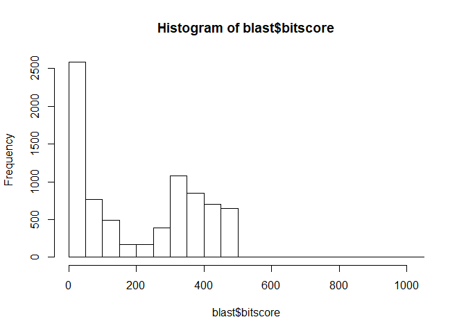
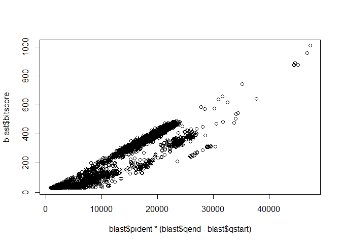
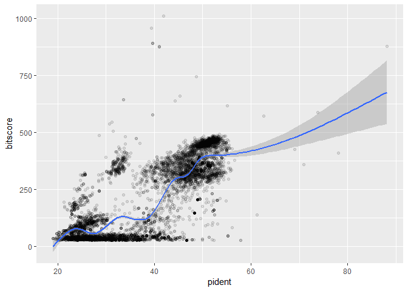

class 16: Essential UNIX for bioinformatics
================
Xiaohui Lyu
2019/5/24

## 

``` r
blast <- read.table("mm-second.x.zebrafish.tsv",col.names = c("qseqid", "sseqid", "pident", "length", "mismatch", "gapopen", "qstart", "qend", "sstart", "send", "evalue", "bitscore"))
head(blast)
```

    ##        qseqid         sseqid pident length mismatch gapopen qstart qend
    ## 1 YP_220550.1    NP_059331.1 69.010    313       97       0      4  316
    ## 2 YP_220551.1    NP_059332.1 44.509    346      188       3      1  344
    ## 3 YP_220551.1    NP_059341.1 24.540    163      112       3    112  263
    ## 4 YP_220551.1    NP_059340.1 26.804     97       65       2     98  188
    ## 5 YP_220552.1    NP_059333.1 88.132    514       61       0      1  514
    ## 6 YP_220552.1 XP_021326074.1 31.818     66       32       2    427  482
    ##   sstart send    evalue bitscore
    ## 1     10  322 1.24e-150    426.0
    ## 2      1  344  8.62e-92    279.0
    ## 3    231  393  5.15e-06     49.7
    ## 4    200  296  1.00e-01     35.8
    ## 5      1  514  0.00e+00    877.0
    ## 6     16   78  6.70e+00     29.3

``` r
hist(blast$bitscore, breaks = 30)
```

<!-- -->

``` r
## Asuming your blast results are stored in an object called 'b'
plot(blast$pident  * (blast$qend - blast$qstart), blast$bitscore)
```

<!-- -->

``` r
library(ggplot2)
ggplot(blast, aes(pident, bitscore)) + geom_point(alpha=0.1) + geom_smooth()
```

    ## `geom_smooth()` using method = 'gam' and formula 'y ~ s(x, bs = "cs")'

<!-- -->
