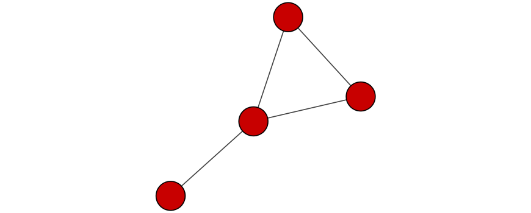
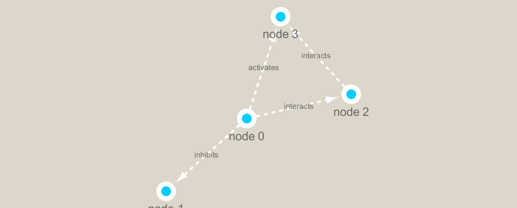

```{r setup, include=FALSE}
knitr::opts_chunk$set(echo = TRUE)
```

## Set up Cytoscape and R connection

```{r}
library(RCy3)
library(igraph)
library(RColorBrewer)
```

Check our connection to cytoscape

```{r}
cytoscapePing()
```

Check the version

```{r}
cytoscapeVersionInfo()
```

```{r}
g <- makeSimpleIgraph()
createNetworkFromIgraph(g,"myGraph")
```

```{r}
fig <- exportImage(filename="demo", type="png", height=350)
```

```{r}

```

```{r}
setVisualStyle("Marquee")
```

```{r}
fig <- exportImage(filename="demo_marquee", type="png", height=350)


```

```{r}
styles <- getVisualStyleNames()
styles
```

```{r}
plot(g)
```

## Read our metagenomics data

We will read in a species co-occurrence matrix that was calculated using Spearman Rank coefficient. (see reference Lima-Mendez et al. (2015) for details).

```{r}
prok_vir_cor <- read.delim("virus_prok_cor_abundant.tsv", stringsAsFactors = FALSE)
head(prok_vir_cor)
```

How many edges will we have?

```{r}
nrow(prok_vir_cor)
```

How many unique species are there?

```{r}
length(unique(c(prok_vir_cor[,1],prok_vir_cor[,2])))
```

```{r}
g <- graph.data.frame(prok_vir_cor, directed = FALSE)
class(g)
```

```{r}
plot(g)
```

```{r}
plot(g, vertex.size=3, vertex.label=NA)
```

## Let's calculate something 

we can query (and set) vertex and edge attributes with the `V()` and `E()` functions respectively:

```{r}
V(g)
```

```{r}
E(g)
```

Community detection with the Girvin Newmen:

```{r}
cb <- cluster_edge_betweenness(g)
plot(cb, y=g, vertex.label=NA,  vertex.size=3)
```

We can extract a cluster/community membership vector for further inspection with the `membership()` function:

```{r}
head( membership(cb) )
```

### Node degree

```{r}
# Calculate and plot node degree of our network
d <- degree(g)
hist(d, breaks=30, col="lightblue", main ="Node Degree Distribution")
```

### Centrality analysis

```{r}
pr <- page_rank(g)
head(pr$vector)
```

Let's plot our network with nodes size scaled via this page rank centrality scores.

```{r}
library(BBmisc)
```

```{r}
# Make a size vector btwn 2 and 20 for node plotting size
v.size <- BBmisc::normalize(pr$vector, range=c(2,20), method="range")
plot(g, vertex.size=v.size, vertex.label=NA)
```

One of the simplest centrality scores is of course degree that we calculated previously and stored as the object `d`.

```{r}
v.size <- BBmisc::normalize(d, range=c(2,20), method="range")
plot(g, vertex.size=v.size, vertex.label=NA)
```

Another very common centrality score is betweenness. The vertex and edge betweenness are (roughly) defined by the number of geodesics (shortest paths) going through a vertex or an edge.

```{r}
b <- betweenness(g)
v.size <- BBmisc::normalize(b, range=c(2,20), method="range")
plot(g, vertex.size=v.size, vertex.label=NA)
```

## Read taxonomic classification for network annotation

```{r}
phage_id_affiliation <- read.delim("phage_ids_with_affiliation.tsv")
head(phage_id_affiliation)
bac_id_affi <- read.delim("prok_tax_from_silva.tsv", stringsAsFactors = FALSE)
head(bac_id_affi)
```


```{r}
## Extract out our vertex names
genenet.nodes <- as.data.frame(vertex.attributes(g), stringsAsFactors=FALSE)
head(genenet.nodes)
```

How may phage entries do we have?

```{r}
length( grep("^ph_",genenet.nodes[,1]) )
```

```{r}
z <- bac_id_affi[,c("Accession_ID", "Kingdom", "Phylum", "Class")]
n <- merge(genenet.nodes, z, by.x="name", by.y="Accession_ID", all.x=TRUE)
head(n)
```

```{r}
colnames(n)
colnames(phage_id_affiliation)
```

```{r}
# Again we only need a subset of `phage_id_affiliation` for our purposes
y <- phage_id_affiliation[, c("first_sheet.Phage_id_network", "phage_affiliation","Tax_order", "Tax_subfamily")]

# Add the little phage annotation that we have
x <- merge(x=n, y=y, by.x="name", by.y="first_sheet.Phage_id_network", all.x=TRUE)

## Remove duplicates from multiple matches
x <- x[!duplicated( (x$name) ),]
head(x)
```

```{r}
genenet.nodes <- x
```

## Send network to Cytoscape using RCy3

To begin we will delete any windows and networks that were already open in Cytoscape. This will clean the slate and help ensure we don't use up all of our memory.

```{r}
deleteAllNetworks()
```

```{r}
# Set the main nodes colname to the required "id" 
colnames(genenet.nodes)[1] <- "id"
```

```{r}
genenet.edges <- data.frame(igraph::as_edgelist(g))

# Set the main edges colname to the required "source" and "target" 
colnames(genenet.edges) <- c("source","target")

# Add the weight from igraph to a new column...
genenet.edges$Weight <- igraph::edge_attr(g)$weight

# Send as a new network to Cytoscape
createNetworkFromDataFrames(genenet.nodes,genenet.edges, 
                            title="Tara_Oceans")
```

