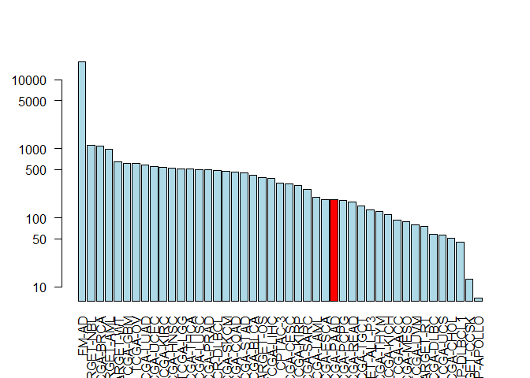

Class 18: Cancer Genomics
================

# Part I. The GenomicDataCommons R package

## Accessing the Genomic Data Commons

We need the bioconductor package
    **GenomicDataCommons**

``` r
BiocManager::install("GenomicDataCommons")
```

``` r
library(GenomicDataCommons)
```

    ## Loading required package: magrittr

    ## Warning: no function found corresponding to methods exports from 'XVector'
    ## for: 'concatenateObjects'

    ## 
    ## Attaching package: 'GenomicDataCommons'

    ## The following object is masked from 'package:stats':
    ## 
    ##     filter

``` r
library(TCGAbiolinks)
library(maftools)
```

    ## Warning: package 'maftools' was built under R version 3.6.0

Let’s use this package to ping the database

``` r
status()
```

    ## $commit
    ## [1] "e588f035feefee17f562b3a1bc2816c49a2b2b19"
    ## 
    ## $data_release
    ## [1] "Data Release 16.0 - March 26, 2019"
    ## 
    ## $status
    ## [1] "OK"
    ## 
    ## $tag
    ## [1] "1.20.0"
    ## 
    ## $version
    ## [1] 1

## Querying the GDC from R

``` r
projects <- getGDCprojects()
head(projects)
```

    ##   dbgap_accession_number
    ## 1                   <NA>
    ## 2              phs000466
    ## 3                   <NA>
    ## 4                   <NA>
    ## 5              phs001444
    ## 6              phs000471
    ##                                                          disease_type
    ## 1 Cystic, Mucinous and Serous Neoplasms, Adenomas and Adenocarcinomas
    ## 2                                    Clear Cell Sarcoma of the Kidney
    ## 3                                               Mesothelial Neoplasms
    ## 4                                        Adenomas and Adenocarcinomas
    ## 5                     Lymphoid Neoplasm Diffuse Large B-cell Lymphoma
    ## 6                                               High-Risk Wilms Tumor
    ##   releasable released state
    ## 1      FALSE     TRUE  open
    ## 2      FALSE     TRUE  open
    ## 3      FALSE     TRUE  open
    ## 4      FALSE     TRUE  open
    ## 5      FALSE     TRUE  open
    ## 6      FALSE     TRUE  open
    ##                                                                                     primary_site
    ## 1 Rectosigmoid junction, Unknown, Rectum, Colon, Connective, subcutaneous and other soft tissues
    ## 2                                                                                         Kidney
    ## 3                                              Heart, mediastinum, and pleura, Bronchus and lung
    ## 4   Other and unspecified parts of biliary tract, Gallbladder, Liver and intrahepatic bile ducts
    ## 5                                                                                    Lymph Nodes
    ## 6                                                                                         Kidney
    ##     project_id           id
    ## 1    TCGA-READ    TCGA-READ
    ## 2  TARGET-CCSK  TARGET-CCSK
    ## 3    TCGA-MESO    TCGA-MESO
    ## 4    TCGA-CHOL    TCGA-CHOL
    ## 5 NCICCR-DLBCL NCICCR-DLBCL
    ## 6    TARGET-WT    TARGET-WT
    ##                                                  name tumor
    ## 1                               Rectum Adenocarcinoma  READ
    ## 2                    Clear Cell Sarcoma of the Kidney  CCSK
    ## 3                                        Mesothelioma  MESO
    ## 4                                  Cholangiocarcinoma  CHOL
    ## 5 Genomic Variation in Diffuse Large B Cell Lymphomas DLBCL
    ## 6                               High-Risk Wilms Tumor    WT

``` r
cases_by_project <- cases() %>%
  facet("project.project_id") %>%
  aggregations()
head(cases_by_project)
```

    ## $project.project_id
    ##               key doc_count
    ## 1           FM-AD     18004
    ## 2      TARGET-NBL      1127
    ## 3       TCGA-BRCA      1098
    ## 4      TARGET-AML       988
    ## 5       TARGET-WT       652
    ## 6        TCGA-GBM       617
    ## 7         TCGA-OV       608
    ## 8       TCGA-LUAD       585
    ## 9       TCGA-UCEC       560
    ## 10      TCGA-KIRC       537
    ## 11      TCGA-HNSC       528
    ## 12       TCGA-LGG       516
    ## 13      TCGA-THCA       507
    ## 14      TCGA-LUSC       504
    ## 15      TCGA-PRAD       500
    ## 16   NCICCR-DLBCL       489
    ## 17      TCGA-SKCM       470
    ## 18      TCGA-COAD       461
    ## 19      TCGA-STAD       443
    ## 20      TCGA-BLCA       412
    ## 21      TARGET-OS       381
    ## 22      TCGA-LIHC       377
    ## 23        CPTAC-3       322
    ## 24      TCGA-CESC       307
    ## 25      TCGA-KIRP       291
    ## 26      TCGA-SARC       261
    ## 27      TCGA-LAML       200
    ## 28      TCGA-ESCA       185
    ## 29      TCGA-PAAD       185
    ## 30      TCGA-PCPG       179
    ## 31      TCGA-READ       172
    ## 32      TCGA-TGCT       150
    ## 33  TARGET-ALL-P3       131
    ## 34      TCGA-THYM       124
    ## 35      TCGA-KICH       113
    ## 36       TCGA-ACC        92
    ## 37      TCGA-MESO        87
    ## 38       TCGA-UVM        80
    ## 39      TARGET-RT        75
    ## 40      TCGA-DLBC        58
    ## 41       TCGA-UCS        57
    ## 42      TCGA-CHOL        51
    ## 43    CTSP-DLBCL1        45
    ## 44    TARGET-CCSK        13
    ## 45 VAREPOP-APOLLO         7

> Q9. Write the R code to make a barplot of the cases per project. Lets
> plot this data with a log scale for the y axis (log=“y”), rotated axis
> labels (las=2) and color the bar coresponding to the TCGA-PAAD
> project.

``` r
x <- cases_by_project$project.project_id

# Make a custom color vector for our plot
colvec <- rep("lightblue", nrow(x))
colvec[x$key == "TCGA-PAAD"] <- "red"

# Plot with 'log' for y axis and rotate labels with 'las'
#par(___)  
barplot(x$doc_count, names.arg=x$key, log="y", col=colvec, las=2)
```

<!-- -->

# Part II. Designing a personalized cancer vaccine

## Section 1. Protein sequences from healthy and tumor tissue

> Q1: Identify sequence regions that contain all 9-mer peptides that are
> only found in the tumor.

``` r
library(bio3d)
```

``` r
seq <- read.fasta("lecture18_sequences.fa")
aln <- seqaln(seq, exefile="muscle3.8.31_i86win32.exe")
```

``` r
attributes(seq)
```

    ## $names
    ## [1] "id"   "ali"  "call"
    ## 
    ## $class
    ## [1] "fasta"

``` r
seq$ali[,41]
```

    ##     P53_wt P53_mutant 
    ##        "D"        "L"

``` r
mutsite <- which(((seq$ali[1,] != seq$ali[2,]) & (seq$ali[2,] != "-")))
```

Another way to find the sites (i.e. amino acids that are different)

``` r
ide <- conserv(seq, method = "identity")
mismatch.inds <- which(ide < 1)
```

``` r
gaps <- gap.inspect(seq)
gap.inds <- gaps$t.inds
```

Find the positions in mismatch.inds that are NOT in gap.inds

``` r
tumor.sites <- mismatch.inds[!mismatch.inds %in% gap.inds]
```

``` r
seq$ali[,tumor.sites]
```

    ##            [,1] [,2] [,3] [,4]
    ## P53_wt     "D"  "R"  "R"  "D" 
    ## P53_mutant "L"  "W"  "V"  "V"

``` r
ids <- paste(seq$ali[1,tumor.sites],
      tumor.sites,
      seq$ali[2,tumor.sites],
      sep="")
```

``` r
start.ind <- tumor.sites-8
end.ind <- tumor.sites+8

tumor <- NULL
for(i in 1:length(start.ind)){
  tumor <- seqbind(tumor,
                   seq$ali[2,start.ind[i]:end.ind[i]])
}
tumor
```

    ##        1        .      17 
    ## seq1   SPLPSQAMLDLMLSPDD
    ## seq2   DPGPDEAPWMPEAAPPV
    ## seq3   YLDDRNTFVHSVVVPYE
    ## seq4   ILTIITLEV--------
    ##                          
    ##        1        .      17 
    ## 
    ## Call:
    ##   seqbind(tumor, seq$ali[2, start.ind[i]:end.ind[i]])
    ## 
    ## Class:
    ##   fasta
    ## 
    ## Alignment dimensions:
    ##   4 sequence rows; 17 position columns (9 non-gap, 8 gap) 
    ## 
    ## + attr: id, ali, call

``` r
write.fasta(ids = ids, ali = tumor, file = "subsequences.fa")
```
